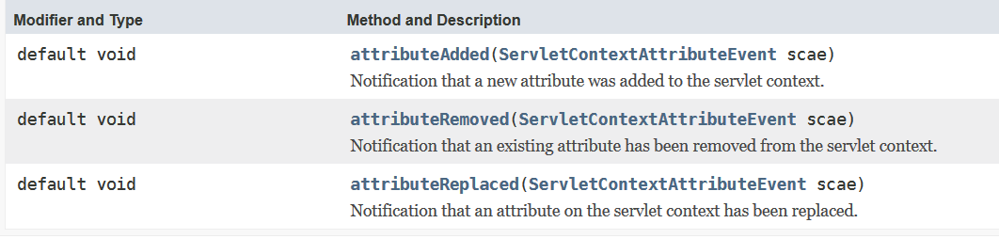
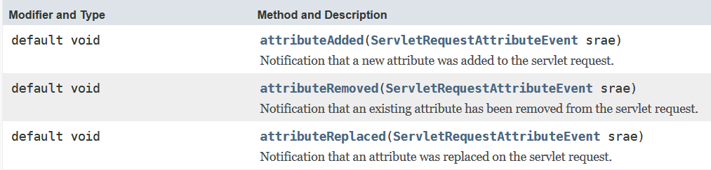
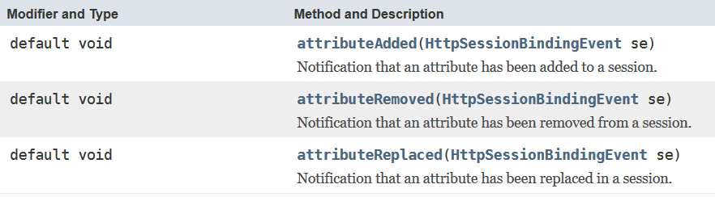
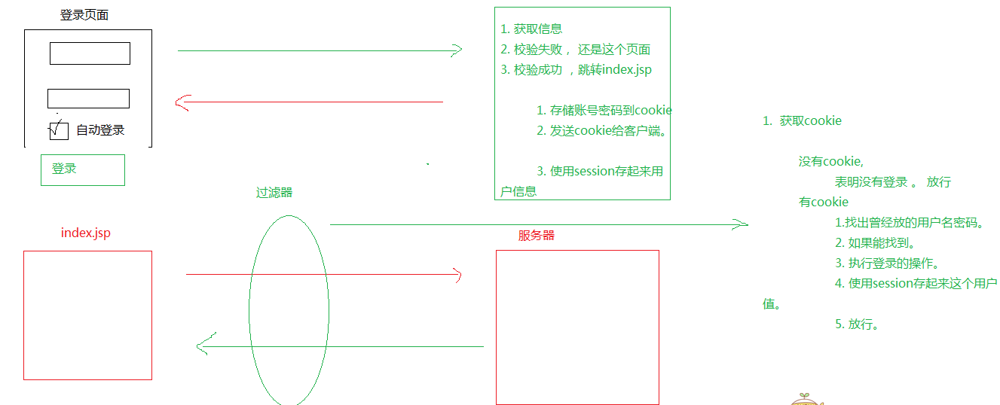

# 17.Listener&Filter

## Listener

### 监听器基本概念

> 监听器

* 能做什么事？

> 监听某一事件的发生，状态的改变。

* 监听的内部机制

> 其实就是接口回调

### 接口回调

* 需求：

> A在执行循环，当循环到5的时候，通知B  
> 事先先把一个对象传递到A，当A执行到5的时候，通过这个对象，来调用B中的方法。但是注意，不是直接传递B的实例，而是传递一个接口的实例过去。

---
接口回调项目目录  

```txt
.  
├── A.java  
├── AListener.java  
├── B.java  
└── Main.java  
```

`A.java`

```java
/**
* 被监听类
* @author Administrator
*
*/
public class A {
    /**
    * 当A循环到第五次的时候，通知AListener的实现类 - 所谓的接口回调
    * @param a
    */
    public static void loop(AListener a) {
        for (int i = 0; i < 10; i++) {
            if (i == 4) {
                a.printFive();
            }
        }
    }

}
```

`AListener.java`

```java
/**
* 提供给其他用户实现，实现了之后可以监控A类的循环次数
* @author Administrator
*
*/
public interface AListener {

    /**
     * 这里需要实现类重新改写，这里就是A类开发者留下的监听口
     */
    public void printFive();
}
```

`B.java`

```java

/**
* 用来做A类的监听器，是A类监听器的实现类
* @author Administrator
*
*/
public class B implements AListener{
    public void printFive() {
        // 实现了监听口
        System.out.println("A执行到5了");
    }
}
```

`Main.java`

```java
/**
* 程序主入口
* @author Administrator
*
*/
public class Main {

    public static void main(String[] args) {
        A.loop(new B());
        // 这里在A循环的过程中，需要监听循环，就把AListener的实现类传入，达到的监听的目的
        // 这里属于接口回调，也属于多态
    }
}
```


### Web监听器

操作方法

1. 定义类，实现接口
2. 注册 + 配置监听器

> 总共有8个，划为成三种类型

#### 监听三个作用域创建和销毁

* request - httpServletRequest
* session - httpSession
* appliction - ServletContext

1. ServletContextListener
   * servletcontext创建：启动服务器的时候
   * servletcontext销毁：关闭服务器，从服务器移除项目
2. ServletRequestListener
   * request创建：访问服务器任意资源都会有请求出现`html、jsp、servlet`
   * request销毁：服务器已经对这次请求做出了响应。
3. HttpSessionListener
   * session的创建：只要调用`getsession()`，`jsp和servlet会`，`html`不会
   * session的销毁：
     * 超时 30分钟
     * 非正常关闭 销毁
     * 正常关闭服务器（序列化）

* 实现`ServletContextListener`

    ```java
    /**
    * Application Lifecycle Listener implementation class MyServletContextListener
    * 初始化：启动服务器的时候
    * 销毁：关闭服务器
    */
    public class MyServletContextListener implements ServletContextListener {

        public MyServletContextListener() {
            // TODO Auto-generated constructor stub
        }

        public void contextDestroyed(ServletContextEvent sce)  {
            System.out.println("contextDestroyed");
        }

        public void contextInitialized(ServletContextEvent sce)  {
            System.out.println("contextInitialized");
        }
    }
    ```

    ```xml
    <listener>
        <listener-class>cc.listener.MyServletContextListener</listener-class>
    </listener>
    ```

* 实现`ServletRequestListener`

    ```java
    /**
    * Application Lifecycle Listener implementation class MyRequestListener
    */
    public class MyRequestListener implements ServletRequestListener {

        public MyRequestListener() {
            // TODO Auto-generated constructor stub
        }

        public void requestDestroyed(ServletRequestEvent sre)  {
            System.out.println("requestDestroyed");
        }

        public void requestInitialized(ServletRequestEvent sre)  {
            System.out.println("requestInitialized");
        }
    }
    ```

    ```xml
    <listener>
        <listener-class>cc.listener.MyRequestListener</listener-class>
    </listener>
    ```

* 实现`HttpSessionListener`

    ```java
    public class MyHttpSessionListener implements HttpSessionListener {

        public MyHttpSessionListener() {
        }

        public void sessionCreated(HttpSessionEvent se) {
            System.out.println("sessionCreated");
        }

        public void sessionDestroyed(HttpSessionEvent se) {
            System.out.println("sessionDestroyed");
        }
    }
    ```

    ```xml
    <listener>
        <listener-class>cc.listener.MyHttpSessionListener</listener-class>
    </listener>
    ```

作用

* ServletContextListener

* 利用它来，在servletcontextListener创建的时候

  1. 完成自己想要的初始化工作
  2. 执行自定义任务调度，执行某一个任务Timer

* HttpSessionListener

  统计在线人数

#### 监听三个作用域属性状态变更

> 可以监听在作用域中值 添加 | 替换 | 移除的动作。

* servletContext - ServletContextAttributeListener
  * 
* request - ServletRequestAttributeListener
  * 
* session - HttpSessionAttributeListener
  * 

演示一个例子

```java
public class ServletContextAttributeListener implements javax.servlet.ServletContextAttributeListener {

    public ServletContextAttributeListener() {
    }

    public void attributeAdded(ServletContextAttributeEvent scae) {
        System.out.println("attributeAdded");
    }

    public void attributeRemoved(ServletContextAttributeEvent scae) {
        System.out.println("attributeRemoved");
    }

    public void attributeReplaced(ServletContextAttributeEvent scae) {
        System.out.println("attributeReplaced");
    }
}


```

```xml
<listener>
<listener-class>cc.listener.ServletContextAttributeListener</listener-class>
</listener>
```

#### 监听httpSession里面存值的状态变更

> 这一类监听器不用注册

##### HttpSessionBindingListener

> 监听对象与session绑定与解除绑定的动作

* 让javabean实现该接口就可以了

    ```java
    public class User implements HttpSessionBindingListener{

        private String userName;
        private String password;

        public User(String userName, String password) {
            super();
            this.userName = userName;
            this.password = password;
        }

        @Override
        public void valueBound(HttpSessionBindingEvent event) {
            System.out.println("对象被绑定到session进来了");
        }

        @Override
        public void valueUnbound(HttpSessionBindingEvent event) {
            System.out.println("对象解除绑定");
        }
    }
    ```

---

##### HttpSessionActivationListener

> 用于监听现在session的值是钝化（序列化）还是活化（反序列化）的动作

* 钝化（序列化） - 把内存的数据存储到硬盘上
* 活化（反序列化）- 把硬盘中的数据读取到内存中

* session钝化活化的用意何在？

> session中的值可能会很多，并且我们有很长一段时间不使用这个内存中的值，那么可以考虑把session的值可以存储到硬盘上【钝化】，等下一次在使用的时候，从硬盘上提取出来。【活化】

* 如何让session在一定的时间钝化

```java
/**
 *
 * @author Administrator
 * 类必须实现Serializable接口，才能存储到硬盘，否则无法存储，即无法钝化
 * 序列化 - 钝化
 * 反序列化 - 活化
 */
public class User implements HttpSessionActivationListener, Serializable {

    private String userName;
    private String password;

    public User(String userName, String password) {
        super();
        this.userName = userName;
        this.password = password;
    }

    // 钝化 - 对象实例化保存到session中，当session失效要被序列化执行之前执行（只有保存到session中的对象才会被监听到）
    public void sessionWillPassivate(HttpSessionEvent se) {
        System.out.println("sessionWillPassivate");
        System.out.println("sessionID:" + se.getSession().getId());
    }

    // 活化 - 当session被反序列化
    public void sessionDidActivate(HttpSessionEvent se) {
        System.out.println("sessionDidActivate");
        System.out.println("sessionID:" + se.getSession().getId());
    }

    @Override
    public String toString() {
        return "User [userName=" + userName + ", password=" + password + "]";
    }
}
```

```xml
<!--
1. 在tomcat里面conf/context.xml配置 - 对所有服务器生效
2. 在conf/Catalina/localhost/context.xml配置 - 对localhost生效 - localhost:8080
3. 在自己的web工程项目中的 META-INF/context.xml - 只对当前工程有效
-->

<Context>
    <Manager className="org.apache.catalina.session.PersistentManager" maxIdleSwap="1">
        <Store className="org.apache.catalina.session.FileStore" directory="itheima"/>
    </Manager>
</Context>

<!-- maxIdleSwap：1分钟不用就钝化 -->
<!-- directory：钝化后文件存放位置 -->
```

## Filter

### Filter简介

> 过滤器，其实就是对客户端发出来的请求进行过滤。浏览器发出，然后服务器派servlet处理，在中间就可以过滤，其实过滤器就是拦截的作用  

这点当然可以直接在servlet做到，但是如果很大的项目，需要很多的代码，如果用servlet把功能都做出来，那么就会造成较高的耦合，低聚合，不利于后期阅读，维护，所以要把这一块独自分离出来降低耦合，降低耦合的好处除了可以后期更好维护，还可以更好的团队合作，分配任务。

* 作用
  1. 对一些敏感词汇进行过滤
  2. 统一设置编码
  3. 自动登陆

...

### 如何使用Filter

1. 定义一个类，实现Filter

    ```java
    public class MyFilter implements Filter {

        public MyFilter() {
        }

        public void destroy() {
        }

        public void doFilter(ServletRequest request, ServletResponse response, FilterChain chain)
                throws IOException, ServletException {
            chain.doFilter(request, response);
        }

        public void init(FilterConfig fConfig) throws ServletException {
        }
    }
    ```

2. 注册过滤器

    ```xml
    <filter>
        <display-name>MyFilter</display-name>
        <filter-name>MyFilter</filter-name>
        <filter-class>cc.filter.MyFilter</filter-class>
    </filter>
    <filter-mapping>
        <filter-name>MyFilter</filter-name>
        <url-pattern>/*</url-pattern>
    </filter-mapping>
    ```

### Filter的生命周期

* 创建

> 在服务器启动的时候就创建。

* 销毁

> 在服务器停止的时候销毁。

### Filter的执行顺序

1. 客户端发出请求，先经过过滤器，如果过滤器放行，那么才能到servlet
2. 如果有多个过滤器，那么他们会按照注册的映射顺序，来排队。只要有一个过滤器，不放行，那么后面排队的过滤器以及咱们的servlet都不会收到请求

```xml
<filter-mapping>
    <filter-name>MyFilter01</filter-name>
    <url-pattern>/*</url-pattern>
</filter-mapping>
<filter-mapping>
    <filter-name>MyFilter</filter-name>
    <url-pattern>/*</url-pattern>
</filter-mapping>
<filter-mapping>
    <filter-name>MyFilter03</filter-name>
    <url-pattern>/*</url-pattern>
</filter-mapping>
<filter-mapping>
    <filter-name>MyFilter02</filter-name>
    <url-pattern>/*</url-pattern>
</filter-mapping>
<!-- 执行顺序是MyFilter01->MyFilter->MyFilter03->MyFilter02 -->
```

### Filter细节

1. init方法的参数 FilterConfig，可以用于获取filter在注册的名字，以及初始化参数，其实这里的设计的初衷与ServletConfig是一样的。其实这里的设计初衷与ServletConfig是一样的。
2. 如果想放行，那么在doFilter方法里面操作，使用参数chain
3. `<url-pattern>/*</url-pattern>`写法格式和servlet一样
    * 全路径匹配 以/开始 - /LoginServlet
    * 以目录匹配 以/开始，以*结束 - `/demo01/*`
    * 以后缀名匹配 以*开始 以后缀名 - `*.jsp *.html *.do`

4. 针对dispatcher设置
    * REQUEST : 只要是请求过来，都拦截，默认就是REQUEST
    * FORWARD : 只要是转发都拦截
    * ERROR : 页面出错发生跳转
    * INCLUDE : 包含页面的时候就拦截。

### 自动登陆

补充 BeanUitls，导入`commons-beanutils-1.9.4.jar`和`commons-logging-1.2.jar`两个包

可能有时候还需要`commons-collections-3.2.jar`这个包

* bean对象

    ```java
    public class User {
        private String username;
        private String password;
        private String email;
        private String phone;
        private String address;
        private Date birthday;
        // 省略set/get/tostring
    }
    ```

* 请求的servlet

    ```java
    protected void doGet(HttpServletRequest request, HttpServletResponse response)
                throws ServletException, IOException {
        try {
            // 只针对post有效
            request.setCharacterEncoding("utf-8");

            // 注册自己的日期转换器
            ConvertUtils.register(new MyDataConverter(), Date.class);

            // 转换数据
            Map map = request.getParameterMap();
            User user = new User();
            BeanUtils.populate(user, map);

            System.out.println(user.toString());
        } catch (IllegalAccessException e) {
            // TODO Auto-generated catch block
            e.printStackTrace();
        } catch (InvocationTargetException e) {
            // TODO Auto-generated catch block
            e.printStackTrace();
        }
    }
    ```

* 自己要注册的转换类型`MyDataConverter`，其实就算是丢给来string转Date

    ```java
    public class MyDataConverter implements Converter {

        @Override
        // 将value 转换 c 对应类型
        // 存在Class参数目的编写通用转换器，如果转换目标类型是确定的，可以不使用c 参数
        public Date convert(Class c, Object value) {
            String strVal = (String) value;
            // 将String转换为Date --- 需要使用日期格式化
            DateFormat dateFormat = new SimpleDateFormat("yyyy-MM-dd");
            try {
                Date date = dateFormat.parse(strVal);
                return date;
            } catch (ParseException e) {
                e.printStackTrace();
            }
            return null;
        }
    }
    ```

---



思路是
过滤器起到自动登陆的作用

* 如果session有值->放行
* 如果session无值->看看是否能自动登陆->能登陆->帮忙登了
  * 不能登陆->放行

给出文件目录

```txt
.
|
├── src
│   ├── c3p0-config.xml
│   └── cc
│       └── auto
│           ├── dao
│           │   ├── Impl
│           │   │   └── UserDaoImpl.java
│           │   └── UserDao.java
│           ├── domain
│           │   └── User.java
│           ├── filter
│           │   └── AutoLoginFilter.java
│           ├── servlet
│           │   └── LoginServlet.java
│           └── utils
│               ├── CookieUtils.java
│               └── JDBCUtils.java
└── WebContent
    ├── index.jsp
    ├── login.jsp
    ├── META-INF
    │   └── MANIFEST.MF
    └── WEB-INF
        ├── lib
        │   ├── c3p0-0.9.5.5.jar
        │   ├── commons-beanutils-1.9.4.jar
        │   ├── commons-collections-3.2.jar
        │   ├── commons-dbutils-1.7.jar
        │   ├── commons-logging-1.2.jar
        │   ├── jstl.jar
        │   ├── mchange-commons-java-0.2.19.jar
        │   ├── mysql-connector-java-8.0.18.jar
        │   └── standard.jar
        └── web.xml
```

* `login.jsp` - 作为登陆使用的页面

    ```html
    <form action="LoginServlet" method="post">
        <table border="" cellspacing="" cellpadding="">
            <tr>
                <td>用户名：</td>
                <td><input type="text" name="username"></td>
            </tr>
            <tr>
                <td>密 码：</td>
                <td><input type="password" name="pwd"></td>
            </tr>
            <tr>
                <td>自动登陆：</td>
                <td><input type="checkbox" name="isAuto"><br></td>
            </tr>
            <tr align="center">
                <td colspan="2"><input type="submit" value="登陆" /></td>
            </tr>
        </table>
    </form>
    ```

```java
protected void doGet(HttpServletRequest request, HttpServletResponse response)
        throws ServletException, IOException {
    try {
        UserDao dao = new UserDaoImpl();
        User receiveUser=new User();

        // 这里要注意，getParameterMap的key要和User的成员变量名字一致
        BeanUtils.populate(receiveUser, request.getParameterMap());
        User user = dao.login(receiveUser);

        if (user != null) {

            // 这里也要注意，不要用request.getParameter("isAuto")去调用方法
            // 因为通过请求穿过来的值可能为null，空指针是无法调用equals方法的
            if ("on".equals(request.getParameter("isAuto"))) {
                Cookie cookie = new Cookie("userInfo", user.getUsername() + "#" + user.getPwd());
                cookie.setMaxAge(60 * 60 * 24);
                response.addCookie(cookie);
            }

            // 成功就设置session的属性值，跳转
            request.getSession().setAttribute("user", user);
            request.getRequestDispatcher("index.jsp").forward(request, response);
        } else {
            // 验证失败就返回登陆页面
            request.getRequestDispatcher("login.jsp").forward(request, response);
        }
    } catch (SQLException | IllegalAccessException | InvocationTargetException e) {
        // TODO Auto-generated catch block
        e.printStackTrace();
    }
}
```

* `UserDaoImpl.java` - 这里是`UserDao.java`的实现类

    ```java
    static QueryRunner runner = new QueryRunner(JDBCUtils.getDataSource());

    @Override
    public cc.auto.domain.User login(User user) throws SQLException {
        User u = runner.query("select * from account where username=? and pwd=?", new BeanHandler<User>(User.class),
                user.getUsername(), user.getPwd());
        // 这里留个疑问
        runner.getDataSource().getConnection().close();
        return u;
    }
    ```

* `AutoLoginFilter.java` - 用来过滤请求，看是否能自动登陆

```java
public void doFilter(ServletRequest request, ServletResponse response, FilterChain chain)
        throws IOException, ServletException {
    HttpServletRequest req = (HttpServletRequest) request;

    HttpSession session = req.getSession();
    User user = (User) session.getAttribute("user");

    // 看看session有没有存值？
    if (user == null) {
        // 说明没登陆，需要自动登陆
        // session没存值，需要看看能不能自动登陆 -> 有没有cookie
        Cookie cookie = CookieUtils.findCookie(req, "userInfo");
        if (cookie != null) {
            // 可以自动登陆
            String userInfo[] = cookie.getValue().split("#");

            try {
                User cUser = new UserDaoImpl().login(new User(userInfo[0], userInfo[1]));
                if (cUser != null) {
                    // 有cookie ， 并且验证正确
                    session.setAttribute("user", cUser);
                    req.getRequestDispatcher("index.jsp").forward(request, response);
                }
                // 有cookie ， 验证失败，放行就行了
            } catch (SQLException e) {
                // TODO Auto-generated catch block
                chain.doFilter(request, response);
                e.printStackTrace();
            }
        }

    } else {
        req.getRequestDispatcher("index.jsp").forward(request, response);
    }

    // 两种情况，
    // 一种是session存值，直接跳 -> 登陆了
    // 一种是session没存值，并且也没设置cookie | cookie验证失败 -> 没登陆并且不能自动登陆 -> 放行
    chain.doFilter(request, response);
}
```

* 注意
  * 过滤器是先判断session还是cookie，肯定是session，因为如果已经在服务器登陆，session是会存放数据的
  * 无论cookie验证错误 | 第一次登陆，统统放行，因为，是否登陆，只看session里是不是存有对象，jsp那边会做判断的
  * jar要判断依赖
  * beanutils这里要注意，getParameterMap的key要和User的成员变量名字一致
  * `"on".equals(request.getParameter("isAuto")`这里注意，不要用`request.getParameter("isAuto")`去访问方法，万一是null了呢

## 总结

* Listener
  * 监听器的基本概念
  * 接口回调
  * Web监听器
    * 监听三个作用域创建或者销毁
    * 监听三个作用域属性变更
    * 监听httpsession中的值状态变更
      * httpsessionbindinglistener - 绑定解绑
      * httpsessionactivationlistener - 钝化活化
* Filter
  * Filter简介
  * 如何使用 - 新建Filter xml注册
  * Filter声明周期
  * Filter执行顺序 - 按照map
  * Filter细节
    * init参数 - 和servlet一样
    * url-patten 也可以匹配符匹配
    * 放行 chain.doFilter
  * 自动登陆
