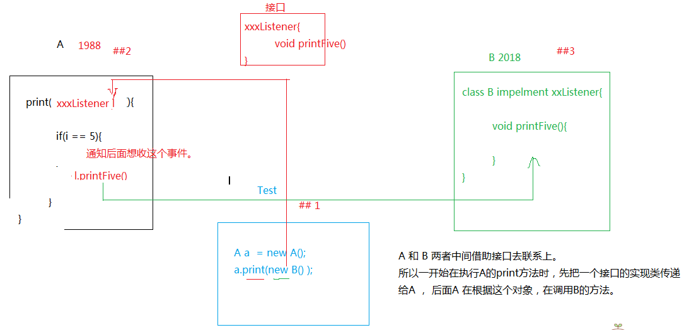

# 17.Listener&Filter

## Listener

### 监听器基本概念

> 监听器

* 能做什么事？

> 监听某一事件的发生，状态的改变。

* 监听的内部机制

> 其实就是接口回调

### 接口回调

* 需求：

> A在执行循环，当循环到5的时候，通知B  
> 事先先把一个对象传递到A，当A执行到5的时候，通过这个对象，来调用B中的方法。但是注意，不是直接传递B的实例，而是传递一个接口的实例过去。

---
接口回调项目目录  

```txt
.  
├── A.java  
├── AListener.java  
├── B.java  
└── Main.java  
```

`A.java`

```java
/**
* 被监听类
* @author Administrator
*
*/
public class A {
    /**
    * 当A循环到第五次的时候，通知AListener的实现类 - 所谓的接口回调
    * @param a
    */
    public static void loop(AListener a) {
        for (int i = 0; i < 10; i++) {
            if (i == 4) {
                a.printFive();
            }
        }
    }

}
```

`AListener.java`

```java
/**
* 提供给其他用户实现，实现了之后可以监控A类的循环次数
* @author Administrator
*
*/
public interface AListener {

    /**
     * 这里需要实现类重新改写，这里就是A类开发者留下的监听口
     */
    public void printFive();
}
```

`B.java`

```java

/**
* 用来做A类的监听器，是A类监听器的实现类
* @author Administrator
*
*/
public class B implements AListener{
    public void printFive() {
        // 实现了监听口
        System.out.println("A执行到5了");
    }
}
```

`Main.java`

```java
/**
* 程序主入口
* @author Administrator
*
*/
public class Main {

    public static void main(String[] args) {
        A.loop(new B());
        // 这里在A循环的过程中，需要监听循环，就把AListener的实现类传入，达到的监听的目的
        // 这里属于接口回调，也属于多态
    }
}
```



### Web监听器

操作方法

1. 定义类，实现接口
2. 注册 + 配置监听器

> 总共有8个，划为成三种类型

#### 监听三个作用域创建和销毁

* request - httpServletRequest
* session - httpSession
* appliction - ServletContext

1. ServletContextListener
   * servletcontext创建：启动服务器的时候
   * servletcontext销毁：关闭服务器，从服务器移除项目
2. ServletRequestListener
   * request创建：访问服务器任意资源都会有请求出现`html、jsp、servlet`
   * request销毁：服务器已经对这次请求做出了响应。
3. HttpSessionListener
   * session的创建：只要调用`getsession()`，`jsp和servlet会`，`html`不会
   * session的销毁：
     * 超时 30分钟
     * 非正常关闭 销毁
     * 正常关闭服务器（序列化）

* 实现`ServletContextListener`

    ```java
    /**
    * Application Lifecycle Listener implementation class MyServletContextListener
    * 初始化：启动服务器的时候
    * 销毁：关闭服务器
    */
    public class MyServletContextListener implements ServletContextListener {

        public MyServletContextListener() {
            // TODO Auto-generated constructor stub
        }

        public void contextDestroyed(ServletContextEvent sce)  {
            System.out.println("contextDestroyed");
        }

        public void contextInitialized(ServletContextEvent sce)  {
            System.out.println("contextInitialized");
        }
    }
    ```

    ```xml
    <listener>
        <listener-class>cc.listener.MyServletContextListener</listener-class>
    </listener>
    ```

* 实现`ServletRequestListener`

    ```java
    /**
    * Application Lifecycle Listener implementation class MyRequestListener
    */
    public class MyRequestListener implements ServletRequestListener {

        public MyRequestListener() {
            // TODO Auto-generated constructor stub
        }

        public void requestDestroyed(ServletRequestEvent sre)  {
            System.out.println("requestDestroyed");
        }

        public void requestInitialized(ServletRequestEvent sre)  {
            System.out.println("requestInitialized");
        }
    }
    ```

    ```xml
    <listener>
        <listener-class>cc.listener.MyRequestListener</listener-class>
    </listener>
    ```

* 实现`HttpSessionListener`

```java
public class MyHttpSessionListener implements HttpSessionListener {

    public MyHttpSessionListener() {
    }

    public void sessionCreated(HttpSessionEvent se) {
        System.out.println("sessionCreated");
    }

    public void sessionDestroyed(HttpSessionEvent se) {
        System.out.println("sessionDestroyed");
    }
}
```
