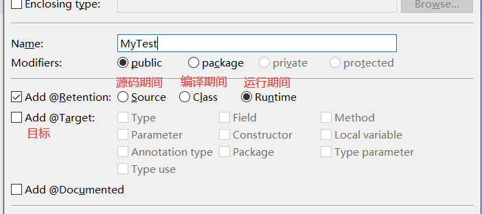

# 基础加强

## 设置环境

* 安装操作系统，安装备份（镜像）：
* JDK：设置环境变量
* eclipse：解压即可
  * eclipse自身解压目录不包括中文
  * 代码工作空间不包括中文
* tomcat解压不要包含中文
* mysql安装，选择utf-8编码
* 设置eclipse
  * 关联tomcat
    * 开发环境中，环境发生变化（重新关联tomcat）
    * 删除servers窗口下的tomcat
    * 删除Project Explore 窗口下的server
    * 重新关联window-> preferences-> servers-> runtime-> tomcat

## 自定义注解

### 注解简介

* 什么是注解？
  * 注解和接口一样，都是属于数据类型
* 注解作用
  * 编译检查
  * **配置（后期使用最多）**
  * 生成帮助文档
* 注解的特点
  * 注解在变量，方法，类之上加载
  * 注解也可以有属性也可以没有属性 @override @Test(timeout=1000)
  * 注解有作用范围（源码，编译期间，运行期间）
    * 源码期间有效：String类之上@Author @Since @See
      * 作用：使用命令javadoc将当前的源码生成帮助文件，可以实别String类上的相关注解
    * 编译器期间有效 @Override @Deprecated @SuppressWarning
      * 作用：告诉编译器部分信息
    * 运行期间有效 @Test
      * 作用：当我们在当前代码以Junit方式运行时候，Junit会运行方法上包含@Test注解的方法



### 回顾JDK中出现的三种注解

* @Override - jdk5.0表示重写父类 | jdk6.0还可以表示实现接口的办法
* @Deprecated - 表示被修饰的办法已经过时。过时的办法不建议使用，但仍可以使用。
  * 一般被这个标记存在不同的缺陷 1.安全问题 2.新的API取代
* @Suppresswarning - 表示抑制警告，被修饰的类或方法如果存在编译警告，则被编译器忽略
  * deprecation：忽略过时
  * rawtypes 忽略类型安全
  * unused 忽略不适用
  * unchecked 忽略安全检查
  * null 忽略空指针
  * all 忽略所有

抑制警告

```java
public void helloworld() {
  @SuppressWarnings("unused")
  int a;
}
```

### 演习junit注解含属性和javadoc自动生成文档

* junit注解属性

    ```java
    @Test(timeout = 1000)
    public void testjdbc() {
        try {
            Thread.sleep(1000);
        } catch (InterruptedException e1) {
            // TODO Auto-generated catch block
            e1.printStackTrace();
        }
    }
    ```

    执行结果
    
* javadoc自动生成文档

  Project -> Genernate Javadoc

  解决中文需要在VM options位置 添加`-encoding UTF-8 -charset UTF-8`

### 自定义注解简介

* 格式：

```java
public @interface MyAnnotation {
  public 属性类型 属性名称1();
  public 属性类型 属性名称2() default 默认值;
}
```

* 自定义注解属性支持的类型
  * 基本数据类型（4类8种）
  * String、Class、Annotaion（注解类型），枚举类型
  * 以上类型的一维数组

注解作用：**配置作用**
> 配置：开发的时候部分信息不希望写死在程序种，例如数据库的用户名和密码，可以将用户名和密码存放在txt、properties、xml文件中，利用程序来读取文件中的内容  
> 框架：一大堆工具类的组合，目的：加速项目开发  
> 后期的学习中，框架部分 hibernate，spring，struts很多信息需要配置，提供了两种形式的配置（xml，注解）

* 什么时候用注解来做配置？
  * 如果配置信息不会发生的修改，例如servlet路径，建议使用的形式
  * 如果配置信息需要发生频繁的修改，例如数据库的用户名和密码信息，建议使用传统发方法信息（.txt，.properties，.xml）

```xml
<students>
  <stu>
   <stuNum>s002</stuNun>
   <stuPhone>
      <stuHomePhone>124324</stuHomePhone>
      <stuCmpPhone>12342143</stuCmpPhone>
   </stuPhone>
  </stu>
</students>

```

* 测试使用自定义注解

  ```java
  public @interface MyAnnotation {
    public int a() default 1;
    public String password();
    public Class clazz() default Date.class;
    public MyAnnotation2 myAnnotation2();
    public Color color() default Color.BLUE;
    String[] arrys();
  }

  public class TestAnnotation {

    @MyAnnotation(a = 1,
        password = "11",
        clazz = String.class,
        color = Color.RED,
        arrys = ("itcast"),
        myAnnotation2 = @MyAnnotation2)
    public static void main(String[] args) {
    }
  }
  ```

  * 注意
    * 注解可以没有属性，如果有属性需要小括号括住
    * 属性格式：属性名=属性值
    * 一个对象上，注解只能用一次

### 自定义注解：解析

1. 自定义注解@MyTest
   * 通过元注解@Rentention @Target声明当前注解作用域以及目标对象,如果没有声明,在运行期间是无法获取到注解的信息
2. 定义UserDao
   * 创建4个方法addUser delUser uptUser getUser ,在前三个方法上加载注解
3. 定义类MyJunit，模拟Junit
   * 将Userdao.class文件加载到内存
   * 获取到字节码文件的所有方法
   * 遍历方法，判断每个方法是否加载了@MyTest注解
   * 如果当前方法上设置@MyTest，执行当前方法

`MyJunit.java`

```java
public class MyJunit {
  /**
  * @param args
  * @throws ClassNotFoundException
  * @throws IllegalAccessException
  * @throws IllegalArgumentException
  * @throws InvocationTargetException
  */
  public static void main(String[] args)
      throws ClassNotFoundException, IllegalAccessException, IllegalArgumentException, InvocationTargetException {
    // 加载UserDao.class字节码文件中的办法，判断哪些方法上有自定义的注解@Mytest，如果当前的方法有@MyTest，执行，否则，不执行

    // 1.将UserDao.class字节码文件加载到内存中，class对象（代表字节码文件在内存中的对象）
    Class clazz = Class.forName("annotation.parsenotation.UserDao");

    Class clazz1 = UserDao.class;
    Class clazz2 = new UserDao().getClass();

    // 2.获取字节码对象所有的方法，返回Method数组对象，数组中每一个元素都代表Method对象（相当与字节码上的每一个方法）
    Method[] mds = clazz.getMethods();
    for (Method method : mds) {
      // 测试方法的名称
      //System.out.println(method.getName());
      // 判断当前方法上是否有@MyTest注解信息
      //System.out.println(method.isAnnotationPresent(MyTest.class));
      if (method.isAnnotationPresent(MyTest.class)) {
        // 如果当前的办法上有@MyTest注解，执行，否则忽略
        method.invoke(new UserDao());
      }
    }
  }
}
```

`MyTest.java`

```java
// 自定义注解，相当于JUnit@Test

// 元注解：注解的注解

// 定义注解的时候，需要通过元注解@Retention说明当前自定义注解的作用域（Class,Source,Runtime）
@Retention(RUNTIME)
// 定义注解的时候，需要通过元注解Target说明当前的自定义注解的目标对象
@Target(ElementType.METHOD)
public @interface MyTest {
  public long timeout() default -1;
}
```

### 注解要求

* 听懂，实现上课代码
* 开发中地位：类似dom4j解析XML文件，XML文件的解析程序员不会去解析，配置XML文件，后期的开发中也不会自定义注解，反射读取注解信息

## 动态代理解决网站的字符集编码问题

### 设计模式

> 软件开发过程中，遇到相似问题，将解决问题的解决方法抽取模型（套路）

例如 单例、工厂、适配器、装饰者、动态代理

* 单例

```java
public class Stu {
  private Stu() {
  }

  private static Stu stu=new Stu();
  
  public static Stu getInstance() {
    return stu;
  }
}
-----------------------------------------
public class TestStu {
  public static void main(String[] args) {
    Stu stu1=Stu.getInstance();
    Stu stu2=Stu.getInstance();
    Stu stu3=Stu.getInstance();
    System.out.println(stu1);
    System.out.println(stu2);
    System.out.println(stu3);
  }
}
```

### 谷歌汽车场景

* java设计了汽车开发约定
  * interface{start run stop}
  * class GoogleCar implements ICar{}
* 希望在将谷歌Car接入到生态圈平台时，增强汽车启动功能
  * 这里为什么不能使用继承或者直接修改源代码
  * 修改源代码 - 找到源码漏洞 | 继承 - 破坏原有方法执行的顺序，也可能造成安全问题 所以google再一开始就不会让你继承或者找到源代码
  * 所以引出两种思路 装饰者模式 | 动态代理模式
* 装饰者模式
  * 场景：二次开发的时候，无法获取到源码，无法使用继承的前提下，要对已经存在的对象上的功能进行增强
  * 前提：可以获取被装饰者的对象GoogleCar实现的所有接口
  * 实现思路：自定义装饰类实现Icar接口，为自定义装饰类传递被装饰的对象
  * 弊端：如果实现的接口方法过多，装饰类的方法过于冗余
* 动态代理模式
  * 原理：通过虚拟机在内存中创建MyCar.class文件
  * 要创建MyCar.class文件告诉虚拟机：
    * 1.被创建的字节码文件应该有多少方法
    * 2.被创建的字节码文件的方法如何实现
  * 字节码加载器：
    * jdk有一些程序，专业将各种字节码文件加载到内存，这类程序简称为字节码加载器
    * 如何将字节码文件class文件加载到内存？
      * 底层实现过程，使用IO流技术，获取到文件中的数据加载到内存
    * 字节码加载器一共有三种
      * 引导类加载器
      * 扩展类加载器
      * 应用类加载器 - 程序员写的都是这种

---

类加载器举例

```java
public class ClassLoaderTest {

  public static void main(String[] args) {
    // 获取String类的加载器
    ClassLoader classLoader = String.class.getClassLoader();
    System.out.println(classLoader);
    // 由于String.class，int.class等字节码文件需要频繁被加载到内存，速度必须快
    // 底层用其他语言实现 C C++

    // 获取ext(extendtion)包下的某个类的字节码加载器 ExtClassLoader:扩展类加载器
    ClassLoader classLoader2 = sun.net.spi.nameservice.dns.DNSNameService.class.getClassLoader();
    System.out.println(classLoader2);

    // 应用类:程序员实现的所有的类都属于应用类
    // 获取应用类加载器 AppClassLoader
    ClassLoader classLoader3 = ClassLoaderTest.class.getClassLoader();
    System.out.println(classLoader3);
  }
}
```

#### 装饰者模式

* 目录结构

  ```txt
  .
  ├── GoogleCar.java
  ├── GoogleCarWrapper.java
  ├── ICar.java
  └── TestCar.java
  ```

`ICar.java`

```java
public interface ICar {
  public void start();
  public void run();
  public void stop();
}

```

`GoogleCar.java`

```java
package javamode.wrapper;

// final 在这里指的是无法继承
public final class GoogleCar implements ICar {

  @Override
  public void start() {
    System.out.println("google car start");
  }

  @Override
  public void run() {
    System.out.println("google car run");
  }

  @Override
  public void stop() {
    System.out.println("google car stop");
  }
}
```

`GoogleCarWrapper.java`

```java
public class GoogleCarWrapper implements ICar{
  private ICar iCar;

  public GoogleCarWrapper(ICar iCar) {
    super();
    this.iCar = iCar;
  }

  @Override
  public void start() {
    System.out.println("This is GoogleCarWrapper");
    System.out.println("do something");
    iCar.start();
  }

  @Override
  public void run() {
    iCar.run();
  }

  @Override
  public void stop() {
    iCar.stop();
  }
}
```

```java
public class TestCar {

  public static void main(String[] args) {
    ICar car=new GoogleCarWrapper(new GoogleCar());
    car.start();
    car.run();
    car.stop();
  }
}
```

#### 动态代理模式

```txt
.
├── GoogleCar.java
├── ICar.java
├── TestCar.java
└── Test.java
```

```java
public interface ICar {
  public String start(int a, int b);
  public void run();
  public void stop();
}
```

```java
public final class GoogleCar implements ICar {

  @Override
  public String start(int a, int b) {
    System.out.println("google car start");
    // 调用谷歌汽车提供的C语言参数
    return "start..." + a + " " + b;
  }

  @Override
  public void run() {
    System.out.println("google car run");
  }

  @Override
  public void stop() {
    System.out.println("google car stop");
  }
}
```

```java
public class TestCar {

  public static void main(String[] args) {

    // param1: 固定值：告诉虚拟机用那个字节码加载器加载内存中创建出的字节码文件
    // param2: 告诉虚拟机内存中正在被创建的字节码文件应该有哪些方法
    // param3: 告诉虚拟机正在被创建的字节码上的各个方法如何处理
    ICar car = (ICar) Proxy.newProxyInstance(Test.class.getClassLoader(), GoogleCar.class.getInterfaces(),
        new InvocationHandler() {

          // method：代表正在执行的方法
          // args：代表正在执行方法的参数
          // proxy: 动态代理对象
          // return Object 代表方法执行完毕的返回值
          @Override
          public Object invoke(Object proxy, Method method, Object[] args) throws Throwable {

            Object object=null;
            //System.out.println(method.getName());
            if (method.getName().equalsIgnoreCase("start")) {
              System.out.println("what's the weather like today");

              // 打印args中的内容
              System.out.println(Arrays.toString(args));

              // 相当于自己先bb两句，然后在使用多态调用googlecar的实例方法

              object=method.invoke(new GoogleCar(), args);

              // 然后再bb两句
              System.out.println("检查路况是否拥堵");
            }else {
              object=method.invoke(new GoogleCar(), args);
            }
            return object;
          }
        });

    // 动态代理做的事情就是把字节码文件在内存中创建，用户通过InvocationHandler类的invoke方法，来操作字节码文件方法的执行过程，然后通过应用类加载器，加载到

    car.start(1, 2);
    car.run();
    car.stop();
  }
}
```

### 动态代理解决全站乱码问题

```java
public void doFilter(ServletRequest request, ServletResponse response, FilterChain chain)
    throws IOException, ServletException {
  // 将request对象转换成HttpServletRequest
  HttpServletRequest req = (HttpServletRequest) request;

  // 拿下req的接口对象数组，通过回调方法invoke - 体现代理，来为每个接口每个方法写内容 - 体现动态，把需要强化的方法强化，剩下的都正常执行
  // ，然后通过在内存中创建字节码对象的引用
  
  // 让JDK在内存中生成代理对象：增强了req对象上的getParameter(name) API
  HttpServletRequest myReq = (HttpServletRequest) Proxy.newProxyInstance(this.getClass().getClassLoader(),
      req.getClass().getInterfaces(), new InvocationHandler() {

        @Override
        public Object invoke(Object proxy, Method method, Object[] args) throws Throwable {
          Object obj = null;

          if (method.getName().equalsIgnoreCase("getParameter")) {
            String requestMethod = req.getMethod();
            // 获取本次请求方式
            if (requestMethod.equalsIgnoreCase("post")) {
              // post方式请求
              req.setCharacterEncoding("utf-8");
              obj = method.invoke(req, args);
            } else {
              // get方式请求
              System.out.println("不需要动作");
              obj = method.invoke(req, args);
            }
          } else {
            obj = method.invoke(req, args);
          }
          return obj;
        }
      });
  response.setContentType("text/html;charset=utf-8");
  chain.doFilter(myReq, response);
}
```

> 这里流一个疑问，req被内部类引用了，为什么不被final修饰

## 总结下

* 基础加强
  * 设置环境
  * 自定义注解
    * 注解简介 - 什么是？有什么用？
    * 回顾jdk三种注解 @Suppresswarning @Deprecated @Override
    * 演习junit注解含有属性 | javadoc自动生成文档
    * 自定义注解简介 - 什么是？怎么用？
    * 自定义注解解析 - 模拟junit
    * 注解要求 - 听懂，理解上课代码
* 动态代理解决网站的字符集编码问题
  * 设计模式 - 单例、工厂、适配器、装饰者、动态代理
  * 谷歌汽车场景
    * 装饰者模式
    * 动态代理模式
* 动态代理解决全站乱码问题
