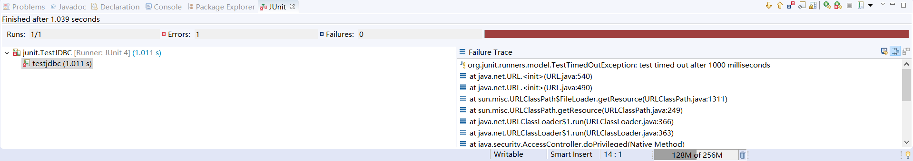

# 基础加强

## 设置环境

* 安装操作系统，安装备份（镜像）：
* JDK：设置环境变量
* eclipse：解压即可
  * eclipse自身解压目录不包括中文
  * 代码工作空间不包括中文
* tomcat解压不要包含中文
* mysql安装，选择utf-8编码
* 设置eclipse
  * 关联tomcat
    * 开发环境中，环境发生变化（重新关联tomcat）
    * 删除servers窗口下的tomcat
    * 删除Project Explore 窗口下的server
    * 重新关联window-> preferences-> servers-> runtime-> tomcat

## 自定义注解

### 注解简介

* 什么是注解？
  * 注解和接口一样，都是属于数据类型
* 注解作用
  * 编译检查
  * **配置（后期使用最多）**
  * 生成帮助文档
* 注解的特点
  * 注解在变量，方法，类之上加载
  * 注解也可以有属性也可以没有属性 @override @Test(timeout=1000)
  * 注解有作用范围（源码，编译期间，运行期间）
    * 源码期间有效：String类之上@Author @Since @See
      * 作用：使用命令javadoc将当前的源码生成帮助文件，可以实别String类上的相关注解
    * 编译器期间有效 @Override @Deprecated @SuppressWarning
      * 作用：告诉编译器部分信息
    * 运行期间有效 @Test
      * 作用：当我们在当前代码以Junit方式运行时候，Junit会运行方法上包含@Test注解的方法

### 回顾JDK中出现的三种注解

* @Override - jdk5.0表示重写父类 | jdk6.0还可以表示实现接口的办法
* @Deprecated - 表示被修饰的办法已经过时。过时的办法不建议使用，但仍可以使用。
  * 一般被这个标记存在不同的缺陷 1.安全问题 2.新的API取代
* @Suppresswarning - 表示抑制警告，被修饰的类或方法如果存在编译警告，则被编译器忽略
  * deprecation：忽略过时
  * rawtypes 忽略类型安全
  * unused 忽略不适用
  * unchecked 忽略安全检查
  * null 忽略空指针
  * all 忽略所有

抑制警告

```java
public void helloworld() {
  @SuppressWarnings("unused")
  int a;
}
```

### 演习junit注解含属性和javadoc自动生成文档

* junit注解属性

    ```java
    @Test(timeout = 1000)
    public void testjdbc() {
        try {
            Thread.sleep(1000);
        } catch (InterruptedException e1) {
            // TODO Auto-generated catch block
            e1.printStackTrace();
        }
    }
    ```

    执行结果
    
* javadoc自动生成文档

  Project -> Genernate Javadoc

  解决中文需要在VM options位置 添加`-encoding UTF-8 -charset UTF-8`

### 自定义注解简介

* 格式：

```java
public @interface MyAnnotation {
  public 属性类型 属性名称1();
  public 属性类型 属性名称2() default 默认值;
}
```

* 自定义注解属性支持的类型
  * 基本数据类型（4类8种）
  * String、Class、Annotaion（注解类型），枚举类型
  * 以上类型的一维数组

注解作用：**配置作用**
> 配置：开发的时候部分信息不希望写死在程序种，例如数据库的用户名和密码，可以将用户名和密码存放在txt、properties、xml文件中，利用程序来读取文件中的内容  
> 框架：一大堆工具类的组合，目的：加速项目开发  
> 后期的学习中，框架部分 hibernate，spring，struts很多信息需要配置，提供了两种形式的配置（xml，注解）

* 什么时候用注解来做配置？
  * 如果配置信息不会发生的修改，例如servlet路径，建议使用的形式
  * 如果配置信息需要发生频繁的修改，例如数据库的用户名和密码信息，建议使用传统发方法信息（.txt，.properties，.xml）

```xml
<students>
  <stu>
   <stuNum>s002</stuNun>
   <stuPhone>
      <stuHomePhone>124324</stuHomePhone>
      <stuCmpPhone>12342143</stuCmpPhone>
   </stuPhone>
  </stu>
</students>

```

* 测试使用自定义注解

  ```java
  public @interface MyAnnotation {
    public int a() default 1;
    public String password();
    public Class clazz() default Date.class;
    public MyAnnotation2 myAnnotation2();
    public Color color() default Color.BLUE;
    String[] arrys();
  }

  public class TestAnnotation {

    @MyAnnotation(a = 1,
        password = "11",
        clazz = String.class,
        color = Color.RED,
        arrys = ("itcast"),
        myAnnotation2 = @MyAnnotation2)
    public static void main(String[] args) {
    }
  }
  ```

  * 注意
    * 注解可以没有属性，如果有属性需要小括号括住
    * 属性格式：属性名=属性值
    * 一个对象上，注解只能用一次

### 自定义注解：解析