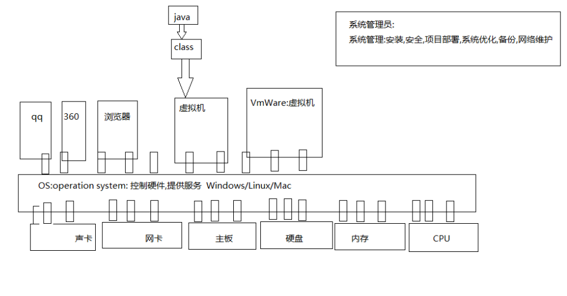
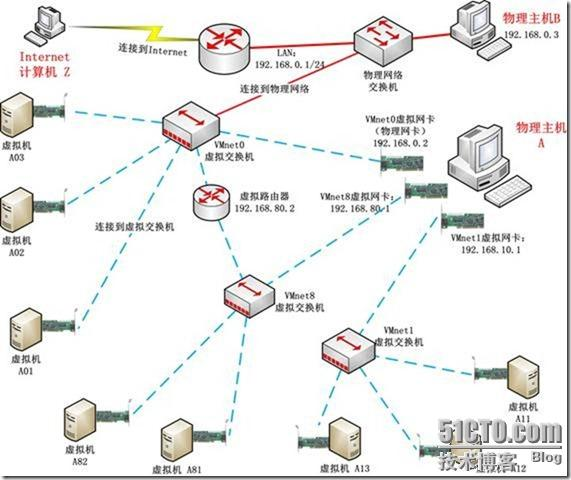

# Linux

## 操作系统


电信(移动/联通/电信)   金融(银行)   Linux系统

硬件:嵌入式行业   硬件(电路),驱动,应用

Linux管理员:项目的发布,Linux系统安全,系能调优,备份数据
系统管理员: 搭建维护企业网络,服务器,OA(网管)

## Linux使用方法

### 解决Centos7-Minimal安装之后无法联网的问题



首先清楚VMware的net如何设置

1. 设置vmware的网关，设置PC上的虚拟网卡，用来连接vmware的net网络
2. 在centos，使用`vi /etc/sysconfig/network-scripts/ifcfg-ens33`，配置成以下说明

```txt
BOOTPROTO=none
# 这里原来是DHCP，换成none或者static

ONBOOT=yes
# 把no换成yes

IPADDR=192.168.80.10
# 设置IP

NETMASK=255.255.255.0
#  子网掩码

GATEWAY=192.168.80.1
# 网关，填写vmware设置的网关

DNS1=114.114.114.114
# dns

HWADDR=00:0c:29:02:42:aa
# 在自己虚拟机上输入命令ip addr即可看到自己的，填上自己的
```

重启`service network start`

镜像修改

> [清华镜像](https://mirrors.tuna.tsinghua.edu.cn/help/centos/)

### Linux基础命令

* Linux常用目录
  * Linux系统:整个系统就一个盘  
  * home:Linux下root用户之外的其他用户位置家
  * root:超级管理员的家
  * etc:配置文件的目录
  * usr:应用程序的目录

* clear 清空
* ls 列出目录内容
  * ls -al 列出当前文件夹下的所有文件和目录,包含隐藏文件
  * `.`是当前目录
  * `..`是上层目录
  * `foo` `.`开头相当于linux的隐藏文件
* ll 列出当前文件夹的所有文件和目录，不包含隐藏文件
  * ll /home/ 查看根目录下的home目录中的内容
* pwd：查看命令所处的当前位置
* cd 切换目录
  * cd /    切换到根目录
  * cd .    切换到当前目录
  * cd ..   切换上层目录
  * cd ~    切换当前用户的家目录
* mkdir 创建目录
  * mkdir  test01
  * mkdir-pv test02/a/b/c
  * mkdir -pv  /root/test02/a/b/c
* 删除空目录
  * rmdir test01
  * rmdir test02 - 不可以 因为test02/a/b/c
* 查看文件内容
  * cat install.log 适合文件内容不多，一个屏幕就可以显示完毕
  * more install.log 分屏幕查看文件内容
  * less -mN install.log 分屏幕查看文件内容，半页前进/后退，加行号，搜索
  * tail -19 install.log 查看文件末尾19行信息
* cp 复制
  * cp install.log install2.log 将当前目录下的install.log文件复制到install2.log
  * cp ./install.log ./test02/ 将当前目录下的install.log文件复制到test02目录里
  * cp -r ./test01 ./test02/ 将当前目录下的test01目录复制到当前目录下的test02 目录中
* mv install.log ./test02 将install.log文件移动到当前目录下的test02目录中
* mv install02.log install03.log 将install02.log 文件重命名成install03.log
* rf -f fileName 强制删除文件
* rf -rf dirName 强制删除目录
* touch 1.txt 新建笔记本
* vim 1.txt 编辑笔记本 i-insert模式 esc-命令行模式->输入wq回车  --- 场景 配置tomcat
* 管道：不是某个具体的命令是管道，命令的一种组合方式
  * 命令1|命令2 ：经常是在命令1的基础上，通过命令2来过滤显示部分内容
  * cat install.log
  * cat install.log | grep -i crash  ： 查看install.log文件中与crash相关的软件包信息
  * ps -ef 相当于windows下的任务管理器
  * ps -ef | grep -i mysql 查看linux下和mysql相关的进程信息
* ping
* tar 解压缩
  * tar czvf ./XXX.tar ./test03 压缩 非打包
  * tar xzvf ./XXX.tar 注销vf
* reboot 重启
* halt关机

---

### Linux权限以及权限命令

* 用户组 在Linux中的每个组必须属于一个组，不能独立于组外，在Linux中每个文件有所有者、所在组、其他组的概念
  * 所有者
    * 一般为文件的创建者，谁创建了文件，就天然称为该文件的所有者
    * 用ls -ahl可以看到文件的所有者
    * 也可以使用`chown 用户名 文件名`来修改文件的所有者
  * 文件所在组
    * 当某个用户创建了一个文件后，这个文件的所在组就是该用户所在的组
    * 用ls -ahl命令可以看到文件的所有组
    * 也可以使用`chgrp组名，文件名`来修改文件所在组
  * 其他组
    * 除开文件所有者和所有组的用户外，系统的其他用户都是文件其他组

* -rwxrw-r‐-1 root root 1213 Feb 2 09:39 abc
  * 权限后边
    * 1代表连接的文件数
    * root表示用户
    * root表示用户所在组
    * 1213表示文件大小（字节）
    * Feb 2 09:39  表示最后修改日期
    * abc 表示文件名
  * 权限解释
    * 第一组rwx：文件所有者的权限是读、写、执行
    * 第二组rw-：与文件同一组的用户的权限是读、写但不能执行
    * 第三组r--：不与文件所有组同组的其他用户的权限是读不能写和执行
    * 注意：r=4 w=2 x=1 因此rwx=4+2+1=7

* 改变权限的命令
  * chmod 改变文件和目录的权限
    * chmod 755 abc：赋予abc rwxr-xr-x
    * chmod u=rwx,g=rx,o=rx abc
    * chmod u-x,g+w abc：给abc取出用户执行的权限，增加组写的权限
    * chmod a+r abcmo