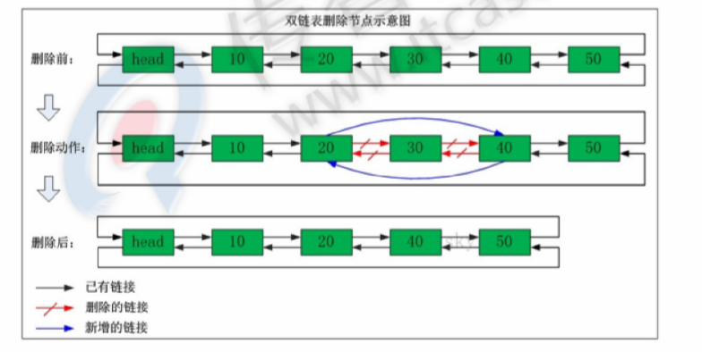

# Redis&nosql

## NoSQL

NoSQL(NoSQL = Not Only SQL) 全新db理念，泛指非关系型数据库

### 为什么需要

因为

* high performance - 对数据库高并发和读写需求
* huge storage - 海量数据的高效率存储和访问
* high scalability&&high availability - 对数据库的高可扩展性和高可用性需求

### 主流NoSQL

* 键值对（Key-value）
  * 相关产品：tokyo cabinet/tyrant、redis、voldemort
  * 典型应用：内容缓冲，主要用于处理大量数据的高访问负载
  * 数据模型：一系列键值对
  * 优势：快速查询
  * 劣势：存储的数据结构缺少结构化
* 列存数据库
  * 相关产品：cassandra，hbase，riak
  * 典型应用：分布式的文件系统
  * 数据模型：以列簇式存储，更容易进行分布式扩展
  * 劣势：功能相对局限
* 文档型数据库
  * 相关产品：couchDB、mongoDB
  * 典型应用：web应用（与key-value类似，value是结构化的）
  * 数据模型：一系列键值对
  * 优势：数据结构要求不严格
  * 劣势：查询性能不高，缺少统一的查询语法
* 图形（graph）数据库
  * 相关数据库：neo4j，infoGrid，infinite graph
  * 典型应用：社交网络
  * 数据模型：图结构
  * 优势：利用图结构算法。
  * 劣势：需要对整个图做计算才得到结果，不容易做分布式的集群方案。

### nosql特点

* 易扩展
* 大数据量，高性能
* 灵活的数据模式
* 高可用

## redis概述

redis是c开发开源高性能键值对数据库，支持的key-value类型为

* 字符串模式
* 散列类型
* 列表类型
* 集合类型
* 有序集合类型

### redis应用场景

* 缓存（ 数据查询 | 短链接 | 新闻内容 | 商品内容等）（最多使用）
* 聊天室在线好友列表
* 任务队列（秒杀 | 抢购 | 12306等）
* 应用排行榜
* 网站访问统计
* 数据过期处理（可以精确到毫秒）
* 分布式集群架构中的session分离

### redis安装

见Linux安装软件

#### 向redis服务器发送命令

* ping 测试客户端与redis连接是否正常，正常会收到pong

    ```txt
    192.168.80.10:6379> ping
    PONG
    ```

* set/get 使用set和get可以向redis设置数据，获取数据
  
    ```txt
    192.168.80.10:6379> set name tom
    OK
    192.168.80.10:6379> get name
    "tom"
    ```

* del 删除指定key

    ```txt
    192.168.80.10:6379> del name
    (integer) 1
    192.168.80.10:6379> get name
    (nil)
    ```

## jedis

redis不仅用命令操作，基本主流语言都有客户端支持，例如java c c++ c# php node.js go

官方有很多java客户端，jedis redisson jredis jdbc-redis，官方推荐jedis redisson，企业最多jedis

### jedis使用

* 导入jar `jedis-2.7.0.jar` `commons-pool2-2.3.jar`

#### 单实例连接

```java
public static void main(String[] args) {
        // 1.设置ip地址和端口
        Jedis jedis = new Jedis("192.168.80.10", 6379);
        // 2.设置密码
        jedis.auth("helloworld");
        // 3.设置数据
        jedis.set("name", "zhangsan");

        // 4. 获得数据
        String hello = jedis.get("name");

        System.out.println(hello);

        // 5. 释放资源
        jedis.close();
    }
```

注意：如果抛出连接超时异常，检查防火墙开了没

#### 连接池连接

```java
public class TestJedisPool {
    /**
    * @param args
    */
    /**
    * @param args
    */
    public static void main(String[] args) {
        // 1.获得连接池配置对象，设置配置项
        JedisPoolConfig config = new JedisPoolConfig();

        // 2. 设置最大连接数
        config.setMaxTotal(30);
        // 3. 设置最大空闲连接数
        config.setMaxIdle(10);

        // 4. 获得连接池
        JedisPool jedisPool = new JedisPool(config, "192.168.80.10", 6379);

        // 5. 获得核心对象
        Jedis jedis = null;

        try {
            jedis = jedisPool.getResource();
            jedis.auth("helloworld");

            // 6. 设置数据
            jedis.set("name", "tom");

            // 7. 获得对象
            String name = jedis.get("name");
            System.out.println(name);

        } catch (Exception e) {
        } finally {
            if (jedis != null) {
                jedis.close();
            }
            // 虚拟机关闭时候，释放pool资源
            if (jedisPool != null) {
                jedisPool.close();
            }
        }
    }
}
```

## Redis的数据结构

redis是一种高级的key-value的存储系统，其中value支持五种数据类型。

* string - 字符串
* hash - 哈希
* list - 字符串列表
* set - 字符串集合
* sorted set - 有序字符串集合

关于key，需要注意

1. key不要太长，最好不要操作1024个字节，这不仅消耗内存还会降低查找效率
2. key不要太短，如果太短降低key的可读性
3. 在项目中，key最好有一个统一的命名规则

### 存储string

字符串类型是redis中最为基础的数据存储类型，它在redis中是二进制安全的，这便意味着该类型存入和获取的数据相同，在redis中字符串类型的value最多可以容纳的长度是512M

> 二进制安全的意思是：只关心二进制化的字符串,不关心具体格式.只会严格的按照二进制的数据存取。不会妄图已某种特殊格式解析数据。

#### string赋值

* set key value - 设定key持有特定的字符串value，如果该key存在则进行附改操作，总是返回OK

    ```txt
    192.168.80.10:6379> set key name
    OK
    ```

#### string取值

* get key - 获取key的value值，如果与该key关联的value不是string，redis将会返回错误信息，因为get命令只能回去string value，如果不存在，返回nil

    ```txt
    192.168.80.10:6379> get name
    "tom"
    192.168.80.10:6379> get name2
    (nil)
    ```

* getset key value - 先获取该key的值，在设置

    ```txt
    192.168.80.10:6379> getset name aa
    "tom"
    192.168.80.10:6379> get name
    "aa"
    ```

#### string删除

* del key - 删除key

    ```txt
    192.168.80.10:6379> set person tom
    OK
    192.168.80.10:6379> get person
    "tom"
    192.168.80.10:6379> del person
    (integer) 1
    192.168.80.10:6379> get person
    (nil
    ```

#### string数值增减

* incr key - 将指定的key的value原子性的递增1 如果该key不存在，其初始值为0，在incr之后其值为1，如果该value不能转成整形，如hello，该操作将执行失败并返回相应的错误信息。

    ```txt
    192.168.80.10:6379> incr num
    (integer) 1
    192.168.80.10:6379> incr num
    (integer) 2
    192.168.80.10:6379> incr num
    (integer) 3
    192.168.80.10:6379> incr num
    (integer) 4
    192.168.80.10:6379> get num
    "4"
    192.168.80.10:6379> del num
    (integer) 1
    192.168.80.10:6379> get num
    (nil)
    ```

* decr key - 将指定的key的value原子性-1，如果该value不能转成整形，如hello，该操作将执行失败并返回相应的错误信息。

    ```txt
    192.168.80.10:6379> decr n
    (integer) -1
    ```

#### string扩展命令

* `incrby key increment key`的value原子性增加increment

    ```txt
    192.168.80.10:6379> set num 0
    OK
    192.168.80.10:6379> get num
    "0"
    192.168.80.10:6379> incrby num 10
    (integer) 10
    192.168.80.10:6379> get num
    "10"
    ```

* `decrby key decrement key`的value原子性减少decrement

    ```txt
    192.168.80.10:6379> get num
    "10"
    192.168.80.10:6379> decrby num 4
    (integer) 6
    ```

* `append key value` 拼凑字符串，如果key存在，追加其值k，key不存在，重新创建一个key/value

    ```txt
    192.168.80.10:6379> get num
    "6"
    192.168.80.10:6379> append num 5
    (integer) 2
    192.168.80.10:6379> get num
    "65"
    192.168.80.10:6379> append aa hll
    (integer) 3
    192.168.80.10:6379> get aa
    "hll"
    ```

### 存储hash

redis中的hash类型可以看成具有string key和string value的map容器。所以该类型非常适合于存储值对象的信息。如username、Password和age等。如果hash中包含很少的字段，那么该类型的数据也将仅占用很少的磁盘空间，每一个hash可以存储4294967295个键值对

#### hash赋值

* `hset key field value` 为指定的key设定field/value对（键值对）

    ```txt
    192.168.80.10:6379> hset myhash username jack
    (integer) 1
    192.168.80.10:6379> hset myhash age 18
    (integer) 1
    ```

* `hmset key field value[field2 value2]` 设置key中多个filed/value

#### hash取值

* hget key field：返回指定的key中的field的值

    ```txt
    192.168.80.10:6379> hget myhash username
    "jack"
    ```

* `hmget key fileds` 获取key中多个field的值

    ```txt
    192.168.80.10:6379> hmget myhash2 username age
    1) "rose"
    2) "21"
    ```

* `hgetall key` 获取key中所有的field-value

    ```txt
    192.168.80.10:6379> hgetall myhash
    1) "username"
    2) "jack"
    3) "age"
    4) "18"
    192.168.80.10:6379> hgetall myhash2
    1) "username"
    2) "rose"
    3) "age"
    4) "21"
    ```

#### hash删除

* `hdel key field[field ...]` 可以删除一个字段或多个字段，返回值是被删除的个数 0 表示删除字段不存在

    ```txt
    192.168.80.10:6379> hdel myhash2 username age
    (integer) 2
    192.168.80.10:6379> hgetall myhash2
    (empty list or set)

    192.168.80.10:6379> hdel myhash2 username
    (integer) 0
    ```

* `del key` 删除整个list

    ```txt
    192.168.80.10:6379> hmset myhash2 username rose age 12
    OK
    192.168.80.10:6379> del myhash2
    (integer) 1
    192.168.80.10:6379> hget myhash2 username
    (nil)
    ```

#### hash增加数字

* `hincrby key field increment` 设置key中field的值增加increment

    ```txt
    192.168.80.10:6379> hget myhash age
    "18"
    192.168.80.10:6379> hincrby myhash age 5
    (integer) 23
    192.168.80.10:6379> hget myhash age
    "23
    ```

#### hash自学命令

* `hexists key field` 判断指定的key中的field是否存在

    ```txt
    192.168.80.10:6379> hexists myhash username
    (integer) 1
    192.168.80.10:6379> hexists myhash password
    (integer) 0
    ```

* `hlen key` 获取key所包含的field的数量

    ```txt
    192.168.80.10:6379> hgetall myhash
    1) "username"
    2) "jack"
    3) "age"
    4) "23"
    192.168.80.10:6379> hlen myhash
    (integer) 2
    ```

* `hkeys key` 获取所有的field

    ```txt
    192.168.80.10:6379> hkeys myhash
    1) "username"
    2) "age"
    ```

* `hvals key` 获取所有的value

    ```txt
    192.168.80.10:6379> hvals myhash
    1) "jack"
    2) "23"
    ```

### 存储list

redis中，list的类型是按照插入顺序排序的字符串链表。和数据结构中的普通链表一样，我们可以在其头部和尾部添加新的元素。在插入时，如果该键并不存在，redis将会为该键创建一个新的链表。与此相反，如果该链表中所有元素均被移除，那么该键也将会被从数据库中删除。

List中可以包含的最大元素数量是4294967295

从元素插入和删除的效率来看，如果我们是在链表的两头插入或删除元素，这将是非常高校的操作，即使链表中已经存储了百万条记录，该操作也可以在常量时间内完成。然而需要说明的是，如果元素插入或删除操作是作用于链表中间，那将会是非常低效。相信对于有良好数据结构基础开发者而言，这一点并不难理解。

1. Arraylist使用数组方式存储数据，所以根据索引查询数据速度块，而新增或者删除元素时需要设计位移操作，所以比较慢
2. LinkedList 使用双向链表方式存储数据，每个元素都记录前后元素的指针，所以插入、删除数据时只是更改前后元素的指针指向即可，速度非常快，然后通过下标查询元素时需要从头开始索引，所以比较慢。
3. 双向链表中添加数据

    

4. 双向链表中删除数据

    

#### list 两端添加

* `lpush key values[value1 value2]` 在指定的key所关联的list的头部插入所有的values，如果该key不存在，该命令在插入之前创建一个与该key关联的空链表，之后再向该链表的头部插入数据。插入成功，返回元素的个数

    ```txt
    192.168.80.10:6379> lpush mylist a  b c
    (integer) 3
    192.168.80.10:6379> lpush mylist 1 2 3
    (integer) 6
    ```

* `rpush key values[value1、value2]` 在该`list`的尾部添加元素

    ```txt
    192.168.80.10:6379> rpush mylist 2 a b c d
    (integer) 11
    192.168.80.10:6379> rpush mylist 2 1 2 3
    (integer) 15
    ```

#### list 查看列表

* `lrange key start end` 获取链表中从start到end的元素的值，start、end从0开始计数；也可为负数，若为-1则表示尾部的元素，-2则表示倒数第二个，以此类推...

    ```txt
    192.168.80.10:6379> lrange mylist  0 14
    1) "3"
    2) "2"
    3) "1"
    4) "c"
    5) "b"
    6) "a"
    7) "2"
    8) "a"
    9) "b"
    10) "c"
    11) "d"
    12) "2"
    13) "1"
    14) "2"
    15) "3"
    ```

    ```txt
    192.168.80.10:6379> lrange mylist  0 -1
    1) "3"
    2) "2"
    3) "1"
    4) "c"
    5) "b"
    6) "a"
    7) "2"
    8) "a"
    9) "b"
    10) "c"
    11) "d"
    12) "2"
    13) "1"
    14) "2"
    15) "3"
    ```

#### 两段弹出

* `lpop key` 返回并弹出指定的key关联的链表中的第一个元素，即头部元素，如果该key不存在，返回nil；若key存在，则返回链表的头部元素

    ```txt
    192.168.80.10:6379> lpop mylist
    "3"
    192.168.80.10:6379> lrange mylist 0 5
    1) "2"
    2) "1"
    3) "c"
    4) "b"
    5) "a"
    6) "2"
    ```

* `rpop key` 从尾部弹出元素

    ```txt
    192.168.80.10:6379> rpop mylist
    "3"
    192.168.80.10:6379> lrange mylist 0 -1
    1) "2"
    2) "1"
    3) "c"
    4) "b"
    5) "a"
    6) "2"
    7) "a"
    8) "b"
    9) "c"
    10) "d"
    11) "2"
    12) "1"
    13) "2"
    ```

#### 获取列表中元素的个数

* `llen key` 获取指定的可以关联的链表中的元素的数量。

    ```txt
    192.168.80.10:6379> llen mylist
    (integer) 13
    ```

#### list扩展命令

* `lpushx key value` 仅当参数中指定的key存在的时候，向关联的list的头部插入value。如果不存在，将不进行插入

    ```txt
    192.168.80.10:6379> lpushx mylist x
    (integer) 14
    192.168.80.10:6379> lpushx h x
    (integer) 0
    ```

* `rpushx key value` 在该list的尾部添加元素

    ```txt
    192.168.80.10:6379> rpushx mylist aa
    (integer) 15
    192.168.80.10:6379> lrange mylist 0 -1
    1) "x"
    2) "2"
    3) "1"
    4) "c"
    5) "b"
    6) "a"
    7) "2"
    8) "a"
    9) "b"
    10) "c"
    11) "d"
    12) "2"
    13) "1"
    14) "2"
    15) "aa"
    192.168.80.10:6379> rpushx h aa
    (integer) 0
    ```

* `lrem key count value` 删除count个值为value的元素，如果count大于0，从头到尾并删除count个值为value的元素，如果count小于0，则从尾到头遍历并删除。如果count等于0，则删除链表中所有等于value的元素

    ```txt
    # 初始化数据
    192.168.80.10:6379> lpush mylist3 1 2 3
    (integer) 3
    192.168.80.10:6379> lpush mylist3 1 2 3
    (integer) 6
    192.168.80.10:6379> lpush mylist3 1 2 3
    (integer) 9

    # 从头删除，删除2个3
    192.168.80.10:6379> lrem mylist3 2 3
    (integer) 2
    192.168.80.10:6379> lrange mylist3 0 -1
    1) "2"
    2) "1"
    3) "2"
    4) "1"
    5) "3"
    6) "2"
    7) "1"

    # 从尾删除，2个数字1
    192.168.80.10:6379> lrem mylist3 -2 1
    (integer) 2
    192.168.80.10:6379> lrange mylist3 0 -1
    1) "2"
    2) "1"
    3) "2"
    4) "3"
    5) "2"

    # 删除所有数字 2
    192.168.80.10:6379> lrem mylist3 0 2
    (integer) 3
    192.168.80.10:6379> lrange mylist3 0 -1
    1) "1"
    2) "3"
    ```

* `lset key index value` 设置链表中的index的脚标的元素值，0代表链表的头元素，-1代表链表的尾元素。操作链表不存在则抛出异常

    ```txt
    192.168.80.10:6379> lset mylist 1 l
    OK
    192.168.80.10:6379> lset mylist -1 r
    OK
    192.168.80.10:6379> lset mylist 100 err
    (error) ERR index out of range
    192.168.80.10:6379> lrange mylist 0 -1
    1) "2"
    2) "l"
    3) "2"
    4) "r"
    192.168.80.10:6379> lset mylist 0 h
    OK
    192.168.80.10:6379> lrange mylist 0 -1
    1) "h"
    2) "l"
    3) "2"
    4) "r"
    ```

* `linsert key before | after pivot value` 在pivot元素前或者后插入value这个元素

    ```txt
    192.168.80.10:6379> lrange mylist 0 -1
    1) "h"
    2) "l"
    3) "xx"
    4) "2"
    5) "hh"
    6) "r"
    192.168.80.10:6379> linsert mylist before xx hello
    (integer) 7
    192.168.80.10:6379> linsert mylist after xx world
    (integer) 8
    192.168.80.10:6379> lrange mylist 0 -1
    1) "h"
    2) "l"
    3) "hello"
    4) "xx"
    5) "world"
    6) "2"
    7) "hh"
    8) "r"
    192.168.80.10:6379>
    ```

* `rpoplpush resource destination` 将链表中的尾部元素弹出并添加到首部 [循环操作]

    ```txt
    192.168.80.10:6379> lpush mylist5 1 2 3
    (integer) 3
    192.168.80.10:6379> lpush mylist6 a b c
    (integer) 3

    # 将mylist5右端弹出，压入到mylist6左边
    192.168.80.10:6379> lrange mylist5 0 -1
    1) "3"
    2) "2"
    3) "1"
    192.168.80.10:6379> lrange mylist6 0 -1
    1) "c"
    2) "b"
    3) "a"
    192.168.80.10:6379> rpoplpush mylist5 mylist6
    "1"
    192.168.80.10:6379> lrange mylist5 0 -1
    1) "3"
    2) "2"
    192.168.80.10:6379> lrange mylist6 0 -1
    1) "1"
    2) "c"
    3) "b"
    4) "a"

    # 将mylist6右端弹出，压入到mylist5左边
    192.168.80.10:6379> lrange mylist5 0 -1
    1) "3"
    2) "2"
    192.168.80.10:6379> lrange mylist6 0 -1
    1) "1"
    2) "c"
    3) "b"
    4) "a"
    192.168.80.10:6379> rpoplpush mylist6 mylist5
    "a"
    192.168.80.10:6379> lrange mylist5 0 -1
    1) "a"
    2) "3"
    3) "2"
    192.168.80.10:6379> lrange mylist6 0 -1
    1) "1"
    2) "c"
    3) "b"
    ```

* rpoplpush的使用场景

redis链表经常会被用于消费队列的服务，以完成更多程序之间的消息交换。假设一个应用程序正在执行LPUSH操作向链表中添加新的元素，我们通常将这样的程序称之为 ”生产者（producer）“，而另外一个应用程序正在执行RPOP操作从链表取出元素，我们称这样的程序为 ”消费者“ （consumer）。如果此时，消费者程序在取出消息元素后立即崩溃，由于该消息已经被取出且没有正常处理，那么我们就可以认为该消息已经丢失，由此可能会导致业务数据丢失，或业务状态不一致等现象的发生。然而使用rpoplpush命令，消费者程序在主消息队列中取出消息之后再将其插入到备份队列中，指导消费者程序完成正常的处理逻辑后再将该消息从备份队列中删除。同时我们还可以提供一个守护进程，当发现备份队列中的消息过期时，可以重新将其放回到主消息队列中，以便其他的消费者程序继续处理。


---


### 存储set

在redis中，我们可以将set类型看作没有排序的字符集合，和list类型一样，我们也可以在该类型的数据值上执行添加、删除或判断某一元素是否存在等操作。需要说明的是，这些操作的时间复杂度为O（1），即常量时间内完成次操作。set可包含的最大元素数量是4294967295.

和list不同的是，**set集合不允许出现重复的元素**，这一点和C++标准库中的set容器是完全相同的，换句话说，如果多次添加相同的元素，set中仅保留该元素一份拷贝。和list类型相比，set类型在功能上还存在着一个非常重要的特性，即在服务器端完成多个sets之间的聚合计算，如 unions - 并集、intersections - 交集、differences - 差集。由于这些操作均在服务器端完成，因此效率极高，而且也节省了大量的网络IO开销。

#### set添加/删除元素

* `sadd key values[value1、value2...]` 向set中添加数据，如果该key的值已有则不会重复添加

    ```txt
    192.168.80.10:6379> sadd myset a b c
    (integer) 3
    192.168.80.10:6379> sadd myset a
    (integer) 0
    ```

* `srem key members[member1、member2...]`

    ```txt
    192.168.80.10:6379> sadd myset 1 2 3
    (integer) 3
    192.168.80.10:6379> srem myset 1 2
    (integer) 2
    ```

#### 获得集合中的元素

* `smembers key：` 获取set中的所有成员

    ```txt
    192.168.80.10:6379> smembers myset
    1) "a"
    2) "c"
    3) "b"
    4) "3"
    ```

* `sismember key member：` 判断参数中指定的成员是否在该set中，1表示存在，0表示不存在或者该key本身就不存在（无论集合有多少元素都可以极速的返回结果）

    ```txt
    192.168.80.10:6379> sismember myset 1
    (integer) 0
    192.168.80.10:6379> sismember myset a
    (integer) 1
    ```

#### 集合的差集运算 A-B

* `sdiff key1 key2` 返回key1与key2相差的成员，而且与key的顺序有关。返回差集。

    

    ```txt
    192.168.80.10:6379> sadd mya1 a b c
    (integer) 3
    192.168.80.10:6379> sadd myb1 a c 1 2
    (integer) 4
    192.168.80.10:6379> sdiff mya1 myb1
    1) "b"
    ```

#### 集合的交集运算 A∩B

* `sinter key1 key2 key3...` 返回交集

   

    ```txt
    192.168.80.10:6379> sadd mya2 a b c
    (integer) 3
    192.168.80.10:6379> sadd myb2 a  c 1 2
    (integer) 4
    192.168.80.10:6379> sinter mya2 myb2
    1) "c"
    2) "a"
    ```

#### 并集运算 A∪B

* `sunion key1 key2 key3...` 返回并集

    

    ```txt
    192.168.80.10:6379> sadd mya3 a b c
    (integer) 3
    192.168.80.10:6379> sadd myb3 a c 1 2
    (integer) 4
    192.168.80.10:6379> sunion mya3 myb3
    1) "a"
    2) "c"
    3) "2"
    4) "b"
    5) "1"
    ```

#### set扩展命令

* `scard key` 获取set中成员的数量
* `srandmember key` 随机返回set中一个成员
* `sdiffstore destination key1 key2...` 将key1 key2相差的成员存储在`destination`上
* `sinterstore destination key[key...]` 将返回的交集存储在destination上
* `sunionstore destination key[key..]` 将返回的并集存储到destination上

#### 使用场景

1.可以使用redis的set数据类型跟踪一些唯一性数据，比如访问某个博客的唯一IP地址信息。对于此场景，我们仅需在每次访问该博客时将访问者的IP存入redis中，set数据类型会自动保证ip地址的唯一性。
2. 充分利用set类型的 服务端聚合操作方便、高校的特性，可以用于维护数据对象之间的关联关系。比如所有购买某一电子设备的客户ID被存储在一个指的的set中，而购买另外一种电子产品的客户ID被存储在另外一个set中，如果此时我们想获取有哪些客户同时购买了这两种产品时，set的intersection命令就可以充分返回它的方便和效率的优势了。

### 存储sortedset

sorted-set和set类型极为相似，它们都是字符串集合，都不允许重复的成员在一个set集合之中，它们之间的**主要差别**是sorted-set中每一个成员都会有一个分数（score）与之关联，redis正是通过分数来为集合中的成员进行从小到大的排序，然而需要额外指出的是，尽管sorted-set中的成员必须是唯一的，但是分数是可以重复的。

在sorted-set中添加、删除或更新一个成员都是非常快速的操作，其时间复杂度为集合中成员数量的对数。由于sorted-set中的成员在集合中的位置是有序的，因此，即便是访问位于集合中部的成员也仍然是非常高效的。事实上，redis所具有的这一特征在很多其他类型的数据库中是很难实现的，换句话说，在该点上要想达到和redis同样的高校，在其他数据库中进行建模是非常困难的

例如 游戏排名、微博热点话题等使用场景。

#### sortedset添加元素

* `zadd key score member score2 member2` 将所有成员以及该成员的分数存放到sorted-set中。如果该元素已经存在则会用新的分数替换原有的分数。返回值是新加入到集合中的元素个数，不包括之前已经存在的元素。

    ```txt
    192.168.80.10:6379> zadd mysort 70 zhangsan 80 lisi 90 wangwu
    (integer) 3
    192.168.80.10:6379> zadd mysort 100 zhangsan # 存在替换分数
    (integer) 0
    192.168.80.10:6379> zadd mysort 50 jack # 添加
    (integer) 1
    ```

#### sortedset获得元素

* `zscore key member` 返回指定成员的分数

    ```txt
    192.168.80.10:6379> zscore mysort zhangsan
    "100"
    ```

* `zcard key` 获取集合的成员数量

    ```txt
    192.168.80.10:6379> zcard mysort
    (integer) 4
    ```

#### sortedset删除元素

* zrem key member[member...] 移除集合中指定的成员，可以指定多个成员

    ```txt
    192.168.80.10:6379> zrem mysort jack wangwu
    (integer) 2
    ```

#### sortedset范围查询

* `zrange key start end[withscores]` 获取集合中脚标为start-end的成员，[withscores]参数表明返回的成员包含其分数

    ```txt
    192.168.80.10:6379> zadd mysort 85 jack 95 rose
    (integer) 2
    192.168.80.10:6379> zrange mysort 0 -1
    1) "lisi"
    2) "jack"
    3) "rose"
    4) "zhangsan"

    ###

    192.168.80.10:6379> zrange mysort 0 -1 withscores
    1) "lisi"
    2) "80"
    3) "jack"
    4) "85"
    5) "rose"
    6) "95"
    7) "zhangsan"
    8) "100"
    ```

* `zrevrange key start stop[withscores]` 按照元素分数从大到小的顺序返回索引从start到stop之间的所有元素（包括两端的元素）

    ```txt
    192.168.80.10:6379> zrevrange mysort 0 -1 withscores
    1) "zhangsan"
    2) "100"
    3) "rose"
    4) "95"
    5) "jack"
    6) "85"
    7) "lisi"
    8) "80"
    ```

* `zremrangebyrank key start stop` 按照排名范围删除元素

    ```txt
    192.168.80.10:6379> zremrangebyrank mysort 0 4
    (integer) 4
    192.168.80.10:6379> zrevrange mysort 0 -1 withscores
    (empty list or set)
    ```

* `zremrangebyscore key min max` 按照分数范围删除元素

    ```txt
    192.168.80.10:6379> zadd mysort 80 zhangsan 90 lisi 100 wangwu
    (integer) 3
    192.168.80.10:6379> zremrangebyscore mysort 80 100
    (integer) 3
    192.168.80.10:6379> zrange mysort 0 -1
    (empty list or set)
    ```

#### sortedset扩展元素

* `zrangebyscore key min max[withscores][limit offset count]` 返回分数在[min,max]的成员并按照分数从低到高排序。[withscores]：显示分数；[limit offset count] ：offset，表明从脚标为offset的元素开始并返回count个成员
* `zincrby key increment member`：设定指定成员的增加的分数。返回值是更改后的分数。
* `zcount key min max` 获取分数在[min max]之间的成员
* `zrank key member` 返回成员在集合中的排名，（从小到大）

#### sortedset使用场景

可以用于一个大型在线游戏的积分排行榜。每当玩家的分数发生变化时，可以执行zadd命令更新玩家的分数，此后再通过zrange命令获取积分toplen的用户信息。当然我们也可以用zrank命令通过username来获取玩家的排行信息。最后我们将组合使用zrange和zrank命令快速的获取和某个玩家积分相近的其他用户的信息

sorted-set类型还可以用于构建索引数据。

### keys的通用操作

* `keys pattern` 获取所有与pattern匹配的key，*表示任意一个或者多个字符，？表示任意一个字符

    ```txt
    192.168.80.10:6379> keys *
    1) "mylist3"
    2) "mylist5"
    3) "aa"
    4) "n"
    5) "cc"
    6) "mylist"
    7) "mya2"
    8) "mya3"
    9) "myset"
    10) "myhash"
    11) "mylist6"
    12) "myb1"
    13) "num"
    14) "hello"
    15) "myb3"
    16) "key"
    17) "myb2"
    18) "mya1"
    19) "name"

    192.168.80.10:6379> keys mya?
    1) "mya2"
    2) "mya3"
    3) "mya1"
    ```

* `del key1 key2...` 删除指定的key

    ```txt
    192.168.80.10:6379> del mya2 mya3 mya1
    (integer) 3
    ```

* `exists key` 判断该key是否存在，1代表存在，0代表不存在

    ```txt
    192.168.80.10:6379> exists name
    (integer) 1
    192.168.80.10:6379> exists aaa
    (integer) 0
    ```

* `rename key newkey` 为当前的key重命名

    ```txt
    192.168.80.10:6379> get aa
    "hll"
    192.168.80.10:6379> rename aa bb
    OK
    192.168.80.10:6379> get bb
    "hll"
    ```

* `expire key` 设置过期时间 单位：秒

    ```txt
    192.168.80.10:6379> expire bb 1
    (integer) 1
    192.168.80.10:6379> get bb
    (nil)
    ```

* `ttl key` 获取该key所剩的超时时间，如果没有设置超时，返回-1.如果返回-2表示超时不存在

    ```txt
    192.168.80.10:6379> expire cc 1000
    (integer) 1
    192.168.80.10:6379> ttl cc
    (integer) 994
    ```

* `type key` 获取指定key的类型。该命令以字符串的格式返回。返回的字符串为string、set、list、hash和zset，如果key不存在返回none

    ```txt
    192.168.80.10:6379> type newname
    string
    192.168.80.10:6379> type mylist
    list
    192.168.80.10:6379> type myhash
    hash
    192.168.80.10:6379> type mysort
    none
    192.168.80.10:6379> zadd mysort 10 list
    (integer) 1
    192.168.80.10:6379> type mysort
    zset
    192.168.80.10:6379> type myset
    set
    ```

## redis特性

### 多数据库

一个redis实例可以包括多个数据库，客户端可以指定连接某个redis实例的那个数据库，就好比一个mysql中创建多个数据库，客户端连接的时候需要指定连接那个数据库

一个redis实例最多可提供16个数据库，下标从0到15，客户端默认连接第0号数据库，也可以通过select选择连接哪个数据库，如下连接1号库

```txt
192.168.80.10:6379> select 1
OK
192.168.80.10:6379[1]> keys *
(empty list or set)
```

连接0号数据库

```txt
192.168.80.10:6379[1]> select 0
OK
192.168.80.10:6379> keys *
 1) "mylist3"
 2) "mylist5"
 3) "n"
 4) "mysort"
 5) "cc"
 6) "mylist"
 7) "newname"
 8) "myset"
 9) "myhash"
10) "mylist6"
11) "myb1"
12) "num"
```

#### 将cc移植到1号库

* `move newkey 1` 将当前库的key移植到1号库

    ```txt
    192.168.80.10:6379> move cc 1
    (integer) 1
    192.168.80.10:6379> select 1
    OK
    192.168.80.10:6379[1]> keys *
    1) "cc"
    192.168.80.10:6379[1]> type cc
    string
    192.168.80.10:6379[1]> get cc
    "2"
    ```

### 服务器命令

* ping 测试连接是否存货
* echo 再命令行打印一些内容
* select 选择数据库，编号0~15
* quit 退出
* dbsize 返回当前数据库key的数目
* info 获取服务器信息统计
* flushdb 删除当前选择数据库所有的key
* flushall 删除所有数据库中所有的key

### 消息订阅和发布

* `subscribe channel` 订阅频道
* `psubscribe channel` 批量订阅频道
* `publish channel content` 在指定的频道中发布消息

* 步骤1 在第一个连接，订阅mychat频道，此时如果没有人“发布”消息，当前窗口处于等待状态。

    ```txt
    # 窗口1 - 订阅mychat
    192.168.80.10:6379> subscribe mychat
    Reading messages... (press Ctrl-C to quit)
    1) "subscribe"
    2) "mychat"
    3) (integer) 1
    ```

* 步骤2 在另一个窗口中，在mychat频道，发布消息

    ```txt
    # 窗口2 - 对mychat订阅的用户发布消息
    192.168.80.10:6379> publish mychat 111
    (integer) 1
    192.168.80.10:6379>

    # 窗口1 - 此时窗口1收到消息
    192.168.80.10:6379> subscribe mychat
    Reading messages... (press Ctrl-C to quit)
    1) "subscribe"
    2) "mychat"
    3) (integer) 1
    1) "message"
    2) "mychat"
    3) "111"
    ```

* 步骤3 再开第三个窗口，批量订阅以my开头的所有频道

    ```txt
    # 窗口3 - 订阅my开头的所有频道
    192.168.80.10:6379> psubscribe my*
    Reading messages... (press Ctrl-C to quit)
    1) "psubscribe"
    2) "my*"
    3) (integer) 1
    ```

* 步骤4 在第二个窗口，分别在 mychat 和 mychat2 发布信息

    ```txt
    # 窗口2 给mychat和mychat2发消息
    192.168.80.10:6379> publish mychat 222
    (integer) 2
    192.168.80.10:6379> publish mychat 333
    (integer) 2
    192.168.80.10:6379> publish mychat2 444
    (integer) 1
    192.168.80.10:6379>

    # 窗口3 收到所有my开头的消息
    192.168.80.10:6379> psubscribe my*
    Reading messages... (press Ctrl-C to quit)
    1) "psubscribe"
    2) "my*"
    3) (integer) 1
    1) "pmessage"
    2) "my*"
    3) "mychat"
    4) "222"
    1) "pmessage"
    2) "my*"
    3) "mychat"
    4) "333"
    1) "pmessage"
    2) "my*"
    3) "mychat2"
    4) "444"

    # 窗口1 - 只收到了mychat频道的消息
    192.168.80.10:6379> subscribe mychat
    Reading messages... (press Ctrl-C to quit)
    1) "subscribe"
    2) "mychat"
    3) (integer) 1
    1) "message"
    2) "mychat"
    3) "111"
    1) "message"
    2) "mychat"


    3) "222"
    4) "message"
    5) "mychat"
    6) "333"
    ```

### 事务

和众多其他数据库一样，redis作为nosql数据库也提供了事务机制，在redis中，multi/exec/discard这三个命令是我们实现事务的基石。

#### redis事务特性

1. 在事务中所有命令都会被串行化的顺序执行，**事务执行期间，redis不会再为其他客户端提供任何服务**，从而保证了事物中的所有命令都被原子的执行
2. 和关系型数据库中的事务相比，**在redis事务中如果有一条命令执行失败，其后的命令仍然会继续执行**
3. 我们可以通过`multi`命令开启一个事务，有关系型数据库开发经验的人可以理解为 `begin transaction`语句，在该语句之后执行的命令都被视为事务之内的操作，最后我们可以通过 `exec/discard`命令提交/回滚该事务内的所有操作。这两个redis命令可被视为等同于关系型数据库中的 `commit/rollback`语句
4. 在事务开启之前，如果客户端和服务器之间出现通讯故障并导致网络断开，其后所有待执行的语句都不会被服务器执行。然而如果网络中断事件是发生在客户端执行EXEC命令之后，那么该事务中的所有命令都会被服务器执行。
5. 当使用append-only模式时，redis会通过调用系统函数write将该事务内的所有写操作在本次调用全部写入磁盘。然而如果在写入的过程中出现系统崩溃，如电源故障导致的宕机，那么此时也许只有一部分数据被写入磁盘，而另一部分数据却已经丢失，redis服务器会在重新启动的时候执行一系列的必要的一致性检测，一旦发现类似问题，就会立即退出并给出相应的错误提示。此时，要充分利用redis工具包下的redis-check-aof工具，该工具可以帮助我们定位到数据不一致的错误，并将已经写入的部分数据进行回滚，修复之后我们就可以再次重新启动redis服务器了。

#### 事务命令解释

* `multi` - 开启事务用于标记事务的开始，其后执行的命令都将被存入命令队列，直到执行EXEC时，这些命令才会被原子的执行，类似关系数据库中的：begin transaction
* `exec`：提交事务，类似与关系数据库的commit
* `discard`：事务回滚，类似与关系数据库中的rollback

#### 事务测试

```txt
# 步骤1 在窗口1 设置num 并获得数据
192.168.80.10:6379> set num 1
OK
192.168.80.10:6379> get num
"1"

# 步骤2 在窗口2 num累加1 并获得数据
192.168.80.10:6379> incr num
(integer) 2
192.168.80.10:6379> get num
"2"

# 步骤3 在窗口1 获得数据
192.168.80.10:6379> get num
"2"

# 步骤4 在窗口1 开启事务，多次累加数据
192.168.80.10:6379> incr num
QUEUED
192.168.80.10:6379> incr num
QUEUED

# 步骤5 在窗口2 获得数据
192.168.80.10:6379> get num
"2"

# 步骤6 在窗口1 提交数据
192.168.80.10:6379> exec
1) (integer) 3
2) (integer) 4

# 步骤7 窗口2 获得数据
192.168.80.10:6379> get num
"4"
```

#### 回滚

```txt
192.168.80.10:6379> set user jack
OK
192.168.80.10:6379> get user                # 数据jack
"jack"
192.168.80.10:6379> multi                   # 开启事务
OK
192.168.80.10:6379> set user rose           # 设置新数据
QUEUED
192.168.80.10:6379> discard                 # 回滚数据
OK
192.168.80.10:6379> get user
"jack"                                      # 数据仍然是jack
```

#### 失败命令

```txt
192.168.80.10:6379> set num 10      # 初始数据10
OK
192.168.80.10:6379> get num
"10"
192.168.80.10:6379> multi
OK
192.168.80.10:6379> incrby num 5    # +5
QUEUED
192.168.80.10:6379> incrby num x    # +x 抛异常
QUEUED
192.168.80.10:6379> incrby num 5    # +5 num=20
QUEUED
192.168.80.10:6379> exec
1) (integer) 15
2) (error) ERR value is not an integer or out of range
3) (integer) 20
192.168.80.10:6379> get num # 当事务提交，执行所有操作，如果部分操作异常，将被忽略
"20"
```

## redis使用场景 - 了解

1. 取最新N个数据的操作
    

2. 排行榜应用，取TOP N操作
   

3. 需要精准设定过期时间的应用
   

4. 计数器应用  
   redis的命令都是原子性的，你可以轻松利用INCR、DECR命令来构建计数器系统

5. uniq操作，获取某段时间所有数据排重值  
    这里使用redis的set数据结构最合适了，只需要不断地将数据往set中扔就行了，set意为集合，所以自动排重

6. 实时系统，反垃圾系统  
    通过set，可以直到一个终端用户是否进行了某个操作，可以找到其他操作的集合并进行分析统计对比等

7. pub/sub构建实时消息系统  
    redis的pub/sub系统可以构建实时的消息系统，比如很多用pub/sub构建的实时聊天系统

8. 构建队列系统
    使用list可以构建队列系统，使用sorted set甚至可以构建有优先级的队列系统的例子。

## redis持久化 -了解

redis高性能是因为所有数据存储到内存，为了redis重启数据不丢失，需要将数据从内存中同步到硬盘中，这一过程就是持久化。

redis支持两种方式的持久化 RDB&AOF，可以单独用，也可以结合用。

1. RDB持久化 - 默认无需配置
   > 该机制是指在指定的时间间隔内将内存中的数据集快照写入到磁盘
2. AOF持久化
   > 该机制将以日志的形式记录服务器所处理的每一个写操作，在redis服务器启动之初会读取该文件来重新构建数据库，以保证启动后数据库中的数据是完整的。
3. 无持久化
   > 通过配置禁用reids服务器的持久化功能，这样就可以把redis视为一个功能加强版的memcached了 --- 内存缓冲
4. redis可以同时使用RDB和AOF

### RDB


---

* 总结
  * 优势
    * 一个备份文件，容易进行恢复
    * 一个备份文件，易转移
    * 性能最大化，服务器进程极大避免IO操作，子进程来进行持久化
    * 相比AOF机制，数据量很大，RDB启动效率高

  * 劣势
    * 数据无法保证高可用，怕丢失，RDB怕宕`dang`机
    * RDB通过子进程协助数据持久化工作，当数据量过大，会导致整个服务器停止服务几百秒，甚至1秒钟

#### 配置说明 snapshooting

* save 900 1 # 每900s（15min）至少有1key变化，则dump内存快照
* save 300 10 # 每300秒（5min）至少10个key变化，则dump内存快照
* save 60 10000 # 每60秒（1min）至少有10000key发生变化，则dump内存快照


保存位置说明


### AOF


---

* 优势
  * 更高数据安全性[数据持久性]-->提供三种同步
    * 每秒同步
        >  异步完成，效率高，差的是一旦宕机，1秒之内数据消失
    * 每修改同步  
        > 同步持久化，即每次发生的数据变化都会立即记录磁盘，这种效率最低  
    * 无同步 - 无需多言，正确理解
* 劣势
  * 对于相同数量的数据集而言，AOF文件通常大于RDB文件
  * 根据同步策略不同，AOF在运行效率慢RDB。总之每秒同步策略效率比较高的，同步禁用策略效率和RDB一样高效

#### 配置AOF

* `always`    # 每秒有数据修改发生时都会写入AOF文件
* `everysec`  # 每秒钟同步一次，该策略为AOF的缺省策略
* `no`        # 从不同步，高效但是数据不持久化

重写AOF - 若不满足重写条件，可以手动重写 - `bgrewriteaof`


策略选择


### 数据恢复演示

1. flushall操作 - 请空数据库
2. 及时关闭redis服务器（防止dump.rdb） shutdown nosave
3. 编辑aof文件，将日志中的flushall命令删除并重启服务即可

* 步骤1 开启aop，并设置总是保存，然后重启redis

    ```txt
    appendonly yes

    ###
    appendfsync always
    # appendfsync everysec
    # appendfsync no
    ```

* 步骤2 在窗口1进行若干操作

    ```txt
    192.168.80.10:6379> set name jack
    OK
    192.168.80.10:6379> set num 10
    OK
    192.168.80.10:6379> set n1 10
    OK
    192.168.80.10:6379> set n2 10
    OK
    192.168.80.10:6379> set n3 10
    OK
    192.168.80.10:6379> keys
    (error) ERR wrong number of arguments for 'keys' command
    192.168.80.10:6379> keys *
    1) "n3"
    2) "num"
    3) "n1"
    4) "n2"
    5) "name"
    ```

* 步骤3 在窗口1 清空数据库

    ```txt
    192.168.80.10:6379> flushall
    OK
    192.168.80.10:6379> keys *
    (empty list or set)
    ```

* 步骤4 在窗口2，关闭redis

    ```txt
    [root@centos bin]# ./redis-cli -h 192.168.80.10 -a helloworld shutdown
    ```

* 步骤5 修改appendonly.aof文件，将最后的命令flushall删除

    ```txt
    [root@centos bin]# vi appendonly.aof
    ```

* 步骤6 在窗口1 启动redis

    ```txt
    [root@centos bin]# ./redis-server ./redis.conf
    1763:C 04 Mar 2020 17:05:51.776 # oO0OoO0OoO0Oo Redis is starting oO0OoO0OoO0Oo
    1763:C 04 Mar 2020 17:05:51.776 # Redis version=5.0.7, bits=64, commit=00000000, modified=0, pid=1763, just started
    1763:C 04 Mar 2020 17:05:51.776 # Configuration loaded
    [root@centos bin]# ./redis-cli -h 192.168.80.10 -a helloworld
    Warning: Using a password with '-a' or '-u' option on the command line interface may not be safe.
    192.168.80.10:6379>
    192.168.80.10:6379> keys *
    1) "n2"
    2) "num"
    3) "n1"
    4) "name"
    5) "n3"
    ```

## redis.conf参数

> 参考 [菜鸟教程-redis.conf参数](https://www.runoob.com/redis/redis-conf.html)

## 扩展：启动多个redis

* 启动时指定端口可在一台服务器启动多个redis进程

    ```txt
    ./redis-server ./redis.conf --port 6666
    ```

* 复制redis目录，编写redis.conf修改端口【推荐】

## 总结

* redis入门
  * nosql
    * 什么是？
    * 为什么需要nosql？
      * 高读写，高效率，高并发，高扩展，高可用
    * 主流nosql
      * 键值对 redis
      * 列存数据库
      * 文档型数据库 mongodb
      * 图型数据库
    * nosql特点
      * 易扩展
      * 大数据量，高性能
      * 灵活的数据模式
      * 高可用
  * redis概述
    * redis应用场景
    * 安装 - 见linux安装过程
    * 向redis发送服务器命令
  * jedis入门
    * java连接jedis
      * 单实例连接
      * 连接池连接
  * redis数据结构
    * string - 二进制安全
      * set key value - 赋
      * get key - 取
      * del key - 删
      * incr/decr key - 数增/数减
    * hash key--> field/value map容器
      * hset key field/value 赋
      * hmset key field value.. 多赋
      * hget key field 取
      * hmget key fileds 夺取
      * hgetall key 取全部
      * hdel key field.. 多删
      * del key 删key
    * list - 链表
      * lpush/rpush key value.. 头尾加
      * lrange key start end 查
      * lpop/rpop 头尾弹
      * llen key 返key数量
      * rpoplpush 尾弹左压 - 消息队列
    * set 元素不重复
      * sadd key value.. 多添
      * srem key member.. 多删
      * smembers key 获key所有成员
      * sismember key member member在key不
      * 集合
        * sdiff key1 key2 差集
        * sinter key1 key2 交集
        * sunion key1 key2 并集
    * sortedset 排序的set
      * zadd key score member.. 多添
      * zscore key member 获key分
      * zcard key 获key数量
      * zrange key start end [withscores] 范围查询
      * zrevrange key start stop[withscores] 从小到大返回
      * zremrangebyrank key start stop 按排名删
      * zremrangebyscore key min max 按分删
  * keys的通用操作
    * keys pattern
    * del key..
    * exists key
    * rename key newkey
    * expire key
    * ttl key
    * type key
  * redis特性
    * 多数据库 -select
    * 服务器命令
      * ping
      * echo
      * select
      * quit
      * dbsize
      * info
      * flushdb
      * flushall
    * 消息订阅和发布
      * subscrbe channel
      * psubscribe channel* 批量
      * publish channel content
    * redis事务
      * multi 开始
      * exec 执行
      * discard 回滚
    * redis使用场景
    * redis持久化
      * RDB
      * AOF
* 启动多个redis
