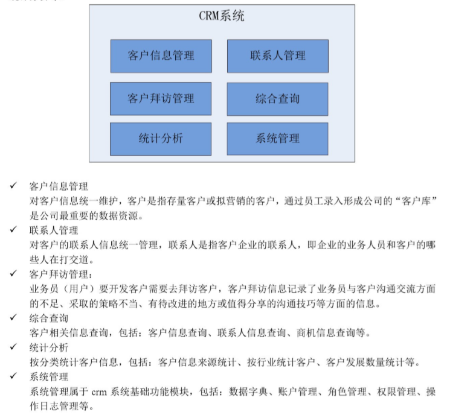
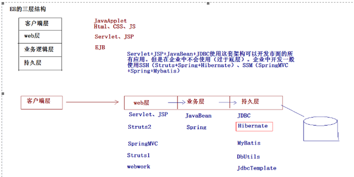
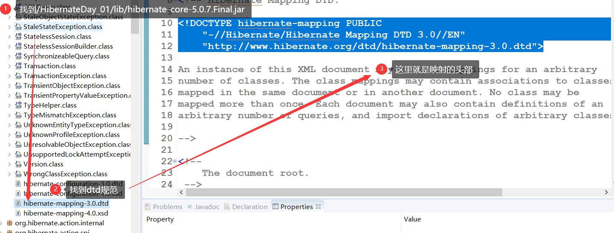
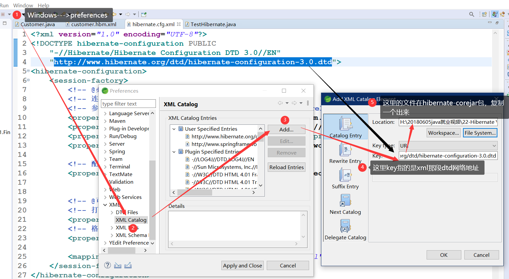
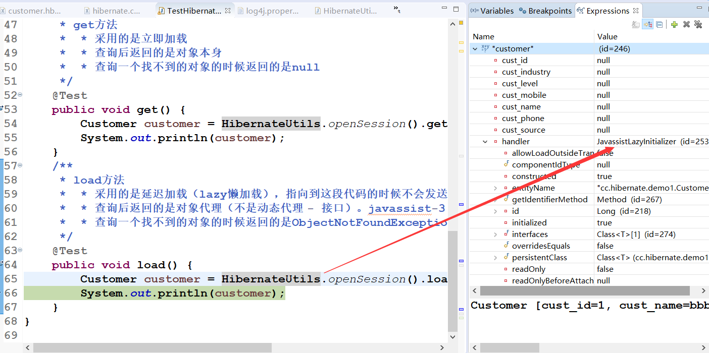

# Hibernate_01

<!--markdownlint-disable MD007 -->
<!--markdownlint-disable MD004 -->
<!-- markdownlint-disable MD033 -->

## Hibernate框架的学习路线

* 第一天：Hibernate入门（Hibernate的环境搭建、Hibernate的api、Hibernate的CRUD）
* 第二天：Hibernate的一级缓存、其他api
* 第三天：Hibernate的一对多配置，Hibernate的多对多配置
* 第四天：Hibernate的查询方式，抓取策略

## CRM的案例

### CRM的概述 - 了解

> CRM - Customer RelationsHip Management 客户关系管理

客户关系管理是指企业为提高核心竞争力，利用相应的信息技术以及互联网技术协调企业与顾客间在销售、营销和服务上的交互，从而提升其管理方式，向客户提供创新式的个性化的客户交互和服务的过程。其最终目标是吸引新客户、保留老客户以及将已有客户转为忠实客户，增加市场。

### CRM有哪些模块



## Hibernate的框架的概述

### 框架的概述

框架：指的是软件的半成品，已经完成了部分功能。

### EE的经典三层架构



### Hibernate的概述

#### 什么是Hibernate

Hibernate框架是当今主流的java持久层框架之一，由于它简单易学、灵活性强、扩展性强等特点，能够大大地简化程序的代码量，提高工作效率，因此受到广大开发人员喜爱。  
Hibernate是一个开放源码的ORM `Object Relational mapping - 对象关系映射`框架，它对JDBC进行了轻量级的对象封装， 使得java开发人员可以使用面向对象的编程思想来操作数据库

> Hibernate     ：就是一个持久层的ORM的框架.  
> **ORM**       ：Object Relational Mapping. 对象关系映射. - Hibernate 的核心思想

#### 为什么学Hibernate

* ORM原理
    

* 因为有以下优势

  * Hibernate对JDBC访问数据库的代码做了轻量级的封装，大大简化数据访问层繁琐的重复性代码，并且减少了内存消耗，加快了运行效率 - 程序员写的代码量减少
  * Hibernate是一个基于jdbc的主流持久化框架，是一个优秀的ORM实现，它很多成都简化了DAO（data access object）层编码访问工作 - 程序员写的代码量减少
  * Hibernate的性能非常好，映射的灵活性很出色，它支持很多关系型的数据库，从一对一到多对多的各种复杂关系 - 可以适应多种数据库/oo思想适合开发人员理解
  * 可扩展性强，由于源代码的开源以及api的开发，当本身功能不够用时，可以自动编码进行扩展

## Hibernate入门

### 1.下载Hibernate的开发环境

Hibernate 3.x Hibernate4.x[过渡版本] Hibernate5.x

> [Hibernate官网](http://hibernate.org/)

### 2.解压Hibernate

* documenttation    ：Hibernate开发的文档
* lib           ：Hibernate开发包
  * require     ：Hibernate的必须的依赖包
  * optional    ：Hibernate开发的可选的jar包
* project       ：Hibernate提供项

### 3.创建一个项目，引入jar包

* 数据库驱动包
  * `mysql-connector-java-5.1.7-bin.jar`
* Hibernate开发的必须的jar包

    ```txt
    .
    ├── antlr-2.7.7.jar
    ├── dom4j-1.6.1.jar
    ├── geronimo-jta_1.1_spec-1.1.1.jar
    ├── hibernate-commons-annotations-5.0.1.Final.jar
    ├── hibernate-core-5.0.7.Final.jar
    ├── hibernate-jpa-2.1-api-1.0.0.Final.jar
    ├── jandex-2.0.0.Final.jar
    ├── javassist-3.18.1-GA.jar
    └── jboss-logging-3.3.0.Final.jar
    ```

* Hibernate引入日志记录包

    ```txt
    .
    ├── log4j-1.2.16.jar
    ├── slf4j-api-1.6.1.jar
    └── slf4j-log4j12-1.7.2.jar
    ```

### 4.创建表

```sql
CREATE TABLE `cst_customer` (
  `cust_id` bigint(32) NOT NULL AUTO_INCREMENT COMMENT '客户编号(主键)',
  `cust_name` varchar(32) NOT NULL COMMENT '客户名称(公司名称)',
  `cust_source` varchar(32) DEFAULT NULL COMMENT '客户信息来源',
  `cust_industry` varchar(32) DEFAULT NULL COMMENT '客户所属行业',
  `cust_level` varchar(32) DEFAULT NULL COMMENT '客户级别',
  `cust_phone` varchar(64) DEFAULT NULL COMMENT '固定电话',
  `cust_mobile` varchar(16) DEFAULT NULL COMMENT '移动电话',
  PRIMARY KEY (`cust_id`)
) ENGINE=InnoDB AUTO_INCREMENT=1 DEFAULT CHARSET=utf8;

```

### 5.创建实体类

```java
public class Customer {
    private Long cust_id;
    private String cust_name;
    private String cust_source;
    private String cust_industry;
    private String cust_level;
    private String cust_phone;
    private String cust_mobile;
}
```

### 6.创建映射

映射需要通过XML的配置文件来完成，这个配置文件可以任意命名。尽量统一命名规范（类名.hbm.xml）

映射的头部在 - 这里需要管理xml-catalog不然不会出提示


* 映射内容

  ```xml
  <?xml version="1.0" encoding="UTF-8"?>
  <!DOCTYPE hibernate-mapping PUBLIC
      "-//Hibernate/Hibernate Mapping DTD 3.0//EN"
      "http://www.hibernate.org/dtd/hibernate-mapping-3.0.dtd">
  <hibernate-mapping>
      <!-- 建立类与表的映射 -->
      <class name="cc.hibernate.demo1.Customer" table="cst_customer">
          <!-- 建立类中的属性与表中的主键对应 -->
          <id name="cust_id" column="cust_id">
              <generator class="native"></generator>
          </id>

          <!-- 建立类中的普通的属性和表中字段的对应 -->
          <property name="cust_name" column="cust_name"></property>
          <property name="cust_source" column="cust_source"></property>
          <property name="cust_industry" column="cust_industry"></property>
          <property name="cust_level" column="cust_level"></property>
          <property name="cust_phone" column="cust_phone"></property>
          <property name="cust_mobile" column="cust_mobile"></property>

      </class>
  </hibernate-mapping>
  ```

### 7.创建一个Hibernate的核心配置文件

Hibernate的核心配置文件的名称：hibernate.cfg.xml

* 然后要找到配置文件的头部
  * 根据图5去找jar包
  * 或者在`hibernate-release-5.0.7.Final.zip\hibernate-release-5.0.7.Final\project\etc`的位置

* hibernate.cfg.xml

    ```xml
    <?xml version="1.0" encoding="UTF-8"?>
    <!DOCTYPE hibernate-configuration PUBLIC
        "-//Hibernate/Hibernate Configuration DTD 3.0//EN"
        "http://www.hibernate.org/dtd/hibernate-configuration-3.0.dtd">
    <hibernate-configuration>
        <session-factory>
            <!-- @必须参数 -->
            <!-- 连接数据库的基本参数 -->
            <!-- 参考hibernate-release-5.0.7.Final.zip\hibernate-release-5.0.7.Final\project\etchibernate.properties -->
            <property name="hibernate.connection.driver_class">com.mysql.jdbc.Driver</property>
            <property name="hibernate.connection.url">jdbc:mysql://localhost/db_crm?serverTimezone=Asia/Shanghai</property>
            <property name="hibernate.connection.username">root</property>
            <property name="hibernate.connection.password">199746wo</property>

            <!-- 配置hibernate的方言 -->
            <property name="hibernate.dialect">org.hibernate.dialect.MySQLDialect</property>


            <!-- @可选参数 -->
            <!-- 打印sql -->
            <property name="hibernate.show_sql">true</property>
            <!-- 格式花sql -->
            <property name="hibernate.format_sql">true</property>

            <mapping resource="cc/hibernate/demo1/customer.hbm.xml" />
        </session-factory>
    </hibernate-configuration>
    ```

### 8.编写测试代码

```java
/**
* hibernate的入门案例
* @author Administrator
*
*/
public class TestHibernate {

    // 保存客户的案例
    @Test
    public void test() {
        // 1.加载Hibernate的核心文件
        Configuration configure = new Configuration().configure();

        // 2.创建一个SessionFactory对象;类似于JDBC的连接池
        SessionFactory sessionFactory = configure.buildSessionFactory();

        // 3.通过SessionFactory获取到Session对象 - 类似于JDBC中Connection
        Session session = sessionFactory.openSession();

        // 4.手动开启事务
        Transaction transaction = session.beginTransaction();

        // 5.编写代码
        Customer customer = new Customer();
        customer.setCust_name("aaa");
        session.save(customer);

        // 6.事务提交
        transaction.commit();

        // 7.资源释放
        session.close();
    }
}
```

## Hibernate的常见配置

### XML提示配置



### Hibernate的映射配置

* `class标签的配置`
  * 标签用来建立类与表的映射关系
  * 属性：
    * name      ： 类的全路径
    * table     ： 表名（类名与表名一致的时候，table可以省略）
    * catalog   ： 数据库名 - 可以不写
* `id标签的配置`
  * 标签用来建立类中的属性与表中主键的对应关系
  * 属性：
    * name      ：表中的类名
    * column    ：表中的字段名（类中的属性名与表中的字段名如果一致，column可以省略）
    * length    ：长度
    * type      ：类型
    * not-null  ：设置非空
    * unique    ：设置唯一
* `property`标签的配置
  * 标签用来建立类中的普通属性与表中的字段的对应关系
  * 属性
    * name      ：表中的属性名
    * column    ：表中的字段名
    * length    ：长度 - 这里是在建表的时候用
    * type      ：类型
    * not-null  ：设置非空
    * unique    ：设置唯一

### Hibernate的核心配置 - 了解

* 一种方式 - 属性文件的方式
  * hibernate.properties
    * hibernate.connection.driver_class=com.mysql.jdbc.Driver
    * ...
    * hibernate.show_sql=true

* <font color='red'>属性文件的方式不能引入映射文件（手动编写代码加载到映射文件）
* 第二种方式 - xml
  * hibernate.cfg.xml</font>

### 核心的配置

* 必须的配置
  * 连接数据库的基本的参数
    * 驱动类
    * url路径
    * 用户名
    * 密码
  * 方言
* 可选的配置
  * 显示sql     ：hibernate.show_sql
  * 格式化sql   ：hibernate.format_sql
  * 自动建表    ：hibernate.hbm2ddl.auto
    * none            ：不适用hibernate的自动建表
    * create          ：如果数据库中已经有表，删除原有表，重新创建，如果没有表，新建表（测试）
    * create-drop     ：如果数据库已经有表，删除原有表，重新创建，如果没有表，新建表，使用完了删除该表（测试）
    * <font color="red">update          ：如果数据库中有表，使用原有表，如果没有表，创建新表（更新表结构）</font>
    * <font color="red">validate        ：如果没有表，不会创建表，只会使用数据库中原有的表（校验映射和表结构）</font>
* 映射文件的引入
  * 引入映射文件的位置
    * `<mapping resource="cc/hibernate/demo1/customer.hbm.xml" />`

## Hibernate的核心api

### Configuration：Hibernate的配置对象

> Configuration 类的作用是对Hibernate 进行配置，以及对它进行启动。在Hibernate 的启动过程中，Configuration 类的实例首先定位映射文档的位置，读取这些配置，然后创建一个SessionFactory对象。虽然Configuration 类在整个Hibernate 项目中只扮演着一个很小的角色，但它是启动hibernate 时所遇到的第一个对象。

* 作用：
  * 加载核心配置文件
    * hibernate.properties

    ```java
    Configuration configure = new Configuration();
    ```

    * hibernate.cfg.xml

    ```java
    Configuration cfg = new Configuration().configure();
    ```

  * 手动加载映射文件

    ```java
    configuration.addResource("com/hibernate/demo1/Customer.hbm.xml");
    ```

### SessionFactory：Session工厂

> SessionFactory接口负责初始化Hibernate。它充当数据存储源的代理，并负责创建Session对象。这里用到了工厂模式。需要注意的是SessionFactory并不是轻量级的，因为一般情况下，一个项目通常只需要一个SessionFactory就够，当需要操作多个数据库时，可以为每个数据库指定一个SessionFactory。

SessionFactory内部维护了Hibernate的连接池和Hibernate的二级缓存（不讲）。是线程安全的对象。一个项目创建一个对象即可。

---

* 配置连接池

  * 1.在配置前需要设置一下log文件才能看到连接池成功 - `hibernate-release-5.0.7.Final.zip\hibernate-release-5.0.7.Final\project\etclog4j.properties`

    ```xml
    #
    # Hibernate, Relational Persistence for Idiomatic Java
    #
    # License: GNU Lesser General Public License (LGPL), version 2.1 or later.
    # See the lgpl.txt file in the root directory or <http://www.gnu.org/licenses/lgpl-2.1.html>.
    #

    ### direct log messages to stdout ###
    log4j.appender.stdout=org.apache.log4j.ConsoleAppender
    log4j.appender.stdout.Target=System.out
    log4j.appender.stdout.layout=org.apache.log4j.PatternLayout
    log4j.appender.stdout.layout.ConversionPattern=%d{ABSOLUTE} %5p %c{1}:%L - %m%n

    ### direct messages to file hibernate.log ###
    #log4j.appender.file=org.apache.log4j.FileAppender
    #log4j.appender.file.File=hibernate.log
    #log4j.appender.file.layout=org.apache.log4j.PatternLayout
    #log4j.appender.file.layout.ConversionPattern=%d{ABSOLUTE} %5p %c{1}:%L - %m%n

    ### set log levels - for more verbose logging change 'info' to 'debug' ###
    # 五个级别error warn info debug trace
    log4j.rootLogger=trace, stdout
    ```

  * 2.导入jar

    ```txt
    位置：hibernate-release-5.0.7.Final.zip\hibernate-release-5.0.7.Final\lib\optional\c3p0
    .
    ├── c3p0-0.9.2.1.jar
    ├── hibernate-c3p0-5.0.7.Final.jar
    └── mchange-commons-java-0.2.3.4.jar
    ```

  * 3.配置连接池 ：-了解

      ```xml
      <!-- 配置C3P0连接池 -->
      <property name="connection.provider_class">org.hibernate.connection.C3P0ConnectionProvider</property>
      <!--在连接池中可用的数据库连接的最少数目 -->
      <property name="c3p0.min_size">5</property>
      <!--在连接池中所有数据库连接的最大数目 -->
      <property name="c3p0.max_size">20</property>
      <!--设定数据库连接的过期时间,以秒为单位, 如果连接池中的某个数据库连接处于空闲状态的时间超过了timeout时间,就会从连接池中清除 -->
      <property name="c3p0.timeout">120</property>
      <!--每3000秒检查所有连接池中的空闲连接 以秒为单位 -->
      <property name="c3p0.idle_test_period">3000</property>
      ```

* 理解以下java的static方法

  ```java
  // 1.静态的方法在整个应用程序其间存储在内存中,速度快，但占用内存.
  class A{
    public static string b(){
      return "Hello";
    }
  }

  // 用法: A.b(); //调用方便
  // 静态方法可以通过类名直接调用，
  // 2.动态的方法在先声明类实例才能调用类中的方法.

  class A{
    public string b(){
    return "Hello";
    }
  }
  //用法: A a = new a(); a.b();
  //3.一般使用频繁的方法用静态方法，用的少的方法用动态的。静态的速度快，占内存。动态的速度相对慢些，但调用完后，立即释放类，可以节省内存，可以根据自己的需要选择是用动态方法还是静态方法。
  //4.静态方法主要的问题就是数据同步的问题。如果你的静态方法的类中不保存私有变量那么什么问题都不会有的。最好是包要操作的数据全部以参数的方式传到方法中去
  //5. 静态方法是类方法，调用时不需要创建类实例。
  //6. 静态方法是静态绑定到子类，不是被继承。- 静态方法事先就已经分配好内存，跟普通方法不一样，普通方法要实例化后才分配内存。所以子类调用静态方法也和普通的继承方法不一样，它是一早就已经分配好了内存的，不需要继承。


  // 我的理解是因为静态方法和静态变量都是先加载的，所以this无法指向任何位置才会报错，如果在静态方法里面先实例化对象是可以在方法内调用类内的其他方法
  // 同理，全局对象也是，静态方法是先加载的，在静态变量的对象无法指向任何位置也会保存
  ```

* 抽取工具类

    ```java
    public class HibernateUtils {

      public static final SessionFactory sessionFactory;
      public static final Configuration configure;
      static {
        configure = new Configuration().configure();
        sessionFactory = configure.buildSessionFactory();
      }

      public static Session openSession() {
        return sessionFactory.openSession();
      }
    }
    ```

### <font color=red>Session：类似Connection对象是连接对象</font>

> Session接口负责执行被持久化对象的CRUD操作(CRUD的任务是完成与数据库的交流，包含了很多常见的SQL语句)。但需要注意的是Session对象是**非线程安全**的。同时，Hibernate的session不同于JSP应用中的HttpSession。这里当使用session这个术语时，其实指的是Hibernate中的session，而以后会将HttpSession对象称为用户session。

session代表的是Hibernate与数据库的连接对象。不是线程安全的，与数据库交互桥梁

* session中的api
  * 保存方法
    * `Serializable save(Object obj);`
  * 查询方法
    * `T get(Class c,Serializable id);`
    * <font color='red'>get和load方法的区别？<font>

* 查询方法
  * get&load

  ```java
  /**
    * get方法
    *  * 采用的是立即加载
    *  * 查询后返回的是对象本身
    *  * 查询一个找不到的对象的时候返回的是null
    */
  @Test
  public void get() {
    Customer customer = HibernateUtils.openSession().get(Customer.class, 11l);
    System.out.println(customer);
  }
  /**
    * load方法
    *  * 采用的是延迟加载（lazy懒加载），指向到这段代码的时候不会发送SQL语句，当真正使用这个对象的时候才会发送SQL语句
    *  * 查询后返回的是对象代理（不是动态代理 - 接口）。javassist-3.18.1-GA.jar 利用的是javassist技术产生的代理。
    *  * 查询一个找不到的对象的时候返回的是ObjectNotFoundException
    */
  @Test
  public void load() {
    Customer customer = HibernateUtils.openSession().load(Customer.class, 1l);
    System.out.println(customer);
  }
  ```



* 修改方法
  * void update(Object obj);

  ```java
  @Test
  public void update() {
    Session session = HibernateUtils.openSession();
    Transaction tx = session.beginTransaction();

    // 直接创建对象，进行修改 - 不推荐，因为更新会把id为1的其他数据覆盖
    // Customer customer=new Customer();
    // customer.setCust_id(1l);
    // customer.setCust_name("asd");
    // session.update(customer);
    // tx.commit();

    // 先查询在修改 - 推荐
    Customer customer = session.get(Customer.class, 1l);
    customer.setCust_name("aaa");
    session.update(customer);
    tx.commit();
    session.close();
  }
  ```

* 删除方法
  * void delete(Object obj)

  ```java
  @Test
    public void delete() {
      Session session = HibernateUtils.openSession();
      Transaction tx = session.beginTransaction();

      // 直接创建对象，删除
      // Customer customer = new Customer();
      // customer.setCust_id(1l);
      // session.delete(customer);

      // 先查询再删除 - 推荐 -- 级联删除
      Customer customer=session.get(Customer.class, 2l);
      session.delete(customer);
      tx.commit();
      session.close();
    }
  ```

* 保存或更新
  * void saveOrUpdate(Object obj)

  ```java
  @Test
  public void saveAndUpdate() {
    Session session = HibernateUtils.openSession();
    Transaction transaction = session.beginTransaction();

    // 这里如果更新的话还是推荐先查再更新，否则还是会覆盖
    // Customer customer=new Customer();
    // customer.setCust_id(3l);
    // customer.setCust_name("lisi");
    // session.saveOrUpdate(customer);
    // transaction.commit();

    Customer customer = new Customer();
    customer.setCust_name("xxx");
    session.saveOrUpdate(customer);
    transaction.commit();
    session.close();
  }
  ```

* 查询所有

  ```java
  @Test
  public void getAll() {
    Session session = HibernateUtils.openSession();
    Transaction transaction = session.beginTransaction();
    // 接收HQL Hibernate Query Language 面向对象的查询语言
    // Query query = session.createQuery("from Customer");
    // List<Customer> list = query.list();
    // for (Customer customer : list) {
    // System.out.println(customer);
    // }

    // 接收SQL
    SQLQuery query = session.createSQLQuery("select * from cst_customer");
    List<Object[]> list = query.list();
    for (Object[] objects : list) {
      System.out.println(Arrays.toString(objects));
    }
  }
  ```

### Transaction 对象

Hibernate中的事务对象

* commit();
* rollback();

## 总结

* Hibernate第一天
  * CRM案例 - 了解 客户关系管理
  * Hibernate框架概述
    * 框架的概述 > 指的是软件半成品 已经完成部分功能
    * EE的经典三层架构
    * Hibernate的概述
      * 什么是Hibernate ORM的框架
      * 为什么学Hibernate
        * 优势
  * Hibernate的入门
    * 下载hibernate的开发环境
    * 解压hibernate
    * 创建一个项目，引入jar
      * 必须jar
      * 日志jar
    * 创建表
    * 创建实体类
    * 创建映射 - 映射配置文件 customer.hbm.xml
    * 创建一个hibernate的核心配置文件 hibernate.cfg.xml
    * 编写测试类
  * hibernate的常见配置
    * XML提示配置
    * hibernate的映射配置
      * class - table
      * id - table主键
      * property - table某一列
    * hibernate的核心配置
      * hibernate的配置方式
        * XML方式
        * properties方式
      * 核心的设置
        * 必须配置
          * 基本参数
          * 方言
        * 可选配置
          * 显示sql，格式化sql
          * 自动建表
        * 映射文件的引入
  * 核心api
    * Configuration hibernate的配置对象
      * 加载核心配置
      * 手动加载映射文件
    * SessionFactory Session工厂 类似连接池
      * 配置连接池
      * 抽取工具类
      * 理解java static关键字
    * Session 类似Connection
      * 增删改查
        * 查 get&load
          * get获取不到的为null
          * get是直接拿到对象
          * load获取不到的报错
          * load是用对象的时候再通过代理获得对象
    * Transaction
      * commit
      * rollback
