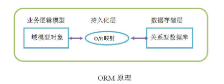

# Hibernate_01

## Hibernate框架的学习路线

* 第一天：Hibernate入门（Hibernate的环境搭建、Hibernate的api、Hibernate的CRUD）
* 第二天：Hibernate的一级缓存、其他api
* 第三天：Hibernate的一对多配置，Hibernate的多对多配置
* 第四天：Hibernate的查询方式，抓取策略

## CRM的案例

### CRM的概述 - 了解

> CRM - Customer RelationsHip Management 客户关系管理

客户关系管理是指企业为提高核心竞争力，利用相应的信息技术以及互联网技术协调企业与顾客间在销售、营销和服务上的交互，从而提升其管理方式，向客户提供创新式的个性化的客户交互和服务的过程。其最终目标是吸引新客户、保留老客户以及将已有客户转为忠实客户，增加市场。

### CRM有哪些模块


## Hibernate的框架的概述

### 框架的概述

框架：指的是软件的半成品，已经完成了部分功能。

### EE的经典三层架构


### Hibernate的概述

#### 什么是Hibernate

Hibernate框架是当今主流的java持久层框架之一，由于它简单易学、灵活性强、扩展性强等特点，能够大大地简化程序的代码量，提高工作效率，因此受到广大开发人员喜爱。  
Hibernate是一个开放源码的ORM `Object Relational mapping - 对象关系映射`框架，它对JDBC进行了轻量级的对象封装， 使得java开发人员可以使用面向对象的编程思想来操作数据库

> Hibernate     ：就是一个持久层的ORM的框架.  
> **ORM**       ：Object Relational Mapping. 对象关系映射. - Hibernate 的核心思想

#### 为什么学Hibernate

* ORM原理
    

* 因为有以下优势

  * Hibernate对JDBC访问数据库的代码做了轻量级的封装，大大简化数据访问层繁琐的重复性代码，并且减少了内存消耗，加快了运行效率 - 程序员写的代码量减少
  * Hibernate是一个基于jdbc的主流持久化框架，是一个优秀的ORM实现，它很多成都简化了DAO（data access object）层编码访问工作 - 程序员写的代码量减少
  * Hibernate的性能非常好，映射的灵活性很出色，它支持很多关系型的数据库，从一对一到多对多的各种复杂关系 - 可以适应多种数据库/oo思想适合开发人员理解
  * 可扩展性强，由于源代码的开源以及api的开发，当本身功能不够用时，可以自动编码进行扩展

## Hibernate入门

### 1.下载Hibernate的开发环境

Hibernate 3.x Hibernate4.x[过渡版本] Hibernate5.x

> [Hibernate官网](http://hibernate.org/)

### 2.解压Hibernate

* documenttation    ：Hibernate开发的文档
* lib           ：Hibernate开发包
  * require     ：Hibernate的必须的依赖包
  * optional    ：Hibernate开发的可选的jar包
* project       ：Hibernate提供项

### 3.创建一个项目，引入jar包

* 数据库驱动包
  * `mysql-connector-java-5.1.7-bin.jar`
* Hibernate开发的必须的jar包

    ```txt
    .
    ├── antlr-2.7.7.jar
    ├── dom4j-1.6.1.jar
    ├── geronimo-jta_1.1_spec-1.1.1.jar
    ├── hibernate-commons-annotations-5.0.1.Final.jar
    ├── hibernate-core-5.0.7.Final.jar
    ├── hibernate-jpa-2.1-api-1.0.0.Final.jar
    ├── jandex-2.0.0.Final.jar
    ├── javassist-3.18.1-GA.jar
    └── jboss-logging-3.3.0.Final.jar
    ```

* Hibernate引入日志记录包

    ```txt
    .
    ├── log4j-1.2.16.jar
    ├── slf4j-api-1.6.1.jar
    └── slf4j-log4j12-1.7.2.jar
    ```

### 4.创建表

```sql
CREATE TABLE `cst_customer` (
  `cust_id` bigint(32) NOT NULL AUTO_INCREMENT COMMENT '客户编号(主键)',
  `cust_name` varchar(32) NOT NULL COMMENT '客户名称(公司名称)',
  `cust_source` varchar(32) DEFAULT NULL COMMENT '客户信息来源',
  `cust_industry` varchar(32) DEFAULT NULL COMMENT '客户所属行业',
  `cust_level` varchar(32) DEFAULT NULL COMMENT '客户级别',
  `cust_phone` varchar(64) DEFAULT NULL COMMENT '固定电话',
  `cust_mobile` varchar(16) DEFAULT NULL COMMENT '移动电话',
  PRIMARY KEY (`cust_id`)
) ENGINE=InnoDB AUTO_INCREMENT=1 DEFAULT CHARSET=utf8;

```

### 5.创建实体类

```java
public class Customer {
    private Long cust_id;
    private String cust_name;
    private String cust_source;
    private String cust_industry;
    private String cust_level;
    private String cust_phone;
    private String cust_mobile;
}
```

### 创建映射

映射需要通过XML的配置文件来完成，这个配置文件可以任意命名。尽量统一命名规范（类名.hbm.xml）

映射的头部在 - 这里需要管理xml-catalog不然不会出提示


* 映射内容

  ```xml
  <?xml version="1.0" encoding="UTF-8"?>
  <!DOCTYPE hibernate-mapping PUBLIC 
      "-//Hibernate/Hibernate Mapping DTD 3.0//EN"
      "http://www.hibernate.org/dtd/hibernate-mapping-3.0.dtd">
  <hibernate-mapping>
      <!-- 建立类与表的映射 -->
      <class name="cc.hibernate.demo1.Customer" table="cst_customer">
          <!-- 建立类中的属性与表中的主键对应 -->
          <id name="cust_id" column="cust_id">
              <generator class="native"></generator>
          </id>

          <!-- 建立类中的普通的属性和表中字段的对应 -->
          <property name="cust_name" column="cust_name"></property>
          <property name="cust_source" column="cust_source"></property>
          <property name="cust_industry" column="cust_industry"></property>
          <property name="cust_level" column="cust_level"></property>
          <property name="cust_phone" column="cust_phone"></property>
          <property name="cust_mobile" column="cust_mobile"></property>

      </class>
  </hibernate-mapping>
  ```

### 创建一个Hibernate的核心配置文件

Hibernate的核心配置文件的名称：hibernate.cfg.xml

* 然后要找到配置文件的头部
  * 根据图5去找jar包
  * 或者在`hibernate-release-5.0.7.Final.zip\hibernate-release-5.0.7.Final\project\etc`的位置

* hibernate.cfg.xml

    ```xml
    <?xml version="1.0" encoding="UTF-8"?>
    <!DOCTYPE hibernate-configuration PUBLIC
        "-//Hibernate/Hibernate Configuration DTD 3.0//EN"
        "http://www.hibernate.org/dtd/hibernate-configuration-3.0.dtd">
    <hibernate-configuration>
        <session-factory>
            <!-- @必须参数 -->
            <!-- 连接数据库的基本参数 -->
            <!-- 参考hibernate-release-5.0.7.Final.zip\hibernate-release-5.0.7.Final\project\etchibernate.properties -->
            <property name="hibernate.connection.driver_class">com.mysql.jdbc.Driver</property>
            <property name="hibernate.connection.url">jdbc:mysql://localhost/db_crm?serverTimezone=Asia/Shanghai</property>
            <property name="hibernate.connection.username">root</property>
            <property name="hibernate.connection.password">199746wo</property>

            <!-- 配置hibernate的方言 -->
            <property name="hibernate.dialect">org.hibernate.dialect.MySQLDialect</property>


            <!-- @可选参数 -->
            <!-- 打印sql -->
            <property name="hibernate.show_sql">true</property>
            <!-- 格式花sql -->
            <property name="hibernate.format_sql">true</property>

            <mapping resource="cc/hibernate/demo1/customer.hbm.xml" />
        </session-factory>
    </hibernate-configuration>
    ```

### 编写测试代码

```java
/**
* hibernate的入门案例
* @author Administrator
*
*/
public class TestHibernate {

    // 保存客户的案例
    @Test
    public void test() {
        // 1.加载Hibernate的核心文件
        Configuration configure = new Configuration().configure();

        // 2.创建一个SessionFactory对象;类似于JDBC的连接池
        SessionFactory sessionFactory = configure.buildSessionFactory();

        // 3.通过SessionFactory获取到Session对象 - 类似于JDBC中Connection
        Session session = sessionFactory.openSession();

        // 4.手动开启事务
        Transaction transaction = session.beginTransaction();

        // 5.编写代码
        Customer customer = new Customer();
        customer.setCust_name("aaa");
        session.save(customer);

        // 6.事务提交
        transaction.commit();

        // 7.资源释放
        session.close();
    }
}
```

## Hibernate的常见配置
