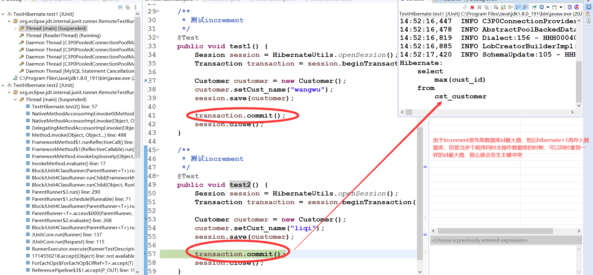
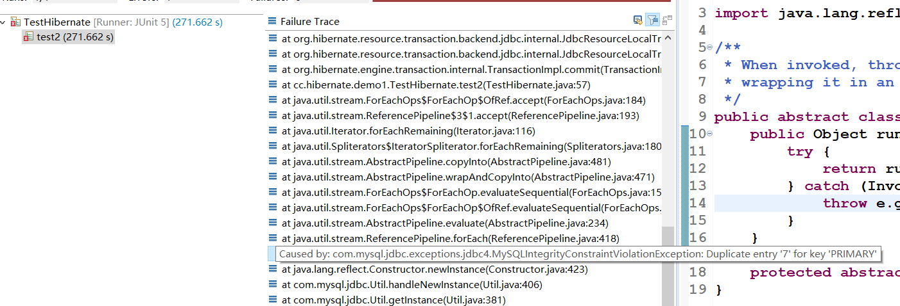
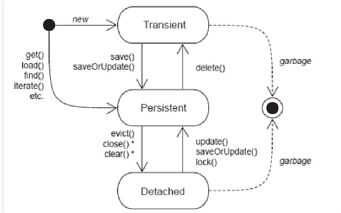
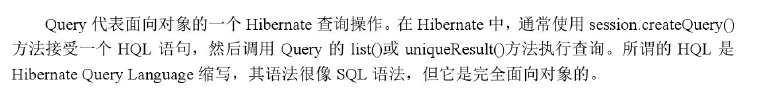
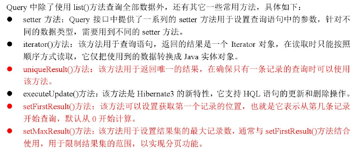
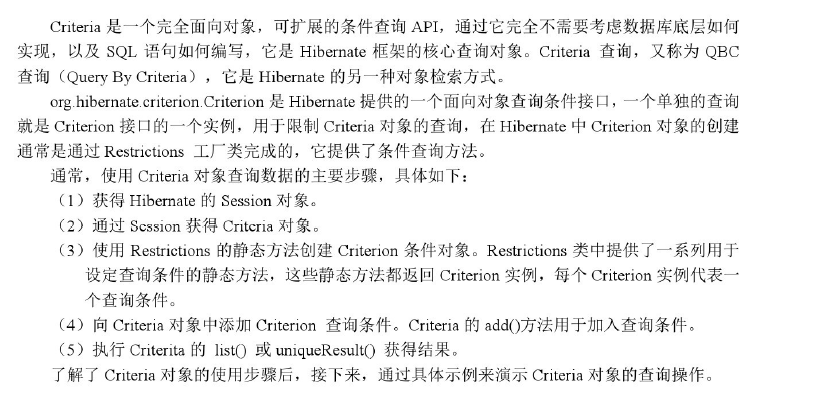
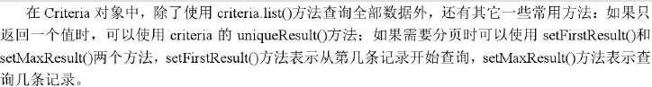

# Hibernate_02

<!--markdownlint-disable MD007 -->
<!--markdownlint-disable MD004 -->
<!-- markdownlint-disable MD033 -->

<!-- TOC -->

- [Hibernate02](#hibernate02)
    - [Hibernate持久化类的编写规则](#hibernate持久化类的编写规则)
        - [什么是持久化类](#什么是持久化类)
        - [持久化类的编写规则](#持久化类的编写规则)
    - [Hibernate主键生成策略](#hibernate主键生成策略)
        - [主键的类型](#主键的类型)
        - [Hibernate的主键生成策略](#hibernate的主键生成策略)
    - [Hibernate的持久化对象的三种状态](#hibernate的持久化对象的三种状态)
        - [持久化对象三种状态的概述](#持久化对象三种状态的概述)
        - [区分对现象的三种状态](#区分对现象的三种状态)
        - [持久化对象的三种状态转换](#持久化对象的三种状态转换)
        - [持久化对象能够自动更新数据库](#持久化对象能够自动更新数据库)
    - [Hibernate的一级缓存](#hibernate的一级缓存)
        - [什么是Hibernate的一级缓存](#什么是hibernate的一级缓存)
        - [测试一级缓存](#测试一级缓存)
        - [一级缓存的内部结构（快照区）](#一级缓存的内部结构快照区)
    - [Hibernate的事务控制](#hibernate的事务控制)
        - [什么是事务](#什么是事务)
        - [事务的四个特性 - ACID](#事务的四个特性---acid)
            - [事务的并发问题](#事务的并发问题)
        - [事务的隔离级别](#事务的隔离级别)
        - [Hibernate中的事务管理](#hibernate中的事务管理)
    - [Hibernate的其他api](#hibernate的其他api)
        - [Query](#query)
        - [Criteria](#criteria)
        - [SQLQuery](#sqlquery)

<!-- /TOC -->

## Hibernate持久化类的编写规则

### 什么是持久化类

> Hibernate是持久层的ORM - object relational mapping 映射框架，专注于数据的持久化工作，

* 什么是持久化
    > 所谓的持久化，就是将内存中的数据永久存储到关系数据库中。
* 什么是持久化类
    > 类 + 映射   - 所谓的持久化类指的是一个java类与数据库建立了映射关系

### 持久化类的编写规则

* 再编写持久化类的时候需要有以下几点需要注意：
  * <font color='red'>持久化类需要提供无参数的构造方法</font>。因为Hibernate的底层需要使用反射生成类的实例
  * <font color='red'>持久化类的属性需要私有，对私有的属性提供公有的get&set方法</font>。因为Hibernate底层类会将查询到的数据进行封装。
  * <font color='red'>持久化类的属性要尽量使用包装类的类型</font>。因为包装类和基本数据类型的默认值不同，包装类的类型语义描述更清晰而基本数据类型不容易描述
    > 举个例子：例如表中有一列员工工资，如果使用double类型，如果这个员工工资忘记录入到系统中，系统会将默认值0存入数据库，如果这个员工工资被扣完了，也会存入0，那么这个0，就有了多重含义，而如果使用了包装类型就会避免以上情况，如果使用Double类型，忘记录入工资就会存入null，而这个员工工资被扣完了，就会存入0，不会产生歧义
  * <font color='red'>持久化层要有一个唯一标识OID与表中主键对应</font>。因为Hibernate中需要通过这个唯一表示OID区分在内存中是否是同一个持久化类。在java中通过地址区分是否是同一个对象，在关系型数据库的表中是通过主键区分是否同一条记录。那么Hibernate就是通过这个OID来进行区分的，Hibernate是不允许在内存中出现两个OID相同的持久化对象的。
  * <font color='red'>持久化类尽量不要使用final进行修饰</font>。因为Hibernate中有延迟加载机制，这个机制中会产生代理对象，Hibernate产生代理对象使用的是字节码的增强技术完成的，其实就是产生了当前类的一个子类对象实现的。如果使用了final修饰持久化类，那么就不能产生子类，从而就不会产生代理对象，那么Hibernate的延迟加载策略（是一种优化手段）就会失效。

## Hibernate主键生成策略

### 主键的类型

* 自然主键
  * 把具体业务含义的字段作为主键，称之为自然主键。
    * > 例如在customer表中，如果把name字段作为主键，其前提条件必须是：每一个客户的姓名不允许为null，不允许客户重复名，并且不允许修改客户姓名。尽管这也是可行的，但是不能满足不断变化的业务需求，一旦出现了客户重名的业务需求，就必须修改数据模型，重新定义表的主键，这给数据库的维护增加了难度。
* 代理主键
  * 把不具备业务含义的字段作为主键，称之为代理主键。改字段一般命名为 "ID" 通常为整数类型，因为整数类型比字符串类型要节省更多数据库空间。在上面的例子中，显然更合适的方式是使用代理主键。

### Hibernate的主键生成策略

Hibernate中提供了几个内置的主键生成策略，其常用主键生成策略的名称如下

| 名称      | 描述                                                                                                                                                                                                                             |
|-----------|----------------------------------------------------------------------------------------------------------------------------------------------------------------------------------------------------------------------------------|
| increment | 用于long、short或int类型，由Hibernate自动以递增的方式生成唯一标识符，每次增量为1.只有当没有其他进程向同一张表中插入数据时才可以使用，不能在集群环境下使用，适用于代理主键                                                        |
| identity  | 采用底层数据库本身提供的主键生成标识符，条件是数据库支持自动增长数据类型。在DB2、MySQL、MSSQL Server、Sybase和HypersonicSQL数据库中可以使用该生成器，该生成器要求数据库把主键定义成自增长模式，适合于代理主键                    |
| sequence  | Hibernate 根据底层数据库序列生成标识符。条件是数据库支持序列。适用于代理主键                                                                                                                                                     |
| native    | 根据底层数据库对自动生成表示符的能力来选择identity、sequence、hilo三种生成器的一种，适合跨数据库平台开发，适用于代理主键                                                                                                         |
| uuid      | Hibernate采用128位的UUID算法来生成标识符。该算法能够在网络环境下生成唯一的字符串标识符，其UUID被编码为一个长度为32位的十六进制字符串，这种策略并不流行，因为字符串类型的主键比整数类型的主键占用更多的数据库空间，适用于代理主键 |
| assigned  | 由java程序负责生成标识符，如果不指定id元素的generator属性，则默认使用该主键生成策略。适用于自然主键。                                                                                                                            |

* 测试increment

    * 首先修改xml文件

        ```xml
        <id name="cust_id" column="cust_id">
            <generator class="increment"></generator>
        </id>
        ```

    * 然后编写测试类

    ```java
    /**
    * 测试increment
    */
    @Test
    public void test1() {
        Session session = HibernateUtils.openSession();
        Transaction transaction = session.beginTransaction();

        Customer customer = new Customer();
        customer.setCust_name("wangwu");
        session.save(customer);

        transaction.commit();
        session.close();
    }

    /**
    * 测试increment
    */
    @Test
    public void test2() {
        Session session = HibernateUtils.openSession();
        Transaction transaction = session.beginTransaction();

        Customer customer = new Customer();
        customer.setCust_name("liqi");
        session.save(customer);

        transaction.commit();
        session.close();
    }
    ```

    * 测试过程
        
    * 测试结果
      

## Hibernate的持久化对象的三种状态

> 了解了主键的生成策略之后，我们可以进一步来了解持久化类了。Hibernate为了更好的管理持久化类，特将持久化类对象分成了三种状态。在Hibernate中持久化的对象可以划分为三种状态，分别是瞬间态、持久态、和脱管态，一个持久化类的实例可能处于三种不同状态中的某一种，三种状态的详细介绍如下

### 持久化对象三种状态的概述

1. 瞬时态 - transient
   > 瞬间态也称为临时态或者自由态，瞬时态的实例是由new命令创建的、开辟内存空间的对象，不存在持久化表示OID（相当于主键值），尚未于Hibernate Session相关联，在数据库中也没有记录，失去引用后被JVM回收。瞬时状态的对象在内存中是孤立存在的，与数据库中的数据无任何关联，仅是一个信息携带的载体
2. 持久态 - persistent
   > 持久态的对象存在持久化OID，加入到了Session缓存中，并且相关联的Session没有关闭，在数据库中有对应的记录，每条记录只对应唯一的持久化对象，需要注意的是，持久态对象是在事务还未提交前变成持久态的。
3. 脱管态 - detached
   > 托管态也称离线态或者游离态，当某个持久化状态的实例与Session的关联被关闭时就变成了脱管态。脱管态对象存在持久化标记的OID，并且仍然与数据库的数据存在关联，只是失去了与当前Session的关联，脱管状态对象发生改变时，Hibernate不能检测到。

### 区分对现象的三种状态

```java
/**
* 测试三种状态
*/
@Test
public void test3() {
    Session session = HibernateUtils.openSession();
    Transaction transaction = session.beginTransaction();

    Customer customer = new Customer();           // 瞬时态对象，没有标识OID，没有session管理
    customer.setCust_name("老王");

    Serializable id = session.save(customer);     // 持久态对象，有标识化OID，被session管理
    System.out.println(id);

    transaction.commit();
    session.close();

    System.out.println(customer);                // 脱离态对象，有持久化OID，没有被session管理
}
```

* 三个阶段
  * customer对象由new关键字创建，此时还未与Session进行关联，它的状态称为瞬时态
  * 在执行了session.save(customer)操作后，book对象纳入了Session的管理范围，这时的customer对象变成了持久态的对象，此时Session事务还未提交
  * 程序执行了commit()操作并且关闭了Session后，customer对象与Session的关联被关闭，此时customer变成了脱离态

理解三个阶段有利于更好理解Hibernate

### 持久化对象的三种状态转换

* 

  * 从图中可以看出，当一个对象被执行new关键字创建后，该对象处于瞬时态;
  * 当瞬时态对象执行Session的save()或saveOrUpdate()方法后，该对象将被放入Session的一级缓存（在后面有所介绍）对象进入持久态；
  * 当对象持久态对象执行evict();、close();或clear();操作后，对象进入脱管态
  * 当直接执行Session的get() load() find()或iterate()等方法从数据库查询对象时，查询的对象也处于持久态；
  * 当对数据库中的记录进行update() saveOrupdate()一级lock()等操作后，此时托管态的对象就过度到持久态
  * 由于瞬间态和脱管态的对象不在session的管理范围，所以在一段时间后被JVM回收。

* 持久化对象的三种状态可以通过调用Session中的一系列方法实现状态间的转换

    1. 瞬时态转换到其他状态
       * 瞬时态->持久态 调用Session的save() | saveOrUpdate方法
       * 瞬时态->脱管态 为瞬时态对象设置持久化OID - `customer.setCust_id(1);`
    2. 持久态对象转换到其他状态
       * 持久态->瞬时态 执行Session的delete()方法，需要注意的是被删除的持久化对象，不建议再次使用
       * 持久态->脱管态 执行Session的close() clear() - 一次清空一级缓存中所有对象 evict() - 清除一级缓存中某一个对象
    3. 脱管态对象转换到其他状态 - 脱管态无法直接得到
       * 脱管态->持久态 执行Session的update() saveOrUpdate()或lock()
       * 脱管态->瞬时态 将脱管态对象的持久化标识的OID设置为null

### 持久化对象能够自动更新数据库

* 重要--> 持久化对象能够自动更新数据库

    ```java
    /*
    * 测试持久化类的持久化对象有自动更新数据库的能力
    */
    @Test
    public void test4() {
        Session session = HibernateUtils.openSession();
        Transaction transaction = session.beginTransaction();

        // 获得持久化对象
        Customer customer = session.get(Customer.class, 7l); // 持久化对象
        customer.setCust_name("wwwwangwu");

        // session.update(customer); 不用手动调用update方法就可以更新

        transaction.commit();
        session.close();
    }
    ```

    为什么Hibernate的持久化对象可以实现不调用update方法就可以进行数据更新，那是因为依赖了Hibernate的一级缓存

## Hibernate的一级缓存

> 缓存是计算机领域非常通用的概念。它基于应用程序和永久性数据存储源（如硬盘上的文件或者数据库）之间，其作用是降低应用程序直接读写永久性数据存储源的频率，<font color='red'>从而提高应用程序的运行性能</font>。缓存中的数据存储源中数据的拷贝。缓存的物理介质通常是内存。

* 举个例子，如果从数据库中需要查询一段数据然后放在应用程序上，只有应用程序直接IO操作读取数据库的数据，由于IO读取的数据位置是在硬盘上，硬盘经过大量的IO操作速度过慢，于是需要在内存中开辟一块空间，将硬盘的数据查询一次存放到内存中，每次查询都到内存中查询，就大大减少了IO操作硬盘的次数，而内存的读取速度也高于硬盘的读取速度。

Hibernate的缓存分为一级缓存和二级缓存，Hibernate的这两级缓存都位于持久化层，存储的都是数据库数据的备份，其中第一级缓存为Hibernate的内置缓存，不能被卸载。

### 什么是Hibernate的一级缓存

Hibernate的一级缓存就是指Session缓存，Session缓存是一块内存空间，用来存放相互管理的java对象，在使用Hibernate查询对象的时候，首先就会使用对象属性的OID值在HIbernate的一级缓存中进行查找，如果找到匹配OID值得对象，就会直接将该对象从一级缓存中取出，不会再查询数据库；如果没有找到相同OID值的对象，则会去数据库中查找相应的数据。当从数据库中查询到所需数据时，该数据信息也会放置到一级缓存中，Hibernate的一级缓存的作用就是减少对数据库的访问的次数。

在session接口的实现包含一些列的java集合，这些java集合构成了Session缓存，只要Session实例没有结束生命周期，存放在它缓存中的对象也不会结束生命周期，固一级缓存也被称为是Session基本的缓存。

* Hibernate的一级缓存中有如下特点：

  * 当应用程序调用Session接口的save() update() saveOrUpdate() 如果Session缓存中没有相应的对象，Hibernate就会自动把从数据库中查询到的相应对象信息加入到一级缓存中去。
  * 当调用Session接口的load() get() 方法，以及Query接口的list() iterator()方法时，会判断缓存中是否存在该对象，有则返回，不会查询数据库，如果缓存中没有要查询对象，再去数据库中查询对应对象，并添加到一级缓存中。
  * 当调用Session的close()方法时，Session缓存会被清空。
  * 缓存造成的读不正确问题，可以清空缓存在读 ???

### 测试一级缓存

```java
/**
* 测试缓存
*/
@Test
public void test6() {
    Session session = HibernateUtils.openSession();
    Transaction transaction = session.beginTransaction();

    Customer customer = session.get(Customer.class, 7l);
    System.out.println(customer);

    //session.evict(customer);

    Customer customer2 = session.get(Customer.class, 7l);
    System.out.println(customer2); // 这里去找缓存了

    System.out.println(c);

    transaction.commit();
    session.close();
}
```

### 一级缓存的内部结构（快照区）

Hibernate向一级缓存放入数据时，同时复制一份数据放入到Hibernate的快照中，当使用commit()方法提交事务时，同时会请理Session的一级缓存，这时会使用OID判断一级缓存中对象和快照中对象是否一致，如果两个对象中的属性发生变化，则执行update语句，将缓存中的内容同步到数据库，并更新快照；如果一致，不执行update语句，Hibernate快照的作用就是确保一级缓存中的数据和数据库中的数据是否一致

```java
/**
    * 一级缓存的内部结构（快照区）
    */
@Test
public void test7() {
    Session session = HibernateUtils.openSession();
    Transaction transaction = session.beginTransaction();

    Customer customer = session.get(Customer.class, 7l);
    customer.setCust_name("ccccc");

    transaction.commit(); // 此时缓存区与快照区是否一致，如果不一致则更新数据库，一致就更新
    session.close();
}
```

## Hibernate的事务控制

Hibernate是对JDBC的轻量级封装，其主要功能就是操作数据库。在操作数据库过程中，经常会遇到事务处理的问题，那么接下来介绍Hibernate的事务管理

### 什么是事务

> 在数据库操作中，一项事务（transaction） 是由一条或多条操作数据库的SQL语句组成的一个不可分割的工作单元，当事务中所有操作都正常完成的时候，整个事务才能被提交到数据库中，如果有一项操作没有完成，则整个事务就会被回滚

其实事务总结理解起来为：逻辑上一组操作，组成这组操作的各个单元，要么一起成功，要么一起失败

### 事务的四个特性 - ACID

事务由严格的定义，需要同时满足四个特性 -ACID

* 原子性 Atomic 表示事务中所做的操作捆绑成一个不可分割的单元，即对事物进行数据修改等操作，要么全部执行，要么全都不执行。
* 一致性 Consistency 表示事物完成时，必须使所有的数据保持一致性的状态
* 隔离性 Isolation 指一个事物的执行不能被其他事务干扰，即一个事务内部的操作及使用的数据对并发的其他事务是隔离的，并发执行的各个事务之间不能相互干扰
* 持久性 Durability 持久性也称永久性permanence，指一个事务一旦提交，它对数据库中数据的改变就是永久性的，提交后的其他操作或故障不会对其他有所影响。

#### 事务的并发问题

* 读
  * 脏读         一个事务读取到另一个事务未提交的数据
  * 不可重复度   一个事务读取到另一个事务已经提交的update的数据，导致在同一个事务中的多次查询结果不一样
  * 幻读/虚度    一个事务读到了另一个事务已经提交的insert的数据，导致在同一个事务中多次查询结果不一样
* 两种写

### 事务的隔离级别

* 四种事务的隔离级别
  * 读未提交 （Read Uncommited 1级） 一个事务在执行过程中，既可以访问其他事务未提交的新插入的数据，又可以访问未提交的数据，如果一个事务已经开始写数据，则另外一个事务则不允许同时进行写操作，但允许其他事务读此行数据。此隔离级别可以防止丢失更新。
  * 读已提交 （Read Commited 2级）  一个事务在执行过程中，既可以访问其他事务成功提交新插入的数据，又可以访问成功修改的数据。读取数据的事务允许其他事务继续访问该行数据，但是未提交的写事务将会禁止其他事务进行访问，此隔离级别可有效防止脏读。
  * 可重复读（Repetabled Read 4级） 一个事务在执行过程中，可以访问其他事务成功提交新插入的数据，但不可以访问成功修改的数据，读取数据的事务将会禁止写事务（但允许读事务），写事务则禁止任何事物，此隔离级别可以有效防止不可重复读和脏读
  * 序列化/串行化 提供严格的事务隔离，此隔离级别可有效防止脏读、不可重复读和幻读。

| 隔离级别    | 含义                                                                                                                       |
| --------------- | ---------------------------------------------------------------------------------------------------------------------------- |
| READ_UNCOMMITT  | 允许你读取还未提交的改变了的数据。可能导致脏、幻、不可重复读                                   |
| READ_COMMITED   | 允许在并发事务已经提交后读取，可防止脏读，但幻读和不可重复度仍可发生                       |
| REPEATABLE_READ | 对相同字段的多次读取是一致的，除非数据被事务本身改变。可防止脏、不可重复读，但是幻读仍可能发生 |
| SERIALIZABLE    | 完全服从ACID的隔离级别，确保不发生脏、幻、不可重复读。这在所有隔离级别中最慢的，它是典型的通过锁定在事务中设计的数据来完成的 |

事务的隔离级别，是由数据库提供的，并不是所有数据库都支持四种隔离级别

* MySQL ：READ_UNCOMMITTED、READ_COMMITTED、REPEATABLE_READ（默认）、SERIALIZABLE
* Oracle：READ_UNCOMMITTED、READ_COMMITTED（默认） 、SERIALIZABLE

在使用数据库的时候，隔离级别越高，安全性越高，性能越低  
实际开发时，不会选择最高或者最低的隔离级别，选择READ_COMMITTED、REPEATABLE_READ

### Hibernate中的事务管理

在Hibernate中，可以通过代码来操作管理事务

* `Transaction transaction = session.beginTransaction();`开启事务
* `transaction.commit();`提交事务
* `transaction.rollback();`事务回滚

除了在代码中对事物开启，提交或者回滚操作，还可以在Hibernate的配置文件中对事物进行配置，配置文件中，可以设置事务的隔离级别，其具体的方法是在`hibernate.cfg.xml`文件中的`<session-factory>标签中进行的`

配置方法：

```xml
<!--
    READ_UNCOMMITTED-1、
    READ_COMMITTED-2、
    REPEATABLE_READ-4（默认）、
    SERIALIZABLE-8 -->
<property name="hibernate.connection.isolation">4</property>
```

到这我们已经设置了事务的隔离级别，那么我们在进行真正的事务管理的时候，需要考虑事务应用的场景，也就是说我们的事务控制不应该是在DAO层控制的，应该在Service层实现的，并且在Service中调用多个DAO实现一个业务逻辑的操作，具体的操作如下


其实最主要的是如何保证在Service中开启的事务时使用的Session对象和DAO中多个操作使用的是同一个Session对象

其实有两种方法可以实现：

* 可以在业务层获取到Session，并将Session作为参数传递给DAO
* 可以使用ThreadLocal将业务层获取的Session绑定到当前线程中，然后再DAO中获取Session的时候，都从当前线程中获取。

其实使用第二种方式肯定是最优方案，那么具体的实现已经不用我们来完成了，Hibernate再内部已经帮我们实现了，我们只需要完成这么一小段配置即可

* Hibernate5中自身提供了三种管理Session对象的方法
  * Session对象的生命周期与本地线程绑定
  * Session对象的声明周期与JTA事务绑定
  * Hibernate委托程序管理Session对象的生命周期

在Hibernate的配置文件中，hibernate.current_session_context_class属性用于绑定session管理方式，可选值
    * <font color='red'>thread：Session对象的生命周期与本地线程绑定</font>
    * Jta：Session对象的生命周期与JTA事务绑定
    * managed：Hibernate委托程序来管理Session对象的生命周期

在hibernate.cfg.xml中进行如下配置

```xml
<!-- 配置session绑定到本地线程 -->
<property name="hibernate.current_session_context_class">thread</property>
```

在HibernateUtil 工具类中更改`getCurrentSession` 方法

```java
// 获取当前线程绑定的会话
public static Session getCurrentSession() {
    return sessionFactory.getCurrentSession();
}
```

并且Hibernate中提供的这个与线程绑定的session可以**不用关闭**，当线程执行结束后，就会自动关闭了。

## Hibernate的其他api

### Query



* 在Hibernate中使用Query对象的步骤
  * 获得Hibernate的Session对象
  * 编写HQL语句
  * 调用session.createQuery创建查询对象
  * 如果HQL语句包含参数，则调用Query的setXXX设置参数
  * 调用Query对象的list()或uniqueResult()方法执行查询

```java
/**
    * 测试Query对象
    */
@Test
public void test9() {
    Session session = HibernateUtils.getCurrentSession();
    Transaction transaction = session.beginTransaction();
    // 1.查询所有记录
    // org.hibernate.Query query = session.createQuery("from Customer");
    // List<Customer> list = query.list();
    // for (Customer customer : list) {
    // System.out.println(customer);
    // }

    // 2.条件查询
    // org.hibernate.Query query = session.createQuery("from Customer where
    // cust_id=?");
    // query.setLong(0, 7l);
    // List<Customer> list = query.list();
    // for (Customer customer : list) {
    // System.out.println(customer);
    // }

    // 3.

    org.hibernate.Query query = session.createQuery("from Customer");
    query.setFirstResult(3);
    query.setMaxResults(3);
    List<Customer> list = query.list();
    for (Customer customer : list) {
        System.out.println(customer);
    }
    // getCurrentSession()方法不用关闭当前session
    // session.close();
}
```



### Criteria



```java
@Test
public void test10() {
    Session session = HibernateUtils.getCurrentSession();
    Transaction transaction = session.beginTransaction();

    // 查询所有记录
    // Criteria criteria = session.createCriteria(Customer.class);
    // List<Customer> list = criteria.list();
    // for (Customer customer : list) {
    // System.out.println(customer);
    // }

    // 条件查询
    // Criteria criteria = session.createCriteria(Customer.class);
    // criteria.add(Restrictions.eq("cust_id", 7l));
    // criteria.add(Restrictions.eq("cust_name", "ccccc"));
    // List<Customer> list = criteria.list();
    // for (Customer customer : list) {
    // System.out.println(customer);
    // }

    // 分页查询
    Criteria criteria = session.createCriteria(Customer.class);
    criteria.setFirstResult(3);
    criteria.setMaxResults(3);
    List<Customer> list = criteria.list();
    for (Customer customer : list) {
        System.out.println(customer);
    }
}
```



### SQLQuery

```java

@Test
public void getAll() {
    Session session = HibernateUtils.openSession();
    Transaction transaction = session.beginTransaction();
    // 接收HQL Hibernate Query Language 面向对象的查询语言
    // Query query = session.createQuery("from Customer");
    // List<Customer> list = query.list();
    // for (Customer customer : list) {
    // System.out.println(customer);
    // }

    // 接收SQL
    SQLQuery query = session.createSQLQuery("select * from cst_customer");
    List<Object[]> list = query.list();
    for (Object[] objects : list) {
        System.out.println(Arrays.toString(objects));
    }
}
```
