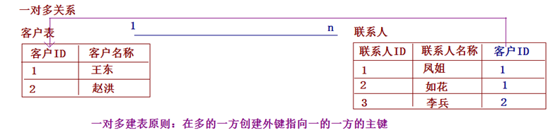
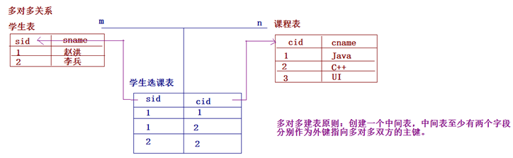
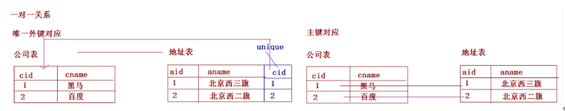
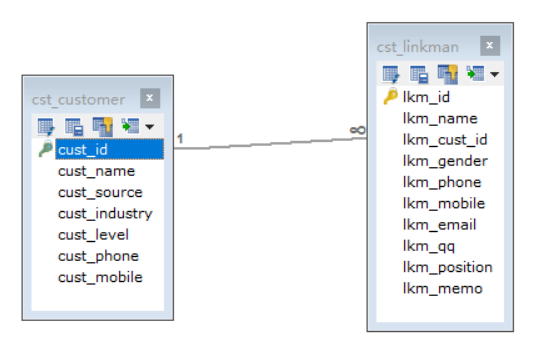
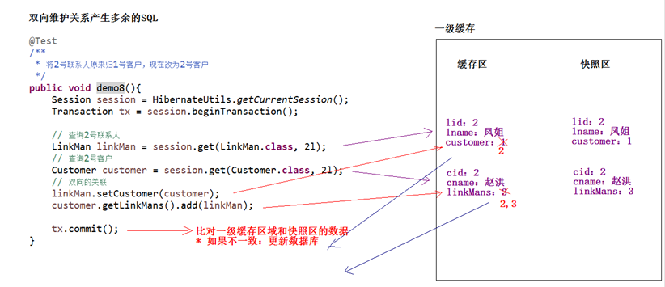

# Hibernate_03

<!--markdownlint-disable MD007 -->
<!--markdownlint-disable MD004 -->
<!-- markdownlint-disable MD033 -->

<!-- TOC -->

- [Hibernate03](#hibernate03)
    - [Hibernate的一对多关联的映射](#hibernate的一对多关联的映射)
        - [数据库表与表之间的关系](#数据库表与表之间的关系)
            - [一对多关系](#一对多关系)
            - [多对多关系](#多对多关系)
            - [一对一关系 - 了解](#一对一关系---了解)
        - [Hibernate一对多的关系配置](#hibernate一对多的关系配置)
            - [1. 创建一个项目，引入相应的jar](#1-创建一个项目引入相应的jar)
            - [2. 创建数据库和表](#2-创建数据库和表)
- [客户表](#客户表)
- [客户表](#客户表)
- [联系人表](#联系人表)
            - [3. 创建实体](#3-创建实体)
            - [4. 创建映射文件](#4-创建映射文件)
            - [5. 创建核心配置文件](#5-创建核心配置文件)
            - [6. 引入工具类](#6-引入工具类)
            - [7. 编写测试类](#7-编写测试类)
        - [Hibernate一对多的相关操作](#hibernate一对多的相关操作)
            - [一对多关系只保存一边是否可以](#一对多关系只保存一边是否可以)
            - [一对多的级联操作](#一对多的级联操作)
            - [级联保存或更新](#级联保存或更新)
            - [测试对象的导航](#测试对象的导航)
            - [级联删除](#级联删除)
            - [一对多设置了双向关联产生了多余的SQL语句](#一对多设置了双向关联产生了多余的sql语句)
            - [区分cascade和inverse](#区分cascade和inverse)
    - [Hibernate的多对多关联的映射](#hibernate的多对多关联的映射)
        - [Hibernate多对多关系的配置](#hibernate多对多关系的配置)
            - [创建表](#创建表)
            - [创建实体](#创建实体)
            - [创建映射](#创建映射)
            - [编写测试类](#编写测试类)
        - [Hibernate多对多的操作](#hibernate多对多的操作)
            - [只保存一边是否可以](#只保存一边是否可以)
            - [多对多的级联保存或更新](#多对多的级联保存或更新)
            - [多对多的级联删除 - 基本上不用](#多对多的级联删除---基本上不用)
            - [多对多的其他的操作](#多对多的其他的操作)
    - [总结](#总结)

<!-- /TOC -->
## Hibernate的一对多关联的映射

### 数据库表与表之间的关系

#### 一对多关系

* 什么样关系属于一对多？
  * 一个部门对应多个员工，一个员工只能属于某一个部门。
  * 一个客户对应多个联系人，一个联系人只能属于某一个客户。
* 一堆多建表原则
    

#### 多对多关系

* 什么样关系属于多对多？
  * 一个学生可以选择多门课程，一门课程也可以被多个学生选择。
  * 一个用户可以选择多个角色，一个角色也可以被多个用户选择。
* 多对多的建表原则
    

#### 一对一关系 - 了解

* 什么样关系属于一对一？
  * 一个公司只能由一个注册地址，一个注册地址只能被一个公司注册
* 一对一的建表原则
    

### Hibernate一对多的关系配置

#### 1.创建一个项目，引入相应的jar

#### 2.创建数据库和表

```sql
# 客户表
CREATE TABLE `cst_customer` (
  `cust_id` bigint(32) NOT NULL AUTO_INCREMENT COMMENT '客户编号(主键)',
  `cust_name` varchar(32) NOT NULL COMMENT '客户名称(公司名称)',
  `cust_source` varchar(32) DEFAULT NULL COMMENT '客户信息来源',
  `cust_industry` varchar(32) DEFAULT NULL COMMENT '客户所属行业',
  `cust_level` varchar(32) DEFAULT NULL COMMENT '客户级别',
  `cust_phone` varchar(64) DEFAULT NULL COMMENT '固定电话',
  `cust_mobile` varchar(16) DEFAULT NULL COMMENT '移动电话',
  PRIMARY KEY (`cust_id`)
) ENGINE=InnoDB AUTO_INCREMENT=1 DEFAULT CHARSET=utf8;

# 联系人表
CREATE TABLE `cst_linkman` (
  `lkm_id` bigint(32) NOT NULL AUTO_INCREMENT COMMENT '联系人编号(主键)',
  `lkm_name` varchar(16) DEFAULT NULL COMMENT '联系人姓名',
  `lkm_cust_id` bigint(32) DEFAULT NULL COMMENT '客户id',
  `lkm_gender` char(1) DEFAULT NULL COMMENT '联系人性别',
  `lkm_phone` varchar(16) DEFAULT NULL COMMENT '联系人办公电话',
  `lkm_mobile` varchar(16) DEFAULT NULL COMMENT '联系人手机',
  `lkm_email` varchar(64) DEFAULT NULL COMMENT '联系人邮箱',
  `lkm_qq` varchar(16) DEFAULT NULL COMMENT '联系人qq',
  `lkm_position` varchar(16) DEFAULT NULL COMMENT '联系人职位',
  `lkm_memo` varchar(512) DEFAULT NULL COMMENT '联系人备注',
  PRIMARY KEY (`lkm_id`),
  KEY `FK_cst_linkman_lkm_cust_id` (`lkm_cust_id`),
  CONSTRAINT `FK_cst_linkman_lkm_cust_id` FOREIGN KEY (`lkm_cust_id`) REFERENCES `cst_customer` (`cust_id`) ON DELETE NO ACTION ON UPDATE NO ACTION
) ENGINE=InnoDB AUTO_INCREMENT=1 DEFAULT CHARSET=utf8;
```



#### 3.创建实体

* 一方的实体

```java
public class Customer {
    private Long cust_id;
    private String cust_name;
    private String cust_source;
    private String cust_industry;
    private String cust_level;
    private String cust_phone;
    private String cust_mobile;

    // 通过ORM方式表示：一个客户对应多个联系人
    // 放置的多的一方的集合。Hibernate默认使用的是Set集合
    // 这里为什么要用set不用list集合，因为如果用list集合排序的话还会往表中再建一列，来充当排序
    private Set<LinkMan> linkMans = new HashSet<LinkMan>();
}
```

* 多的一方的实体

```java
public class LinkMan {
    private Long lkm_cust_id;
    private String lkm_name;
    private String lkm_gender;
    private String lkm_phone;
    private String lkm_mobile;
    private String lkm_email;
    private String lkm_qq;
    private String lkm_position;
    private String lkm_memo;

    // 通过ORM方式表示，一个联系人只能属于某一个客户
    // 放置的是一的一方的对象
    private Customer customer;
}
```

#### 4.创建映射文件

* 多的一方的映射的创建

    ```xml
    <hibernate-mapping>
        <!-- 建立类与表的映射 -->
        <class name="cc.hibernate.domain.LinkMan" table="cst_linkman">
            <!-- 建立类中的属性与表中的主键对应 -->
            <id name="lkm_cust_id" column="lkm_cust_id">
                <generator class="native"></generator>
            </id>

            <!-- 建立类中的普通的属性和表中字段的对应 -->
            <property name="lkm_name"></property>
            <property name="lkm_gender"></property>
            <property name="lkm_phone"></property>
            <property name="lkm_mobile"></property>
            <property name="lkm_email"></property>
            <property name="lkm_qq"></property>
            <property name="lkm_position"></property>
            <property name="lkm_memo"></property>

            <!-- 配置多对一的关系，放置的是一的一方的对象 -->
            <!-- 
                many-to-one标签
                    * name		：一的一方的对象的属性名称
                    * class		：一的一方类的全路径
                    * column	：在多的一方的表的外键的名称
            -->
            <many-to-one name="customer" class="cc.hibernate.domain.Customer" column="lkm_cust_id"></many-to-one>
        </class>
    </hibernate-mapping>
    ```

* 一的一方的映射的创建

```xml
<hibernate-mapping>
    <!-- 建立类与表的映射 -->
    <class name="cc.hibernate.demo1.Customer" table="cst_customer">
        <!-- 建立类中的属性与表中的主键对应 -->
        <id name="cust_id" column="cust_id">
            <generator class="native"></generator>
        </id>

        <!-- 建立类中的普通的属性和表中字段的对应 -->
        <property name="cust_name" column="cust_name" length="20"></property>
        <property name="cust_source" column="cust_source"></property>
        <property name="cust_industry" column="cust_industry"></property>
        <property name="cust_level" column="cust_level"></property>
        <property name="cust_phone" column="cust_phone"></property>
        <property name="cust_mobile" column="cust_mobile"></property>

        <!-- 配置一对多的映射：放置的多的一方的集合 -->
        <!-- set标签： * name ： 多的一方对象集合的属性名称 -->
        <set name="linkMans">
            <!-- key标签 column：多的一方的外键的名称。 -->
            <key column="lkm_cust_id" />

            <!-- one-to-many标签 class：多的一方类标签 -->
            <one-to-many class="cc.hibernate.domain.LinkMan" />
        </set>
    </class>
</hibernate-mapping>
```

#### 5.创建核心配置文件

```xml
<hibernate-configuration>
    <session-factory>
        <!-- @必须参数 -->
        <!-- 连接数据库的基本参数 -->
        <!-- 参考hibernate-release-5.0.7.Final.zip\hibernate-release-5.0.7.Final\project\etchibernate.properties -->
        <property name="hibernate.connection.driver_class">com.mysql.jdbc.Driver</property>
        <property name="hibernate.connection.url">jdbc:mysql://localhost/db_crm?serverTimezone=Asia/Shanghai</property>
        <property name="hibernate.connection.username">root</property>
        <property name="hibernate.connection.password">199746wo</property>

        <!-- 配置hibernate的方言 -->
        <property name="hibernate.dialect">org.hibernate.dialect.MySQL5InnoDBDialect
        </property>

        <!-- @可选参数 -->
        <!-- 打印sql -->
        <property name="hibernate.show_sql">true</property>
        <!-- 格式花sql -->
        <property name="hibernate.format_sql">true</property>
        <property name="hibernate.hbm2ddl.auto">create</property>

        <!-- 配置C3P0连接池 -->
        <property name="connection.provider_class">org.hibernate.connection.C3P0ConnectionProvider</property>
        <!--在连接池中可用的数据库连接的最少数目 -->
        <property name="c3p0.min_size">5</property>
        <!--在连接池中所有数据库连接的最大数目 -->
        <property name="c3p0.max_size">20</property>
        <!--设定数据库连接的过期时间,以秒为单位, 如果连接池中的某个数据库连接处于空闲状态的时间超过了timeout时间,就会从连接池中清除 -->
        <property name="c3p0.timeout">120</property>
        <!--每3000秒检查所有连接池中的空闲连接 以秒为单位 -->
        <property name="c3p0.idle_test_period">3000</property>
        <property name="hibernate.current_session_context_class">thread</property>
        <mapping resource="cc/hibernate/domain/customer.hbm.xml" />
        <mapping resource="cc/hibernate/domain/linkman.hbm.xml" />
    </session-factory>
</hibernate-configuration>
```

* 注意
    `<property name="hibernate.dialect">org.hibernate.dialect.MySQL5InnoDBDialect</property>`这里要设置以下数据库引擎，不然无法设置外键

#### 6.引入工具类

```java
public class HibernateUtils {

    public static final SessionFactory sessionFactory;
    public static final Configuration configure;
    static {
        configure = new Configuration().configure();
        sessionFactory = configure.buildSessionFactory();
    }

    public static Session openSession() {
        return sessionFactory.openSession();
    }

    // 获取当前线程绑定的会话
    public static Session getCurrentSession() {
        return sessionFactory.getCurrentSession();
    }
}
```

#### 7.编写测试类

```java
public class TestHibernate {

    // 保存两个客户，三个联系人，并且建立关系
    @Test
    public void test0() {
        Session session = HibernateUtils.getCurrentSession();
        Transaction transaction = session.beginTransaction();

        // 创建两个客户
        Customer customer1 = new Customer();
        customer1.setCust_name("王东");
        Customer customer2 = new Customer();
        customer2.setCust_name("赵洪");

        // 创建三个联系人
        LinkMan linkMan1 = new LinkMan();
        linkMan1.setLkm_name("凤姐");
        LinkMan linkMan2 = new LinkMan();
        linkMan2.setLkm_name("如花");
        LinkMan linkMan3 = new LinkMan();
        linkMan3.setLkm_name("旺财");

        // 设置关系
        linkMan1.setCustomer(customer1);
        linkMan2.setCustomer(customer1);
        linkMan3.setCustomer(customer2);

        customer1.getLinkMans().add(linkMan1);
        customer1.getLinkMans().add(linkMan2);
        customer2.getLinkMans().add(linkMan3);

        // 保存数据
        session.save(customer1);
        session.save(customer2);
        session.save(linkMan1);
        session.save(linkMan2);
        session.save(linkMan3);

        transaction.commit();
    }
}
```

### Hibernate一对多的相关操作

#### 一对多关系只保存一边是否可以

```java
// 只保存一边是否可以？
@Test
public void test2() {
    Session session = HibernateUtils.getCurrentSession();
    Transaction transaction = session.beginTransaction();

    Customer customer = new Customer();
    customer.setCust_name("赵洪");

    LinkMan linkMan = new LinkMan();
    linkMan.setLkm_name("如花");

    customer.getLinkMans().add(linkMan);
    linkMan.setCustomer(customer);

    // 只保存一边是否可以 ： 不可以，报一个瞬时对象异常，持久态对象关联了一个瞬时态对象。
    session.save(customer);
    session.save(linkMan);
    transaction.commit();
}
```

#### 一对多的级联操作

* 什么叫级联
  * 级联指的是，操作一个对象的时候，是否会同时操作其关联的对象。
* 级联由方向性
  * 操作一的一方的时候，是否操作多的一方
  * 操作多的一方的时候，是否操作一的一方

#### 级联保存或更新

* 保存客户 **级联** 联系人

  * 在`customer.hbm.xml`中的set集合设置级联

    ```xml
    <set name="linkMans" cascade="save-update">
        <!-- key标签 column：多的一方的外键的名称。 -->
        <key column="lkm_cust_id" />

        <!-- one-to-many标签 class：多的一方类标签 -->
        <one-to-many class="cc.hibernate.domain.LinkMan" />
    </set>
    ```

  * 写测试类

    ```java
    /**
        * 级联保存或更新操作 * 保存客户 级联 联系人，操作的主体是客户对象，需要在Customer.hbm.xml中进行设置 *
        * <set name="linkMans" cascade="save-update">
        */
    @Test
    public void test3() {
        Session session = HibernateUtils.getCurrentSession();
        Transaction transaction = session.beginTransaction();

        Customer customer = new Customer();
        customer.setCust_name("王东");

        LinkMan linkMan = new LinkMan();
        linkMan.setLkm_name("凤姐");

        customer.getLinkMans().add(linkMan);
        linkMan.setCustomer(customer);

        session.save(customer);
        // 只保存一边是否可以 ： 可以
        // 因为设置了级联
        transaction.commit();
    }
    ```

* 保存联系人 **级联** 客户

  * 在`linkman.hbm.xml`的many-to-one标签设置级联

      ```xml
      <many-to-one name="customer" cascade="save-update"
                  class="cc.hibernate.domain.Customer" column="lkm_cust_id"></many-to-one>
      ```

  * 编写测试类

    ```java
    /**
        * 级联保存或更新操作 * 保存联系人 级联 客户，操作的主体是联系人对象，需要在Customer.hbm.xml中进行设置 *
        * <set name="linkMans" cascade="save-update">
        */
    @Test
    public void test4() {
        Session session = HibernateUtils.getCurrentSession();
        Transaction transaction = session.beginTransaction();

        Customer customer = new Customer();
        customer.setCust_name("aaa");

        LinkMan linkMan = new LinkMan();
        linkMan.setLkm_name("bbb");

        customer.getLinkMans().add(linkMan);
        linkMan.setCustomer(customer);

        session.save(linkMan);
        transaction.commit();
    }
    ```

#### 测试对象的导航

```java
// 测试对象的导航
@Test
public void test5() {
    Session session = HibernateUtils.getCurrentSession();
    Transaction transaction = session.beginTransaction();

    Customer customer = new Customer();
    customer.setCust_name("李冰");

    LinkMan linkMan1 = new LinkMan();
    linkMan1.setLkm_name("凤姐");
    LinkMan linkMan2 = new LinkMan();
    linkMan2.setLkm_name("如花");
    LinkMan linkMan3 = new LinkMan();
    linkMan3.setLkm_name("旺财");

    linkMan1.setCustomer(customer);
    customer.getLinkMans().add(linkMan2);
    customer.getLinkMans().add(linkMan3);

    // 双方都设置了cascade
    // session.save(linkMan1); // 发送几条insert语句 - 4
    // session.save(customer); // 发送几条insert语句 - 3
    session.save(linkMan2);   // 发送几条insert语句 - 1

    transaction.commit();
}
```

#### 级联删除

* 级联删除
  * 删除一边的时候，同时将另一边的数据也一并删除。
* 删除客户**级联**联系人

    ```java
    /**
    * 级联删除
    * * 删除客户 级联 联系人，删除的主体是客户，需要在Customer.hbm.xml中配置
    * * <set name="linkMans" cascade="save-update,delete">
    */
    @Test
    public void test6() {
        Session session = HibernateUtils.getCurrentSession();
        Transaction transaction = session.beginTransaction();

        // 如果没有设置级联     ：默认情况，修改了联系人的外键，删除客户
        // 如果设置了级联       ：删除客户，同时删除联系人
        Customer customer = session.get(Customer.class, 1l);
        session.delete(customer);

        transaction.commit();
    }
    ```

* 删除联系人级联删除客户（基本不用）

    ```java
    /**
    * 级联删除
    * * 删除联系人 级联 客户，删除的主体是联系人，需要在LinkMan.hbm.xml中配置
    * * <many-to-one name="customer" cascade="save-update,delete"
    */
    @Test
    public void test7() {
        Session session = HibernateUtils.getCurrentSession();
        Transaction transaction = session.beginTransaction();

        // 删除客户同时删除联系人
        LinkMan linkMan = session.get(LinkMan.class, 3l);
        session.delete(linkMan);

        transaction.commit();
    }
    ```

#### 一对多设置了双向关联产生了多余的SQL语句

```java
/**
* 将2号联系人原来归1号客户，现在改为2号客户
*/
@Test
public void test8() {
    Session session = HibernateUtils.getCurrentSession();
    Transaction transaction = session.beginTransaction();

    Customer customer = session.get(Customer.class, 2l);
    LinkMan linkMan = session.get(LinkMan.class, 2l);
    linkMan.setCustomer(customer);
    customer.getLinkMans().add(linkMan);

    transaction.commit();
}
```



* 解决多余的SQL语句
  * 单向维护
  * 使一方放弃外键的维护权：
    * 一的一方放弃 - <font color='red'>在set上配置inverse="true"</font>
  * 一对多的关联查询的修改的时候 - ???

#### 区分cascade和inverse

```java
/**
    * 区分cascade和inverse的区别 cascade：级联操作 保存&更新&删除
    * inverse：对外键的修改权限，true就是放弃，false就是得到
    */
@Test
public void test9() {
    Session session = HibernateUtils.getCurrentSession();
    Transaction transaction = session.beginTransaction();

    Customer customer = new Customer();
    customer.setCust_name("李冰");

    LinkMan linkMan = new LinkMan();
    linkMan.setLkm_name("小狗");

    // 条件在Customer.hbm.xml上set中配置了cascade="save-update,delete" inverse="true"
    customer.getLinkMans().add(linkMan);
    // 客户会插入到数据库，联系人也会插入数据库，但是外键为null
    // 因为客户inverse为true，放弃了对外键的修改权

    // linkMan.setCustomer(customer); - 这句是可以的，因为linkMan设置了级联，没有取消对外键的控制权

    session.save(customer);
    transaction.commit();
}
```

## Hibernate的多对多关联的映射

### Hibernate多对多关系的配置

#### 创建表

* 用户表

    ```sql
    CREATE TABLE `sys_user` (
    `user_id` bigint(32) NOT NULL AUTO_INCREMENT COMMENT '用户id',
    `user_code` varchar(32) NOT NULL COMMENT '用户账号',
    `user_name` varchar(64) NOT NULL COMMENT '用户名称',
    `user_password` varchar(32) NOT NULL COMMENT '用户密码',
    `user_state` char(1) NOT NULL COMMENT '1:正常,0:暂停',
    PRIMARY KEY (`user_id`)
    ) ENGINE=InnoDB AUTO_INCREMENT=1 DEFAULT CHARSET=utf8;
    ```

* 角色表

    ```sql
    CREATE TABLE `sys_role` (
    `role_id` bigint(32) NOT NULL AUTO_INCREMENT,
    `role_name` varchar(32) NOT NULL COMMENT '角色名称',
    `role_memo` varchar(128) DEFAULT NULL COMMENT '备注',
    PRIMARY KEY (`role_id`)
    ) ENGINE=InnoDB AUTO_INCREMENT=1 DEFAULT CHARSET=utf8;
    ```

* 中间表

    ```sql
    CREATE TABLE `sys_user_role` (
    `role_id` bigint(32) NOT NULL COMMENT '角色id',
    `user_id` bigint(32) NOT NULL COMMENT '用户id',
    PRIMARY KEY (`role_id`,`user_id`),
    KEY `FK_user_role_user_id` (`user_id`),
    CONSTRAINT `FK_user_role_role_id` FOREIGN KEY (`role_id`) REFERENCES `sys_role` (`role_id`) ON DELETE NO ACTION ON UPDATE NO ACTION,
    CONSTRAINT `FK_user_role_user_id` FOREIGN KEY (`user_id`) REFERENCES `sys_user` (`user_id`) ON DELETE NO ACTION ON UPDATE NO ACTION
    ) ENGINE=InnoDB DEFAULT CHARSET=utf8;
    ```

#### 创建实体

* 用户的实体

    ```java
    public class User {
        private Long user_id;
        private String user_code;
        private String user_name;
        private String user_password;
        private String user_state;

        // 设置多对多关系：表示一个用户选择多个角色
        // 放置的是角色的集合
        private Set<Role> roles=new HashSet<Role>();
    }
    ```

* 角色的实体

    ```java
    public class Role {
        private Long role_id;
        private String role_name;
        private String role_memo;

        // 一个角色被多个用户选择
        // 设置的是用户的集合
        private Set<User> users = new HashSet<User>();
    }
    ```

#### 创建映射

* role.hbm.xml

    ```xml
    <hibernate-mapping>
        <!-- 建立类与表的映射 -->
        <class name="cc.hibernate.domain.Role" table="sys_role">
            <!-- 建立OID与主键的映射 -->
            <id name="role_id" column="role_id">
                <generator class="native"></generator>
            </id>

            <!-- 建立类中的普通的属性和表中字段的对应 -->
            <property name="role_name" column="role_name"></property>
            <property name="role_memo" column="role_memo"></property>

            <!-- 建立与校色多对多的映射关系 -->
            <!-- set标签： 
                    * name ： 对方集合的属性名称
                    * table： 多对多的关系需要使用中间表，放的是中间表的名称
                    
            -->
            <set name="users" table="sys_user_role">
                <!-- key标签 column：当前的对象对应中间表的名称。 -->
                <key column="role_id" />

                <!-- many-to-many标签
                    class	：对方的类的全路径
                    column	：对方的对象在中间表中外键的名称
                -->
                <many-to-many class="cc.hibernate.domain.User" column="user_id"></many-to-many>
            </set>
        </class>
    </hibernate-mapping>
    ```

* user.hbm.xml

```xml
<hibernate-mapping>
    <!-- 建立类与表的映射 -->
    <class name="cc.hibernate.domain.User" table="sys_user">
        <!-- 建立OID与主键的映射 -->
        <id name="user_id" column="user_id">
            <generator class="native"></generator>
        </id>

        <!-- 建立类中的普通的属性和表中字段的对应 -->
        <property name="user_code" column="user_code"></property>
        <property name="user_name" column="user_name"></property>
        <property name="user_password" column="user_password"></property>
        <property name="user_state" column="user_state"></property>

        <!-- set标签： 
            * name ：对方集合属性的名称
            * table：多对多的关系需要使用中间表，放的是中间表的名称
        -->
        <set name="roles" table="sys_user_role" inverse="true">
            <!-- key标签 column：当前的对象对应中间表的名称。 -->
            <key column="user_id" />

            <!-- many-to-many标签 
            class ：对方的类的全路径 
            column ：对方的对象在中间表中外键的名称 多的一方类标签 -->
            <many-to-many class="cc.hibernate.domain.Role"
                column="role_id" ></many-to-many>
        </set>
    </class>
</hibernate-mapping>
```

#### 编写测试类

```java
/**
    * Hibernate的多对多的映射
    */
@Test
public void test10() {
    Session session = HibernateUtils.getCurrentSession();
    Transaction transaction = session.beginTransaction();

    // 创建2个用户
    User user1 = new User();
    user1.setUser_name("赵洪");
    User user2 = new User();
    user2.setUser_name("李兵");

    // 创建3个角色
    Role role1 = new Role();
    role1.setRole_name("研发部");
    Role role2 = new Role();
    role2.setRole_name("市场部");
    Role role3 = new Role();
    role3.setRole_name("公关部");

    // 设置双向的关系联系
    user1.getRoles().add(role1);
    user1.getRoles().add(role2);
    user2.getRoles().add(role2);
    user2.getRoles().add(role3);

    role1.getUsers().add(user1);
    role2.getUsers().add(user1);
    role2.getUsers().add(user2);
    role3.getUsers().add(user2);

    // 保存操作，多对多建立了双向关系，必须有一方放弃外键维护
    // 一般是被动方放弃外键维护
    session.save(user1);
    session.save(user2);
    session.save(role1);
    session.save(role2);
    session.save(role3);

    transaction.commit();
}
```

* 注意
  * 再设置好映射文件之后记得再核心配置中添加`<mapping resource="" />`
  * 确保映射的属性名和表的属性名一致 - 即确定映射的内容是否正确
  * 确保事务`transaction.commit(); 或者 transaction.rollback();`
  * 确保插入数据能够通过数据库的约束

### Hibernate多对多的操作

#### 只保存一边是否可以

```java
/**
* 只保存一边是否可以 - 不可以
* org.hibernate.TransientObjectException: object references an unsaved transient instance - save the transient instance before flushing: cc.hibernate.domain.User
*/

@Test
public void test11() {
    Session session = HibernateUtils.getCurrentSession();
    Transaction transaction = session.beginTransaction();

    // 创建1个用户
    User user1 = new User();
    user1.setUser_name("赵洪");

    // 创建1个角色
    Role role1 = new Role();
    role1.setRole_name("研发部");

    // 设置双向的关系联系
    user1.getRoles().add(role1);
    role1.getUsers().add(user1);

    // session.save(user1);
    session.save(role1);

    transaction.commit();
}
```

#### 多对多的级联保存或更新

* 保存用户 **级联** 保存角色

    ```java
    /**
        * 设置用户保存级联<set name="roles" table="sys_user_role" inverse="true" cascade="save-update">
        */
    @Test
    public void test12() {
        Session session = HibernateUtils.getCurrentSession();
        Transaction transaction = session.beginTransaction();

        // 创建1个用户
        User user1 = new User();
        user1.setUser_name("赵洪");

        // 创建1个角色
        Role role1 = new Role();
        role1.setRole_name("研发部");

        // 设置双向的关系联系
        user1.getRoles().add(role1);
        role1.getUsers().add(user1);

        // session.save(user1);
        session.save(user1);

        transaction.commit();
    }
    ```

* 保存角色 **级联** 保存用户

    ```java
    /**
        * 设置角色保存级联<set name="users" table="sys_user_role" cascade="save-update">
        */
    @Test
    public void test13() {
        Session session = HibernateUtils.getCurrentSession();
        Transaction transaction = session.beginTransaction();

        // 创建1个用户
        User user1 = new User();
        user1.setUser_name("张三");

        // 创建1个角色
        Role role1 = new Role();
        role1.setRole_name("魔鬼");

        // 设置双向的关系联系
        user1.getRoles().add(role1);
        role1.getUsers().add(user1);

        // session.save(user1);
        session.save(role1);

        transaction.commit();
    }
    ```

#### 多对多的级联删除 - 基本上不用

* 删除用户**级联**删除角色

    ```java
    /**
    * 设置删除用户级联删除角色<set name="roles" table="sys_user_role" inverse="true" cascade=
    * "save-update,delete">
    */
    @Test
    public void test15() {
        Session session = HibernateUtils.getCurrentSession();
        Transaction transaction = session.beginTransaction();

        User user = session.get(User.class, 4l);

        session.delete(user);

        transaction.commit();
    }
    ```

* 删除角色**级联**删除用户

```java
/**
    * 设置角色级联删除用户<set name="users" table="sys_user_role" cascade="save-update,delete">
    */
@Test
public void test14() {
    Session session = HibernateUtils.getCurrentSession();
    Transaction transaction = session.beginTransaction();

    Role role = session.get(Role.class, 1l);

    session.delete(role);

    transaction.commit();
}
```

#### 多对多的其他的操作

* 给用户选择角色

    ```java
    /**
        * 给用户选择角色
        */
    @Test
    public void test16() {
        Session session = HibernateUtils.getCurrentSession();
        Transaction transaction = session.beginTransaction();

        // 查询1号用户
        User user = session.get(User.class, 1l);

        // 查询3号角色
        Role role = session.get(Role.class, 3l);

        // 给1号用户添加三号角色
        user.getRoles().add(role);

        //session.save(user);

        transaction.commit();
    }
    ```

    * 注意，两个映射都不要放弃对外键的处止权

* 给用户改选角色

    ```java
    /**
      * 给用户改选角色
      */
    @Test
    public void test17() {
        Session session = HibernateUtils.getCurrentSession();
        Transaction transaction = session.beginTransaction();

        // 查询1号用户
        User user = session.get(User.class, 2l);

        // 查询3号角色
        Role role2 = session.get(Role.class, 2l);
        Role role1 = session.get(Role.class, 1l);

        // 给1号用户添加三号角色
        user.getRoles().remove(role2);
        user.getRoles().add(role1);

        //session.save(user);

        transaction.commit();
    }
    ```

* 给用户删除角色

```java
/**
    * 给用户删除角色
    */
@Test
public void test18() {
    Session session = HibernateUtils.getCurrentSession();
    Transaction transaction = session.beginTransaction();

    // 查询1号用户
    User user = session.get(User.class, 1l);

    // 查询3号角色
    Role role2 = session.get(Role.class, 2l);

    // 给1号用户删除二号角色
    user.getRoles().remove(role2);
    // 这种删角色不会级联...

    transaction.commit();
}
```

## 总结

* Hibernate_03
  * Hibernate的一对多的映射
    * 数据库表与表的关系
      * 一对多
      * 多对多
      * 一对一 - 了解
    * Hibernate的一对多的配置
      * 1.创建项目，引入jar
      * 2.创建数据库和表
      * 3.创建实体
      * 4.创建映射文件 - 重点
      * 5.创建核心配置文件 - 记得添加映射
      * 6.引入工具类
      * 7.编写测试
    * Hibernate的其他操作
      * 一对多关系只保存是否可以 - 只能配置级联才可以
      * 一对多的级联操作
      * 级联保存或更新
      * 测试对象的导航
      * 级联删除
      * 一对多设置了双向关联产生了多余的SQL语句 - 主要指更新
      * 区分cascade和inverse
  * Hibernate的多对多的映射
    * Hibernate多对多的配置
      * 创建表
      * 创建类
      * 创建映射 - 重点
      * 创建核心配置文件 - 记得加映射
      * 编写测试
    * Hibernate的多对多操作
      * 只保存一边是否可以 - 除非级联否则不可以
      * 多对多的级联保存或更新
      * 多对多的级联删除 - 基本用不上
      * 对多多的其他操作
