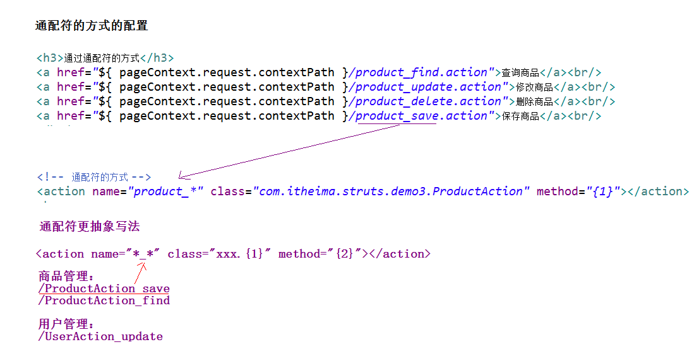

# Struts2_01

<!--markdownlint-disable MD007 -->
<!--markdownlint-disable MD004 -->
<!-- markdownlint-disable MD033 -->

## 学习路线

* 第一天：Struts的概述，Struts的入门、Struts2常见的配置、Struts2的Action的编写
* 第二天：Struts的数据的封装、结果页面配置
* 第三天：Struts的值栈和OGNL表达式
* 第四天：Struts的标签库

## Struts2的概述

### 什么是Struts2

> Struts2是一个基于MVC设计模式的Web应用框架，它本质上相当于一个servlet，在MVC设计模式中，Struts2作为控制器(Controller)来建立模型与视图的数据交互。Struts 2是Struts的下一代产品，是在 struts 1和WebWork的技术基础上进行了合并的全新的Struts 2框架。其全新的Struts 2的体系结构与Struts 1的体系结构差别巨大。Struts 2以WebWork为核心，采用拦截器的机制来处理用户的请求，这样的设计也使得业务逻辑控制器能够与ServletAPI完全脱离开，所以Struts 2可以理解为WebWork的更新产品。虽然从Struts 1到Struts 2有着太大的变化，但是相对于WebWork，Struts 2的变化很小。

* Struts2是一个基于MVC设计模式的<font color='red'>WEB层框架</font>
  * Struts2的内核相对于Struts1来讲已经发生巨大变化。

### 常见的Web层框架

* <font color='red'>Struts2</font>
* Strut1
* Webwork
* <font color='red'>SpringMVC</font>

### Web层框架基于前端控制器模型设计


* 注意这里的图不是指并发，而是指用户请求的时候，是怎么找到servlet或者action
* 下图是指servlet并发

* servlet的并发是单实例多线程的


## Struts2的入门

### 下载Struts2的开发环境

> [struts.apache.org](http://struts.apache.org/)

### 解压Struts2开发包


* apps  ：Struts2提供的应用，war文件：web项目打成war包 - 和jar有点类似，直接放到tomcat可以运行
* docs  ：Struts2的开发文档和api
* lib   ：Struts2框架的开发的jar包
* src   ：Struts2的源码

### 创建web项目，引入jar

* 引入jar
  * struts-blank下找jar包
  * 

### 创建一个jsp页面

```java
<h1>Struts2入门</h1>
<h3>
    <a href="${ pageContext.request.contextPath }/hello.action">点击进入Hello.action</a>
</h3>
```

### 编写Action的类

```java
/**
* Struts2的入门Action类
* @author Administrator
*
*/
public class HelloAction {
    /**
    * 提供一个办法：
    * * 方法签名是固定的
    * * 共有的，返回值是String类型，方法名execute，在这个方法中不能传递参数
    */
    public String execute() {
        System.out.println("HelloAction执行了");
        return null;
    }
}
```

### 对Action进行配置

* 在src下创建（提供）名称叫做struts.xml的配置文件

```java
<?xml version="1.0" encoding="UTF-8" ?>
<!DOCTYPE struts PUBLIC
    "-//Apache Software Foundation//DTD Struts Configuration 2.3//EN"
    "http://struts.apache.org/dtds/struts-2.3.dtd">

<struts>
    <!-- Struts2为了管理Action的配置，通过包管理 -->
    <!-- 配置Struts2的包 -->
    <package name="demo1" extends="struts-default" namespace="/">
        <!-- 配置Action -->
        <action name="hello" class="cc.struts.action.HelloAction">
        </action>
    </package>
</struts>
```

* 这里要配置一下提示
    

### 配置前端控制器 | 核心过滤器

* 在`struts2-blank.war\WEB-INF\web.xml`可以找到配置

```xml
<!-- 配置Struts前端过滤器 -->
<filter>
    <filter-name>struts2</filter-name>
    <filter-class>org.apache.struts2.dispatcher.ng.filter.StrutsPrepareAndExecuteFilter</filter-class>
</filter>

<filter-mapping>
    <filter-name>struts2</filter-name>
    <url-pattern>/*</url-pattern>
</filter-mapping>
```

### 改写Action中方法的返回值 - 修改源码是支持热部署

```java
public String execute() {
    System.out.println("HelloAction执行了");
    return "success";
}
```

* 注意，到这里运行一下，
  * 如果`return null;`就会跳到一个空白页面
  * 如果`return "aaa"`就会得到一个错误`No result defined for action cc.struts.action.HelloAction and result aaa`

* 另外，eclipse支持热部署action

    

### 改写 struts.xml

```xml
<struts>
    <!-- Struts2为了管理Action的配置，通过包管理 -->
    <!-- 配置Struts2的包 -->
    <package name="demo1" extends="struts-default" namespace="/">
        <!-- 配置Action -->
        <action name="hello" class="cc.struts.action.HelloAction">
            <result name="success">/success.jsp</result>
            <!-- 这里直接加地址是可以生效的，但是namespace设置是不可以直接生效的 -->
        </action>
        <!-- 这里result的意义是为action提供跳转地址的映射 -->
    </package>
</struts>
```

### 编写success.jsp

```html
<body>
    <h1>成功跳转页面</h1>
</body>
```

* 注意这里的跳转是内部直接跳，而不是重定向

## Struts2的执行流程


当用户访问某一个Action的时候，先经过核心过滤器，在核心过滤器中执行一组拦截器（这组拦截器实现部分功能），执行目标Action，根据Action的返回值，进行页面跳转

* 这里做了一个实验
  * 找到struts2-core-2.3.24.jar下的struts-default.xml
  * 在默认栈defaultStack里面装的有很多拦截器
  * 找对拦截器对应的类，通过`ctrl+shift+t`找到该类文件并关联代码
  * 然后分别在拦截器和Action加上断点，debug后能够看到Action的执行顺序

## Struts2的常见配置

### XML的提示配置

这里是为了struts.xml进行自动提示


### Struts2的配置文件的加载顺序 - 了解

#### Struts2的配置文件加载顺序


* 如何找到加载文件的代码位置
  * 找到核心过滤器类StrutsPrepareAndExecuteFilter
  * 核心过滤器的`init`方法中的`init.initDispatcher(config);`
  * 点入到`InitOperations`类的`initDispatcher`方法
  * 进入`dispatcher.init()`这个方法就找到了


* init_DefaultProperties()              ---- 加载default.properties
  * 位置`/org/apache/struts2/default.properties`
* init_TraditionalXmlConfigurations();  ---- 加载struts-default.xml、struts-plugin.xml、struts.xml
  * 字符串在`org.apache.struts2.dispatcher.Dispatcher`中的常量
* init_LegacyStrutsProperties();        ----加载struts.properties(用户提供自定义)
* init_CustomConfigurationProviders();  ----加载配置提供类
* init_FilterInitParameters()           ----加载web.xml中过滤器初始化参数
* init_AliasStandardObjects()           ----加载Bean对象
  * <font color='red'>注意：后配置的常量的值会覆盖先配置的常量的值</font>

#### 加载顺序

* default.properties
* struts-default.xml
* struts-plugin.xml
* <font color='red'>struts.xml</font>
* struts.properties
* web.xml

### Action的配置

#### package相关配置

* package标签称为包，这个包与java中的包的概念不一致，包为了更好管理action的配置。
* package标签的属性
  * name        ： 包的名称，只有在一个项目不重名即可
  * extends     ： 继承哪个包，通常值为`struts-default`
  * namespace   ： 名称空间，与`<action>`标签中的name属性共同决定访问路径
    * 名称空间有三种写法：
      * 带名称的名称空间       ： namespace="/aaa"
      * 跟名称空间             ： namespace="/"
      * 默认名称空间           ： namespace="" 如果为这个的话，任何名称空间下都能匹配到该action
  * abstract                 ： 表示当前包是抽象包，需要其他包来实现

#### action相关配置

* action标签配置Action
* action标签的属性
  * <font color='red'>name        ： 与namespace共同决定访问路径
  * class       ： Action类的全路径
  * method      ： 执行Action中的那个方法的方法名，默认值execute</font>
  * converter   ： 用于设置类型转换器

* 这里更改method是可以直接修改到项目中的，不需要重新启动

### 常量的配置

* 在Struts2的框架中，提供了非常多的常量：（在/org/apache/struts2/default.properties里）

  * `struts.i18n.encoding=UTF-8`      - Struts2中所有的Post请求的中文乱码不用处理
  * struts.action.extension=action,,  - Struts2请求的默认的扩展名。默认扩展名是.action或者是什么都不写

* 在Struts2中修改一些常量的值：

* struts.xml中进行修改

    ```xml
    <constant name="struts.action.extension" value="action"/>
    ```

* struts.properties中进行修改 - 在src用户自定义创建，只能修改常量

    ```txt
        struts.action.extension=action
    ```

* 在web.xml中进行修改

    ```xml
    <!-- 配置Struts前端过滤器 -->
    <filter>
        <filter-name>struts2</filter-name>
        <filter-class>org.apache.struts2.dispatcher.ng.filter.StrutsPrepareAndExecuteFilter</filter-class>
        <init-param>
            <param-name>struts.action.extension</param-name>
            <param-value>xyz</param-value>
        </init-param>
    </filter>
    ```

* 注意，如果在web.xml配置了常量，就会把struts2.xml的常量给覆盖了，所以一般就在struts2.xml配置，简单方便。

### 分模块开发的配置

```xml
<include file="cc/struts/action2/struts.xml"></include>
```

## Action的访问

### Action的写法

#### Action类是POJO的类

```java
/*
* Action的编写方式，Action类是一个POJO的类
*/
public String execute() {
    System.out.println("HelloAction执行了");
    return null;
}
```

> POJO（Plain Ordinary Java Object）简单的Java对象，实际就是普通JavaBeans，是为了避免和EJB混淆所创造的简称。

#### Action实现一个Action的接口

```java
public class ActionDemo2 implements Action{
    /**
    * Action的编写方式二：实现了一个Action的接口
    * * 实现接口的这种方式：提供了五个常量（五个逻辑视图的名称）
    *       *SUCCESS    :成功
    *       *ERROR      :失败
    *       *LOGIN      :登陆出错页面跳转
    *       *INPUT      :表单校验的时候出错
    *       *NONE       :不跳转
    */
    @Override
    public String execute() throws Exception {
        System.out.println("ActionDemo2 implements Action");
        return null;
    }
}
```

#### Action继承ActionSupport的类

```java
public class ActionDemo3 extends ActionSupport{
    /**
        * Action的编写方式三：Action继承ActionSupport类
        * * 推荐使用此方式
        * * ActionSupport中提供了数据校验、国际化等一系列操作的办法。
        */
    @Override
    public String execute() throws Exception {
        System.out.println("ActionDemo3 extends ActionSupport");
        return NONE;
    }
}
```

### Action的访问方法

#### 通过method设置

```java
<package name="demo4" extends="struts-default" namespace="/">
    <!-- 配置Action -->
    <action name="userFind" class="cc.struts.action4.ActionDemo"
        method="find"></action>
    <action name="userUpdate" class="cc.struts.action4.ActionDemo"
        method="update"></action>
    <action name="userDelete" class="cc.struts.action4.ActionDemo"
        method="delete"></action>
    <action name="userSave" class="cc.struts.action4.ActionDemo"
        method="save"></action>
</package>
```

#### 通过通配符的方式进行设置 - 重要

```xml
<action name="product_*" class="cc.struts.action4.ActionDemo2" method="{1}"></action>
```



#### 动态方法访问

* 开启动态访问

    ```xml
    <!-- 动态方式访问 -->
    <constant name="struts.enable.DynamicMethodInvocation" value="true"></constant>
    <action name="customer" class="cc.struts.action4.CustomerAction"></action>
    ```

* 编写访问路径

```html
<h3>通过动态方式访问的方式</h3>
<a href="${ pageContext.request.contextPath }/customer!find.action">查询客户</a>
<a href="${ pageContext.request.contextPath }/customer!update.action">修改客户</a>
<a href="${ pageContext.request.contextPath }/customer!delete.action">删除客户</a>
<a href="${ pageContext.request.contextPath }/customer!save.action">保护客户</a>
```

## CRM的客户列表展示

### 搭建开发环境

#### 创建web项目，进入jar包

* Struts2
* Hibernate

#### 引入配置文件

* Struts2
  * struts.xml
  * web.xml
* Hibernate
  * 核心文件
  * 映射文件
  * 日志文件

* struts.xml

```xml
<?xml version="1.0" encoding="UTF-8" ?>
<!DOCTYPE struts PUBLIC
    "-//Apache Software Foundation//DTD Struts Configuration 2.3//EN"
    "http://struts.apache.org/dtds/struts-2.3.dtd">

<struts>

    <constant name="struts.action.extension" value="action" />
    <!-- Struts2为了管理Action的配置，通过包管理 -->
    <!-- 配置Struts2的包 -->

    <!-- Struts2的执行过程是 请求->过滤器中的拦截器->xxx.action->[result返回视图] -->

    <!-- 
        package - 包
            *name   		:包名称
            *extends 		:继承那个包？
            *namespace		:名称空间，与action中的name属性共同决定了action的请求路径
    -->
    <package name="crm" extends="struts-default" namespace="/">
        <!-- 
            action  请求发给哪一个action
                * name		： action名称
                * class		： 指定action的类
                * method：	： 执行action的哪一个方法，默认是execute
            这里的方法是通过通配符的方式进行设置
        -->
        <action name="customer_*" class="cc.crm.web.action.CustomerListAction" method="{1}">
            <!-- 
                result - 根据action的返回字符串来判断返回哪一个视图
                    * name设置逻辑视图，结点内部是对应逻辑视图的具体视图
            -->
            <result name="findSuccess">/jsp/customer/list.jsp</result>
        </action>
    </package>
</struts>
```

* web.xml

```xml
<!-- 配置Struts前端过滤器 -->
<filter>
    <filter-name>struts2</filter-name>
    <filter-class>org.apache.struts2.dispatcher.ng.filter.StrutsPrepareAndExecuteFilter</filter-class>
</filter>

<filter-mapping>
    <filter-name>struts2</filter-name>
    <url-pattern>/*</url-pattern>
</filter-mapping>
```

* Hibernate 核心文件

    ```xml
    <?xml version="1.0" encoding="UTF-8"?>
    <!DOCTYPE hibernate-configuration PUBLIC
        "-//Hibernate/Hibernate Configuration DTD 3.0//EN"
        "http://www.hibernate.org/dtd/hibernate-configuration-3.0.dtd">
    <hibernate-configuration>
        <session-factory>
            <!-- @必须参数 -->
            <!-- 连接数据库的基本参数 -->
            <!-- 参考hibernate-release-5.0.7.Final.zip\hibernate-release-5.0.7.Final\project\etchibernate.properties -->
            <property name="hibernate.connection.driver_class">com.mysql.jdbc.Driver</property>
            <property name="hibernate.connection.url">jdbc:mysql://localhost/db_crm?serverTimezone=Asia/Shanghai</property>
            <property name="hibernate.connection.username">root</property>
            <property name="hibernate.connection.password">199746wo</property>

            <!-- 配置hibernate的方言 -org.hibernate.dialect.MySQL5InnoDBDialect- 设置引擎  -->
            <property name="hibernate.dialect">org.hibernate.dialect.MySQL5InnoDBDialect
            </property>

            <!-- @可选参数 -->
            <!-- 打印sql -->
            <property name="hibernate.show_sql">true</property>
            <!-- 格式化sql -->
            <property name="hibernate.format_sql">true</property>
            <property name="hibernate.hbm2ddl.auto">update</property>

            <!-- 配置C3P0连接池 -->
            <property name="connection.provider_class">org.hibernate.connection.C3P0ConnectionProvider</property>
            <!--在连接池中可用的数据库连接的最少数目 -->
            <property name="c3p0.min_size">5</property>
            <!--在连接池中所有数据库连接的最大数目 -->
            <property name="c3p0.max_size">20</property>
            <!--设定数据库连接的过期时间,以秒为单位, 如果连接池中的某个数据库连接处于空闲状态的时间超过了timeout时间,就会从连接池中清除 -->
            <property name="c3p0.timeout">120</property>
            <!--每3000秒检查所有连接池中的空闲连接 以秒为单位 -->
            <property name="c3p0.idle_test_period">3000</property>

            <!-- 将session和当前对象绑定 -->
            <property name="hibernate.current_session_context_class">thread</property>

            <!-- 设置Customer对象的映射 -->
            <mapping resource="cc/crm/domain/customer.hbm.xml" />
        </session-factory>
    </hibernate-configuration>
    ```

* Hibernate映射文件

    ```xml
    <?xml version="1.0" encoding="UTF-8"?>
    <!DOCTYPE hibernate-mapping PUBLIC
        "-//Hibernate/Hibernate Mapping DTD 3.0//EN"
        "http://www.hibernate.org/dtd/hibernate-mapping-3.0.dtd">
    <hibernate-mapping>
        <!-- 建立类与表的映射 -->
        <!-- 
            name  - 类所在的位置
            table - 此类对应的表·
        -->
        <class name="cc.crm.domain.Customer" table="cst_customer" >
            <!-- 建立类中的属性与表中的主键对应 -->
            <id name="cust_id" column="cust_id">
                <generator class="native"></generator>
            </id>

            <!-- 建立类中的普通的属性和表中字段的对应 -->
            <property name="cust_name" column="cust_name" length="20"></property>
            <property name="cust_source" column="cust_source"></property>
            <property name="cust_industry" column="cust_industry"></property>
            <property name="cust_level" column="cust_level"></property>
            <property name="cust_phone" column="cust_phone"></property>
            <property name="cust_mobile" column="cust_mobile"></property>
        </class>
    </hibernate-mapping>
    ```

* Hibernate的日志文件

```txt
#
# Hibernate, Relational Persistence for Idiomatic Java
#
# License: GNU Lesser General Public License (LGPL), version 2.1 or later.
# See the lgpl.txt file in the root directory or <http://www.gnu.org/licenses/lgpl-2.1.html>.
#

### direct log messages to stdout ###
log4j.appender.stdout=org.apache.log4j.ConsoleAppender
log4j.appender.stdout.Target=System.out
log4j.appender.stdout.layout=org.apache.log4j.PatternLayout
log4j.appender.stdout.layout.ConversionPattern=%d{ABSOLUTE} %5p %c{1}:%L - %m%n

### direct messages to file hibernate.log ###
#log4j.appender.file=org.apache.log4j.FileAppender
#log4j.appender.file.File=hibernate.log
#log4j.appender.file.layout=org.apache.log4j.PatternLayout
#log4j.appender.file.layout.ConversionPattern=%d{ABSOLUTE} %5p %c{1}:%L - %m%n

### set log levels - for more verbose logging change 'info' to 'debug' ###
# error warn info debug trace
log4j.rootLogger=info, stdout
```

#### 创建数据库和表

```sql
CREATE TABLE `cst_customer` (
  `cust_id` bigint(32) NOT NULL AUTO_INCREMENT COMMENT '客户编号(主键)',
  `cust_name` varchar(32) NOT NULL COMMENT '客户名称(公司名称)',
  `cust_source` varchar(32) DEFAULT NULL COMMENT '客户信息来源',
  `cust_industry` varchar(32) DEFAULT NULL COMMENT '客户所属行业',
  `cust_level` varchar(32) DEFAULT NULL COMMENT '客户级别',
  `cust_phone` varchar(64) DEFAULT NULL COMMENT '固定电话',
  `cust_mobile` varchar(16) DEFAULT NULL COMMENT '移动电话',
  PRIMARY KEY (`cust_id`)
) ENGINE=InnoDB AUTO_INCREMENT=1 DEFAULT CHARSET=utf8;
```

#### 创建包结构

```txt
.
├── cc
│   └── crm
│       ├── dao
│       │   ├── CustomerDAO.java
│       │   └── impl
│       │       └── CustomerDAOImpl.java
│       ├── domain
│       │   ├── customer.hbm.xml
│       │   └── Customer.java
│       ├── service
│       │   ├── CustomerService.java
│       │   └── impl
│       │       └── CustomerServiceImpl.java
│       ├── utils
│       │   └── HibernateUtils.java
│       └── web
│           └── action
│               └── CustomerListAction.java
├── hibernate.cfg.xml
├── log4j.properties
└── struts.xml
```

#### 引入相应页面

> 见代码

### 代码实现

#### 修改请求路径

* menu.htm

    ```html
    <TR>
        <TD class=menuSmall><A class=style2 href="/Struts2_crm/customer_find.action"
            target=main>－ 客户列表</A></TD>
    </TR>
    ```

#### 编写Action、Service、DAO

* CustomerListAction

    ```java
    public class CustomerListAction extends ActionSupport {

        // 这里就调用一下service得到客户数据，然后保存在request的域中
        public String find() throws Exception {
            List<Customer> list = new CustomerServiceImpl().findList();
            ServletActionContext.getRequest().setAttribute("list", list);
            return "findSuccess";
        }
    }
    ```

* CustomerService - 此处省略 & CustomerServiceImpl

    ```java
    public class CustomerServiceImpl implements CustomerService {

        static final CustomerDAO customerDaoImpl=new CustomerDAOImpl();

        public List<Customer> findList() {
            return customerDaoImpl.findList();
        }
    }
    ```

* CustomerDAO - 此处省略 & CustomerDAOImpl

    ```java
    public List<Customer> findList() {
        Session session = HibernateUtils.getCurrentSession();
        Transaction transaction = session.beginTransaction();
        List<Customer> list = session.createCriteria(Customer.class).list();
        transaction.commit();
        return list;
    }
    ```

#### 配置Action

```xml
<action name="customer_*" class="cc.crm.web.action.CustomerListAction" method="{1}">
    <!-- 
        result - 根据action的返回字符串来判断返回哪一个视图
            * name设置逻辑视图，结点内部是对应逻辑视图的具体视图
        -->
    <result name="findSuccess">/jsp/customer/list.jsp</result>
</action>
```

#### 编写页面

需要用JSTL+EL把数据遍历出来

```jsp
<c:forEach items="${list }" var="customer">
<TR
    style="FONT-WEIGHT: normal; FONT-STYLE: normal; BACKGROUND-COLOR: white; TEXT-DECORATION: none">
    <TD>${customer.cust_name }</TD>
    <TD>${customer.cust_level }</TD>
    <TD>${customer.cust_source }</TD>
    <TD>${customer.cust_industry }</TD>
    <TD>${customer.cust_phone }</TD>
    <TD>${customer.cust_mobile }</TD>
    <TD>
    <a href="${pageContext.request.contextPath }/customerServlet?method=edit&custId=${customer.cust_id}">修改</a>
    &nbsp;&nbsp;
    <a href="${pageContext.request.contextPath }/customerServlet?method=delete&custId=${customer.cust_id}">删除</a>
    </TD>
</TR>

</c:forEach>
```

## 总结

* Struts2的框架的概述
  * 什么是Struts2
    * Strut2是一个基于MVC设计模式的web层的框架
  * 常见的Web层框架
    * Struts2
    * Struts1
    * SpringMVC
    * WebWork
  * Web层框架
    * 基于前端控制器模型
* Struts2的入门程序
  * 下载Struts2的开发环境
  * 解压Struts2的压缩包
  * 创建项目，引入jar
  * 编写Action类
  * 对Action进行配置
  * 配置前端过滤器|核心过滤器
  * 改写Action中返回的逻辑视图
  * 改写Struts.xml中的result
  * 编写success.jsp
* Struts2的执行流程
  * 请求->核心过滤器（StrutsPrepareAndExecuteFilter）->执行一组拦截器（完成部分功能）->Action->Result
  * eclipse在类关系的技巧
* Struts2的常见配置
  * 配置文件的加载顺序
    * 后配置的配置文件中的常量的值会覆盖先配置文件的常量的值。
  * Action的配置
    * package配置
      * name        ：包名 -在一个项目中不重复就可以了
      * extends     ：继承 一般是固定
      * namespace   ：名称空间 - 与action中name 共同决定访问路径
      * abstract    ：用于其他包的继承
    * action配置
      * name        ：与namespace共同决定访问路径
      * class       ：action类的全路径
      * method      ：执行Action中某个方法，默认值是execute
* constant配置（default.properties）
  * 设置Struts2的常量
* include设置
  * 分模块开发的使用
* Struts2的Action的访问
  * Action的编写
    * Action是POJO类
    * Action实现Action接口
    * Action继承ActionSupport类
  * Action的访问
    * 通过method属性配置
    * <font color='red'>通过通配符的方式配置
    * 动态方法访问的方式</font>
* 关于并发
  * servlet是单实例多线程
  * action是多实例多线程
* 补充图片


