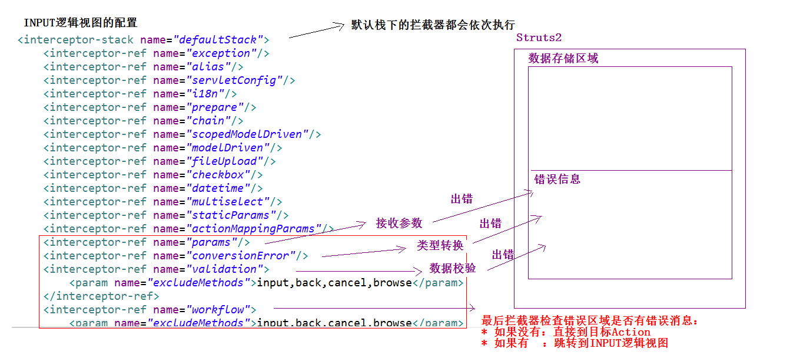
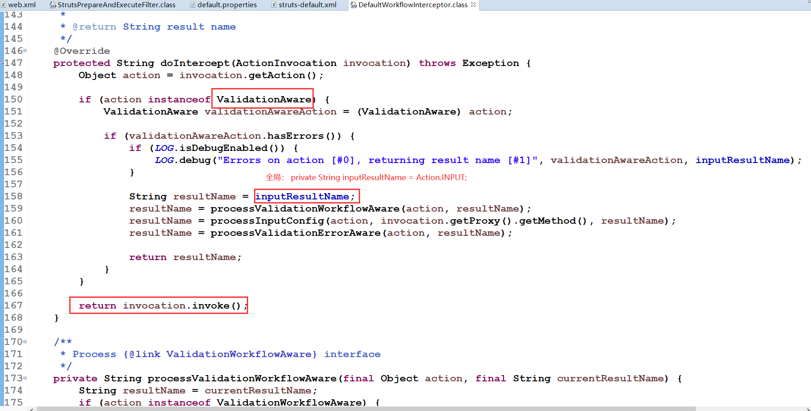
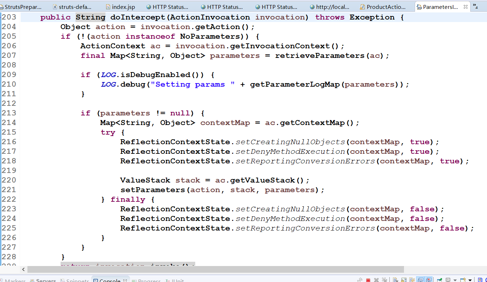

# Struts2_02

<!--markdownlint-disable MD007 -->
<!--markdownlint-disable MD004 -->
<!-- markdownlint-disable MD033 -->

<!-- TOC -->

- [Struts202](#struts202)
    - [Struts2的Servlet的API的访问](#struts2的servlet的api的访问)
        - [完全解耦的方式](#完全解耦的方式)
        - [使用Servlet的API的原生方式 - 最多](#使用servlet的api的原生方式---最多)
        - [接口注入方式](#接口注入方式)
    - [Struts2的结果页面的配置](#struts2的结果页面的配置)
        - [结果页面的配置](#结果页面的配置)
            - [全局页面配置](#全局页面配置)
            - [局部结果页面](#局部结果页面)
        - [result的标签配置](#result的标签配置)
    - [Struts2的数据的封装](#struts2的数据的封装)
        - [Struts2的数据封装](#struts2的数据封装)
            - [属性驱动：提供属性set方法 - 不常用](#属性驱动提供属性set方法---不常用)
            - [属性驱动：页面中提供表达式方式](#属性驱动页面中提供表达式方式)
            - [模型驱动：采用模型驱动方式 - <font color='red'>最常用</font>](#模型驱动采用模型驱动方式---font-colorred最常用font)
        - [关于INPUT的逻辑视图](#关于input的逻辑视图)
    - [Struts2的复杂类型的数据封装](#struts2的复杂类型的数据封装)
        - [封装数据到List集合中](#封装数据到list集合中)
        - [封装数据到Map集合中](#封装数据到map集合中)
    - [综合练习CRM：保存客户](#综合练习crm保存客户)
        - [环境搭建](#环境搭建)
        - [修改html改为jsp](#修改html改为jsp)
        - [代码实现](#代码实现)
            - [保存操作流程](#保存操作流程)
            - [修改菜单页面上来连接](#修改菜单页面上来连接)
            - [编写Action中saveUI & save方法](#编写action中saveui--save方法)
            - [页面配置跳转](#页面配置跳转)
            - [修改添加页面](#修改添加页面)
            - [完成保存操作](#完成保存操作)
            - [配置页面的跳转](#配置页面的跳转)
    - [总结](#总结)

<!-- /TOC -->

## Struts2的Servlet的API的访问

> 在使用Struts2的框架的过程中，发现Struts2的Servlet的API是解耦的。在实际开发中，经常使用Servlet的API，比如进行登陆，将用户的信息保存到Session中，有的时候需要向页面输出一些内容，用到response对象。涉及到Servlet的API的访问

### 完全解耦的方式

* 编写JSP

    * demo1/index.jsp

        ```jsp
        <body>

            <h1>Struts2_day-02</h1>

            <form action="${ pageContext.request.contextPath }/requestdemo1.action"
                method="post">
                姓名：<input type="text" name="name"> <br>
                密码：<input type="password" name="password"><br>
                    <input type="submit" value="提交">
            </form>

        </body>
        ```

    * demo1/success.jsp

        ```jsp
        <body>
        <h1>登陆成功</h1>
        ${ reqName } ${ sessName } ${ appName }
        </body>
        ```

* 编写Action

* RequestDemoAction1.java

    ```java
    public class RequestDemoAction1 extends ActionSupport {

        @Override
        public String execute() throws Exception {
            // 1、接收参数 - 利用Struts2中的对象ActionContext对象
            ActionContext context = ActionContext.getContext();

            // 2.调用ActionContext的getParameters方法
            // - 类似于Map<String String[]> request getParameterMap();
            Map<String, Object> map = context.getParameters();

            for (String key : map.keySet()) {
                String[] values = (String[]) map.get(key);
                System.out.println(key + "   " + Arrays.toString(values));
            }

            // 3. 向域对象存入数据
            context.put("reqName", "reqValue"); // request.setAttrbute();
            context.getSession().put("sessName", "sessValue"); // 相当于session.setAttrbute();
            context.getApplication().put("appName", "appValue");// 相当于application.setAttrbute();

            return SUCCESS;
        }
    }
    ```

* <font color='red'>注意，这种方式只能获得代表request、session、appliction的数据的map集合</font>

### 使用Servlet的API的原生方式 - 最多

* 编写JSP
    * /demo1/index.jsp

        ```jsp
        <form action="${ pageContext.request.contextPath }/requestdemo2.action"
        method="post">
        <h2>方式二、使用原生的方式访问</h2>
        姓名：<input type="text" name="name"> <br> 密码：<input
            type="password" name="password"><br> <input
            type="submit" value="提交">
        </form>
        ```

* 编写Action
    * RequestDemoAction2.java

        ```java
        public class RequestDemoAction2 extends ActionSupport {

            @Override
            public String execute() throws Exception {
                // 1.接收数据
                HttpServletRequest request = ServletActionContext.getRequest();
                Map<String, String[]> map = request.getParameterMap();

                // 2.输出接收数据
                for (String key : map.keySet()) {
                    String[] values = map.get(key);
                    System.out.println(key + "  " + Arrays.toString(values));
                }

                // 3.向域对象中保存数据
                request.setAttribute("reqName", "reqValue"); // - request
                request.getSession().setAttribute("sessName", "sessValue"); // - session
                ServletActionContext.getServletContext().setAttribute("appName", "appValue");// - application

                return SUCCESS;
            }
        }
        ```

* <font color='red'>注意，这种方式可以操作域对象，同时也可以获得对象的方法</font>

### 接口注入方式

* 编写jsp
    * demo1/index.jsp

        ```html
        <form action="${ pageContext.request.contextPath }/requestdemo3.action"
            method="post">
            <h2>方式三、接口注入的方式</h2>
            姓名：<input type="text" name="name"> <br> 密码：<input
                type="password" name="password"><br> <input
                type="submit" value="提交">
        </form>
        ```

* 编写action

    * RequestDemoAction3

        ```java
        public class RequestDemoAction3 extends ActionSupport implements ServletRequestAware, ServletContextAware {

            private HttpServletRequest request;
            private ServletContext servletContext;

            @Override
            public String execute() throws Exception {
                // 1.拿数据
                Map<String, String[]> map = request.getParameterMap();

                // 2.输数据
                for (String key : map.keySet()) {
                    String[] strings = map.get(key);
                    System.out.println(key + "  " + Arrays.toString(strings));
                }

                // 3.向域对象中保存数据
                request.setAttribute("reqName", "reqValue"); // - request
                request.getSession().setAttribute("sessName", "sessValue"); // - session
                ServletActionContext.getServletContext().setAttribute("appName", "appValue");// - application

                return SUCCESS;
            }

            public void setServletRequest(HttpServletRequest arg0) {
                this.request = arg0;
            }

            public void setServletContext(ServletContext arg0) {
                this.servletContext = arg0;
            }
        }
        ```

* 这里涉及到了全局变量
  * 要讨论一下action的多线程问题
    * Servlet是单线程的，多个程序访问同一个Servlet只会创建一个Servlet的实例。
    * Action是多例的，一次请求，创建一个Action实例 - 不会出现线程安全问题

## Struts2的结果页面的配置

### 结果页面的配置

#### 全局页面配置

* 全局结束页面：全局结束页面是指，在包中配置一次，其他的在这个包中的所有的action只要返回了这个值，都可以跳转到这个页面
    * 针对这个包的所有的action的配置都有效

        ```xml
        <struts>
            <package name="demo1" extends="struts-default" namespace="/">
                <global-results>
                    <result name="success">demo1/success.jsp</result>
                </global-results>
                <action name="requestdemo1"
                    class="cc.struts.action.RequestDemoAction1">
                </action>
                <action name="requestdemo2"
                    class="cc.struts.action.RequestDemoAction2">
                </action>
                <action name="requestdemo3"
                    class="cc.struts.action.RequestDemoAction3">
                </action>
            </package>
        </struts>
        ```

#### 局部结果页面

* 局部结果页面：局部结果页面指的是，只在当前的action中的配置有效。
    * 针对当前的action有效
    * 如果局部action与全局action一样，以全局action为主

        ```xml
        <struts>
            <package name="demo1" extends="struts-default" namespace="/">
                <global-results>
                    <result name="success">demo1/success.jsp</result>
                </global-results>
                <action name="requestdemo1"
                    class="cc.struts.action.RequestDemoAction1">
                    <result name="success">demo1/aa.jsp</result>
                </action>
                <action name="requestdemo2"
                    class="cc.struts.action.RequestDemoAction2">
                </action>
                <action name="requestdemo3"
                    class="cc.struts.action.RequestDemoAction3">
                </action>
            </package>
        </struts>
        ```

### result的标签配置

* result标签用于配置页面的跳转。在result标签有两个属性
  * name属性       ： 逻辑视图的名称。默认值success
  * type属性       ： 页面跳转的类型
    * dispatcher    ：默认值（请求转发）             Action转发jsp
    * redirect      ：重定向                        Action重定向jsp
    * chain         ：转发                          Action转发Action
    * redirectAction：重定向                        Action重定向Action
    * stream        ：Struts2提供的下载功能

## Struts2的数据的封装

> Struts2框架是一个web层框架，web层框架（软件的半成品，完成一部分功能）。 Strut2提供了数据封装的功能

### Struts2的数据封装

#### 属性驱动：提供属性set方法 - 不常用

* 编写jsp页面

    ```jsp
    <h1>Struts2_day-02</h1>
    <form action="${ pageContext.request.contextPath }/useraction1.action"
        method="post">
        <h2>方式一：属性驱动-提供set方法的方法</h2>
        用户名<input type="text" name="username"><br/>
        密码<input type="password" name="password"><br/>
        年龄<input type="text" name="age"><br/>
        生日<input type="text" name="birthday"><br/>
        工资<input type="text" name="salary"><br/>
        <input type="submit" value="提交"><br/>
    </form>
    ```

* 编写action

    ```java
    public class UserAction1 extends ActionSupport {

        private String username;
        private String password;
        private String age;
        private Date birthday;
        private Double salary;

        public void setUsername(String username) {
            this.username = username;
        }

        public void setPassword(String password) {
            this.password = password;
        }

        public void setAge(String age) {
            this.age = age;
        }

        public void setBirthday(Date birthday) {
            this.birthday = birthday;
        }

        public void setSalary(Double salary) {
            this.salary = salary;
        }

        @Override
        public String execute() throws Exception {
            // 接收数据
            System.out.println("UserAction1 [username=" + username + ", password=" + password + ", age=" + age
                    + ", birthday=" + birthday + ", salary=" + salary + "]");

            // 封装数据
            User user = new User();

            user.setSalary(salary);
            user.setAge(age);
            user.setPassword(password);
            user.setUsername(username);
            user.setBirthday(birthday);

            return NONE;
        }
    }
    ```

#### 属性驱动：页面中提供表达式方式

* 编写JSP

    ```jsp
    <form action="${ pageContext.request.contextPath }/useraction2.action"
            method="post">
        <h2>方式二：属性驱动-在页面提供表达式</h2>
        用户名<input type="text" name="user.username"><br/>
        密码<input type="password" name="user.password"><br/>
        年龄<input type="text" name="user.age"><br/>
        生日<input type="text" name="user.birthday"><br/>
        工资<input type="text" name="user.salary"><br/>
        <input type="submit" value="提交"><br/>
    </form>
    ```

* 编写Action

    ```java
    public class UserAction2 extends ActionSupport {

        private User user;

        public User getUser() {
            return user;
        }

        public void setUser(User user) {
            this.user = user;
        }

        @Override
        public String execute() throws Exception {
            System.out.println(user);
            return NONE;
        }
    }
    ```

#### 模型驱动：采用模型驱动方式 - <font color='red'>最常用</font>

* 编写jsp

    ```jsp
    <form action="${ pageContext.request.contextPath }/useraction3.action"
        method="post">
        <h2>方式三：模型驱动，采用模型驱动方式 - 最常用</h2>
                用户名<input type="text" name="username"><br/>
        密码<input type="password" name="password"><br/>
        年龄<input type="text" name="age"><br/>
        生日<input type="text" name="birthday"><br/>
        工资<input type="text" name="salary"><br/>
        <input type="submit" value="提交"><br/>
    </form>
    ```

* 编写action

    ```java
    public class UserAction3 extends ActionSupport implements ModelDriven<User> {

        // 模型驱动使用的对象：前提必须手动提供对象的实例
        private User user = new User(); // 手动实例化User

        // 模型需要使用的方法
        public User getModel() {
            return user;
        }

        @Override
        public String execute() throws Exception {
            System.out.println(user);
            return NONE;
        }
    }
    ```

* 模型驱动方式最常用的方式
  * 缺点：只能同时向一个对象中封装数据
* 使用第二种可以向多个对象中同时封装数据

### 关于INPUT的逻辑视图

* Action接口中提供了五个逻辑视图的名称：
  * SUCCESS
  * ERROR
  * LOGIN
  * <font color='red'>INPUT       : 某些拦截器会用</font>
  * NONE



* 这里需要补充一个源码来解释上述图片内容

    

    关于01.png中，instanceof的用法

    ```java
    // instanceof 严格来说是Java中的一个双目运算符，用来测试一个对象是否为一个类的实例，用法为：
    boolean result = obj instanceof Class;
    // 其中obj为null，那么也返回false
    ```

* 实验

    ```html
    <%@ page language="java" contentType="text/html; charset=UTF-8"
    pageEncoding="UTF-8"%>
    <%@ taglib uri="/struts-tags" prefix="s"%>
    <!-- 这里设置标签库 -->
    <!DOCTYPE html>
    <html>
    <head>
    <meta charset="UTF-8">
    <title>Insert title here</title>
    </head>
    <body>
        <h1>Struts2_day-02</h1>
        <!-- 这里让提示错误信息 -->
        <s:fielderror />
        <form action="${ pageContext.request.contextPath }/useraction1.action"
            method="post">
            <h2>方式一：属性驱动-提供set方法的方法</h2>
            用户名<input type="text" name="username"><br /> 密码<input
                type="password" name="password"><br /> 年龄<input type="text"
                name="age"><br /> 生日<input type="text" name="birthday"><br />
            工资<input type="text" name="salary"><br /> <input
                type="submit" value="提交"><br />
        </form>
    ```

    * struts.xml

        ```xml
        <!-- 过不了拦截器就重定向到本来页面 -->
        <global-results>
            <result name="input">demo2/index.jsp</result>
        </global-results>
        ```

## Struts2的复杂类型的数据封装

### 封装数据到List集合中

* 编写jsp

    ```jsp
    <h3>封装到List集合中：批量插入商品</h3>
    <form action="${ pageContext.request.contextPath }/productaction1.action" method="post">
        商品名称<input type="text" name="products[0].name">
        <br>
        商品价格<input type="text" name="products[0].price">
        <br>
        商品名称<input type="text" name="products[1].name">
        <br>
        商品价格<input type="text" name="products[1].price">
        <br>
        商品名称<input type="text" name="products[2].name">
        <br>
        商品价格<input type="text" name="products[2].price">
        <br>
        <input type="submit" value="提交" />
    </form>
    ```

* 编写Action

    ```java
    public class ProductAction1 extends ActionSupport {

        private List<Product> products;

        public List<Product> getProducts() {
            return products;
        }

        public void setProducts(List<Product> products) {
            this.products = products;
        }

        @Override
        public String execute() throws Exception {
            for (Product product : products) {
                System.out.println(product);
            }
            return NONE;
        }
    }
    ```

### 封装数据到Map集合中

* 编写jsp

    ```jsp
  <h3>封装到Map集合中：批量插入商品</h3>
    <form action="${ pageContext.request.contextPath }/productaction2.action" method="post">
        商品名称<input type="text" name="map['one'].name">
        <br>
        商品价格<input type="text" name="map['one'].price">
        <br>
        商品名称<input type="text" name="map['two'].name">
        <br>
        商品价格<input type="text" name="map['two'].price">
        <br>
        商品名称<input type="text" name="map['three'].name">
        <br>
        商品价格<input type="text" name="map['three'].price">
        <br>
        <input type="submit" value="提交" />
    </form>
    ```

* 编写action

    ```java

    public class ProductAction2 extends ActionSupport {

        private Map<String, Product> map;

        public Map<String, Product> getMap() {
            return map;
        }

        public void setMap(Map<String, Product> map) {
            this.map = map;
        }

        public String execute() throws Exception {
            for (String key : map.keySet()) {
                Product product = map.get(key);
                System.out.println(key + "  " + product);
            }
            System.out.println("Aaa");
            return NONE;
        }
    }
    ```

这里分析一个源码



## 综合练习CRM：保存客户

### 环境搭建

### 修改html改为jsp

### 代码实现

#### 保存操作流程

* 点击左侧的菜单页面
* 跳转到添加页面（经过Action）
* 在添加页面中输入指定的信息，点击保存
* 将数据提交到Action->Service->DAO
* 最终回到列表页面

#### 修改菜单页面上来连接

```html
<TR>
    <TD class=menuSmall><A class=style2 href="${ pageContext.request.contextPath }/customer_saveUI.action" 
        target=main>－ 新增客户</A></TD>
</TR>
```

#### 编写Action中saveUI & save方法

```java
public String saveUI() {
    return "saveUI";
}
```

#### 页面配置跳转

```xml
<action name="customer_*"
    class="cc.crm.web.action.CustomerListAction" method="{1}">
    <!-- result - 根据action的返回字符串来判断返回哪一个视图 * name设置逻辑视图，结点内部是对应逻辑视图的具体视图 -->
    <result name="findSuccess">/jsp/customer/list.jsp</result>
    <result name="saveUI">/jsp/customer/add.jsp</result>
    <result name="saveSuccess" type="redirectAction">/customer_find.action</result>
</action>
```

#### 修改添加页面

```html
<!-- 修改以下两个地方，一个是post请求的action，一个是input标签的name -->
<FORM id=form1 name=form1
    action="${pageContext.request.contextPath }/customer_save.action"
    method=post>


<td><INPUT class=textbox id=sChannel2 style="WIDTH: 180px"
                                maxLength=50 name="cust_name"></td>
                                <!-- 把所有input的标签的name改成对象属性名称 -->
```

#### 完成保存操作

```java
public class CustomerListAction extends ActionSupport implements ModelDriven<Customer> {

    private Customer customer=new Customer();

    public Customer getModel() {
        return customer;
    }

    public String find() throws Exception {
        List<Customer> list = new CustomerServiceImpl().findList();
        ServletActionContext.getRequest().setAttribute("list", list);
        return "findSuccess";
    }

    public String saveUI() {
        return "saveUI";
    }

    public String save() {
        CustomerService customerService=new CustomerServiceImpl();
        System.out.println(customer);
        customerService.save(customer);
        return "saveSuccess";
    }
}
```

#### 配置页面的跳转

```xml
<action name="customer_*"
    class="cc.crm.web.action.CustomerListAction" method="{1}">
    <!-- result - 根据action的返回字符串来判断返回哪一个视图 * name设置逻辑视图，结点内部是对应逻辑视图的具体视图 -->
    <result name="findSuccess">/jsp/customer/list.jsp</result>
    <result name="saveUI">/jsp/customer/add.jsp</result>
    <result name="saveSuccess" type="redirectAction">/customer_find.action</result>
</action>
```

## 总结

* Struts2的Servlet的API的访问
  * 完全解耦的方式 - ActionServlet
  * 使用Servlet的API 的原生方式 -  ServietActionContext.get
  * 接口注入方式 implements ServletRequestAware, ServletContextAware
* Strut2的结果页面的配置
  * 结果页面的位置
    * 全局页面配置
    * 局部页面配置
  * result的标签配置
    * name
    * type
      * 决定是重定向还是转发，是跳action还是jsp
* struts2的数据封装
  * 属性驱动
    * 提供属性set方法 - 不常用
    * 页面中提供表达式方式 - 要提供get&set
  * 模型驱动 - 最常用
    * 采用模型驱动的方式
    * 关于INPUT的逻辑视图
      * 在数据的传递过程中，拦截器根据自身情况，是否执行action，如果拦截器有错，就会跳转到INPUT的视图
      * 补充两图片
        * 用来解释拦截器出错将会返回INPUT逻辑视图
        * 用来解释拦截器代码以及instance of关键字
* Struts2的复杂类型的数据封装
  * 封装数据到List集合
  * 封装数据到Map集合
* CRM
  * 环境搭建
  * 修改html为jsp
  * 代码实现
    * 保存操作流程
    * 修改菜单页面上来链接
    * 编写Action中save UI和save方法
    * 页面配置跳转
    * 修改添加页面 - 修改name
    * 完成保存操作
    * 配置页面的跳转 - result
* 总结
