# 1. Struts2_03

<!--markdownlint-disable MD007 -->
<!--markdownlint-disable MD004 -->
<!-- markdownlint-disable MD033 -->

## 1.1. OGNL的概述

### 1.1.1. 什么是OGNL

> 对象导航图语言（Object Graph Navigation Language），简称OGNL，是应用于Java中的一个开源的表达式语言（Expression Language），它被集成在Struts2等框架中，作用是对数据进行访问，它拥有类型转换、访问对象方法、操作集合对象等功能。

ognl的全称是对象导航语言，它是一种功能强大的开源表达式语言，使用这种表达式语言，可以通过某种表达式语法，存取java对象的任意属性，调用java对象的方法，同时能够自动实现必要的类型转换。如果把表达式看作是一个带有语义的字符串，那么OGNL无疑成为了这个语义字符串与java对象之间沟通的桥梁

### 1.1.2. OGNL的作用

Struts2默认的表达式语言就是OGNL，它具有如下特点

* 支持对象方法调用。例如：objName.methodName()
* 支持类静态方法调用和值访问，表达式的格式为@[类全名(包括类路径)]@[方法名|值名]
  * 例如`java.lang.String@format('foo %s','bar')`
* 支持赋值操作和表达式串联
  * 例如 `price=100，discount=0.8，calculatePrice()`在方法中进行乘法计算会返回80
* 访问OGNL上下文（OGNL context）和ActionContext
* 操作集合对象。

### 1.1.3. OGNL的要素

* OGNL的要素有三个

  * 表达式 expression
  * 根对象 root object
  * 上下文 context

* 表达式

    > 表达式是整个OGNL的核心，OGNL会根据表达式去对象中取值。所有OGNL操作都是针对表达式解析进行的。它表明了此次OGNL操作要**“做什么”**。表达式就是一个带有语法含义的字符串，这个字符串规定了操作的类型和操作的内容。OGNL支持大量的表达式语法，不仅仅支持这种“链式”对象访问路径，还支持表达式中进行简单计算

* 根对象 - root

    > root对象可以理解为OGNL的操作对象，表达式规定了“做什么”，而Root对象规定了**“对谁操作”**。OGNL称为对象图导航语言，所谓对象图，即以任意一个对象为根，通过OGNL可以访问与这个对象关联的其他对象。

* Context对象

    > 实际上OGNL的取值还需要一个上下文环境，设置Root对象，OGNL可以对Root对象进行取值或写值操作，Root对象所在环境就是OGNL的上下文（Context）。上下文规定了OGNL的操作**“在哪里进行”**。上下文环境Context是一个Map类型的对象，在表达式中访问了Context中的对象，需要使用“#”号加对象名称，即`#对象名称`的形式。

### 1.1.4. OGNL的入门

* 演示OGNL如何访问对象的方法

    ```java
    /**
        * OGNL调用对象的方法
        * @throws OgnlException
        */
    @Test
    public void test1() throws OgnlException {
        OgnlContext context = new OgnlContext();
        // OGNL获得值需要三个要素
        // 表达式 - 怎么做
        // root - 对谁做
        // context - 在呢做

        Object obj = Ognl.getValue("'helloworld'.length()", context, context.getRoot());
        // 'helloworld'.length() - 表达式 - 运行结果10

        System.out.println(obj);
    }
    ```

* OGNL访问对象静态方法

    * 格式

        ```txt
        @类的全路径名@方法名称(参数列表)
        @类的全路径名@属性名称
        ```

    * 代码实现

        ```java
        /**
            * OGNL获取数据
            * @throws OgnlException
            */
        @Test
        public void test3() throws OgnlException {
            OgnlContext context = new OgnlContext();
            context.put("name", "张三");
            Object value = Ognl.getValue("#name", context, context.getRoot());
            System.out.println(value);

            User user=new User();
            user.setName("李四");
            context.setRoot(user);

            Object value2 = Ognl.getValue("name", context, context.getRoot());
            System.out.println(value2);
        }
        ```

* 补充图片

    

## 1.2. 值栈的概述

### 1.2.1. 什么是值栈

> ValueStack是Struts的一个接口，字面意义为值栈，OgnlValueStack是ValueStack的实现类，**客户端发起一个请求struts2框架会创建一个action同时创建一个OgnlValueStack值栈实例**，OgnlValueStack贯穿整个Action的生命周期，strut2中使用OGNL将请求Action的参数封装为对对象存储到值栈中，并通过OGNL表达式读取值栈中的对象属性值。

### 1.2.2. 值栈的内部结构

* Context：即OgnlContext上下文，它是一个map结构，上下文中存储了一些引用
  * parameters：    该map中包含当前请求参数
  * request：       该Map中包含当前request对象的所有属性
  * session：       该Map中包含当前session对象的所有属性
  * application：   该Map中包含当前application对象的所有属性
  * attr：          该Map按如下顺序检索某个属性：
* CompoundRoot：存储了action实例，它作为OgnlContext的Root对象。
  * CompoundRoot 继承了ArrayList的压栈和出栈的功能，具有栈的特点，先进后出，后进后出，最后压进栈的数据在栈顶，我们把它称为对象栈。
  * struts2对原OGNL作出的改进就是Root使用CompoundRoot（自定义栈），使用OnglValueStack的findValue方法可以在CompoundRoot中从栈顶向栈底查找的对象的属性值。
  * CompoundRoot作为OgnlContext的Root对象，并且在CompoundRoot中action实例位于栈顶，当读取action的属性值时会从栈顶对象中找对应的属性，如果找不到则继续找栈中的其他对象，如果找到则停止查找。

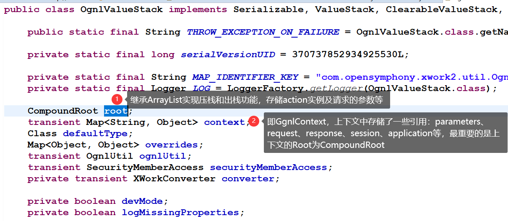

补充三张图 - Struts2与OGNL的结合

* 参数接收
  * 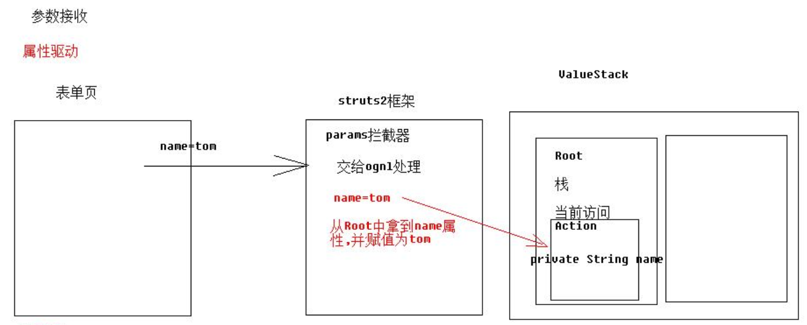
* 对象驱动
  * 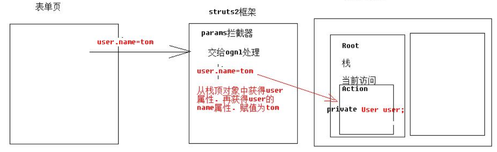
* 模型驱动
  * 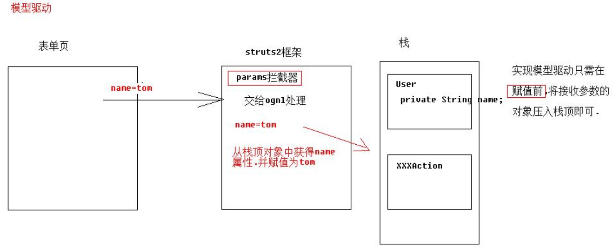

* 重复栈内属性
  * 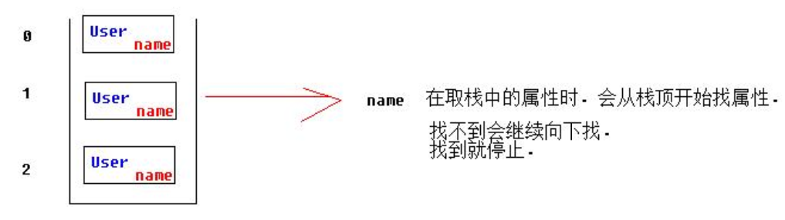

### 1.2.3. ActionContext和ValueStack的关系

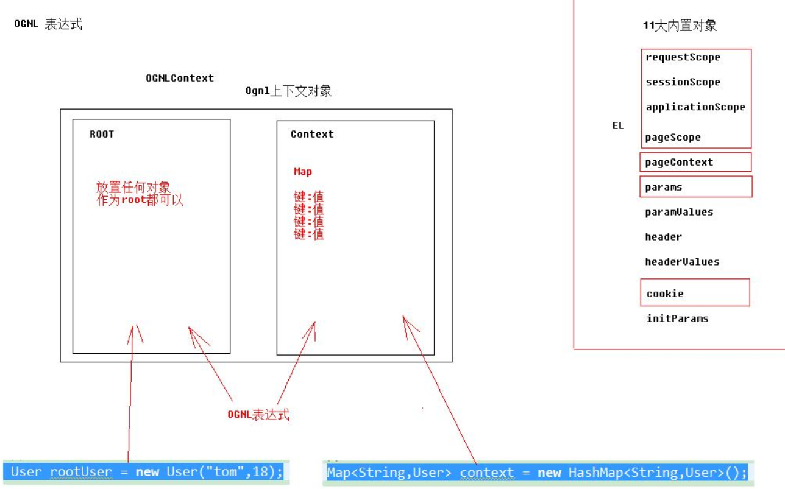

* 创建ActionContext的时候，创建ValueStack的对象，将ValueStack对象给ActionContext.
* ActionContext中有一个ValueStack的引用，ValueStack中也有一个ActionContext的引用
  * ActionContext中有一个ValueStack的引用

    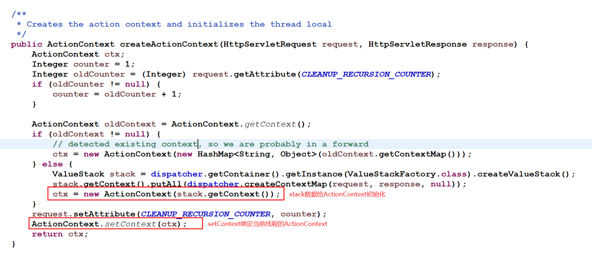

  * ValueStack中有一个ActionContext的引用

    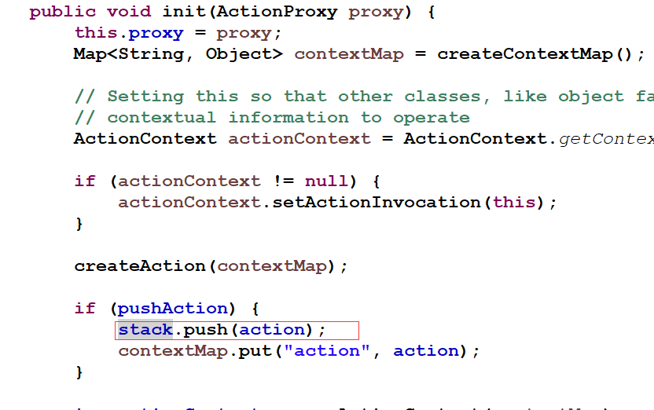

  * 方法寻找
    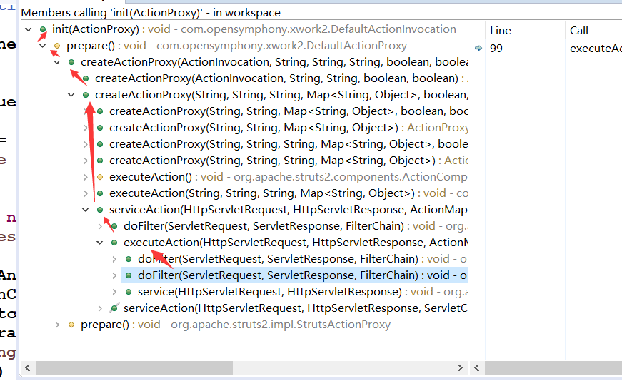

* ActionContext获取ServletAPI的时候，就依赖值栈了。

* ServletContext - Servlet的上下文
* ActionSContext - Action的上下文
  * 通过源码看到：当请求过来的时候，执行过滤器中doFilter方法，在这个方法中创建ActionContext，在创建ActionContext过程中，创建ValueStack对象，将ValueStack对象传递给ActionContext对象。<font color='red'>所以可以通过ActionContext获取值栈对象。
  * ActionContext对象之所以能够访问Servlet的API（访问是域对象的数据）。因为在其内部有值栈的引用。</font>

### 1.2.4. 获取值栈对象

* 通过ActionContext对象获取值栈
* 通过request域获取值栈

```java
public class ValueStackAction extends ActionSupport {

  @Override
  public String execute() throws Exception {
    // 一种，通过ActionContext获得
    ValueStack valueStack1 = ActionContext.getContext().getValueStack();

    // 二种：通过request对象获得
    ValueStack valueStack2 = (ValueStack) ServletActionContext.getRequest()
        .getAttribute(ServletActionContext.STRUTS_VALUESTACK_KEY);

    System.out.println(valueStack1 == valueStack2);

    return NONE;
  }
}
```

### 1.2.5. 操作值栈 - 向值栈中存入数据

* 一种：在action中提供属性的get方法的方式
  * 默认的情况下，将Action对象压入到值栈。Action的属性呢？--> 也会在值栈中。

    ```java
    public class ValueStackAction2 extends ActionSupport {
      private User user;

      public User getUser() {
        return user;
      }

      @Override
      public String execute() throws Exception {
        // 向ValueStack中存值
        user = new User("张三", 11);
        return SUCCESS;
      }
    }
    ```

    ```html
    <%@ page language="java" contentType="text/html; charset=UTF-8"
      pageEncoding="UTF-8"%>
    <%@ taglib uri="/struts-tags" prefix="s"%>
    <!DOCTYPE html>
    <html>
    <head>
    <meta charset="UTF-8">
    <title>Insert title here</title>
    </head>
    <body>
      <h1>查看值栈的结构</h1>
      <s:debug></s:debug>
      <!-- 方式一的获取：利用Action在值栈中的特性 -->
      <s:property  value="user.name" />
      <s:property  value="user.age" />
    </body>
    </html>
    ```

  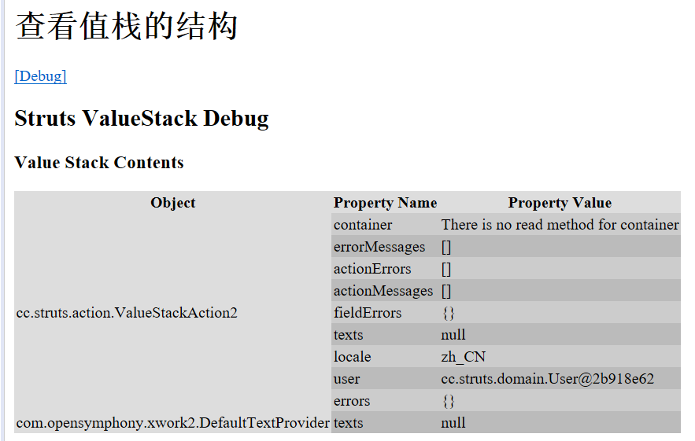

* 二种：使用valueStack中本身的方法的方式

  ```java
  public class ValueStackAction3 extends ActionSupport {

    @Override
    // 向值栈中保存数据
    public String execute() throws Exception {
      // 获得值栈对象
      ValueStack valueStack = ActionContext.getContext().getValueStack();

      // 使用push(Object obj);
      // set(String key,Object obj)
      valueStack.push(new User("赵洪", 38));

      valueStack.set("username", "李观熙");
      // 在栈中放的是java.util.HashMap

      return super.execute();
      // return SUCCESS
    }
  }
  ```

  ```html
  <body>
    <h1>查看值栈的结构</h1>
    <s:debug></s:debug>
    <!-- 方式一的获取：利用Action在值栈中的特性 -->
    <%-- <s:property  value="user.name" />
    <s:property  value="user.age" /> --%>

    <!-- 方式二的获取：调用ValueStack本身的方法 -->
    <s:property value="name" />
    <s:property value="age" />
    <s:property value="username" />
  </body>
  ```

  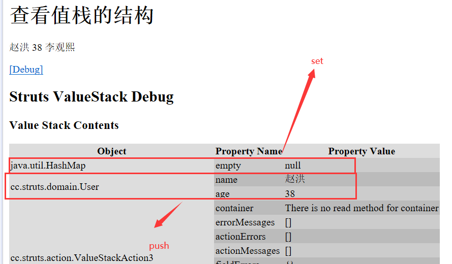

### 1.2.6. 获取值栈数据

* 获取值栈中的数据就是在页面中使用OGNL表达式即可
  * 获取root数据

      ```java
      public String execute() throws Exception {
        ActionContext.getContext().getValueStack().push(new User("zhangsan", 11));

        ArrayList<User> list = new ArrayList<User>();

        list.add(new User("aaa", 111));
        list.add(new User("bbb", 222));
        list.add(new User("ccc", 333));
        ActionContext.getContext().getValueStack().set("list", list);

        // 向context存入数据
        ServletActionContext.getRequest().setAttribute("username", "r李冰");
        ServletActionContext.getRequest().getSession().setAttribute("username", "s赵洪");
        ServletActionContext.getServletContext().setAttribute("username", "a邓超");
        return super.execute();
      }
      ```

    ```html
    <!-- 获取一个对象的数据 -->
    <s:property value="name"/>
    <s:property value="age"/>

    <!-- 获取集合中的数据 -->
    <s:property value="list[0].name"/>
    <s:property value="list[0].age"/>
    <s:property value="list[1].name"/>
    <s:property value="list[1].age"/>
    <s:property value="list[2].name"/>
    <s:property value="list[2].age"/>
    ```

  * 获取Context的数据

    ```html
    <!-- 获取context中的数据 -->
    <s:property value="#request.username" />
    <s:property value="#session.username" />
    <s:property value="#application.username" />
    <s:property value="#attr.username" />
    <!-- parameters.id -> 接收get中的参数 -->
    <s:property value="#parameters.id" />
    ```

### 1.2.7. EL为何能访问值栈数据

* 因为Struts2的框架的底层对request.getAttribute(key)的方法进行了包装。
  * 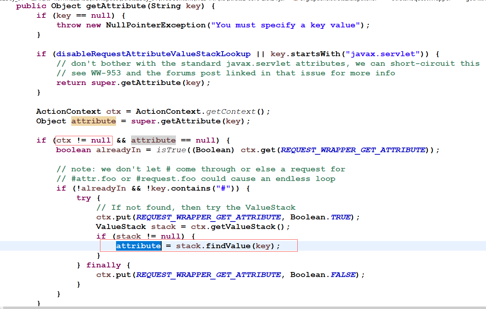

* 加强后的request如何找参数
  * 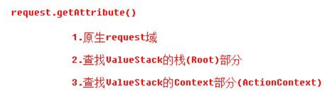

## 1.2. OGNL中特殊字符

### 1.2.1. #号

#### 1.2.1.1. 获取context的数据

  ```html
  <h1>#号的用法</h1>
  <h3>获取context的数据</h3>

  <%
    request.setAttribute("name", "李兵");
  %>

  <s:property value="#request.name" />
  ```

#### 1.2.1.2. 使用#号构建map集合

  ```html
  <h3>构建List</h3>
  <s:iterator var="i" value="{'aa','bb','cc'}">
    <s:property value="i" />---<s:property value="#i" />
  </s:iterator>


  <h3>构建Map</h3>
  <s:iterator var="i" value="#{'aa':'11','bb':'22','cc':'33'}">
    <s:property value="key" />---<s:property value="value" />
    <s:property value="#entry.key" />--<s:property value="#entry.value" />
  </s:iterator>

  性别：
  <input type="radio" name="sex1" value="1">男
  <input type="radio" name="sex1" value="2">女

  <s:radio list="#{'1':'男','2':'女'}" name="sex2" label="性别"></s:radio>
  <s:debug></s:debug>
  ```

### 1.1.2. %号

#### 1.1.2.1. 强制解析OGNL

```html
<%
  request.setAttribute("name", "王东");
%>
<h1>%号的用法</h1>
姓名：
<s:textfield name="name" value="%{#request.name}"></s:textfield>
```

#### 1.1.2.2. 强制不解析OGNL（没用）

```html
<s:property value="%{'#request.name'}"/>
```

### 1.1.2. $号

* 属性文件
  * 国际化地方
    * message_zh_CN_properties
      user.login=登陆  
      user.welcome=欢迎,${#session.user.username}  
    * message_en_US.properties
      user.login=Login
      user.welcome=Welcome,${#session.user.username}
* XML文件
  * 文件下载
    * 配置

      ```xml
      <action name="download" class="xxx.DownloadAction">
        <result type="stream">
          <param name="Content-Type">文件类型</param>
          <param name="Content-Disposition">attachment;filement=${文件名}</param>
        </result>
      </action>
      ```

## 1.2. 总结

* OGNL
  * OGNL:对象图导航语言，是一种功能强大的表达式语言
  * 优点
    * 调用对象方法
    * 调用对象静态方法
    * 表达式串联
    * 访问ActionContext的数据
    * 操作集合
  * OGNL的入门
    * Java环境
    * Strut2环境
* 值栈
  * 什么是值栈：值栈是一个接口，实现类是OgnlValueStack，值栈贯穿了整个action的生命周期，相当于数据中转站
  * 值栈的内部接口
    * root：CompoundRoot，就是一个ArrayList
    * context：OgnlContext，就是一个Map
  * 值栈和ActionContext关系
    * 在ActionContext中获得值栈的引用
  * 获得值栈
    * 通过ActionContext获得
    * 通过request对象获得
  * 操作值栈
    * 利用Action本身在值栈中特性，给Action定义属性和属性get方法
    * 调用值栈本身的方法
      * set(String str,Object obj);
      * push(Object obj);
    * 获取值栈数据
      * 在页面中使用OGNL获取
        * 获取对象数据
        * 获取集合数据
      * 获取context数据
  * EL访问值栈的数据
    * 底层增强request.getAttrbute方法
* OGNL特殊字符
  * `#`
    * 获取context集合
    * 构建map集合
  * %
    * 强制解析ognl表达式
    * 强制不解析
  * $
    * 在配置文件中使用OGNL
