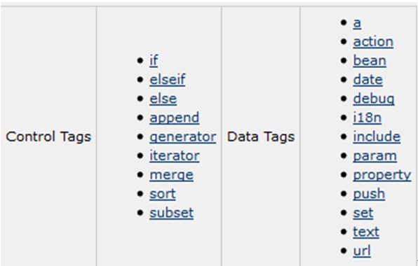
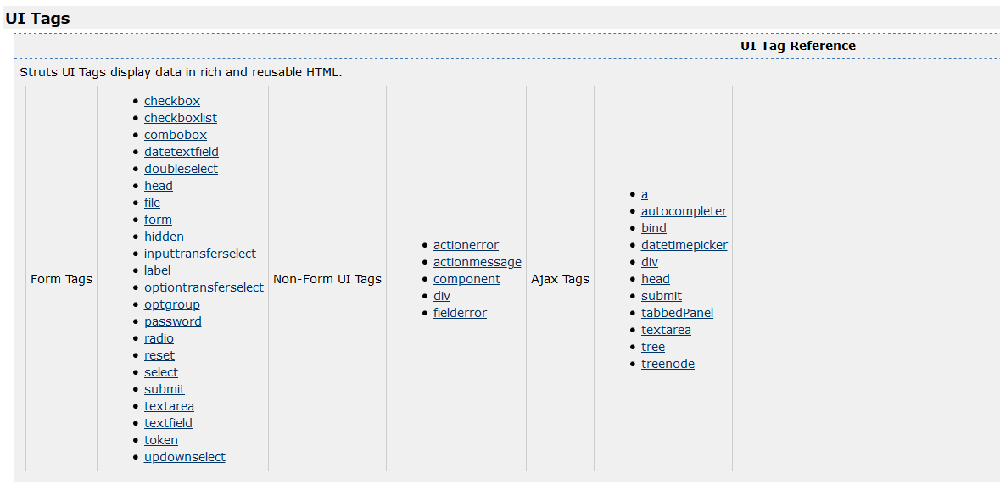

# 1. Struts2_04

<!--markdownlint-disable MD007 -->
<!--markdownlint-disable MD004 -->
<!-- markdownlint-disable MD033 -->

## Struts2的拦截器

### 拦截器概述

### 什么是拦截器

* Interceptor：拦截器，起到拦截Action的作用。
  * Filter：过滤器，过滤从客户端向服务器发送的请求。
  * Interceptor：拦截器，拦截是客户端对Action的访问，更细粒度化的拦截（拦截Action中具体的方法）。
* Struts2框架核心的功能都是依赖拦截器实现。

### Struts2的执行流程

客户端向服务器发送一个Action请求，执行核心过滤器的（doFilter）方法。在这个方法中，调用executeAction()方法，在这个内部方法调用dispatcher.serviceAction()方法，在这个方法内部创建一个Action代理，最终执行的是Action代理的excute()，在代理执行的execute()方法中调用ActionInvocation的invoke方法。在这个方法内部递归执行一组拦截器（完成部分功能），如果没有下一个拦截器，就会执行目标Action，根据Action的返回结果进行页面跳转。


这里要学会查看实现类的方法


### 拦截器入门

#### 搭建Struts2的环境

#### 编写拦截器类

```java
public class InterceptorDemo1 extends AbstractInterceptor {

    @Override
    public String intercept(ActionInvocation invocation) throws Exception {
        System.out.println("InterceptorDemo1执行了...");
        String obj = invocation.invoke();
        System.out.println("InterceptorDemo1执行结束了....");
        return null;
    }
}
```

#### 对拦截器进行配置

* 定义拦截器进行设置

    ```xml
    <package name="demo1" namespace="/" extends="struts-default">
        <!-- 定义拦截器 -->
        <interceptors>
            <interceptor name="interceptorDemo1"
                class="cc.struts.interceptor.InterceptorDemo1"></interceptor>
            <interceptor name="interceptorDemo2"
                class="cc.struts.interceptor.InterceptorDemo2"></interceptor>
        </interceptors>


        <action name="actiondemo1" class="cc.struts.action.ActionDemo">
            <result name="success">/demo1/</result>
            <!-- 引入拦截器（一旦引入自定义拦截器，默认拦截器栈的拦截器就不执行了....） -->
            <interceptor-ref name="defaultStack"></interceptor-ref>
            <interceptor-ref name="interceptorDemo1"></interceptor-ref>
            <interceptor-ref name="interceptorDemo2"></interceptor-ref>
        </action>
    </package>
    ```

* 定义一个拦截器的方式

    ```xml
    <package name="demo1" namespace="/" extends="struts-default">
            <!-- 定义拦截器 -->
            <interceptors>
                <interceptor name="interceptorDemo1"
                    class="cc.struts.interceptor.InterceptorDemo1"></interceptor>
                <interceptor name="interceptorDemo2"
                    class="cc.struts.interceptor.InterceptorDemo2"></interceptor>

                <!-- 定义拦截器栈 -->
                <interceptor-stack name="myStack">
                    <interceptor-ref name="defaultStack"></interceptor-ref>
                    <interceptor-ref name="interceptorDemo1"></interceptor-ref>
                    <interceptor-ref name="interceptorDemo2"></interceptor-ref>
                </interceptor-stack>
            </interceptors>


            <action name="actiondemo1" class="cc.struts.action.ActionDemo">
                <result name="success">/demo1/</result>

                <!-- 引入拦截器（一旦引入自定义拦截器，默认拦截器栈的拦截器就不执行了....） -->
                <interceptor-ref name="myStack"></interceptor-ref>
            </action>
        </package>
    ```

## CRM的权限拦截器

### 创建表和实体

* 创建表

    ```sql
    CREATE TABLE `sys_user` (
    `user_id` bigint(32) NOT NULL AUTO_INCREMENT COMMENT '用户id',
    `user_code` varchar(32) NOT NULL COMMENT '用户账号',
    `user_name` varchar(64) NOT NULL COMMENT '用户名称',
    `user_password` varchar(32) NOT NULL COMMENT '用户密码',
    `user_state` char(1) NOT NULL COMMENT '1:正常,0:暂停',
    PRIMARY KEY (`user_id`)
    ) ENGINE=InnoDB AUTO_INCREMENT=1 DEFAULT CHARSET=utf8;
    ```

* 创建实体

    ```java
    public class User {
        private Long user_id;
        private String user_code;
        private String user_name;
        private String user_password;
        private String user_state;
        // 省略get/set/tostring
    }
    ```

### 提交数据到Action

* 编写action

    ```java
    public class UserAction extends ActionSupport implements ModelDriven<User> {

        private User user = new User();

        public User getModel() {
            return user;
        }

        /**
        * 用户登录的方法
        */
        public String login() {
            System.out.println(user);
            UserService userServiceImpl = new UserServiceImpl();
            User userIsExist = userServiceImpl.login(user);
            if (userIsExist == null) {
                System.out.println("aa");
                this.addActionError("用户名或者密码错误!");
                return LOGIN;
            } else {
                ServletActionContext.getRequest().getSession().setAttribute("userIsExist", userIsExist);
                return SUCCESS;
            }
        }
    }
    ```

* 编写struts.xml

    ```xml
    <action name="user_*" class="cc.crm.web.action.UserAction"
        method="{1}">
        <result name="success" type="redirect">/index.htm</result>
        <result name="login">/login.jsp</result>
    </action>
    ```

### Action->Service->Dao

* 编写Service

    ```java
    public class UserServiceImpl implements UserService{

        public User login(User user) {
            return new UserDaoImpl().login(user);
        }

    }
    ```

* 编写Dao

```java
public class UserDaoImpl implements UserDao {

    public User login(User user) {
        Session session = HibernateUtils.getCurrentSession();
        Transaction transaction = session.beginTransaction();

        List<User> list = session.createQuery("from User where user_code=? and user_password=?")
                .setParameter(0, user.getUser_code()).setParameter(1, user.getUser_password()).list();
        if (list.size() > 0) {
            return list.get(0);
        }
        transaction.commit();
        return null;
    }
}
```

### 根据结果进行页面跳转

```xml
<result name="success" type="redirect">/index.htm</result>
<result name="login">/login.jsp</result>
```

### 更改web页面表单&访问

```html


-login.jsp-
<FORM id=form1 name=form1 action="${ pageContext.request.contextPath }/user_login.action" method=post>

<INPUT id=txtPwd style="WIDTH: 130px" type=password name=user_password>

<INPUT id=txtName style="WIDTH: 130px" name=user_code>

-top.jsp-
当前用户：<s:property value="#session.userIsExist.user_name"/>

-index.jsp-
<FRAME name=top src="top.jsp" frameBorder=0 noResize
```

### 编写权限拦截器

```java
public class PrivilegeInterceptor extends MethodFilterInterceptor {

    @Override
    protected String doIntercept(ActionInvocation invoca) throws Exception {
        User user = (User) ServletActionContext.getRequest().getSession().getAttribute("userIsExist");
        if (user==null) {
            // 用户没登陆
            ActionSupport action = (ActionSupport) invoca.getAction(); // 通过invoca能拿到当前Action
            // 添加错误返回信息
            action.addActionError("没有登陆！没有权限访问");
            // 返回当前执行的action的LOGIN视图页面
            return action.LOGIN;
        }else {
            // 用户登陆了，执行下一个过滤器
            return invoca.invoke();
        }
    }
}
```

### 配置拦截器

```XML
<struts>
    <constant name="struts.action.extension" value="action" />
    <package name="crm" extends="struts-default" namespace="/">

        <!-- 配置拦截器 -->
        <interceptors>
            <interceptor name="privilegeInterceptor"
                class="cc.crm.interceptor.PrivilegeInterceptor"></interceptor>

            <!-- 拦截器栈 -->
            <interceptor-stack name="myStack">
                <interceptor-ref name="defaultStack" />
                <interceptor-ref name="privilegeInterceptor">
                    <!-- 这个拦截器对login方法放行  -->
                    <!-- 如果login都不放行，那session就永远都没有值，自然无法通过此连接器 -->
                    <param name="excludeMethods">login</param>
                </interceptor-ref>
            </interceptor-stack>
        </interceptors>

        <!-- 默认拦截器参考，意味着所有action都要经过此拦截 -->
        <default-interceptor-ref name="myStack"></default-interceptor-ref>

        <!-- 全局结果视图 -->
        <global-results>
            <!-- result这里不要写重定向。不然就看不到actionerror -->
            <result name="login">/login.jsp</result>
        </global-results>

        <action name="customer_*"
            class="cc.crm.web.action.CustomerListAction" method="{1}">
            <result name="findSuccess">/jsp/customer/list.jsp</result>
            <result name="saveUI">/jsp/customer/add.jsp</result>
            <result name="saveSuccess" type="redirectAction">/customer_find.action</result>
        </action>
        <action name="user_*" class="cc.crm.web.action.UserAction"
            method="{1}">
            <result name="success" type="redirect">/index.htm</result>
        </action>
    </package>
</struts>
```

### 更改web页面

```html
-login.jsp-
<FORM id=form1 name=form1 action="${ pageContext.request.contextPath }/user_login.action" method=post target="_parent">
<!-- 这里要设置target用来把结果页面输出到父窗口上 -->
```

## Struts2的标签库

### 通用标签库



## 判断标签

* `<s:if>`、`<:elseif>`、`<s:else>`

    ```html
    <body>
        <s:set var="i" value="3" scope="request"></s:set>
        <s:if test="#request.i>3">i大于3</s:if>
        <s:elseif test="#request.i<3">i小于3</s:elseif>
        <s:else>i等于3</s:else>
    </body>
    ```

* `<s:iterator>`

    ```html
    <s:iterator var="i" value="{'aa','bb','cc'}">
        <s:property value="#i" />
    </s:iterator>

    <hr />

    <s:iterator var="entry" value="#{'aaa':'111','bbb':'222','ccc':'333'}">
        <s:property value="#entry.key" />--<s:property value="#entry.value" />
    </s:iterator>

    <hr />

    <s:iterator var="i" begin="1" end="10" step="1">
        <s:property value="#i" />
    </s:iterator>

    <hr />

    <s:iterator var="i" begin="100" end="300" step="5" status="status">
        <!-- status记录当前循环的状态-->
        <s:if test="#status.count%3==0">
            <font color='red'><s:property value="#i" /> </font>
        </s:if>
        <s:else>
            <s:property value="#i" />
        </s:else>
    </s:iterator>
    ```

* 其他常用的标签
  * `<s:property />`
  * `<s:debug />`
  * `<s:data />` -- 在页面上进行日期格式化

### UI标签库



```html
<body>
    <form action="${ pageContext.request.contextPath }/actiondemo2.action">
        <input type="hidden" name="id"> 用户名<input type="text"
            name="name"> <br> 密码<input type="password"
            name="password"> <br> 年龄<input type="text" name="age">
        <br> 性别<input type="radio" name="sex" value="男">男 <input
            type="radio" name="sex" value="女">女 <br> 籍贯<select
            name="city">
            <option value="">请选择</option>
            <option value="北京">北京</option>
            <option value="上海">上海</option>
            <option value="深圳">深圳</option>
            <option value="韩国">韩国</option>
        </select> <br> 爱好<input type="checkbox" name="hobby" value="basketball">篮球
        <input type="checkbox" name="hobby" value="football">足球 <input
            type="checkbox" name="hobby" value="volleyball">排球 <input
            type="checkbox" name="hobby" value="pingpong">乒乓球<br /> 介绍：
        <textarea name="" id="" cols="30" rows="10"></textarea>
        <br /> <input type="submit" value="提交">
    </form>

    <!-- s:form表单最大作用是数据回显，提交错误的数据实际上是保存到值栈中了 -->
    <!-- action书写方便，UI是定制的 -->
    <s:debug></s:debug>
    <s:form action="actiondemo2" namespace="/" method="post">
        <s:hidden name="id" />
        <s:textfield name="name" label="用户名" />
        <s:password name="password" label="密码" showPassword="true" />
        <s:textfield name="age" label="年龄" />
        <s:radio list="{'男','女'}" name="sex" label="性别" />
        <s:select list="{'北京','上海','深圳','韩国'}" name="city" label="籍贯"
            headerKey="" headerValue="-请选择-" />
        <s:checkboxlist
            list="#{'basketball':'篮球','football':'足球','volleyball':'排球','pingpang':'乒乓球'}"
            name="hobby" label="爱好" />
        <s:textarea name="info" cols="8" rows="2" label="介绍"></s:textarea>
        <s:submit value="提交" />
    </s:form>
</body>
```

```xml
<!-- 更换主题样式 -->
<constant name="struts.ui.theme" value="simple"></constant>
```

## 总结

* Struts2的拦截器
  * 拦截器概述
    * 什么是拦截器
      * 拦截器：拦截action，粒度更细
      * 过滤器：拦截filter的
    * Struts2的执行流程
  * 拦截器入门
    * 搭建Struts2的环境
    * 编写拦截器类
    * 对拦截器进行配置
* CRM的权限拦截器
  * 创建表和实体
  * 提交数据到Action
  * Action->Service->Dao
  * 根据结果进行页面跳转
  * 更改web页面表单&访问
  * 配置拦截器
  * 更改web页面
* Struts2的标签库
  * 通用标签库
    * 判断标签
  * UI标签库
