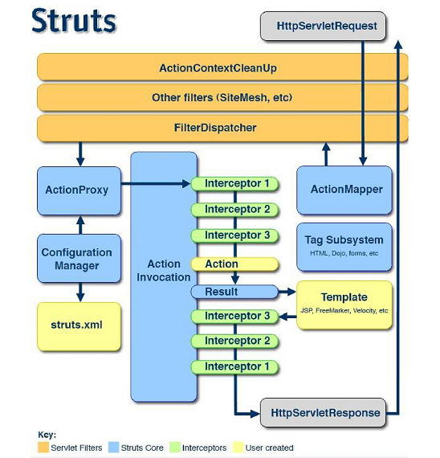
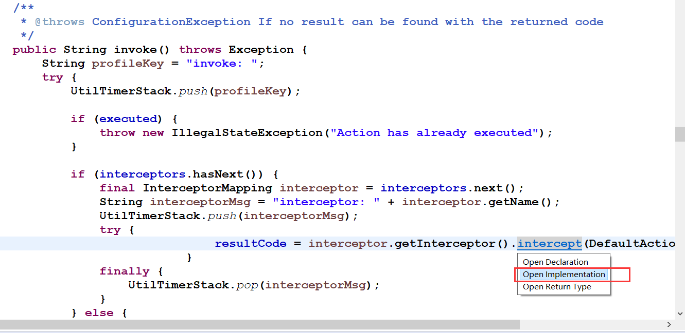

# 1. Struts2_04

<!--markdownlint-disable MD007 -->
<!--markdownlint-disable MD004 -->
<!-- markdownlint-disable MD033 -->

## Struts2的拦截器

### 拦截器概述

### 什么是拦截器

* Interceptor：拦截器，起到拦截Action的作用。
  * Filter：过滤器，过滤从客户端向服务器发送的请求。
  * Interceptor：拦截器，拦截是客户端对Action的访问，更细粒度化的拦截（拦截Action中具体的方法）。
* Struts2框架核心的功能都是依赖拦截器实现。

### Struts2的执行流程

客户端向服务器发送一个Action请求，执行核心过滤器的（doFilter）方法。在这个方法中，调用executeAction()方法，在这个内部方法调用dispatcher.serviceAction()方法，在这个方法内部创建一个Action代理，最终执行的是Action代理的excute()，在代理执行的execute()方法中调用ActionInvocation的invoke方法。在这个方法内部递归执行一组拦截器（完成部分功能），如果没有下一个拦截器，就会执行目标Action，根据Action的返回结果进行页面跳转。



这里要学会查看实现类的方法



#### 搭建Struts2的环境

#### 编写拦截器类

```java
public class InterceptorDemo1 extends AbstractInterceptor {

    @Override
    public String intercept(ActionInvocation invocation) throws Exception {
        System.out.println("InterceptorDemo1执行了...");
        String obj = invocation.invoke();
        System.out.println("InterceptorDemo1执行结束了....");
        return null;
    }
}
```

#### 对拦截器进行配置

* 定义拦截器进行设置

    ```xml
    <package name="demo1" namespace="/" extends="struts-default">
        <!-- 定义拦截器 -->
        <interceptors>
            <interceptor name="interceptorDemo1"
                class="cc.struts.interceptor.InterceptorDemo1"></interceptor>
            <interceptor name="interceptorDemo2"
                class="cc.struts.interceptor.InterceptorDemo2"></interceptor>
        </interceptors>


        <action name="actiondemo1" class="cc.struts.action.ActionDemo">
            <result name="success">/demo1/</result>
            <!-- 引入拦截器（一旦引入自定义拦截器，默认拦截器栈的拦截器就不执行了....） -->
            <interceptor-ref name="defaultStack"></interceptor-ref>
            <interceptor-ref name="interceptorDemo1"></interceptor-ref>
            <interceptor-ref name="interceptorDemo2"></interceptor-ref>
        </action>
    </package>
    ```

* 定义一个拦截器的方式

    ```xml
    <package name="demo1" namespace="/" extends="struts-default">
            <!-- 定义拦截器 -->
            <interceptors>
                <interceptor name="interceptorDemo1"
                    class="cc.struts.interceptor.InterceptorDemo1"></interceptor>
                <interceptor name="interceptorDemo2"
                    class="cc.struts.interceptor.InterceptorDemo2"></interceptor>

                <!-- 定义拦截器栈 -->
                <interceptor-stack name="myStack">
                    <interceptor-ref name="defaultStack"></interceptor-ref>
                    <interceptor-ref name="interceptorDemo1"></interceptor-ref>
                    <interceptor-ref name="interceptorDemo2"></interceptor-ref>
                </interceptor-stack>
            </interceptors>


            <action name="actiondemo1" class="cc.struts.action.ActionDemo">
                <result name="success">/demo1/</result>

                <!-- 引入拦截器（一旦引入自定义拦截器，默认拦截器栈的拦截器就不执行了....） -->
                <interceptor-ref name="myStack"></interceptor-ref>
            </action>
        </package>
    ```

## CRM的权限拦截器

### 创建表和实体

* 创建表

    ```sql
    CREATE TABLE `sys_user` (
    `user_id` bigint(32) NOT NULL AUTO_INCREMENT COMMENT '用户id',
    `user_code` varchar(32) NOT NULL COMMENT '用户账号',
    `user_name` varchar(64) NOT NULL COMMENT '用户名称',
    `user_password` varchar(32) NOT NULL COMMENT '用户密码',
    `user_state` char(1) NOT NULL COMMENT '1:正常,0:暂停',
    PRIMARY KEY (`user_id`)
    ) ENGINE=InnoDB AUTO_INCREMENT=1 DEFAULT CHARSET=utf8;
    ```

* 创建实体

    ```java
    public class User {
        private Long user_id;
        private String user_code;
        private String user_name;
        private String user_password;
        private String user_state;
        // 省略get/set/tostring
    }
    ```

### 提交数据到Action

* 编写action

    ```java
    public class UserAction extends ActionSupport implements ModelDriven<User> {

        private User user = new User();

        public User getModel() {
            return user;
        }

        /**
        * 用户登录的方法
        */
        public String login() {
            System.out.println(user);
            UserService userServiceImpl = new UserServiceImpl();
            User userIsExist = userServiceImpl.login(user);
            if (userIsExist == null) {
                System.out.println("aa");
                this.addActionError("用户名或者密码错误!");
                return LOGIN;
            } else {
                ServletActionContext.getRequest().getSession().setAttribute("userIsExist", userIsExist);
                return SUCCESS;
            }
        }
    }
    ```

* 编写struts.xml

    ```xml
    <action name="user_*" class="cc.crm.web.action.UserAction"
        method="{1}">
        <result name="success" type="redirect">/index.htm</result>
        <result name="login">/login.jsp</result>
    </action>
    ```

### Action->Service->Dao

* 编写Service

    ```java
    public class UserServiceImpl implements UserService{

        public User login(User user) {
            return new UserDaoImpl().login(user);
        }

    }
    ```

* 编写Dao

```java
public class UserDaoImpl implements UserDao {

    public User login(User user) {
        Session session = HibernateUtils.getCurrentSession();
        Transaction transaction = session.beginTransaction();

        List<User> list = session.createQuery("from User where user_code=? and user_password=?")
                .setParameter(0, user.getUser_code()).setParameter(1, user.getUser_password()).list();
        if (list.size() > 0) {
            return list.get(0);
        }
        transaction.commit();
        return null;
    }
}
```

### 根据结果进行页面跳转

```xml
<result name="success" type="redirect">/index.htm</result>
<result name="login">/login.jsp</result>
```

### 更改web页面表单&访问

```html


-login.jsp-
<FORM id=form1 name=form1 action="${ pageContext.request.contextPath }/user_login.action" method=post>

<INPUT id=txtPwd style="WIDTH: 130px" type=password name=user_password>

<INPUT id=txtName style="WIDTH: 130px" name=user_code>

-top.jsp-
当前用户：<s:property value="#session.userIsExist.user_name"/>

-index.jsp-
<FRAME name=top src="top.jsp" frameBorder=0 noResize
```

### 编写权限拦截器

