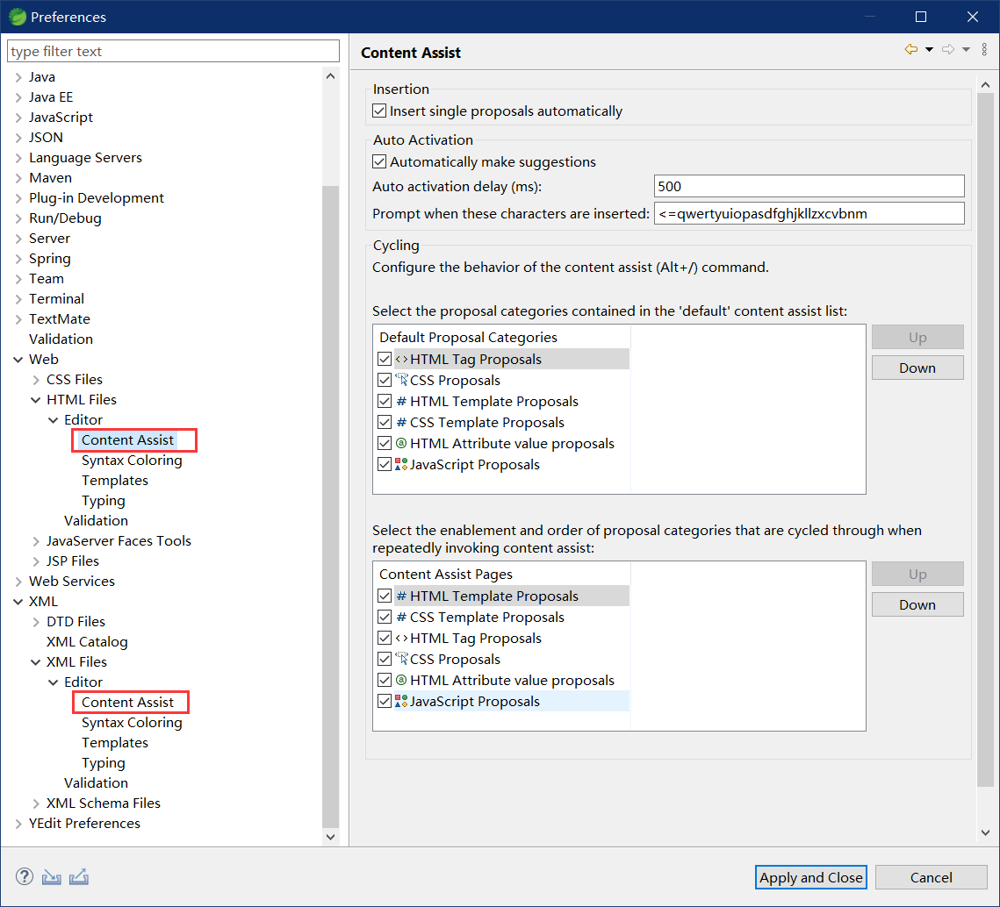
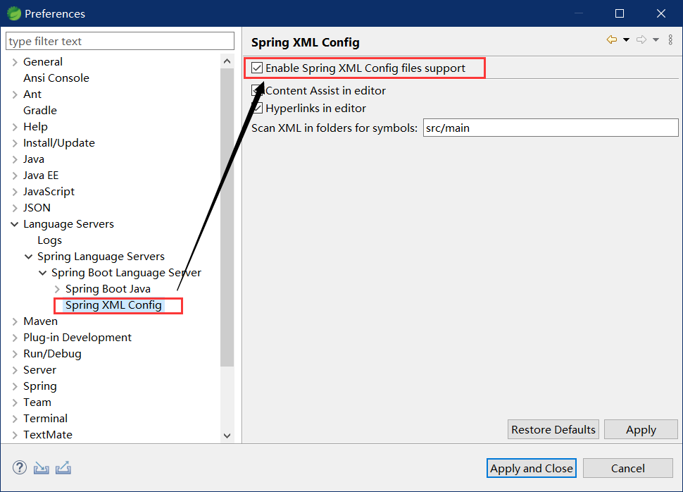
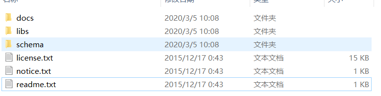
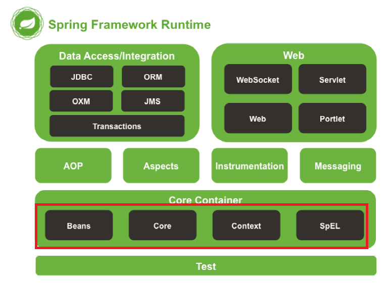
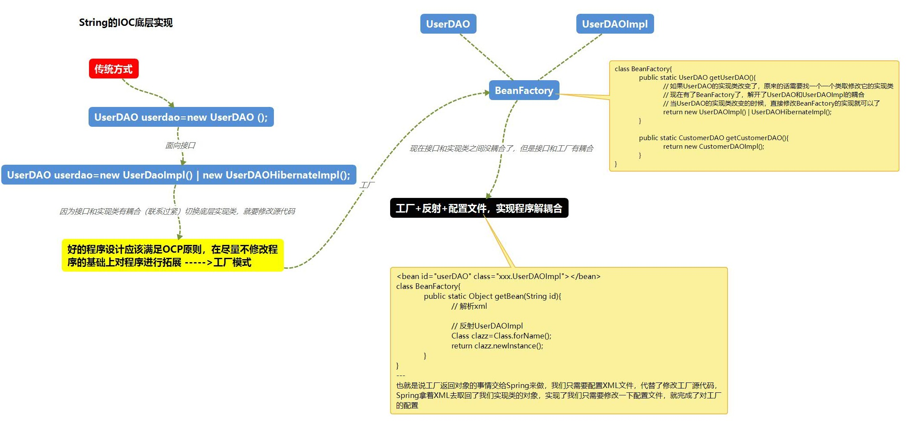
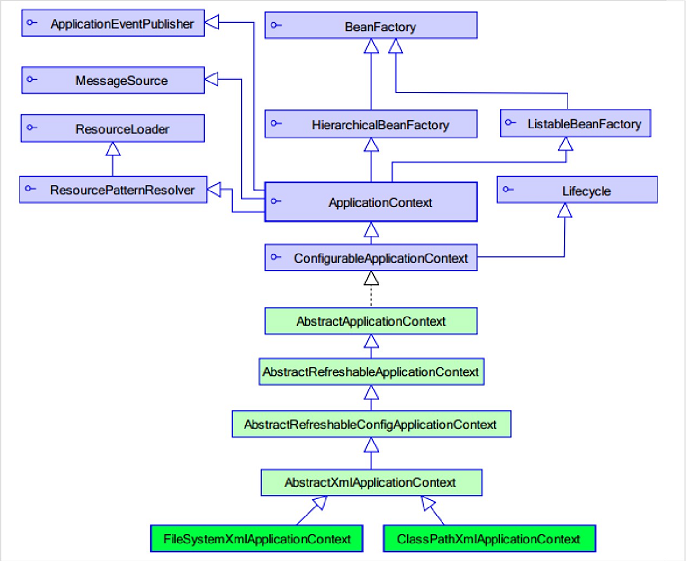
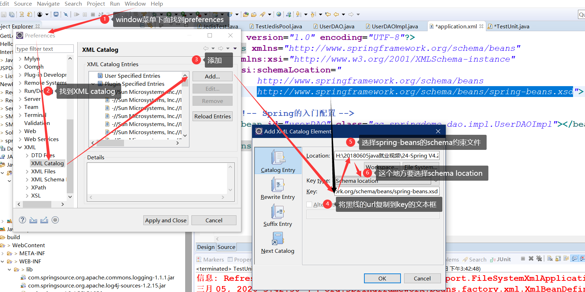
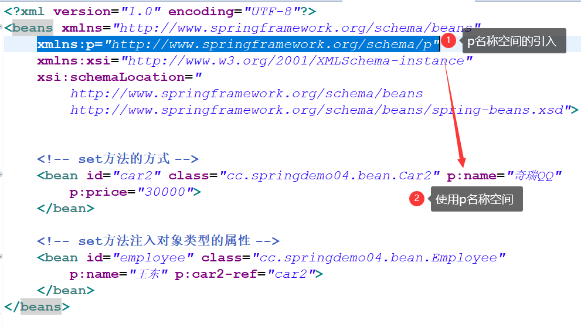

# Spring4_01

<!-- markdownlint-disable MD033 -->
<!-- markdownlint-disable MD007 -->
<!-- markdownlint-disable MD004 -->
<!-- TOC -->

- [Spring401](#spring401)
    - [spring概述](#spring概述)
    - [Spring的环境准备](#spring的环境准备)
    - [Spring的入门 IOC](#spring的入门-ioc)
        - [IOC](#ioc)
            - [1. 下载&解压spring的开发包](#1-下载解压spring的开发包)
            - [2. 创建web项目，引入jar包](#2-创建web项目引入jar包)
            - [3. 创建接口和类](#3-创建接口和类)
            - [4. 将实现类交给spring管理](#4-将实现类交给spring管理)
            - [5. 编写测试类](#5-编写测试类)
            - [入门spring程序总结](#入门spring程序总结)
            - [IOC和DI - 面试*](#ioc和di---面试)
    - [Spring的工厂类](#spring的工厂类)
        - [Spring工厂类的结构图](#spring工厂类的结构图)
    - [Spring的配置](#spring的配置)
        - [XML的提示配置](#xml的提示配置)
        - [Bean的相关配置](#bean的相关配置)
            - [Bean标签的id和name配置](#bean标签的id和name配置)
            - [Bean的生命周期的配置 - 了解](#bean的生命周期的配置---了解)
            - [Bean的作用范围的配置（重点）](#bean的作用范围的配置重点)
    - [Spring的Bean管理](#spring的bean管理)
        - [实例化方法](#实例化方法)
            - [无参构造方法的方式（默认）](#无参构造方法的方式默认)
            - [静态工厂实例化的方式](#静态工厂实例化的方式)
            - [动态工厂实例化的方式](#动态工厂实例化的方式)
        - [Spring的属性注入](#spring的属性注入)
            - [构造方法的方式的属性注入](#构造方法的方式的属性注入)
            - [Set方法的方式的属性注入](#set方法的方式的属性注入)
            - [p名称空间的属性注入 - Spring2.5以后](#p名称空间的属性注入---spring25以后)
            - [SpEL的属性注入（Spring3.0 以后）](#spel的属性注入spring30-以后)
            - [复杂属性的注入](#复杂属性的注入)
    - [Spring的分模块开发的配置](#spring的分模块开发的配置)
        - [在加载配置文件的时候，加载多个](#在加载配置文件的时候加载多个)
        - [在一个配置文件中引入多个配置文件](#在一个配置文件中引入多个配置文件)
    - [CRM的综合案例](#crm的综合案例)
        - [代码实现](#代码实现)
        - [创建web项目，引入jar包](#创建web项目引入jar包)
        - [引入页面](#引入页面)
        - [编写Action类](#编写action类)
        - [配置Action](#配置action)
        - [修改提交页面到Action](#修改提交页面到action)
        - [编写Action的save方法](#编写action的save方法)
        - [解决方案：使用Spring核心监听器ContextLoaderListener（整合web项目）](#解决方案使用spring核心监听器contextloaderlistener整合web项目)
    - [总结](#总结)

<!-- /TOC -->

学习路线

* 第一天
  * spring概述
  * spring IOC入门（XML）
  * spring的bean管理
  * spring的属性注入
* 第二天
  * spring的IOC的注解方式
  * spring的AOP开发（XML）
* 第三天
  * spring的AOP开发
  * spring的声明式事务，jdbcTemplate
* 第四天
  * ssh整合、hibernateTemplate使用、opensessionviewfilter使用

## spring概述

* spring
    > spring是一个开源框架，spring是于2003兴起的一个轻量级的java开发框架，由rod johnson创建，简单来说，spring是一个分层的 java se/ee full-stack（一站式）轻量级开源框架
* spring se/ee开发的一站式框架
  * 一站式框架：有ee开发的每一层解决方案
    * web层     ：springMVC
    * service层 ：spring的bean管理，spring声明式事务
    * dao层     ：spring的jdbc模板，spring的orm模块  
    > ORM Object Relational Mapping  对象关系映射 是通过使用描述对象和数据库之间映射的元数据，将面向对象语言程序中的对象自动持久化到关系数据库中。本质上就是将数据从一种形式转换到另外一种形式。
* 为什么要学习spring
  * 方便解耦，简化开发
    > 通过spring提供的IOC容器，我们可以将对象之间的依赖关系交给spring控制，避免硬编码所造成的过度程序耦合，有了spring，用户不必再为单例模式类、属性文件解析等这些很底层的需求编写代码，可以更专注于上层的应用
  * AOP编程的支持
    > 通过spring提供AOP功能，方便进行面向切面的编程，许多不容易用传统OO实现的功能可以通过AOP轻松应付。
  * 声明式事务的支持
    > 再spring中，我们可以从单调烦闷的事务管理代码中解脱出来，通过声明式方式灵活进行事务的管理，提高开发效率和质量
  * 方便程序的测试
    > 可以用非容器依赖的编程方式进行几乎所有的测试工作，在spring里，测试不再是昂贵的操作，而是随手可做的事情。例如：spring对junit4支持，可以通过注解方便的测试spring程序
  * 方便集成各种优秀框架
    > spring不排斥各种优秀的开源框架，相反，spring可以降低各种框架的使用难度，spring提供了对各种优秀框架（如 struts hibernate hessian quartz）等直接支持
  * 降低java ee api的使用难度
    > spring对很多难用的java ee api（如jdbc，javaMail，远程调控）等提供了一个薄薄的封装层，通过spring的建议封装，这些java ee api的使用难度大为降低。
* spring版本
  * spring 3.x和spring 4.x

## Spring的环境准备

* 关于Spring的IDE在以下的下载地址
    > [Spring tools | 4](https://spring.io/tools)

* 配置java、xml、html自动填充
  * 

* 开启spring config编辑
  * 

* 打开java EE视图
  * 

## Spring的入门 IOC

### IOC

* IOC inversion of control （控制反转）
  * 控制反转：将对象的创建权反转给（交给）spring。

#### 1.下载&解压spring的开发包

下载spring开发包

> [spring官网](https://spring.io/)

开发包目录



* docs   : spring的开发规范和api
* libs   : spring的开发的jar和源码
* schema : spring的配置文件和约束

#### 2.创建web项目，引入jar包



核心：导入`spring-expression-4.2.4.RELEASE.jar`,`spring-core-4.2.4.RELEASE.jar`,`spring-context-4.2.4.RELEASE.jar`,`spring-beans-4.2.4.RELEASE.jar`

依赖`com.springsource.org.apache.log4j-sources-1.2.15.jar` 和`com.springsource.org.apache.commons.logging-1.1.1.jar` ---> 来自dependencies的压缩包

> 网上目前`spring-framework-3.0.2.RELEASE-dependencies`这个压缩包很难找到，目前解决的方法就是直接名字用搜索引擎搜资源，或者去maven库里面直接下--->可以找到


#### 3.创建接口和类

```java
public class UserDAOImpl implements UserDAO {
    @Override
    public void save() {
        System.out.println("UserDAOImpl执行了...");
    }
}
```

---

IOC原理



> IOC原理的核心，Spring其实就是干了工厂的事情，我们改配置要比改工厂方便，所以spring把工厂和接口之间解耦了。

#### 4.将实现类交给spring管理

在spring的解压路径下
`./docs\spring-framework-reference\html\xsd-configuration.html`存在XML文件的配置方法

然后将其复制到src文件夹下，写上名称`application.xml`

```xml
<?xml version="1.0" encoding="UTF-8"?>
<beans xmlns="http://www.springframework.org/schema/beans"
    xmlns:xsi="http://www.w3.org/2001/XMLSchema-instance"
    xsi:schemaLocation="
        http://www.springframework.org/schema/beans http://www.springframework.org/schema/beans/spring-beans.xsd">

    <!-- bean definitions here -->
    <!-- Spring的入门配置 -->
    <bean id="userDAO" class="cc.springdemo.dao.impl.UserDAOImpl"></bean>
</beans>
```

#### 5.编写测试类

```java
public class TestUnit {
    @Test
    /**
    * 传统方式的调用
    */
    public void demo1() {
        UserDAOImpl userDAO = new UserDAOImpl();
        userDAO.save();
    }

    @Test
    /**
    * Spring的方式的调用
    */
    public void demo2() {
        // 创建Spring的工厂
        ApplicationContext applicationContext = new ClassPathXmlApplicationContext("applicationContext.xml");
        UserDAO userDAO = (UserDAO) applicationContext.getBean("userDAO");
        userDAO.save();
    }
}
```

#### 入门spring程序总结

下载&解压spring开发包 ----> 创建web，导入核心jar和依赖jar ----> 创建接口和类 -DAO和DAOImpl ----> 加入XML配置 ----> 单元测试IOC

1. 下载&解压spring开发包 - 认清目录
2. 创建web项目，导入核心jar和依赖jar
3. 创建接口和类 - DAO和DAOImpl
4. 加入XML配置 - 去开发包里找配置
5. 单元测试IOC - IOC其实是Spring去XML通过反射拿到类对象，注入依赖属性后返回

#### IOC和DI - 面试*

* IOC 控制反转，将对象的创建权转给了Spring
  * DI 依赖注入，前提必须有IOC的环境，Spring管理这个类的时候将类的依赖的属性注入（设置）进来。
* 面向对象的时候 有继承、实现、依赖、关联、聚合、组合
  * 依赖

    > 指两个相互独立的对象，当一个对象构造另一个对象实例的时候，或者依赖另一个对象服务时候，这两个对象主要体现出是依赖关系，在java中，类A当中使用了类B，其中类B是类A的方法参数、方法中的局部变量、或者静态方法调用

    ```java
    class A{

    }

    class B{
        public void xxx(A a){
            // 这里调用方法必须传递个A进来，这种关系叫依赖
        }
    }
    ```

  * 关联
    >  指一个类的实例A使用另外一个类的实例B，这两个对象之间为关联关系，关联关系分为单项关联和双向关联。在Java中，单向关联表现为：类A当中使用了类B，其中B作为类A的成员变量。双向关联表现为：类A当中使用了类B作为成员变量；同时类B中也使用了类A作为成员变量。
  * 聚合 - has a 松散/紧闭
    >  聚合关系是关联关系的一种，耦合度强于关联，他们的代码表现是相同的，仅仅是在语义上有所区别：关联关系的对象间是相互独立的，而聚合关系的对象之间存在着包容关系，他们之间是“整体-个体”的相互关系。
  * 继承 is a
  
    ```java
    class A{}
    class B extends A{} // 继承
    ```

  * 实现 - 类实现接口
  * 组合
    > 相比于聚合，组合是一种耦合度更强的关联关系。存在组合关系的类表示“整体-部分”的关联关系，“整体”负责“部分”的生命周期，他们之间是共生共死的；并且“部分”单独存在时没有任何意义。

## Spring的工厂类

### Spring工厂类的结构图



* ApplicationContext继承BeanFactory

* Beanfactory - 老版本的工厂类
  * 只有调用getBean方法的时候，才会生成类的实例
* ApplicationContext - 新版本的工厂类
  * ApplicationContext 加载配置文件的时候，就会将Spring管理的类都实例化。
  * ApplicationContext 有两个实现类
    * ClassPathXmlApplicationContext 加载类路径下的配置文件
    * FileSystemXmlApplicationContext 加载文件系统下的配置文件

FileSystemXmlApplicationContext的使用

```java
@Test
/**
    * 加载磁盘上的配置文件
    */
public void demo3(){
    ApplicationContext applicationContext = new FileSystemXmlApplicationContext("C:\\applicationContext.xml");
    UserDAO userDAO = (UserDAO) applicationContext.getBean("userDAO");
    userDAO.save();
}
```

## Spring的配置

### XML的提示配置



### Bean的相关配置

#### Bean标签的id和name配置

* id    ： 使用了约束中的唯一约束。里面不能出现特殊字符的
* name  ： 没有使用约束中的唯一约束（理论上可以重复，但是实际开发不能出现） 里面可以出现特殊字符
  * Spring于Struts1框架整合的时候
  * `<bean name="/user" class="">`

#### Bean的生命周期的配置 - 了解

* init-method       ： Bean被初始化的时候执行的方法
* destory-method    ： Bean被销毁的时候执行的方法（Bean是单例创建，工厂关闭）

#### Bean的作用范围的配置（重点）

* scope          ： Bean的作用范围
  * singleton    ： 默认的，Spring会采用单例模式创建这个对象
  * prototype    ： 多例模式（Struts2和Spring整合一定会用到，action是多例）
  * request      ： 应用在web项目中，Spring创建这个类以后，将这个类存入request范围中。
  * session      ： 应用在web项目中，Spring创建这个类以后，将这个类存入到session范围中。
  * globalsession： 应用在web项目中，必须在porlet环境下使用。但是如果没有这种环境，相当于session

> Portlet是基于Java的Web组件，由Portlet容器管理，并由容器处理请求，生产动态内容。

## Spring的Bean管理

### 实例化方法

Bean已经都交给Spring管理，Spring创建这些类，有几种方式：

#### 无参构造方法的方式（默认）

* 编写类

  ```java
  public class Bean1 {

    public Bean1() {
      System.out.println("Bean1的无参数构造方法执行力...");
    }
  }
  ```

* 编写配置

  ```xml
  <bean id="bean1" class="cc.springdemo03.bean.Bean1"></bean>
  ```

#### 静态工厂实例化的方式

* 编写Bean2的静态工厂

  ```java
  public class Bean2Factory {
    public static Bean2 createBean2() {
      System.out.println("Bean2Factory方法执行了..");
      return new Bean2();
    }
  }
  ```

* 配置

  ```xml
  <bean id="bean2" class="cc.springdemo03.bean.Bean2Factory"
    factory-method="createBean2"></bean>
  ```

#### 动态工厂实例化的方式

* Bean3的实例工厂

  ```java
  public class Bean3Factory {
    public Bean3 createBean3() {
      System.out.println("createBean3");
      return new Bean3();
    }
  }
  ```

* 配置

  ```xml
    <!-- 动态工厂构造 -->
    <bean id="bean3Factory" class="cc.springdemo03.bean.Bean3Factory"></bean>
    <bean id="bean3" factory-bean="bean3Factory"
      factory-method="createBean3"></bean>
  ```

* 注意
  * 静态工厂的bean中只用写上工厂类路径和方法，Spring会自动去调用`工厂类.静态方法();`来返回对象
  * 动态工厂需要动态工厂的实例才然后才能调用创建方法，索要要设置两个bean，一个是Spring要实例工厂用的，一个是通过动态工厂的id去找到这个动态工厂，然后通过工厂的创建方法创建的Bean3对象。

### Spring的属性注入

#### 构造方法的方式的属性注入

* 构造方法的属性注入

  ```xml
  <!-- 构造方法的方式 -->
    <bean id="car" class="cc.springdemo04.bean.Car">
      <constructor-arg name="name" value="宝马" />
      <constructor-arg name="price" value="800000" />
    </bean>
  ```

#### Set方法的方式的属性注入

* Set方法的属性注入

  ```xml
  <!-- set方法的方式 -->
  <bean id="car2" class="cc.springdemo04.bean.Car2">
    <property name="name" value="奔驰"></property>
    <property name="price" value="100000"></property>
  </bean>
  ```

  * <font color='red'>注意！用set方法必须在业务类中写一个无参的构造方法</font>

* Set方法设置对象类型的属性

  ```xml
    <!-- set方法的方式 -->
    <bean id="car2" class="cc.springdemo04.bean.Car2">
      <property name="name" value="奔驰"></property>
      <property name="price" value="100000"></property>
    </bean>

    <!-- 这里car2的属性的依赖注入一个对象，而这个对象在之前已经定义过一个bean了，直接通过ref传入id就完成了参数传入 -->
    <!-- set方法注入对象类型的属性 -->
    <bean id="employee" class="cc.springdemo04.bean.Employee">
      <property name="name" value="zhangsan"></property>
      <property name="car2" ref="car2"></property>
    </bean>
  ```

#### p名称空间的属性注入 - Spring2.5以后

* 通过引用p名称空间完成属性的注入
  * 写法：
    * 普通属性  `p:属性名="值"`
    * 对象属性  `p:属性名-ref="值"`
* p名称空间的引入

  

#### SpEL的属性注入（Spring3.0 以后）

* SpEL - Spring Expression Language，Spring的表达式语言 - 完成属性注入
  * 语法：
    * `#{SpEL}`

  ```xml
  <bean id="carInfo" class="cc.springdemo04.bean.CarInfo"></bean>

  <bean id="car2" class="cc.springdemo04.bean.Car2">
    <property name="name" value="#{carInfo.name}"></property>
    <property name="price" value="#{carInfo.calculatorPrice()}"></property>
  </bean>

  <bean id="employee" class="cc.springdemo04.bean.Employee">
    <property name="name" value="#{'aaa'}"></property>
    <property name="car2" value="#{car2}"></property>
  </bean>
  ```

#### 复杂属性的注入

```xml
<bean id="collectionBean" class="com.spring.domain.CollectionBean">
  <property name="arrs">
    <list>
      <value>王东</value>
      <value>赵洪</value>
      <value>李观熙</value>
    </list>
  </property>


  <property name="list">
    <list>
      <value>李冰</value>
      <value>赵xx</value>
      <value>张三</value>
    </list>
  </property>

  <property name="set">
    <set>
      <value>aaa</value>
      <value>bbb</value>
      <value>ccc</value>
    </set>
  </property>

  <!-- 注入map集合 -->
  <property name="map">
    <map>
      <entry key="aaa" value="111" />
      <entry key="bbb" value="222" />
      <entry key="ccc" value="333" />
    </map>
  </property>
</bean>
```

## Spring的分模块开发的配置

### 在加载配置文件的时候，加载多个

```java
ClassPathXmlApplicationContext applicationContext = new ClassPathXmlApplicationContext("application.xml","application2.xml");
```

### 在一个配置文件中引入多个配置文件

```xml
<?xml version="1.0" encoding="UTF-8"?>
<beans xmlns="http://www.springframework.org/schema/beans"
  xmlns:p="http://www.springframework.org/schema/p"
  xmlns:xsi="http://www.w3.org/2001/XMLSchema-instance"
  xsi:schemaLocation="
        http://www.springframework.org/schema/beans http://www.springframework.org/schema/beans/spring-beans.xsd">
  <import resource="com/spring/domain/application1.xml" />
  <import resource="com/spring/domain/application2.xml" />
</beans>
```

## CRM的综合案例

### 代码实现

### 创建web项目，引入jar包

### 引入页面

### 编写Action类

```java
public class CustomerSaveAction extends ActionSupport implements ModelDriven<Customer> {

  private Customer customer = new Customer();

  public Customer getModel() {
    return customer;
  }

  public String save() {
    ApplicationContext applicationContext = new ClassPathXmlApplicationContext("application.xml");
    CustomerServiceImpl bean = (CustomerServiceImpl) applicationContext.getBean("customerServiceImpl");
    bean.saveCustomer(customer);
    System.out.println(customer);
    return NONE;
  }

  public String saveUI() {
    return "saveUIPage";
  }
}
```

### 配置Action

```xml
<struts>
  <constant name="struts.action.extension" value="action" />
  <package name="demo1" namespace="/" extends="struts-default">
    <action name="customer_*" class="com.crm.web.action.CustomerSaveAction" method="{1}">
      <result name="saveUIPage">/jsp/customer/add.jsp</result>
      <result name="save">/jsp/customer/list.jsp</result>
    </action>
  </package>
</struts>
```

### 修改提交页面到Action

```html
-add.jsp-
<FORM id=form1 name=form1 action="${pageContext.request.contextPath }/customer_save.action" method=post>

<TD class=menuSmall><A class=style2 href="${ pageContext.request.contextPath }/customer_saveUI.action" target=main>－ 新增客户</A></TD>
```

### 编写Action的save方法

* CustomerServiceImpl

  ```java
  public class CustomerServiceImpl implements CustomerService {
  
    private CustomerDaoImpl customerDaoImpl;
  
    public CustomerDaoImpl getCustomerDaoImpl() {
      return customerDaoImpl;
    }

    public void setCustomerDaoImpl(CustomerDaoImpl customerDaoImpl) {
      this.customerDaoImpl = customerDaoImpl;
    }

    public Customer saveCustomer(Customer customer) {
      return customerDaoImpl.save(customer);
    }
  }
  ```

* CustomerDaoImpl

  ```java
  public class CustomerDaoImpl implements CustomerDao {

    public Customer save(Customer customer) {
      Session openSession = HibernateUtils.openSession();
      Transaction transaction = openSession.beginTransaction();
      Serializable id = openSession.save(customer);
      transaction.commit();
      if (id != null) {
        return customer;
      } else {
        return null;
      }
    }
  }
  ```

* application.xml

  ```xml
  <beans xmlns="http://www.springframework.org/schema/beans"
    xmlns:p="http://www.springframework.org/schema/p"
    xmlns:xsi="http://www.w3.org/2001/XMLSchema-instance"
    xsi:schemaLocation="
          http://www.springframework.org/schema/beans http://www.springframework.org/schema/beans/spring-beans.xsd">

    <bean id="customerDaoImpl"
      class="com.crm.dao.Impl.CustomerDaoImpl" />

    <!- 需要注入customerDaoImpl- -->
    <bean id="customerServiceImpl"
      class="com.crm.service.Impl.CustomerServiceImpl"
      p:customerDaoImpl-ref="customerDaoImpl" />

  </beans>
  ```

### 解决方案：使用Spring核心监听器ContextLoaderListener（整合web项目）

* 引入jar - `spring-web.jar`
* 配置监听器

  ```xml
  <!-- 配置Spring的核心监听器 -->
  <listener>
    <listener-class>org.springframework.web.context.ContextLoaderListener</listener-class>
  </listener>

  <context-param>
    <param-name>contextConfigLocation</param-name>
    <param-value>classpath:application.xml</param-value>
  </context-param>
  ```

* 在Action中获得工厂

```java
public class CustomerSaveAction extends ActionSupport implements ModelDriven<Customer> {

  private Customer customer = new Customer();

  public Customer getModel() {
    return customer;
  }

  public String save() {
    // ApplicationContext applicationContext = new ClassPathXmlApplicationContext("application.xml");

    // 通过ServletContext去获得工厂
    ServletContext servletContext = ServletActionContext.getServletContext();
    WebApplicationContext applicationContext = WebApplicationContextUtils.getWebApplicationContext(servletContext);
    CustomerServiceImpl bean = (CustomerServiceImpl) applicationContext.getBean("customerServiceImpl");
    bean.saveCustomer(customer);
    System.out.println(customer);
    return NONE;
  }

  public String saveUI() {
    return "saveUIPage";
  }
}
```

## 总结

* Spring的概述
  * Spring概述
    * 什么是Spring 分层javaee一站式轻量开源框架
    * 为什么学习Spring
      * 方便解耦，简化开发
      * AOP
      * 声明式事务
      * 方便程序测试
      * 方便集成各种优秀框架
      * 降低javaee api开发难度
    * spring版本 3.x 4.x
  * Spring入门
    * 什么是IOC - 控制反转，将对象的创建权给Spring
    * 下载Spring开发包
    * 解压Spring开发包
    * 创建web项目，引入jar
    * 创建接口和类
      * spring的IOC原理：工厂+反射+xml配置文件
    * 将实现类交给Spring管理
    * 编写测试类
    * IOC和DI
      * 面向对象的时候
        * 依赖
        * 继承
        * 聚合
      * IOC 控制反转，将对象的创建权反转给了Spring
        * DI 依赖注入，前提必须有IOC的环境，Spring管理类的时候，将依赖属性注入进来
* Spring的工厂类
  * Spring工厂类的结构图
  * BeanFactory：老版本的工厂类
    * 调用getbean的时候才会生成类的实例
  * ApplicationContext：新版本的工厂类
    * 加载配置文件的时候，就将Spring管理的类都实例化
    * ApplicationContext有两个实现类
      * ClassPathXmlApplicationContext
      * FileSystemXmlApplicationContext
* Spring的配置
  * XML提示
    * Schema的配置
  * Bean的相关管理
    * `<bean>`标签的id和name的配置
    * bean的生命周期的配置 - 了解
    * bean的作用范围的配置 - 重点
* Spring的bean管理
  * Spring的bean的实例化方式 - 了解
    * 无参构造的方法的方式 - 默认
    * 静态工厂实例化的方式
    * 实例工厂实例化的方式
  * Spring的属性注入
    * 构造方法的方式的属性注入
    * set方法的方式的属性注入
    * p名称空间的属性注入 - spring2.5之后
    * spEL的属性注入 - spring3.0之后
  * 集合属性的属性注入（了解）
* Spring的分模块开发的配置
* CRM综合案例
  * 整合环境
    * 配置struts2
      * 引入jar
      * 配置核心过滤器
      * log4j2.xml
      * struts.xml中配置action
    * 配置hibernate
      * 导入jar
      * 核心配置文件
      * 日志文件log4j.properties
      * 编写 | 复制HibernateUtils.java
      * 实体类和实体映射文件
    * 配置Spring
      * 导入jar
      * application.xml
  * 代码实现
    * 创建数据库和表
    * 引入页面
    * 编写Action
    * 配置Action
    * 修改页面提交到Action
    * 编写Action中的save方法
    * 将Service交给Spring
    * 在Action中调用Service
    * 编写Dao并且完成配置
    * 在Service中使用Dao
  * 问题描述
    * 程序的spring工厂建立太多浪费
  * 解决方案
    * 引入jar
    * 配置监听器
    * 在action通过ServletContext获取工厂
