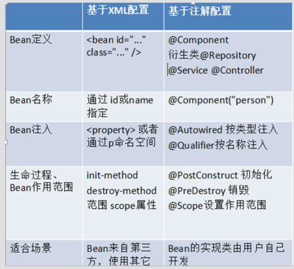
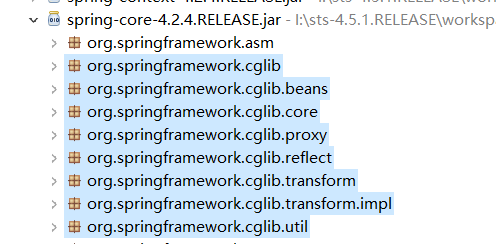
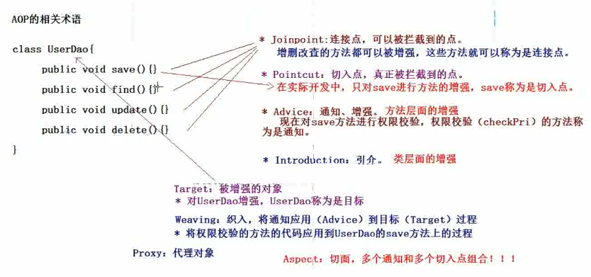
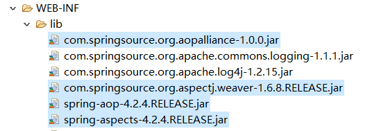
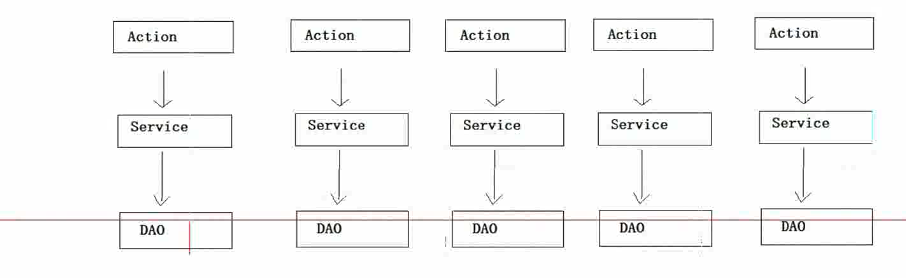

# Spring4_02

<!-- markdownlint-disable MD033 -->
<!-- markdownlint-disable MD007 -->
<!-- markdownlint-disable MD004 -->
<!-- TOC -->

- [Spring4_02](#spring402)
  - [Spring的IOC的注解开发](#spring%e7%9a%84ioc%e7%9a%84%e6%b3%a8%e8%a7%a3%e5%bc%80%e5%8f%91)
    - [Spring的注解入门](#spring%e7%9a%84%e6%b3%a8%e8%a7%a3%e5%85%a5%e9%97%a8)
      - [步骤一：下载Spring开发包](#%e6%ad%a5%e9%aa%a4%e4%b8%80%e4%b8%8b%e8%bd%bdspring%e5%bc%80%e5%8f%91%e5%8c%85)
      - [步骤二：创建web项目，引入jar](#%e6%ad%a5%e9%aa%a4%e4%ba%8c%e5%88%9b%e5%bb%baweb%e9%a1%b9%e7%9b%ae%e5%bc%95%e5%85%a5jar)
      - [步骤三：引入相关配置文件](#%e6%ad%a5%e9%aa%a4%e4%b8%89%e5%bc%95%e5%85%a5%e7%9b%b8%e5%85%b3%e9%85%8d%e7%bd%ae%e6%96%87%e4%bb%b6)
      - [步骤四：编写相关的类](#%e6%ad%a5%e9%aa%a4%e5%9b%9b%e7%bc%96%e5%86%99%e7%9b%b8%e5%85%b3%e7%9a%84%e7%b1%bb)
      - [步骤五：在applicationContext.xml配置扫描注释](#%e6%ad%a5%e9%aa%a4%e4%ba%94%e5%9c%a8applicationcontextxml%e9%85%8d%e7%bd%ae%e6%89%ab%e6%8f%8f%e6%b3%a8%e9%87%8a)
      - [步骤六：在相关的类上添加注解](#%e6%ad%a5%e9%aa%a4%e5%85%ad%e5%9c%a8%e7%9b%b8%e5%85%b3%e7%9a%84%e7%b1%bb%e4%b8%8a%e6%b7%bb%e5%8a%a0%e6%b3%a8%e8%a7%a3)
      - [步骤七：编写测试类](#%e6%ad%a5%e9%aa%a4%e4%b8%83%e7%bc%96%e5%86%99%e6%b5%8b%e8%af%95%e7%b1%bb)
      - [注意：注解方式设置属性的值](#%e6%b3%a8%e6%84%8f%e6%b3%a8%e8%a7%a3%e6%96%b9%e5%bc%8f%e8%ae%be%e7%bd%ae%e5%b1%9e%e6%80%a7%e7%9a%84%e5%80%bc)
    - [Spring的IOC注解的详解](#spring%e7%9a%84ioc%e6%b3%a8%e8%a7%a3%e7%9a%84%e8%af%a6%e8%a7%a3)
      - [@Componenet组件](#componenet%e7%bb%84%e4%bb%b6)
      - [属性注入的注解](#%e5%b1%9e%e6%80%a7%e6%b3%a8%e5%85%a5%e7%9a%84%e6%b3%a8%e8%a7%a3)
      - [Bean的其他的注解](#bean%e7%9a%84%e5%85%b6%e4%bb%96%e7%9a%84%e6%b3%a8%e8%a7%a3)
    - [IOC和XML和注解开发比较](#ioc%e5%92%8cxml%e5%92%8c%e6%b3%a8%e8%a7%a3%e5%bc%80%e5%8f%91%e6%af%94%e8%be%83)
  - [AOP](#aop)
    - [AOP的概述](#aop%e7%9a%84%e6%a6%82%e8%bf%b0)
      - [什么是AOP](#%e4%bb%80%e4%b9%88%e6%98%afaop)
      - [为什么学习AOP](#%e4%b8%ba%e4%bb%80%e4%b9%88%e5%ad%a6%e4%b9%a0aop)
      - [Spring的AOP的由来](#spring%e7%9a%84aop%e7%9a%84%e7%94%b1%e6%9d%a5)
      - [底层实现](#%e5%ba%95%e5%b1%82%e5%ae%9e%e7%8e%b0)
    - [Spring底层AOP的实现原理（了解）](#spring%e5%ba%95%e5%b1%82aop%e7%9a%84%e5%ae%9e%e7%8e%b0%e5%8e%9f%e7%90%86%e4%ba%86%e8%a7%a3)
      - [使用JDK动态代理增强一个类中方法](#%e4%bd%bf%e7%94%a8jdk%e5%8a%a8%e6%80%81%e4%bb%a3%e7%90%86%e5%a2%9e%e5%bc%ba%e4%b8%80%e4%b8%aa%e7%b1%bb%e4%b8%ad%e6%96%b9%e6%b3%95)
      - [Cglib动态代理增强一个类中的方法](#cglib%e5%8a%a8%e6%80%81%e4%bb%a3%e7%90%86%e5%a2%9e%e5%bc%ba%e4%b8%80%e4%b8%aa%e7%b1%bb%e4%b8%ad%e7%9a%84%e6%96%b9%e6%b3%95)
    - [Spring的AOP的开发入门（AspectJ的XML方式）](#spring%e7%9a%84aop%e7%9a%84%e5%bc%80%e5%8f%91%e5%85%a5%e9%97%a8aspectj%e7%9a%84xml%e6%96%b9%e5%bc%8f)
      - [Spring的AOP的简介](#spring%e7%9a%84aop%e7%9a%84%e7%ae%80%e4%bb%8b)
      - [AOP开发的相关术语](#aop%e5%bc%80%e5%8f%91%e7%9a%84%e7%9b%b8%e5%85%b3%e6%9c%af%e8%af%ad)
      - [Spring使用AspectJ进行AOP的开发入门：XML的方式（****）](#spring%e4%bd%bf%e7%94%a8aspectj%e8%bf%9b%e8%a1%8caop%e7%9a%84%e5%bc%80%e5%8f%91%e5%85%a5%e9%97%a8xml%e7%9a%84%e6%96%b9%e5%bc%8f)
        - [引入相应的jar包](#%e5%bc%95%e5%85%a5%e7%9b%b8%e5%ba%94%e7%9a%84jar%e5%8c%85)
        - [引入Spring的配置文件](#%e5%bc%95%e5%85%a5spring%e7%9a%84%e9%85%8d%e7%bd%ae%e6%96%87%e4%bb%b6)
        - [引入Spring集成的单元测试](#%e5%bc%95%e5%85%a5spring%e9%9b%86%e6%88%90%e7%9a%84%e5%8d%95%e5%85%83%e6%b5%8b%e8%af%95)
        - [编写切面](#%e7%bc%96%e5%86%99%e5%88%87%e9%9d%a2)
        - [通过AOP配置实现](#%e9%80%9a%e8%bf%87aop%e9%85%8d%e7%bd%ae%e5%ae%9e%e7%8e%b0)
    - [Spring的AOP通知类型](#spring%e7%9a%84aop%e9%80%9a%e7%9f%a5%e7%b1%bb%e5%9e%8b)
      - [前置通知：在目标方法执行之前进行操作](#%e5%89%8d%e7%bd%ae%e9%80%9a%e7%9f%a5%e5%9c%a8%e7%9b%ae%e6%a0%87%e6%96%b9%e6%b3%95%e6%89%a7%e8%a1%8c%e4%b9%8b%e5%89%8d%e8%bf%9b%e8%a1%8c%e6%93%8d%e4%bd%9c)
      - [后置通知：在目标方法执行之后进行操作](#%e5%90%8e%e7%bd%ae%e9%80%9a%e7%9f%a5%e5%9c%a8%e7%9b%ae%e6%a0%87%e6%96%b9%e6%b3%95%e6%89%a7%e8%a1%8c%e4%b9%8b%e5%90%8e%e8%bf%9b%e8%a1%8c%e6%93%8d%e4%bd%9c)
      - [环绕通知：在目标方法执行之前和之后进行操作](#%e7%8e%af%e7%bb%95%e9%80%9a%e7%9f%a5%e5%9c%a8%e7%9b%ae%e6%a0%87%e6%96%b9%e6%b3%95%e6%89%a7%e8%a1%8c%e4%b9%8b%e5%89%8d%e5%92%8c%e4%b9%8b%e5%90%8e%e8%bf%9b%e8%a1%8c%e6%93%8d%e4%bd%9c)
      - [异常抛出通知：在程序出现异常的时候，进行的操作](#%e5%bc%82%e5%b8%b8%e6%8a%9b%e5%87%ba%e9%80%9a%e7%9f%a5%e5%9c%a8%e7%a8%8b%e5%ba%8f%e5%87%ba%e7%8e%b0%e5%bc%82%e5%b8%b8%e7%9a%84%e6%97%b6%e5%80%99%e8%bf%9b%e8%a1%8c%e7%9a%84%e6%93%8d%e4%bd%9c)
      - [最终通知：无论代码是否有异常，总是会执行](#%e6%9c%80%e7%bb%88%e9%80%9a%e7%9f%a5%e6%97%a0%e8%ae%ba%e4%bb%a3%e7%a0%81%e6%98%af%e5%90%a6%e6%9c%89%e5%bc%82%e5%b8%b8%e6%80%bb%e6%98%af%e4%bc%9a%e6%89%a7%e8%a1%8c)
      - [引介通知（不用会）](#%e5%bc%95%e4%bb%8b%e9%80%9a%e7%9f%a5%e4%b8%8d%e7%94%a8%e4%bc%9a)
    - [Spring切入点表达式](#spring%e5%88%87%e5%85%a5%e7%82%b9%e8%a1%a8%e8%be%be%e5%bc%8f)
    - [AOP在实际开发中的作用](#aop%e5%9c%a8%e5%ae%9e%e9%99%85%e5%bc%80%e5%8f%91%e4%b8%ad%e7%9a%84%e4%bd%9c%e7%94%a8)
  - [总结](#%e6%80%bb%e7%bb%93)

<!-- /TOC -->

## Spring的IOC的注解开发

### Spring的注解入门

#### 步骤一：下载Spring开发包

#### 步骤二：创建web项目，引入jar


* 注意在Spring的注解的AOP需要引入**spring-aop**的jar包

#### 步骤三：引入相关配置文件

* log4j.properties
* applicationContext.xml
* 引入约束：spring-framework-4.2.4.RELEASE-docs.zip\spring-framework-reference\html\xsd-configuration.html

```xml
<?xml version="1.0" encoding="UTF-8"?>
<beans xmlns="http://www.springframework.org/schema/beans"
    xmlns:context="http://www.springframework.org/schema/context"
    xmlns:xsi="http://www.w3.org/2001/XMLSchema-instance"
    xsi:schemaLocation="
        http://www.springframework.org/schema/beans http://www.springframework.org/schema/beans/spring-beans.xsd
        http://www.springframework.org/schema/context http://www.springframework.org/schema/context/spring-context.xsd">

</beans>
```

* 注意，引进context命名空间之后，为了能够提示，需要设置catalog

#### 步骤四：编写相关的类

```java
public interface UserDao {
    public void sayHello();
}

public class UserDaoImpl implements UserDao {

    public void sayHello() {
        System.out.println("Hello Spring...");
    }
}
```

#### 步骤五：在applicationContext.xml配置扫描注释

```xml
<!-- Spring的注解开发：组件扫描（类上注解：可以直接使用属性注入的注解） -->
<context:component-scan
    base-package="com.spring.*"></context:component-scan>
```

#### 步骤六：在相关的类上添加注解

```java

// 相当于<bean id="userDao" class="com.spring.dao.impl.UserDaoImpl"/>
@Component(value = "userDao")
public class UserDaoImpl implements UserDao {

    @Value("张三")
    private String name;

//  public String getName() {
//      return name;
//  }
//
//  public void setName(String name) {
//      this.name = name;
//  }

    public void sayHello() {
        System.out.println("Hello Spring..." + name);
    }
}
```

#### 步骤七：编写测试类

```java
@Test
/**
* Spring的IOC注解的方式
*/
public void test2() {
    ApplicationContext applicationContext = new ClassPathXmlApplicationContext("applicationContext.xml");
    UserDao userDaoImpl = (UserDaoImpl) applicationContext.getBean("userDao");
    userDaoImpl.sayHello();
}
```

#### 注意：注解方式设置属性的值

* 注解方式：使用注解方式，可以没有set方法的
  * 属性如果有set方法，需要将属性注入的注解添加到set方法
  * 属性如果没有set方法，需要将属性注入的注解添加属性上。

### Spring的IOC注解的详解

#### @Componenet组件

* 修饰一个类，将这个类交给Spring管理
* 这个注释有三个衍生注解（功能类似）
  * @Controller ：web层
  * @Service    ：service层
  * @Repository ：dao层

这三个注解是为了让标注类本身的用途清晰，Spring在后续版本会对其加强

#### 属性注入的注解

* 普通属性：
  * @Value          ：设置普通属性的值
* 对象类型属性
  * @Autowired      ：设置对象类型的属性的值，但是按照类型完成属性注入 - 不会因为对象所在当前类的id改变而出错
    * 我们习惯是按照名称完成属性注入；必须让@Autowired注解和@Qualifier一起使用完成按照名称属性
  * @Resource       ：完成对象类型的属性的注入，按照名称完成属性注入

    ```java
    @Service("userService")
    public class UserServiceImpl implements UserService{

        // 注入dao
        @Resource(name="userDao")
        private UserDao userDao;

        public void save() {
            System.out.println("userServiceImpl save");
            userDao.sayHello();
        }
    }
    ```

#### Bean的其他的注解

* 生命周期相关的注解 - 了解（注释到方法上）
  * @PostConstruct  ： 初始化方法
  * @PreDestroy     ： 销毁方法
* Bean作用范围的注解 （注释到类上）
  * <font color='red'>@Scope          ：作用范围
    * singleton     ：默认单例
    * prototype     ：多例</font>
    * request
    * session
    * globalsession

```java
@Service("userService")
@Scope("prototype")
public class UserServiceImpl implements UserService{
  
  // 注入dao
  @Resource(name="userDao")
  private UserDao userDao;
  
  @PostConstruct
  public void save() {
    System.out.println("userServiceImpl save");
    userDao.sayHello();
  }
}
```

### IOC和XML和注解开发比较



* xml和注解：
  * xml：结构清晰
  * 注解：开发方便（属性注入）

* 实际开发还有一种XML和注解整合开发：
  * <font color='red'>Bean有XML配置，但是使用的属性使用注解注入</font>

    ```xml
    <?xml version="1.0" encoding="UTF-8"?>
    <beans xmlns="http://www.springframework.org/schema/beans"
        xmlns:p="http://www.springframework.org/schema/p"
        xmlns:context="http://www.springframework.org/schema/context"
        xmlns:xsi="http://www.w3.org/2001/XMLSchema-instance"
        xsi:schemaLocation="
            http://www.springframework.org/schema/beans http://www.springframework.org/schema/beans/spring-beans.xsd
            http://www.springframework.org/schema/context http://www.springframework.org/schema/context/spring-context.xsd">
        <!-- Spring的注解开发：组件扫描（类上注解：可以直接使用属性注入的注解） -->
        <!--  <context:component-scan
            base-package="com.spring.*"></context:component-scan>-->

        <!-- 没有扫描的情况下，使用属性注入的注解 @Resource、@Value、@Autowired、@Qulifier -->
        <context:annotation-config/>
        <bean id="productDao" class="com.spring.dao.ProductDao"></bean>
        <bean id="orderDao" class="com.spring.dao.OrderDao"></bean>
        <bean id="productService"
            class="com.spring.service.ProductService" />
    </beans>
    ```

## AOP

### AOP的概述

#### 什么是AOP

> 在软件业，AOP为Aspect Oriented Programming的缩写，意为：面向切面编程，通过预编译方式和运行期间动态代理实现程序功能的统一维护的一种技术。AOP是OOP的延续，是软件开发中的一个热点，也是Spring框架中的一个重要内容，是函数式编程的一种衍生范型。利用AOP可以对业务逻辑的各个部分进行隔离，从而使得业务逻辑各部分之间的耦合度降低，提高程序的可重用性，同时提高了开发的效率。

---

> 面向切面编程（AOP是Aspect Oriented Program的首字母缩写） ，我们知道，面向对象的特点是继承、多态和封装。而封装就要求将功能分散到不同的对象中去，这在软件设计中往往称为职责分配。实际上也就是说，让不同的类设计不同的方法。这样代码就分散到一个个的类中去了。这样做的好处是降低了代码的复杂程度，使类可重用。      但是人们也发现，在分散代码的同时，也增加了代码的重复性。什么意思呢？比如说，我们在两个类中，可能都需要在每个方法中做日志。按面向对象的设计方法，我们就必须在两个类的方法中都加入日志的内容。也许他们是完全相同的，但就是因为面向对象的设计让类与类之间无法联系，而不能将这些重复的代码统一起来。    也许有人会说，那好办啊，我们可以将这段代码写在一个独立的类独立的方法里，然后再在这两个类中调用。但是，这样一来，这两个类跟我们上面提到的独立的类就有耦合了，它的改变会影响这两个类。那么，有没有什么办法，能让我们在需要的时候，随意地加入代码呢？这种在运行时，动态地将代码切入到类的指定方法、指定位置上的编程思想就是面向切面的编程。       一般而言，我们管切入到指定类指定方法的代码片段称为切面，而切入到哪些类、哪些方法则叫切入点。有了AOP，我们就可以把几个类共有的代码，抽取到一个切片中，等到需要时再切入对象中去，从而改变其原有的行为。这样看来，AOP其实只是OOP的补充而已。OOP从横向上区分出一个个的类来，而AOP则从纵向上向对象中加入特定的代码。有了AOP，OOP变得立体了。如果加上时间维度，AOP使OOP由原来的二维变为三维了，由平面变成立体了。从技术上来说，AOP基本上是通过代理机制实现的。      AOP在编程历史上可以说是里程碑式的，对OOP编程是一种十分有益的补充。

* Spring是解决实际开发中的一些问题
  * AOP解决OOP中遇到的一些问题，是OOP的延续和扩展。

#### 为什么学习AOP

对程序进行增强；不修改源码的情况下

* AOP可以进行权限校验，日志记录，性能监控，事务控制

#### Spring的AOP的由来

AOP最早由AOP联盟组织提出的，指定一套规范，spring将aop思想引入到框架中，必须遵守aop联盟的规范。

#### 底层实现

代理机制

* Spring的AOP的底层用到两种代理机制：
  * JDK的动态代理：针对实现了接口的类产生代理。
  * Cglib的动态代理：针对没有实现接口的类产生代理，应用的是底层的字节码增强的技术 生成当前类的子类对象

### Spring底层AOP的实现原理（了解）

#### 使用JDK动态代理增强一个类中方法

```java
public class MainTest {
  public static void main(String[] args) {
    People people = new Student();
    InvocationHandler handler = new WorkHandler(people);

    // proxy返回的是代理
    People proxy = (People) Proxy.newProxyInstance(people.getClass().getClassLoader(),
        people.getClass().getInterfaces(), handler);
    // 代理执行方法
    People p = proxy.work("bbb");

    // proxy是代理对象，p是work的返回值
    System.out.println(p == proxy);
  }
}

public class MainTest {
  public static void main(String[] args) {
    People people = new Student();
    InvocationHandler handler = new WorkHandler(people);

    // proxy返回的是代理
    People proxy = (People) Proxy.newProxyInstance(people.getClass().getClassLoader(),
        people.getClass().getInterfaces(), handler);
    // 代理执行方法
    People p = proxy.work("bbb");

    // proxy是代理对象，p是work的返回值
    System.out.println(p == proxy);
  }
}
```

#### Cglib动态代理增强一个类中的方法

> Cglib：第三方开源代码生成类库，动态添加类的属性和方法。



```java
public class CglibProxy implements MethodInterceptor {

  private CustomerDao customerDao;

  public CglibProxy(CustomerDao customerDao) {
    this.customerDao = customerDao;
  }

  public CustomerDao createProxy() {
    // 1.创建Cglib的核心类对象
    Enhancer enhancer = new Enhancer();

    // 2.设置父类
    enhancer.setSuperclass(customerDao.getClass());

    // 3.设置回调：类似于InvocationHandler对象
    enhancer.setCallback(this);

    // 4.创建代理对象
    CustomerDao proxy = (CustomerDao) enhancer.create();
    return proxy;
  }

  public Object intercept(Object prox, Method method, Object[] args, MethodProxy methodProxy) throws Throwable {
    // 判断方法是否为save
    if ("save".equals(method.getName())) {
      // 增强
      System.out.println("数据校验中...");
      return methodProxy.invokeSuper(prox, args);
    }

    // 如果是inovke，那第一个参数是customerDao，因为prox和customer是父子类关系
    // 如果invokesuper，那第一个参数必须是proxy，因为customer没父类
    // return methodProxy.invoke(customerDao, args);
    return methodProxy.invokeSuper(prox, args);
  }
}

@Test
  /**
  * Cglib代理
  */
  public void test7() {
    CustomerDao customerDao = new CustomerDao();
      CustomerDao proxy = new CglibProxy(customerDao).createProxy();
    proxy.save();
    proxy.update();
    proxy.delete();
    proxy.find();
  }
```

### Spring的AOP的开发入门（AspectJ的XML方式）

#### Spring的AOP的简介

* AOP的思想最早是AOP联盟提出的，Spring是使用这种思想最好的一个框架了。
  * Spring的AOP有自己实现的方式 - 非常繁琐，AspectJ是一个AOP的框架，Spring引入了AspectJ作为自身AOP开发。
  * Spring两套AOP开发方式
    * Spring传统方式 - 弃用
    * Spring基于AspectJ的AOP的开发 - 使用

#### AOP开发的相关术语

* JoinPoint（连接点）：所谓连接点是指哪些被拦截到的点。在Spring中，这些点指的是方法，因为Spring支支持方法类型的连接点。
* PointCut（切入点）：所谓切入点是指我们要对哪些JointPoint进行拦截的定义
* Advice（通知/增强）：所谓通知是指拦截到JoinPoint之后所要做的事情就是通知，通知分为前置通知，后置通知，异常通知，最终通知，环绕通知（切面要完成的功能）
* Introduction（引介）：引介是一种特殊的通知在不修改类代码的前提下，Introduction可以在运行期为类动态地添加一些方法或Field
* Target（目标对象）：代理的目标对象
* weaving（织入）：是指把增强应用到目标对象来创建新的代理的过程
* Proxy（代理）：一个类被AOP织入增强后，就产生一个结果代理类
* Aspect（切面）：是切入点和通知（引介）的结合



#### Spring使用AspectJ进行AOP的开发入门：XML的方式（****）

##### 引入相应的jar包

* spring的传统AOP的开发的包
  * spring-aop-4.2.4.RELEASE.jar
  * com.springsource.org.aopalliance-1.0.0.jar （依赖包）

* aspectJ的开发包
  * spring-aspects-4.2.4.RELEASE.jar
  * com.springsource.org.aspectj.weaver-1.6.8.RELEASE.jar



##### 引入Spring的配置文件

```xml
<?xml version="1.0" encoding="UTF-8"?>
<beans xmlns="http://www.springframework.org/schema/beans"
  xmlns:p="http://www.springframework.org/schema/p"
  xmlns:context="http://www.springframework.org/schema/context"
  xmlns:aop="http://www.springframework.org/schema/aop"

  xmlns:xsi="http://www.w3.org/2001/XMLSchema-instance"
  xsi:schemaLocation="
        http://www.springframework.org/schema/beans http://www.springframework.org/schema/beans/spring-beans.xsd
        http://www.springframework.org/schema/context http://www.springframework.org/schema/context/spring-context.xsd
        http://www.springframework.org/schema/aop http://www.springframework.org/schema/aop/spring-aop.xsd">


</beans>
```

##### 引入Spring集成的单元测试

* 引入jar
  * spring-test-4.2.4.RELEASE.jar
* 写代码

  ```java
  @RunWith(SpringJUnit4ClassRunner.class)
  @ContextConfiguration("classpath:applicationContext.xml")
  public class AOPTest {

    @Resource(name = "productDao")
    private ProductDao productDao;

    @Test
    // 要想使用Runwith这个注解要先导入org.junit这个包
    public void test0() {
      productDao.save();
      productDao.update();
      productDao.delete();
      productDao.save();
    }
  }

  public class ProductDaoImpl implements ProductDao {

    public void save() {
      System.out.println("ProductDao的save方法执行了");
    }

    public void update() {
      System.out.println("ProductDao的update方法执行了");
    }

    public String delete() {
      System.out.println("ProductDao的delete方法执行了");
      return "aa";
    }

    public void find() {
      int i = 1 / 0;
      System.out.println("ProductDao的find方法执行了");
    }
  }

  ```

##### 编写切面

* 切面类

  ```java
  public class MyAspectXML {

    /**
    * 前至通知
    *
    * @param joinPoint
    */
    public void checkPri(JoinPoint joinPoint) {
      System.out.println("权限校验..." + joinPoint);
    }

    /**
    * 后置通知
    *
    */
    public void writeLog(Object result) {
      System.out.println("日志记录..." + result);
    }

    /**
    * 环绕通知 性能监控
    *
    * @throws Throwable
    */
    public Object around(ProceedingJoinPoint joinPoint) throws Throwable {
      System.out.println("环绕前通知....");
      Object obj = joinPoint.proceed();
      System.out.println("环绕后通知....");
      return obj;
    }

    /**
    * 抛出异常通知
    */
    public void afterThrowing(Throwable ex) throws Throwable {
      System.out.println("抛出异常通知了..."+ex.getMessage());
    }

    /**
    * 最终通知
    */
    public void after()  {
      System.out.println("最终通知");
    }
  }

  ```

* 将切面交给Spring

  ```xml
  <!-- 将切面交给Spring管理 -->
  <bean id="myAspect" class="com.spring.aspect.MyAspectXML" />
  ```

##### 通过AOP配置实现

  ```xml
  <beans xmlns="http://www.springframework.org/schema/beans"
    xmlns:p="http://www.springframework.org/schema/p"
    xmlns:context="http://www.springframework.org/schema/context"
    xmlns:aop="http://www.springframework.org/schema/aop"

    xmlns:xsi="http://www.w3.org/2001/XMLSchema-instance"
    xsi:schemaLocation="
          http://www.springframework.org/schema/beans http://www.springframework.org/schema/beans/spring-beans.xsd
          http://www.springframework.org/schema/context http://www.springframework.org/schema/context/spring-context.xsd
          http://www.springframework.org/schema/aop http://www.springframework.org/schema/aop/spring-aop.xsd">

    <!-- 配置目标对象：被增强的对象 -->
    <bean id="productDao" class="com.spring.dao.impl.ProductDaoImpl"></bean>

    <!-- 将切面交给Spring管理 -->
    <bean id="myAspect" class="com.spring.aspect.MyAspectXML" />

    <!-- 通过AOP的配置完成对目标类产生代理 -->
    <aop:config>
      <!-- 表达式配置哪些类的哪些方法需要进行增强 -->
      <aop:pointcut
        expression="execution(* com.spring.dao.impl.ProductDaoImpl.save(..))"
        id="pointcut1" />

      <aop:pointcut
        expression="execution(* com.spring.dao.impl.ProductDaoImpl.delete(..))"
        id="pointcut2" />

      <aop:pointcut
        expression="execution(* com.spring.dao.impl.ProductDaoImpl.update(..))"
        id="pointcut3" />

      <aop:pointcut
        expression="execution(* com.spring.dao.impl.ProductDaoImpl.find(..))"
        id="pointcut4" />

      <!-- 配置切面 -->
      <!-- 切面中的谁? 给那个切入点加强? 在前在后还是环绕还是通知还是最终通知? -->
      <aop:aspect ref="myAspect">
        <!-- 前至通知 -->
        <aop:before method="checkPri" pointcut-ref="pointcut1" />

        <!-- 后置通知 -->
        <aop:after-returning method="writeLog"
          pointcut-ref="pointcut2" returning="result" />

        <!-- 环绕通知 -->
        <aop:around method="around" pointcut-ref="pointcut3" />

        <!-- 抛出异常通知 -->
        <aop:after-throwing method="afterThrowing" pointcut-ref="pointcut4" throwing="ex"/>

        <!-- 最终通知 -->
        <aop:after method="after" pointcut-ref="pointcut4"/>
      </aop:aspect>
    </aop:config>
  </beans>
  ```

### Spring的AOP通知类型

#### 前置通知：在目标方法执行之前进行操作

* 前置通知：获得切入点信息

  ```xml
  <!-- 配置切面 -->
  <aop:aspect ref="myAspect">
    <aop:before method="checkPri" pointcut-ref="pointcut1" />
  </aop:aspect>
  ```

#### 后置通知：在目标方法执行之后进行操作

* 后置通知：获得方法的返回值

  ```xml
  <aop:after-returning method="writeLog" pointcut-ref="pointcut2" returning="result" />
  ```

  ```java
  /**
    * 后置通知
    *
    */
  public void writeLog(Object result) {
    System.out.println("日志记录..." + result);
  }
  ```

#### 环绕通知：在目标方法执行之前和之后进行操作

* 环绕通知可以阻止目标方法的执行

  ```xml
  <!-- 环绕通知 -->
  <aop:around method="around" pointcut-ref="pointcut3" /
  ```

  ```java
  /**
    * 环绕通知 性能监控
    *
    * @throws Throwable
    */
  public Object around(ProceedingJoinPoint joinPoint) throws Throwable {
    System.out.println("环绕前通知....");
    Object obj = joinPoint.proceed();
    System.out.println("环绕后通知....");
    return obj;
  }
  ```

#### 异常抛出通知：在程序出现异常的时候，进行的操作

```xml
<!-- 抛出异常通知 -->
<aop:after-throwing method="afterThrowing" pointcut-ref="pointcut4" />
```

#### 最终通知：无论代码是否有异常，总是会执行

```xml
<!-- 最终通知 -->
<aop:after method="after" pointcut-ref="pointcut4"/>
```

#### 引介通知（不用会）

### Spring切入点表达式

```txt
execution(表达式)
表达式:
[方法访问修饰符] 方法返回值 包名.类名.方法名(方法的参数)
public * com.spring.dao.*.*(..)
* * *.*.*.*Dao.save(..)                   - 三层包下以DAO为结尾的类的save方法
* com.spring.dao.*.*(..)                  - dao包下所有类的所有方法
* com.spring.dao.ProductDao+.*(..)        - ProductDao当前类和其子类里所有方法都可以被增强
* com.spring.dao..*.*(..)                 - 包以及子包所有类的所有方法
```

### AOP在实际开发中的作用



## 总结

* Spring的IOC的注解开发
  * Spring的注解入门
    * 步骤一：下载Spring开发包
    * 步骤二：创建web项目，引入jar 以及 引入aop的jar
    * 步骤三：引入相关配置文件以及设置catalog
    * 步骤四：编写相关类
    * 步骤五：在applicationContext.xml配置扫描注释
    * 步骤六：在相关的类上添加注解
    * 步骤七：编写测试类
  * Spring的IOC注解的详解
    * @Componenet组件 - 修饰一个类，将这个类交给Spring管理
      * @Controller
      * @Service
      * @Repository
    * 属性注入的注解
      * 普通属性
        * @Value：设置普通属性的值
      * 对象属性
        * @Autowired+@Qualifier
        * @Resource 常用
    * Bean的其他注解
      * 生命周期相关的注解 - 了解
        * @PostConstruct：初始化方法
        * @PreDestory：销毁方法
      * Bean作用范围的注解
        * @Scope：作用范围
          * singleton：默认单例
          * prototype：多例
          * request
          * session
          * globalsession
  * IOC和XML注解开发比较
    * Bean定义
    * Bean名称
    * Bean注入
    * Bean生命周期
    * 适合场景
    * IOC和XML整合开发
* AOP
  * AOP概述
    * 什么是AOP
    * 为什么学习AOP
    * Spring的AOP的由来
    * 底层实现
      * JDK
      * Cglib
  * Spring的AOP的底层原理
    * 使用JDK动态代理增强一个类中方法 Proxy.newProxyInstance
    * Cglib动态代理增强一个类中的方法 Enhance
  * Spring的AOP的开发入门 Aspect的XML方式
    * Spring的AOP简介
      * Spring开发有自己一套方式 - 繁琐
      * Spring基于AspectJ的AOP开发 - 常用
    * AOP开发的相关术语
      * 连接点 JoinPoint
      * 切入点 PointCut
      * 通知/增强 Advice
      * 引介 Introduction
      * 目标对象 Target
      * weaving 织入
      * Aspect 切面
    * 入门开发
      * 引入jar包
      * 引入Spring的配置文件 - applicationContext
      * 引入Spring集成的单元测试
      * 编写切面类
      * 将切面交给Spring
      * 通过AOP配置实现 - 重点
  * Spring的AOP通知类型
    * 前置通知
    * 后置通知
    * 环绕通知
    * 异常抛出通知
    * 最终通知
    * 引介通知
  * Spring切入点表达式
  * AOP在实际开发中的作用
