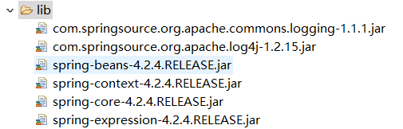

# Spring4_02

## Spring的Bean管理（注解方式）

### 步骤一：下载Spring开发包

### 步骤二：创建web项目，引入jar



* 注意在Spring的注解的AOP需要引入spring-aop的jar包

### 步骤三：引入相关配置文件

* log4j.properties
* applicationContext.xml
* 引入约束：spring-framework-4.2.4.RELEASE-docs.zip\spring-framework-reference\html\xsd-configuration.html

```xml
<?xml version="1.0" encoding="UTF-8"?>
<beans xmlns="http://www.springframework.org/schema/beans"
    xmlns:context="http://www.springframework.org/schema/context"
    xmlns:xsi="http://www.w3.org/2001/XMLSchema-instance"
    xsi:schemaLocation="
        http://www.springframework.org/schema/beans http://www.springframework.org/schema/beans/spring-beans.xsd
        http://www.springframework.org/schema/context http://www.springframework.org/schema/context/spring-context.xsd">

</beans>
```

* 注意，引进context命名空间之后，为了能够提示，需要设置catalog

### 编写相关的类

```java
public interface UserDao {
    public void sayHello();
}

public class UserDaoImpl implements UserDao {

    public void sayHello() {
        System.out.println("Hello Spring...");
    }
}
```
