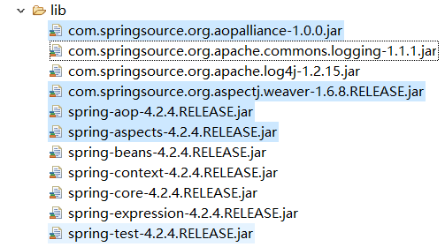
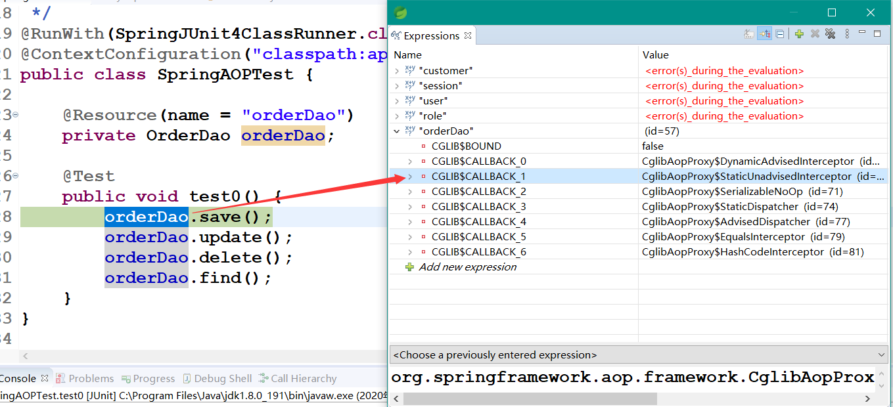
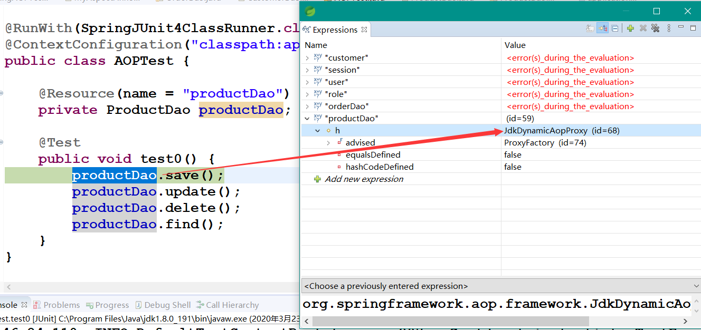
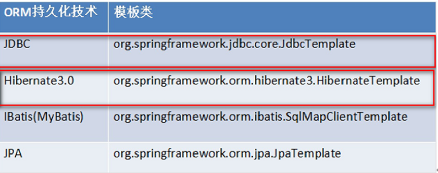
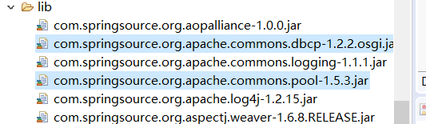
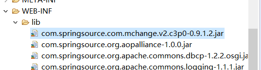

# Spring4_03

<!-- markdownlint-disable MD033 -->
<!-- markdownlint-disable MD007 -->
<!-- markdownlint-disable MD004 -->

## Spring的AOP的基于AspectJ注解开发

### Spring的基于ApectJ的注解的AOP开发

#### 创建项目，引入jar包



#### 引入配置文件

```xml
<?xml version="1.0" encoding="UTF-8"?>
<beans xmlns="http://www.springframework.org/schema/beans"
    xmlns:xsi="http://www.w3.org/2001/XMLSchema-instance"
    xmlns:context="http://www.springframework.org/schema/context"
    xmlns:aop="http://www.springframework.org/schema/aop"
    xmlns:tx="http://www.springframework.org/schema/tx"
    xsi:schemaLocation="http://www.springframework.org/schema/beans
    http://www.springframework.org/schema/beans/spring-beans.xsd
    http://www.springframework.org/schema/context
    http://www.springframework.org/schema/context/spring-context.xsd
    http://www.springframework.org/schema/aop
    http://www.springframework.org/schema/aop/spring-aop.xsd
    http://www.springframework.org/schema/tx
    http://www.springframework.org/schema/tx/spring-tx.xsd">
</beans>
```

#### 编写目标类并配置

* 目标类

    ```java
    public class OrderDaoImpl implements OrderDao {

        public void save() {
            System.out.println("保存订单");
        }

        public void update() {
            System.out.println("更新订单");
        }

        public void delete() {
            System.out.println("删除订单");
        }

        public void find() {
            System.out.println("查找订单");
        }
    }
    ```

* 配置

    ```xml
    <bean id="orderDao" class="com.spring.dao.impl.OrderDaoImpl" />
    ```

#### 编写切面类并配置

* 切面类

    ```java
    public class MyAspectAnno {
        public void before() {
            System.out.println("---前置增强---");
        }
    }
    ```

* 配置

    ```xml
    <bean id="myAspectAnno" class="com.spring.aspect.MyAspectAnno"></bean>
    ```

#### 使用注解的AOP对象目标类进行增强

* 在配置文件中打开注解的AOP开发

    ```xml
    <!-- 在配置文件中开启注解的AOP的开发 -->
    <aop:aspectj-autoproxy />
    ```

* 在切面类上使用注解

    ```java
    @Aspect
    public class MyAspectAnno {

        @Before(value = "execution(* com.spring.dao.impl.OrderDaoImpl.save(..))")
        public void before() {
            System.out.println("---前置增强---");
        }
    }
    ```

#### 编写测试类

```java
/**
* Spring的AOP的注解项目
*
* @author Administrator
* RunWith在org.junit的包里面
* 需要导入Junit4这个包再进行注解
*/
@RunWith(SpringJUnit4ClassRunner.class)
@ContextConfiguration("classpath:applicationContext.xml")
public class SpringAOPTest {

    @Resource(name = "orderDao")
    private OrderDao orderDao;

    @Test
    public void test0() {
        orderDao.save();
        orderDao.update();
        orderDao.delete();
        orderDao.find();
    }
}
```

### Spring的注解的AOP的通知类型

#### @Before：前置通知

```java
@Before(value = "execution(* com.spring.dao.impl.OrderDaoImpl.save(..))")
public void before() {
    System.out.println("---前置增强---");
}
```

#### @AfterReturning：后置通知

```java

// 需要com.spring.dao.impl.OrderDaoImpl.delete方法，让其返回String
public String delete() {
    System.out.println("删除订单");
    return "已经删除";
}

// ----

// 后置通知会接收执行的delete方法返回地result对象
@AfterReturning(value = "execution(* com.spring.dao.impl.OrderDaoImpl.delete(..))", returning = "result")
public void afterReturning(Object result) {
    System.out.println("---后置增强：" + result + "---");
}
```

#### @Around：环绕通知

```java
// 环绕通知
@Around(value = "execution(* com.spring.dao.impl.OrderDaoImpl.update(..))")
public Object around(ProceedingJoinPoint joinPoint) throws Throwable {
    System.out.println("---环绕前通知");
    Object obj = joinPoint.proceed();
    System.out.println("---环绕后通知");
    return obj;
}
```

#### @AfterThrowing：抛出异常通知

```java
// 异常抛出通知
@AfterThrowing(value = "execution(* com.spring.dao.impl.OrderDaoImpl.find(..))", throwing = "e")
public void afterThrowing(Throwable e) throws Throwable {
    System.out.println("---异常抛出增强" + e.getMessage() + "---");
}
```

#### 最终通知

```java
// 最终通知
@After(value = "execution(* com.spring.dao.impl.OrderDaoImpl.find(..))")
public void after(){
    System.out.println("最终增强");
}
```

### Spring的注解的AOP的切入点的配置

#### Spring的AOP的注解切入点的配置

```java
@Aspect
public class MyAspectAnno {

    @Before(value = "MyAspectAnno.savePoint()")
    public void before() {
        System.out.println("---前置增强---");
    }

    // 后置通知会接收执行的delete方法返回地result对象
    @AfterReturning(value = "MyAspectAnno.deletePoint()", returning = "result")
    public void afterReturning(Object result) {
        System.out.println("---后置增强：" + result + "---");
    }

    // 环绕通知
    @Around(value = "MyAspectAnno.updatePoint()")
    public Object around(ProceedingJoinPoint joinPoint) throws Throwable {
        System.out.println("---环绕前增强---");
        Object obj = joinPoint.proceed();
        System.out.println("---环绕后增强---");
        return obj;
    }

    // 异常抛出通知
    @AfterThrowing(value = "MyAspectAnno.findPoint()", throwing = "e")
    public void afterThrowing(Throwable e) throws Throwable {
        System.out.println("---异常抛出增强" + e.getMessage() + "---");
    }

    // 最终通知
    @After(value = "MyAspectAnno.findPoint()")
    public void after() {
        System.out.println("最终增强");
    }

    @Pointcut(value = "execution(* com.spring.dao.impl.OrderDaoImpl.find(..))")
    public void findPoint() {
    }

    @Pointcut(value = "execution(* com.spring.dao.impl.OrderDaoImpl.save(..))")
    public void savePoint() {
    }

    @Pointcut(value = "execution(* com.spring.dao.impl.OrderDaoImpl.update(..))")
    public void updatePoint() {
    }

    @Pointcut(value = "execution(* com.spring.dao.impl.OrderDaoImpl.delete(..))")
    public void deletePoint() {
    }
}
```

### 补充查看cglib和jdkproxy调试

* 未实现接口

    ```java
    public class OrderDao {

        public void save() {
            System.out.println("保存订单");
        }

        public void update() {
            System.out.println("更新订单");
        }

        public String delete() {
            System.out.println("删除订单");
            return "已经删除";
        }

        public void find() {
            System.out.println("查找订单");
            int i = 1 / 0;
        }
    }
    ```

    ```java
    @RunWith(SpringJUnit4ClassRunner.class)
    @ContextConfiguration("classpath:applicationContext.xml")
    public class SpringAOPTest {

        @Resource(name = "orderDao")
        private OrderDao orderDao;

        @Test
        public void test0() {
            orderDao.save();
            orderDao.update();
            orderDao.delete();
            orderDao.find();
        }
    }
    ```

    

* 实现接口

    ```java
    public class ProductDaoImpl implements ProductDao {

        public void save() {
            System.out.println("ProductDao的save方法执行了");
        }

        public void update() {
            System.out.println("ProductDao的update方法执行了");
        }

        public String delete() {
            System.out.println("ProductDao的delete方法执行了");
            return "aa";
        }

        public void find() {
            int i = 1 / 0;
            System.out.println("ProductDao的find方法执行了");
        }
    }
    ``` 

    ```java
    @RunWith(SpringJUnit4ClassRunner.class)
    @ContextConfiguration("classpath:applicationContext.xml")
    public class AOPTest {

        @Resource(name = "productDao")
        private ProductDao productDao;

        @Test
        public void test0() {
            productDao.save();
            productDao.update();
            productDao.delete();
            productDao.find();
        }
    }
    ```

    

## Spring的JDBC的模板的使用

### Spring的JDBC模板

Spring是EE开发的一站式的框架，有EE开发的每层的解决方案，Spring对持久层也提供了解决方案：ORM模块和<font color='red'>JDBC模板</font>
Spring提供了很多的模板用于简化开发



#### JDBC模板使用的入门

* 创建项目，引入jar包
  * 引入基本开发包：
  * 数据库驱动
  * Spring的JDBC模板的jar包

#### 创建数据库和表

```sql
create database spring4_day03;
use spring4_day03;
create table account(
    id int primary key auto_increment,
    name varchar(20),
    money double
);
```

#### 使用JDBC模板：保存数据

```java
public class JDBCTemplateTest {

    @Test
    // jdbc模板的使用类似与DBUtils.
    public void test0() {
        DriverManagerDataSource dataSource = new DriverManagerDataSource();
        dataSource.setDriverClassName("com.mysql.jdbc.Driver");
        dataSource.setUrl("jdbc:mysql://localhost/spring4_day03?serverTimezone=Asia/Shanghai");
        dataSource.setUsername("root");
        dataSource.setPassword("******");

        // 创建jdbc模板
        JdbcTemplate jdbcTemplate = new JdbcTemplate(dataSource);
        jdbcTemplate.update("insert into account values(null,?,?)", "张三", 10000d);
    }
}

```

### 将连接池和模板交给Spring管理

#### 引入Spring的配置文件

```xml
<!-- 配置需要增强的类 -->
<bean id="orderDao" class="com.spring.dao.OrderDao" />
<!-- 配置切面类 -->
<bean id="myAspectAnno" class="com.spring.aspect.MyAspectAnno"></bean>

<!-- 配置Spring的内置连接池 -->
<bean id="dataSource" class="org.springframework.jdbc.datasource.DriverManagerDataSource">
    <!-- 属性注入 -->
    <property name="driverClassName" value="com.mysql.jdbc.Driver"></property>
    <property name="url" value="jdbc:mysql://localhost/spring4_day03?serverTimezone=Asia/Shanghai"></property>
    <property name="username" value="root"></property>
    <property name="password" value="******"></property>
</bean>

<!-- 配置Spring的jdbc的模板 -->
<bean id="jdbcTemplate" class="org.springframework.jdbc.core.JdbcTemplate">
    <property name="dataSource" ref="dataSource"></property>
</bean>
```

#### 使用JDBC模板

* 需要引入spring_aop的jar包

```java
@RunWith(SpringJUnit4ClassRunner.class)
@ContextConfiguration("classpath:applicationContext.xml")
public class JDBCTemplateTest {

    @Resource(name = "jdbcTemplate")
    private JdbcTemplate jdbcTemplate;

    @Test
    public void test1() {
        jdbcTemplate.update("insert into account values(null,?,?)", "李四", 10000d);
    }
}
```

### 使用开源的数据库连接

#### DBCP的使用

* 引入jar包
    

* 配置DBCP连接池

    ```xml
    <!-- 配置DBCP连接池 -->
    <bean id="dataSource"
        class="org.apache.commons.dbcp.BasicDataSource">
        <!-- 属性注入 -->
        <property name="driverClassName" value="com.mysql.jdbc.Driver"></property>
        <property name="url" value="jdbc:mysql://localhost/spring4_day03?serverTimezone=Asia/Shanghai"></property>
        <property name="username" value="root"></property>
        <property name="password" value="******"></property>
    </bean>

    <!-- 配置Spring的jdbc的模板 -->
    <bean id="jdbcTemplate" class="org.springframework.jdbc.core.JdbcTemplate">
        <property name="dataSource" ref="dataSource"></property>
    </bean>
    ```

#### CP30的使用

* 引入c3p0的连接池jar包
    

* 配置cp30连接池

    ```xml
    <!-- 配置c3p0连接池 -->
    <bean id="dataSource"
        class="com.mchange.v2.c3p0.ComboPooledDataSource">
        <!-- 属性注入 -->
        <property name="driverClass" value="com.mysql.jdbc.Driver"></property>
        <property name="jdbcUrl"
            value="jdbc:mysql://localhost/spring4_day03?serverTimezone=Asia/Shanghai"></property>
        <property name="user" value="root"></property>
        <property name="password" value="******"></property>
    </bean>

    <!-- 配置Spring的jdbc的模板 -->
    <bean id="jdbcTemplate"
        class="org.springframework.jdbc.core.JdbcTemplate">
        <property name="dataSource" ref="dataSource"></property>
    </bean>
    ```

### 抽取配置到属性文件

#### 定义一个属性文件

* 第一种

```xml
<!-- 第一种方式通过一个bean标签引入的（很少） -->
<bean class="org.springframework.beans.factory.config.PropertyPlaceholderConfigurer">
    <property name="location" value="classpath:jdbc.properties" />
</bean>
```

* 第二种

```xml
<!-- 第二种方式通过context标签引入的 -->
<context:property-placeholder location="classpath:jdbc.properties" />
```

#### 引入属性文件的值

```xml
<!-- 配置c3p0连接池 -->
<bean id="dataSource"
    class="com.mchange.v2.c3p0.ComboPooledDataSource">
    <!-- 属性注入 -->
    <property name="driverClass" value="${jdbc.driverClass}"></property>
    <property name="jdbcUrl" value="${jdbc.url}"></property>
    <property name="user" value="${jdbc.username}"></property>
    <property name="password" value="${jdbc.password}"></property>
</bean>
```

#### 测试

```java
@Test
public void test1() {
    jdbcTemplate.update("insert into account values(null,?,?)", "bb", 10000d);
}
```

### 使用JDBC的模板完成CRUD的操作

#### 保存操作

```java
@Test
public void test1() {
    jdbcTemplate.update("insert into account values(null,?,?)", "bb", 10000d);
}
```

#### 修改操作

```java
@Test
public void test2() {
    jdbcTemplate.update("update account set name=?,money=? where id=?", "李东", 20000d, 6);
}
```

#### 删除操作

```java
@Test
public void test3() {
    jdbcTemplate.update("delete from account where id=?", 6);
}
```

#### 查询操作

* 查询某个属性

    ```java
    @Test
    // 查询操作
    public void test4() {
        String name = jdbcTemplate.queryForObject("select name from account where id =?", String.class, 5);
        System.out.println(name);
    }

    @Test
    // 统计查询
    public void test5() {
        Long count = jdbcTemplate.queryForObject("select count(*) from account", Long.class);
        System.out.println(count);
    }
    ```

* 查询返回对象或集合

    ```java
    @Test
    // 封装到一个对象
    public void test6() {
        Account account = jdbcTemplate.queryForObject("select * from account where id=?", new MyRowMapper(), 5);
        System.out.println(account);
    }

    @Test
    // 查询多条记录
    public void test7() {
        List<Account> list = jdbcTemplate.query("select * from account", new MyRowMapper());
        for (Account account : list) {
            System.out.println(account);
        }
    }
    ```

* 数据封装

    ```java
    class MyRowMapper implements RowMapper<Account> {

        public Account mapRow(ResultSet rs, int rowNum) throws SQLException {
            Account account = new Account();
            account.setId(rs.getInt("id"));
            account.setName(rs.getString("name"));
            account.setMoney(rs.getDouble("money"));
            return account;
        }
    }
    ```

## Spring的事务管理

### 事务的回顾

#### 什么是事务

* 事务：逻辑上的一组操作，组成这组操作的各个单元，要么全都成功，要么全都失败。

#### 事务的特性

* 原子性：事务不可分割
* 一致性：事务执行前后数据完整性保持一致
* 隔离性：一个事务的执行不应该受到其他事务干扰
* 持久性：一旦事务结束，数据就应该持久化到数据库

#### 如果不考虑隔离性引发安全性问题

* 读问题
  * 脏读    ：一个事务读到另一个事务未提交的数据
  * 不可重复读：一个事务读到另一个事务已经提交的update的数据，导致一个事务中多次查询结果不一致
  * 虚度、幻读：一个事务读到另一个事务已经提交的inset的数据，导致一个事务中多次查询结果不一致
* 写问题
  * 丢失更新

#### 解决读问题

* 设置事务的隔离级别
  * Read Uncommitted：未提交读，任何读问题解决不了。
  * Read commited   ：已提交读，解决脏读，但是不可重复读和虚读有可能发生
  * Repeatable read ：重复读，解决脏读和不可重复读，但是虚度有可能发生
  * Serializable    ：解决所有问题

### Spring的事务管理的API

#### PlatformTransactionManager：平台事务管理器

* 平台事务管理器：接口，是Spring用于管理事务的真正的对象。
  * DataSourceTransactionManager：底层使用JDBC管理事务
  * HibernateTransactionManager ：底层使用Hibernate管理事务

#### TransactionDefinition：事务定义信息

* 事务定义：用于定义事务的相关的信息，隔离级别、超时信息、传播行为、是否只读

#### TransactionStatus：事务的状态

* 事务状态：用于记录在事务管理过程中，事务的状态的对象.

#### 事务管理的API的关系

Spring进行事务管理的时候,首先<font color='red'>平台事务管理器</font>根据事务定义信息进行事务的管理，在事务管理过程中，产生各种状态，将这些状态的信息记录到事务状态的对象中。

### Spring的事务的传播行为

#### Spring的传播行为

* Spring中提供了七种事务的传播 - propagation 行为：
  * 保证多个操作在同一个事务中
    * PROPAGATION_REQUIRED      ：默认值，如果A中有事务，使用A的事务，如果A没有，创建一个新的事务，将操作包含进来
    * PROPAGATION_SUPPORTS      ：支持事务，如果A中有事务，使用A中的事务。如果A没有事务，不使用事务。
    * PROPAGATION_MANDATORY     ：如果A中有事务，使用A中的事务。如果A没有事务，抛出异常。

* 保证多个操作不在同一个事务中
  * PROPAGATION_REQUIRES_NEW    ：如果A中有事务，将A的事务挂起（暂停），创建新事物，只包含自身操作，如果A中没有事务，创建一个新事务，包含自身操作。
  * PROPAGATION_NOT_SUPPORTED   ：如果A中有事务，将A的事务挂起，不使用事务管理
  * PROPAGATION_NEVER           ：如果A有事务，报异常。

* 嵌套式事务
  * PROPAGATION_NESTED          ：嵌套事务，如果A中有事务，按照A的事务执行，执行完后，设置一个保存点，执行B中的操作，如果没有异常，执行通过，如果有异常，可以选择回滚到最初始位置，也可以回滚到保存点。

### Spring的事务管理入门

#### 搭建Spring的事务管理的环境

* 创建service的接口和实现类

    ```java
    public class AccountServiceImpl implements AccountService{

        // 注入dao
        private AccountDao accountDao;

        public void setAccountDao(AccountDao accountDao) {
            this.accountDao = accountDao;
        }

        public void transfer(String from,String to,Double money) {
            accountDao.outMoney(from, money);
            accountDao.inMoney(to, money);
        }
    }
    ```

* 创建DAO的接口和实现类

    ```java
    public class AccountDaoImpl extends JdbcDaoSupport implements AccountDao {

        public void outMoney(String from, Double money) {
            this.getJdbcTemplate().update("update account set money=money-? where name=?", money, from);
        }

        public void inMoney(String to, Double money) {
            this.getJdbcTemplate().update("update account set money=money+? where name=?", money, to);
        }
    }
    ```

* 配置Service和Dao：交给Spring管理

    ```xml
    <!-- 配置dao -->
    <bean id="accountDao" class="com.spring.dao.impl.AccountDaoImpl">
        <property name="dataSource" ref="dataSource"></property>
    </bean>

    <!-- 配置service -->
    <bean id="accountService"
        class="com.spring.service.impl.AccountServiceImpl">
        <property name="accountDao" ref="accountDao"></property>
    </bean>
    ```

* 在DAO中编写扣钱和加钱方法
  * 配置连接池和JDBC模板

    ```xml
    <!-- 第二种方式通过context标签引入的 -->
    <context:property-placeholder
        location="classpath:jdbc.properties" />
    <!-- 配置c3p0连接池 -->
    <bean id="dataSource"
        class="com.mchange.v2.c3p0.ComboPooledDataSource">
        <!-- 属性注入 -->
        <property name="driverClass" value="${jdbc.driverClass}"></property>
        <property name="jdbcUrl" value="${jdbc.url}"></property>
        <property name="user" value="${jdbc.username}"></property>
        <property name="password" value="${jdbc.password}"></property>
    </bean>
    ```

  * 在Dao注入jdbc的模板：

    ```xml
    <!-- 配置dao -->
    <bean id="accountDao" class="com.spring.dao.impl.AccountDaoImpl">
        <property name="dataSource" ref="dataSource"></property>
    </bean>
    ```

* 测试

    ```java
    @Test
    // 转账
    public void test8() {
        accountServiceImpl.transfer("aa", "bb", 2000d);
    }
    ```

#### Spring的事务管理：一类：编程式事务（需要手动编写代码） - 了解

##### 第一步：配置平台事务管理器

```xml
<!-- 配置平台事务管理器 -->
<bean id="transactionManager"
    class="org.springframework.jdbc.datasource.DataSourceTransactionManager">
    <property name="dataSource" ref="dataSource"></property>
</bean>
```

##### 第二步：Spring提供了事务管理的模板类

* 配置事务的管理的模板类

    ```xml
    <!-- 配置事务管理的模板 -->
    <bean id="transactionTemplate"
        class="org.springframework.transaction.support.TransactionTemplate">
        <property name="transactionManager" ref="transactionManager"></property>
    </bean>
    ```

##### 第三步，在业务层注入事务管理的模板

```xml
<!-- 配置service -->
<bean id="accountService" class="com.spring.service.impl.AccountServiceImpl">
    <property name="accountDao" ref="accountDao"></property>
    <!-- 注入 事务管理的模板 -->
    <property name="transactionTemplate" ref="transactionTemplate"></property>
</bean>
```

##### 编写事务管理的代码

```java
public void transfer(final String from, final String to, final Double money) {
    transactionTemplate.execute(new TransactionCallbackWithoutResult() {

        @Override
        protected void doInTransactionWithoutResult(TransactionStatus arg0) {
            accountDao.outMoney(from, money);
            int i=1/0;
            accountDao.inMoney(to, money);
        }
    });
}
```

* 注意，数据库要使用InnoDB的数据库引擎，否则事务不生效

#### Spring的事务管理：二类：声明式事务管理（通过配置实现） --AOP

##### XML方式的声明式事务的管理

* 第一步：引入aop的开发包
* 第二步：恢复转账环境
* 第三步：配置事务管理器

    ```xml
    <bean id="transactionManager"
            class="org.springframework.jdbc.datasource.DataSourceTransactionManager">
            <property name="dataSource" ref="dataSource"></property>
    </bean>
    ```

* 第四步：配置增强

    ```xml
    <tx:advice id="txAdvice"
        transaction-manager="transactionManager">
        <tx:attributes>
            <!-- 事务管理的规则 -->

            <!-- <tx:method name="save*" propagation="REQUIRED" isolation="DEFAULT"/>
            <tx:method name="update*" propagation="REQUIRED"/>
            <tx:method name="delete*" propagation="REQUIRED"/>
            <tx:method name="find*" read-only="true"/> -->

            <tx:method name="*" propagation="REQUIRED" />
        </tx:attributes>
    </tx:advice>
    ```

* 第五步：aop的配置

    ```xml
    <!-- aop的配置 -->
    <aop:config>
        <aop:pointcut
            expression="execution(* com.spring.service.impl.AccountServiceImpl.*(..))"
            id="pointcut1" />
        <aop:advisor advice-ref="txAdvice"
            pointcut-ref="pointcut1" />
    </aop:config>
    ```

* 测试
* <font color='red'>注意！</font>

    ```java
    org.springframework.beans.factory.BeanCreationException: Error creating bean with name 'com.spring.test.JDBCTemplateTest': Injection of resource dependencies failed; nested exception is org.springframework.beans.factory.BeanNotOfRequiredTypeException: Bean named 'accountService' must be of type [com.spring.service.impl.AccountServiceImpl], but was actually of type [com.sun.proxy.$Proxy22]

    Caused by: org.springframework.beans.factory.BeanNotOfRequiredTypeException: Bean named 'accountService' must be of type [com.spring.service.impl.AccountServiceImpl], but was actually of type [com.sun.proxy.$Proxy22]

    在aop做配置加强的时候，如果加强某方法所在的类有继承的接口，那么就是用jdk动态代理，创建出来的代理对象和加强某类不是一种类型，但是都是属于同样的接口，所以在这里需要声明接口来实例化。

    @RunWith(SpringJUnit4ClassRunner.class)
    @ContextConfiguration("classpath:applicationContext.xml")
    public class JDBCTemplateTest {

        @Resource(name = "jdbcTemplate")
        private JdbcTemplate jdbcTemplate;

        @Resource(name = "accountService")
        private AccountService accountServiceImpl;
        // 这里的AccountServiceImpl类其实就是一个AccountService的实现类，要加强AccountServiceImpl，Spring底层使用动态代理
        // 通过动态代理所创建的类对象的类型和AccountServiceImpl类不一样，所以强行注入会报错
        // 但是两个类都属于接口的实现类，所以要实例化accountServiceImpl这个对象，只能声明接口。
    ```

#### 注解方式的声明式事务管理

* 第一步：引入aop开发包
* 第二步：恢复转账环境
* 第三步：配置事务管理器

    ```xml
    <!-- 配置平台事务管理器 -->
    <bean id="transactionManager"
        class="org.springframework.jdbc.datasource.DataSourceTransactionManager">
        <property name="dataSource" ref="dataSource"></property>
    </bean>
    ```

* 第四步：开启注释事务

    ```xml
    <!-- 开启注释事务 -->
    <tx:annotation-driven transaction-manager="transactionManager" />
    ```

* 第五步：在业务层添加注解

    ```java
    @Transactional
    public class AccountServiceImpl implements AccountService {
    ```

## 总结

* Spring的AOP基于AspectJ注解开发
  * 注解开发入门
    * 创建项目，引入jar包
    * 引入配置文件
    * 编写目标类并配置
    * 编写切面类并配置
    * 使用注解的AOP对象目标类进行增强
      * 在配置文件中打开注解的AOP开发
      * 在切面类上使用注解
    * 编写测试类
  * Spring的注解的AOP的通知类型
    * @Before           ：前置通知
    * @AfterReturning   ：后置通知
    * @Around           ：环绕通知
    * @AfterThrowing    ：抛出异常通知
    * @After            ：最终通知
  * Spring的注解的AOP的切入点的配置
  * 补充查看cglib和jdkProxy
    * 未实现接口 - cglib
    * 已实现接口 - proxy
* jdbc模板的使用
  * 什么是spring的jdbc模板
    * spring提供了持久层的解决方案，orm模板和jdbc模板，spring提供了很多模板简化开发
  * jdbc模板使用的入门
    * 创建项目，引入jar
      * 数据库驱动
      * 基本开发包
      * spring的jdbc模板的jar包
    * 创建数据库和表
    * 使用jdbc模板，保存数据
  * 将连接池模板交给Spring管理
    * 引入Spring的配置文件
    * 使用jdbc模板
    * 使用开源的数据库连接
      * DBCP
      * CP30
  * 抽取配置到属性文件
    * 定义一个属性文件并导入
      * 通过bean
      * 通过context标签
    * 引入属性文件的值
    * 测试
  * 使用JDBC的模板完成CRUD的操作 - 与dbutils类似
    * 保存操作
    * 修改操作
    * 删除操作
    * 查询操作
* Spring的事务管理
  * 事务的回顾
    * 什么是事务
    * 事务的特性 acid
    * 如果不考虑隔离性引发的安全性问题
      * 读
        * 脏读
        * 不可重复读
        * 虚度、幻读
      * 写
        * 丢失更新
    * 解决读问题
      * 设置事务的隔离级别
  * spring事务管理的API
    * PlatformTransactionManager - 平台事务管理器
    * TransactionDefinition - 事务定义信息
    * TransactionStatus - 事务的状态
  * 事务管理的API的关系
    * spring进行事务管理，首先平台事务管理器根据事务定义信息进行事务管理，在事务管理过程，产生各种状态，将这些状态的信息记录到事务状态的对象中
  * Spring的传播行为
    * 七种
      * 保证多个操作在同一个事务
      * 保证多个操作不在同一个事务
      * 嵌套式事务
  * Spring的事务管理入门
    * 搭建spring事务管理的环境
      * 创建service的接口和实现类
      * 创建dao的接口和实现类，这里继承JdbcDaoSupport
      * 配置service和dao，交给Spring管理
      * 配置连接池并且注入dao中，dao的父类会自动生成一个jdbcTemplate
      * 测试
    * Spring的事务管理
      * 编程式事务（需要手写代码） - 了解
        * 第一步配置平台事务管理器，并注入datasource
        * 配置事务管理的模板类
        * 在业务层service中注入事务管理的模板
        * 编写事务管理的代码 - 注意数据库是否支持事务
      * 声明式事务管理 - aop
        * XML方式
          * 引入aop开发包
          * 恢复转账环境
          * 配置事务管理器
          * 配置增强
          * aop的配置
        * 注解方式
          * 引入aop开发包
          * 恢复转账环境
          * 配置事务管理器
          * 开始注释事务
          * 在业务层添加事务
