# Spring_day04

<!-- markdownlint-disable MD033 -->
<!-- markdownlint-disable MD007 -->
<!-- markdownlint-disable MD004 -->

## SSH整合方式一：无障碍整合

### SSH框架回顾


### SSH整合

#### 第一步：创建web项目，引入jar包

* Struts2的jar包
  * struts-2.3.24\apps\struts2-blank\WEB-INF\lib\*.jar
  * struts2中有一些包需要了解的：
    * struts2-convention-plugin-2.3.24.jar  struts2的注解开发包
    * struts2-json-plugin-2.3.24.jar        struts2的整合ajax的开发包
    * struts2-spring-plugin-2.3.24.jar      struts2的整合spring的开发包
* Hibernate的jar包
  * Hibernate的开发的必须的包
    * hibernate-release-5.0.7.Final\lib\required\*.jar
    * 日志记录
    * 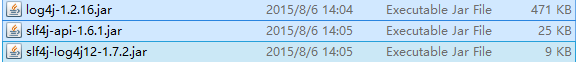
    * 使用C3P0连接池
    * 
    * <font color='red'>注意，struts2和hibernate都引入了一个相同的jar包（javassist包）删除一个即可</font>
* Spring的jar包

    ```txt
    ---IOC的开发---
    .
    ├── com.springsource.org.apache.commons.logging-1.1.1.jar
    ├── com.springsource.org.apache.log4j-1.2.15.jar
    ├── spring-beans-4.2.4.RELEASE.jar
    ├── spring-context-4.2.4.RELEASE.jar
    ├── spring-core-4.2.4.RELEASE.jar
    └── spring-expression-4.2.4.RELEASE.jar

    ---AOP的开发---
    .
    ├── com.springsource.org.aopalliance-1.0.0.jar
    ├── com.springsource.org.aspectj.weaver-1.6.8.RELEASE.jar
    ├── spring-aop-4.2.4.RELEASE.jar
    └── spring-aspects-4.2.4.RELEASE.jar

    ---JDBC模板的开发---
    spring-jdbc-4.2.4.RELEASE.jar
    spring-tx-4.2.4.RELEASE.jar

    ---事务管理---
    spring-tx-4.2.4.RELEASE.jar

    ---整合web项目开发---
    spring-web-4.2.4.RELEASE.jar

    ---整合单元测试的开发---
    spring-test-4.2.4.RELEASE.jar

    ---整合hibernate的开发---
    spring-orm-4.2.4.RELEASE.jar
    ```

#### 第二步：引入配置文件

* struts的配置文件
  * web.xml

    ```xml
    <!-- 配置Struts前端过滤器 -->
    <filter>
        <filter-name>struts2</filter-name>
        <filter-class>org.apache.struts2.dispatcher.ng.filter.StrutsPrepareAndExecuteFilter</filter-class>
    </filter>

    <filter-mapping>
        <filter-name>struts2</filter-name>
        <url-pattern>/*</url-pattern>
    </filter-mapping>
    ```

    * struts.xml
* Hibernate的配置文件
  * hibernate.cfg.xml
    * 删除那个与线程绑定的session
  * 映射文件
* Spring的配置文件
  * web.xml

    ```xml
    <!-- 配置Spring的核心监听器 -->
    <listener>
        <listener-class>org.springframework.web.context.ContextLoaderListener</listener-class>
    </listener>

    <context-param>
        <param-name>contextConfigLocation</param-name>
        <param-value>classpath:application.xml</param-value>
    </context-param>
    ```

    * applicationContext.xml
    * 日志记录
      * log4j.properties

#### 第三步：创建包结构

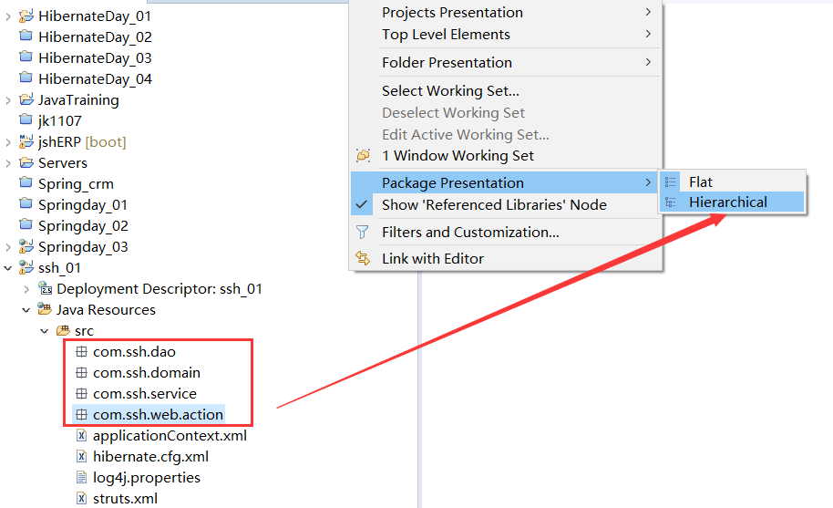

#### 第四步：创建相关类

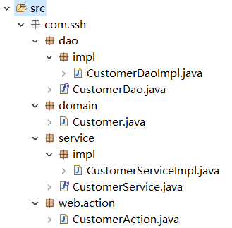

#### 第五步：引入相关的页面

```html
<TD class=menuSmall><A class=style2 href="${ pageContext.request.contextPath }/jsp/customer//add.jsp" target=main>－ 新增客户</A></TD>
```

#### 第六步：修改add.jsp

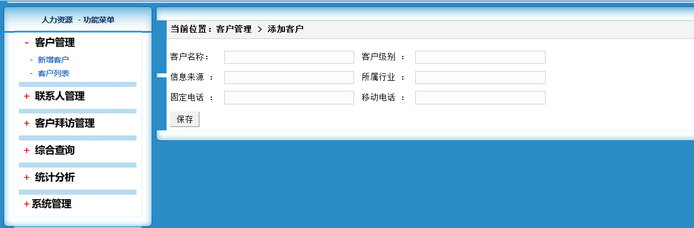

#### 第七步：Spring整合Struts2方式一：Action由Struts2自身创建的

* 编写Action

    ```java
    /**
    * 客户管理的Action的类
    * 
    * @author Administrator
    */
    public class CustomerAction extends ActionSupport implements ModelDriven<Customer> {

        // 模型驱动的对象
        private Customer customer = new Customer();

        public Customer getModel() {
            return customer;
        }

        public String save() {
            System.out.println("Action中的save方法执行了");
            return NONE;
        }
    }
    ```

* 配置Action

  * 在struts.xml中配置

    ```xml
        <package name="ssh" extends="struts-default" namespace="/">
            <action name="customer_*"
                class="com.ssh.web.action.CustomerAction" method="{1}">

            </action>
        </package>
    ```

* 在Action中引入Service
    * 传统方式

        ```java
        WebApplicationContext applicationContext = WebApplicationContextUtils.getWebApplicationContext(ServletActionContext.getServletContext());
        CustomerService customerService = (CustomerService) applicationContext.getBean("customerService");
        ```

    * 进行Spring和Struts2的整合
      * 引入struts2-spring-plugin-2.3.24.jar
      * 在插件包中有如下配置

        ```txt
        # struts-plugin.xml
        <!--  Make the Spring object factory the automatic default -->
        <constant name="struts.objectFactory" value="spring" />
        <!-- 开启上边的常量就可以开启default.properties中下面的关于Spring的一系列操作 -->

        # default.properties
        ### if specified, the default object factory can be overridden here
        ### Note: short-hand notation is supported in some cases, such as "spring"
        ###       Alternatively, you can provide a com.opensymphony.xwork2.ObjectFactory subclass name here
        # struts.objectFactory = spring

        ### specifies the autoWiring logic when using the SpringObjectFactory.
        ### valid values are: name, type, auto, and constructor (name is the default)
        struts.objectFactory.spring.autoWire = name
        # 让Action按照名称自动注入Service
        ```

      * 将Service交给Spring管理

        ```xml
        <bean id="customerService" class="com.ssh.service.impl.CustomerServiceImpl">
            <property name="customerDao" ref="customerDao" />
        </bean>
        ```

* Action注入Service

    ```java
    public class CustomerAction extends ActionSupport implements ModelDriven<Customer> {

        // 模型驱动的对象
        private Customer customer = new Customer();
        private CustomerService customerService;

        public Customer getModel() {
            return customer;
        }

        public void setCustomerService(CustomerService customerService) {
            this.customerService = customerService;
        }

        /**
        * 保护客户的方法
        *
        * @return
        */
        public String save() {
            customerService.save();
            return NONE;
        }
    }
    ```

#### 第八步：Spring整合Struts2方式二：Action交给Spring管理（推荐）

* 引入插件包
  * 引入struts2-spring-plugin-2.3.24.jar
* 将Action交给Spring
    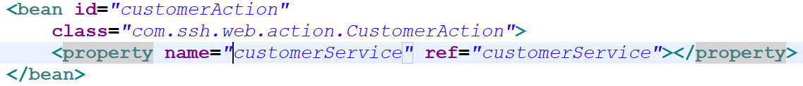
* 在Struts.xml中配置Action
    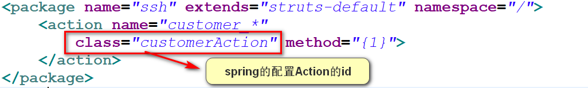
* <font color='red'>注意
  * 需要配置Action为多例的：
  * 需要手动注入Service </font>
    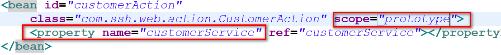

#### 第九步：service调用dao

* 将Dao交给Spring管理

    ```xml
    <bean id="customerDao" class="com.ssh.dao.impl.CustomerDaoImpl"></bean>
    ```

* 在Service注入Dao

    ```java
    public class CustomerServiceImpl implements CustomerService {

        private CustomerDao customerDao;

        public void setCustomerDao(CustomerDao customerDao) {
            this.customerDao = customerDao;
        }

        public void save() {
            System.out.println("CustomerService");
            customerDao.save();
        }
    }
    ```

    ```xml
    <bean id="customerService"
        class="com.ssh.service.impl.CustomerServiceImpl">
        <property name="customerDao" ref="customerDao" />
    </bean>
    ```

#### 第十步：Spring整合hibernate的框架

* 创建数据库和表

```sql
Create database ssh1;
Use ssh1;
CREATE TABLE `cst_customer` (
  `cust_id` bigint(32) NOT NULL AUTO_INCREMENT COMMENT '客户编号(主键)',
  `cust_name` varchar(32) NOT NULL COMMENT '客户名称(公司名称)',
  `cust_source` varchar(32) DEFAULT NULL COMMENT '客户信息来源',
  `cust_industry` varchar(32) DEFAULT NULL COMMENT '客户所属行业',
  `cust_level` varchar(32) DEFAULT NULL COMMENT '客户级别',
  `cust_phone` varchar(64) DEFAULT NULL COMMENT '固定电话',
  `cust_mobile` varchar(16) DEFAULT NULL COMMENT '移动电话',
  PRIMARY KEY (`cust_id`)
) ENGINE=InnoDB AUTO_INCREMENT=1 DEFAULT CHARSET=utf8;
```

* 编写实体和映射
* Spring和Hibernate整合
  * 在Spring的配置文件中，引入Hibernate的配置的信息

    ```xml
    <!-- Spring整合Hibernate -->
    <!-- 引入Hibernate的配置的信息 -->
    <bean id="sessionFactory"
        class="org.springframework.orm.hibernate5.LocalSessionFactoryBean">
        <property name="configLocation"
            value="classpath:hibernate.cfg.xml"></property>
    </bean>
    ```

* 在Spring和Hibernate的整合后，Spring提供了一个Hibernate的模板类简化Hibernate的开发
  * 改写Dao继承HibernateDaoSupport
  * 配置的时候在Dao直接注入SessionFactory
    * 为什么注入即可得到模板？
    * 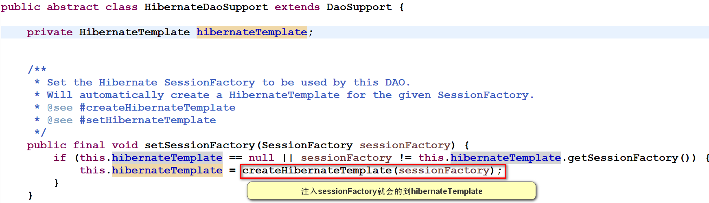
  * 在Dao中使用Hibernate的模板完成保存操作

    ```java
    public class CustomerServiceImpl implements CustomerService {

        private CustomerDao customerDao;

        public void setCustomerDao(CustomerDao customerDao) {
            this.customerDao = customerDao;
        }

        public void save(Customer customer) {
            System.out.println("CustomerService");
            customerDao.save(customer);
        }
    }
    ```

    ```xml
    <!-- Spring整合Hibernate -->
    <!-- 引入Hibernate的配置的信息 -->
    <bean id="sessionFactory"
        class="org.springframework.orm.hibernate5.LocalSessionFactoryBean">
        <property name="configLocation"
            value="classpath:hibernate.cfg.xml"></property>
    </bean>
    <bean id="customerDao" class="com.ssh.dao.impl.CustomerDaoImpl">
        <property name="sessionFactory" ref="sessionFactory" />
        <!-- 注入sessionFactory就会创建Hibernate模板 -->
    </bean>
    ```

#### 第十一步：配置Spring的事务管理

* 配置事务管理器

    ```xml
    <!-- 配置事务管理器 -->
    <!-- 配置事务管理器 -->
    <bean id="transactionManager"
        class="org.springframework.orm.hibernate5.HibernateTransactionManager">
        <property name="sessionFactory" ref="sessionFactory" />
    </bean>
    ```

* 开启注解事务

    ```xml
    <!-- 开启注解事务 -->
    <tx:annotation-driven transaction-manager="transactionManager" />
    ```

* 在业务层使用注解

    ```java
    @Transactional
    public class CustomerServiceImpl implements CustomerService {
    ```

### SSH整合方式二：不带Hibernate配置文件

#### 复制一个项目

#### hibernate配置文件中有哪些内容

* 数据库连接的配置
* Hibernate的相关的属性的配置
  * 方言
  * 显示SQL
  * 格式化SQL
  * 。。。
* C3P0连接池
* 映射文件

#### 将Hibernate的配置交给Spring

```xml
<!-- 引入外部属性文件 -->
<context:property-placeholder
    location="classpath:jdbc.properties" />

<!-- 配置c3p0连接池 -->
<bean id="dataSource"
    class="com.mchange.v2.c3p0.ComboPooledDataSource">
    <property name="driverClass" value="${jdbc.driverClass}"></property>
    <property name="jdbcUrl" value="${jdbc.url}"></property>
    <property name="user" value="${jdbc.username}"></property>
    <property name="password" value="${jdbc.password}"></property>
</bean>

<!-- Spring整合Hibernate -->
<!-- 引入Hibernate的配置的信息 -->
<bean id="sessionFactory"
    class="org.springframework.orm.hibernate5.LocalSessionFactoryBean">
    <property name="dataSource" ref="dataSource"></property>
    <property name="hibernateProperties">
        <props>
            <prop key="hibernate.dialect">org.hibernate.dialect.MySQLDialect</prop>
            <prop key="hibernate.format_sql">true</prop>
            <prop key="hibernate.show_sql">true</prop>
            <prop key="hibernate.hbm2ddl.auto">update</prop>
        </props>
    </property>
    <!-- 设置映射文件 -->
    <property name="mappingResources">
        <list>
            <value>com/ssh/domain/customer.hbm.xml</value>
        </list>
    </property>
</bean>
```

## Hibernate的模板的使用

### Hibernate模板的常用的方法

#### 保存操作

* save(Object obj)

#### 修改操作

* update(Object obj)

#### 删除操作

* delete(Object obj)

#### 查询操作

* 查询一个
  * get(Class c,Serializable id);
  * load(Class c,Serializable id);
* 查询多个
  * List find(String hql,Object… args);
  * List findByCriteria(DetachedCriteria dc);
  * List findByCriteria(DetachedCriteria dc,int firstResult,int maxResults);
  * List findByNamedQuery(String name,Object… args);

## 延迟加载问题的解决

### Spring提供了延迟加载的解决方案

#### 在SSH整合开发中那些地方会出现延迟加载

* 问题描述

 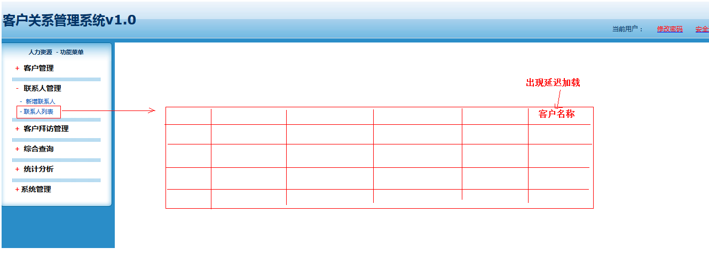

* 出现原因

 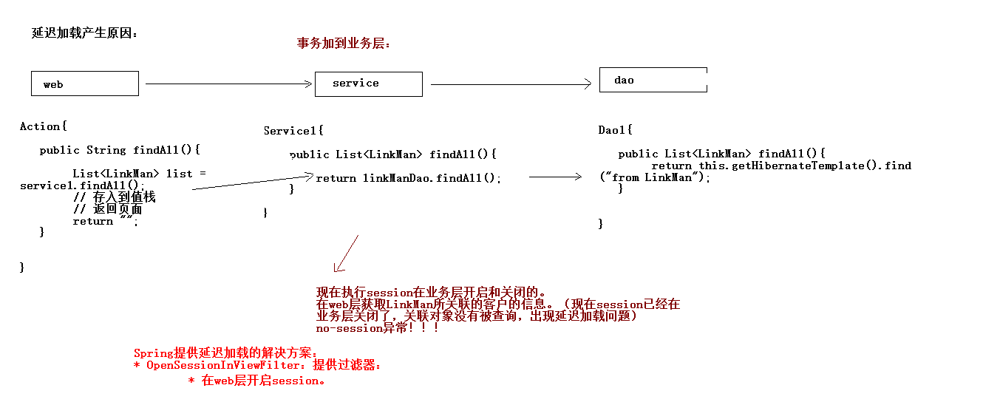

* no session错误

    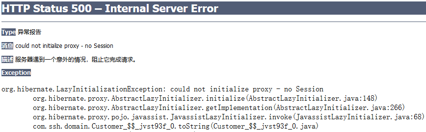

* 解决办法 - 添加OpenSessionViewFilter

    ```xml
    <!-- 解决延迟加载问题的过滤器 -->
    <filter>
        <filter-name>OpenSessionInViewFilter</filter-name>
        <filter-class>org.springframework.orm.hibernate5.support.OpenSessionInViewFilter</filter-class>
    </filter>

    <filter-mapping>
        <filter-name>OpenSessionInViewFilter</filter-name>
        <url-pattern>*.action</url-pattern>
    </filter-mapping>
    ```
