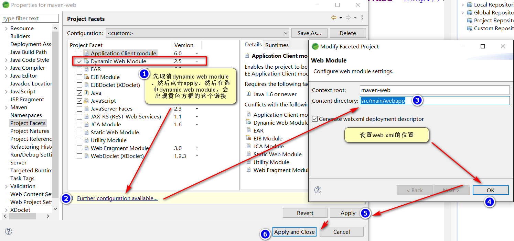
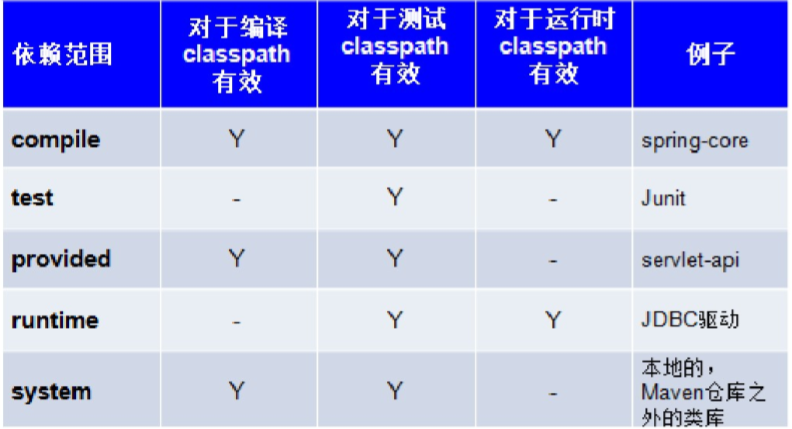

# Maven

<!-- markdownlint-disable MD033 -->
<!-- markdownlint-disable MD007 -->
<!-- markdownlint-disable MD004 -->

## 学习目标

* 学习目标
  * 第一天
    * 会使用maven构建项目的命令
    * 会使用maven构建java项目和java web项目
    * 构建maven-web工程整合struts2成功
  * 第二天
    * 依赖管理--传递依赖 版本冲突处理
    * 在web的单个工程中实现SSH整合
    * 分模块构建工程
    * 会向私服上传jar包。会从私服下载jar包

## Maven介绍

### maven是什么

> maven翻译为专家、内行。maven是apache下的一个纯java开发的开源项目，它是一个项目管理工具，使用maven对java进行构建，依赖管理。当前使用Maven的项目在持续增长。

### 什么是项目构建

> 项目构建是一个项目从编写源代码到编译、测试、运行、打包、部署、运行的过程

#### 传统的使用eclipse构建项目的过程如下


* 构建过程如下：

  1. 在eclipse中创建一个java web工程
  2. 在工程中编写源代码以及配置文件
  3. 对源代码进行编译、java文件编译成class文件
  4. 执行Junit单元测试
  5. 将工程打成war包部署至tomcat运行

#### maven项目构建过程

maven将项目构建的过程进行标准化，每一个阶段使用一个命令完成，下面展示了构建过程的一些阶段。


上图中部分阶段对应命令如下

* 请理阶段对应的maven的命令是clean，请理输出的class文件
* 编译阶段对应的maven的命令是compile，将java代码编译成class文件
* 打包阶段对应的maven的命令是package，java工程可以打成jar包，web包可以打成war包。

<font color='red'>运行一个maven工程（web工程）需要一个命令：tomcat:run</font>

maven工程构建的优点：

1. 一个命令完成构建、运行、方便快捷
2. maven对每个构建阶段进行规范，非常有利于大型团队协作开发。

### 什么是依赖管理

什么是依赖?

> 一个java项目可能要使用一些第三方的jar包才可以运行，那么我们说这个java项目依赖了这些第三方的jar包。

举个例子

> 一个crm系统，它的架构是SSH框架，该crm项目依赖SSH框架，具体它依赖的Hibernate、Spring、Struts2

什么是依赖管理？

> 就是对项目所有依赖的jar包进行规范化管理

#### 传统项目的依赖管理

传统的项目工程要管理所依赖的jar包完全依靠人工进行，程序员从网上下载jar包添加到项目工程中，如下图，程序员手工将Hibernate、struts2、spring的jar添加到工程中的WEB-INF/lib目录下。


手工拷贝jar包添加到工程中的问题是：

1. 没有对jar包的版本统一管理，容易导致版本冲突。
2. 从网上找jar包非常不方便，有些jar找不到。
3. jar包添加到工程中导致工程过大。

#### maven项目的依赖管理

maven项目管理所依赖的jar包不需要手动向工程添加jar包，只需要在pom.xml（maven工程的配置文件）添加jar包的坐标，自动从maven仓库中下载jar包、运行，如下图


使用maven依赖管理添加jar的好处是：

1. 通过pom.xml文件对jar包的版本进行统一管理，可避免版本冲突。
2. maven团队维护了一个非常全的maven仓库，里面包括了当前使用的jar包，maven工程可以自动从maven仓库下载jar包，非常方便。

### 使用maven的好处

通过上边介绍传统项目和maven项目在构建项目及建立依赖管理的方面的区域，maven有如下的好处

1. 一步构建

    >  maven对项目构建的过程进行标准化，通过一个命令即可完成构建过程

2. 依赖管理

    > maven工程不用手动导jar包，通过在pom.xml中定义坐标从maven仓库自动下载，方便且不容易出错。

3. maven的跨平台，可以在windows、linux上使用
4. maven遵循规范开发有利于提高大型团队的开发效率，降低项目的维护成本，大公司都会考虑使用maven来构建项目。

## Maven安装

### 下载安装

从 [apache-maven download](https://maven.apache.org/download.cgi)这个网站下载

* 将maven解压到一个不含有中文和空格的目录中

* bin目录
  * mvn.bat 以run方式运行项目
  * mvnDebug.bar 以debug方式运行项目
* boot目录
  * maven运行需要类加载器
* conf目录
  * settings.xml整个maven工具核心配置文件
* lib目录
  * maven运行依赖jar包

### 环境变量配置

* 电脑上需安装java环境，安装jdk1.7+版本
* 配置MAVEN_HOME
    
* 将%MAVEN_HOME%/bin加入环境变量path
    
* 通过mvn -v命令检查maven是否安装成功，看到maven的版本和jdk的版本即为安装成功
    

### maven仓库

maven的工作需要从仓库下载一些jar包，如下图所示，本地的项目A，项目B通过Maven软件从远程仓库（可以理解为互联网上的仓库）下载jar包并存在本地仓库，本地仓库，就是本地文件夹，当第二次需要此jar包时则不再从远程仓库下载，因为本地仓库已经存在了，可以将本地仓库理解为缓存，有了本地仓库就不用每次从远程仓库下载了。

* 本地仓库：用来存储从远程仓库或者中央仓库下载的插件或jar包，项目使用一些插件或jar包，优先从本地仓库查找
    * 默认本地仓库再${user.dir}/.m2/responsitory，${user.dir}表示windows用户目录
    * 

* 远程仓库：如果本地需要插件或者jar包，本地仓库没有，默认去远程仓库下载。远程仓库可以在互联网内也可以在局域网内。

* 中央仓库：在maven软件中内置一个远程仓库地址[https://repo.maven.apache.org/maven2](https://repo.maven.apache.org/maven2)，它是中央仓库，服务于整个大互联网，它是由maven团队自己维护，里面存储了非常全的jar包，它包含了世界上大部分流行的开源项目构件。

#### 配置本地仓库

* 配置本地仓库

* 在MAVE_HOME/conf/settings.xml文件中配置本地仓库位置

    

### maven自动部署到tomcat9

maven在命令行状态下是没有部署到tomcat容器的办法的，但是可以在依赖中添加tomcat插件来完成部署
但是如果我们想部署到我们想要部署的版本，需要进行以下操作。

> maven的自动部署功能可以很方便的将maven工程自动部署到远程tomcat服务器

* 第一步：配置 Tomcat 访问权限 - 在eclipse的server项目修改tomcat-users.xml

  ```xml
  <!-- 加入以下就可以了 -->
  <user password="1234" username="admin"
  roles="manager-gui,manager-script,manager-jmx,manager-status" />
  ```

  配置好之后访问下`http://localhost:8080/manager`，看看账号密码对不对

* 配置maven的settings.xml的`<servers>`标签

  ```xml
  <server>
      <id>tomcat9</id>
      <username>admin</username>
      <password>1234</password>
  </server>
  ```

* 在项目的pom.xml文件中添加

  ```xml
  <build>
      <finalName>helloworld1</finalName>
      <plugins>
        <plugin>
          <groupId>org.apache.tomcat.maven</groupId>
          <artifactId>tomcat7-maven-plugin</artifactId>
          <version>2.2</version>
          <configuration>
            <!-- 直接访问 Tomcat 服务器的 manager -->
            <url>http://localhost:8080/manager/text</url>
            <server>tomcat9</server>
            <username>tomcat</username>
            <password>1234</password>
            <update>true</update>
            <!-- 这个path是配置部署之后的路径 -->
            <path>/helloworld1</path>
          </configuration>
        </plugin>
      </plugins>
    </build>
  ```

* 使用命令
  * mvn tomcat7:deploy
  * mvn tomcat7:redeploy

* 注意
  * 如果用`mvn tomcat7:run`则用的是Apache Tomcat/7.0.47的这个插件来一键构建项目的
  * 注意web.xml位置，需要设置在`/helloworld1/src/main/webapp/WEB-INF/web.xml`

## 入门程序

### 入门程序学习目标

1. 说出maven项目工程的目录结构是什么？
2. 在cmd命令行下测试maven的常用命令

### maven工程运行演示

#### 运行web工程

进入maven工程目录（当前目录有pom.xml文件）运行tomcat:run命令


根据上边的提示信息，通过浏览器访问Running war on [http://localhost:8080/helloworld1](http://localhost:8080/helloworld1)

#### 问题处理

如果本地仓库配置错误会报下边的错误

分析：maven工程运行先从本地仓库找jar报，本地仓库没有再从中央仓库找。

解决：在maven安装目录的conf/setting.xml文件中配置本地仓库

### maven项目工程目录约定

使用maven创建的工程我们称为maven工程，maven工程具有一定的目录规范，如下

* src/main/java         -- 存放项目的java文件
* src/main/resources    -- 存放项目资源文件，如spring，hibernate配置文件
* src/test/java         -- 存放所有单元测试.java文件，如jUnit测试类
* src/test/resources    -- 测试资源文件
* target                -- 项目输出位置，编译后的class文件会输出此目录
* pom.xml               -- maven项目核心配置文件

```txt
.
├── pom.xml                 # maven项目核心配置文件
├── src
│   ├── main
│   │   ├── java            # 存放项目的.java文件
│   │   └── resources       # 存放项目资源文件，如Spring，hibernate配置文件
│   └── test
│       ├── java            # 存放所有测试.java文件，如Junit测试类
│       └── resources       # 测试资源文件
└── target                  # 目标文件输出位置例如.class 、.jar、.war文件
    ├── classes
    │   └── META-INF
    │       ├── MANIFEST.MF
    │       └── maven
    │           └── com.maven
    │               └── test
    │                   ├── pom.properties
    │                   └── pom.xml
    └── test-classes
```

### 常用的maven命令

在cmd的状态下测试

#### compile

compile是maven工程的编译命令，作用是将src/main/java下的文件编译为.class文件输出到target目录下


查看target目录


#### test

test是maven工程的测试命令，会执行src/test/java下的单元测试类。

cmd执行mvn test执行src/test/java下的单元测试类，下图为测试结果，运行1个测试用例


#### clean

clean是maven工程的清理命令，执行clean会删除target目录的内容

#### package

package是maven工程的打包命令，对于java工程执行package打成jar包，对于web工程打成war包

#### install

install是maven工程的安装命令，执行install将maven打成jar包或war包发布到本地仓库


### 生命周期 - 了解

#### 三套生命周期

maven对项目构建过程分为三套相互独立的生命周期，请注意这里说的三套，而且相互独立，这三套生命周期分别是

* Clean Lifecycle   ： 在进行真正的构建之前进行一些清理工作。
* Default Lifecycle ： 构建的核心部分，编译，测试，打包，部署等等。
* Site Lifecycle    ： 生成项目报告，站点，发布站点

#### 生命周期的阶段

每个生命周期都有很多阶段，每个阶段对应一个执行命令

1. 如下是clean生命周期的阶段

   * pre-clean 执行一些需要在clean之前完成的工作
   * clean 移除所有上一次构建生成的文件
   * post-clean 执行一些需要在clean之后立刻完成的工作

2. 如下是default周期的内容

   * validate
   * generate-sources
   * process-sources
   * generate-resources
   * process-resources        复制并处理资源文件，至目标目录，准备打包
   * **compile**              编译项目的源代码
   * process-classes
   * generate-test-sources
   * process-test-sources
   * genernate-test-resources
   * process-test-resources
   * test-compile
   * process-test-classes
   * **test**
   * prepare-package
   * **package**
   * pre-integration-test
   * integration-test
   * post-integration-test
   * verify
   * **install**               将包装至本地仓库，以让其他项目依赖
   * **deploy**                将最终的包复制到远程的仓库，以让其他人员和项目共享

3. 如下是site生命周期的极端

   * pre-site      执行一些需要在生成站点前完成的工作
   * site          生成项目的站点文档
   * post-site     执行一些需要在生成站点文档之后完成的工作，并且为部署做准备
   * site-deploy   将生成的站点文档部署到特定的服务器上

#### 命令与生命周期的阶段

每个maven命令对应生命周期的某个阶段

如：
mvn clean - clean生命周期的clean阶段
mvn test  - default生命周期的test阶段

执行命令会将该命令在生命周期当中之前的阶段自动执行

如：
mvn clean - 会自动执行pre-clean和clean阶段
mvn test  - 会自动执行validate、compile、test等阶段

注意：执行某个生命周期的某个阶段不会影响其他的生命周期！

如果要同时执行多个生命周期的阶段可在命令行输入多个命令，中间以空格隔开，

如：
mvn clean package - 该命令执行clean生命周期的clean阶段和default生命周期的package阶段。

### maven的概念模型

maven包含了一个项目对象模型（Project Object Model），一组标准组合，一个项目生命周期（Project Lifecycle），一个依赖管理系统（Dependency Management System），和用来运行定义在生命周期阶段（Phase）中插件(plugin)目标（goal)的逻辑


* 项目对象模型（Project Object Model）

  > 一个maven工程都有一个pom.xml文件，通过pom.xml文件定义项目的坐标、项目依赖、项目信息、插件目标等。

* 依赖管理系统（Dependency Management System）

  > 通过maven的依赖管理对项目所依赖的jar包进行统一管理

  ```xml
  <dependencies>
    <!-- 此项目运行使用junit，所以此项目依赖Junit -->
    <dependency>
      <!-- groupId和artifactId统称为坐标 -->
      <!-- groupId类似组织的包名 -->
      <groupId>junit</groupId>
      <!-- artifactId类似项目名 -->
      <artifactId>junit</artifactId>
      <!-- junit的版本 -->
      <version>4.12</version>
      <!-- 依赖范围：单元测试时使用junit -->
      <scope>test</scope>
    </dependency>
  ```

* 一个项目生命周期（Project Lifecycle）

  > 使用maven完成项目的构建，项目构建包括：清理、编译、测试、部署等过程，maven将这些过程规范为一个生命周期

  

  maven通过执行一些简单命令即可实现上边生命周期的各个过程，例如执行mvn compile执行编译。执行mvn clean执行清理

* 一组标准集合

  > maven将整个项目管理过程定义一组标准，比如：通过maven构建工程有标准的目录结构，有标准的生命周期阶段、依赖管理有标准的坐标定义等。

* 插件（plugin）目标(goal)

  > maven管理项目生命周期过程都是基于插件完成的。

## 项目构建

### 项目构建目标

1. 独立在eclipse中安装maven插件
2. 说出maven坐标的含义
3. 使用eclipse创建maven工程（java工程及java web工程）
4. 使用eclipse运行maven命令

### m&e插件安装配置

#### eclipse与maven

命令行使用maven工作效率低，可以在eclipse开发工具中集成maven

eclipse是开发工具，maven是项目管理工具

maven有一套项目构建的规范，在eclipse中集成maven软件，最终通过eclipse创建maven工程。

#### 插件安装

有些eclipse已经内置maven，这里自己制定maven

* 制定maven安装目录

  

* User setting配置

  在eclipse中配置使用maven安装目录下的setting.xml文件
  

  注意：如果修改了setting.xml文件需要点击上图中的update settings 按钮对本地仓库重建索引，点击reindex

### eclipse浏览仓库

maven配置完成需要测试在eclipse中是否可以浏览maven的本地仓库，如果可以正常浏览maven本地仓库说明eclipse集成maven已经完成。

* 打开eclipse仓库视图

  

* 找到Local respository本地仓库项，点击rebuild index重建索引

  

* 重建索引完成点击展开图标即可看到本地仓库内容

  

### 定义maven坐标

每个maven工程都需要定义本工程的坐标，坐标是maven对jar包的身份定义

  ```xml
  <!-- 项目名称，定义为组织名+项目名，类似包名 -->
  <groupId>com.maven</groupId>
  <!-- 模块名称 -->
  <artifactId>helloworld1</artifactId>
  <!-- 打包类型 -->
  <!-- jar：执行package会打成jar包 -->
  <!-- war：执行package会打成war包 -->
  <!-- pom：用于maven工程的继承，通常父工程设置为pom -->
  <packaging>war</packaging>
  <!-- 当前项目版本号，snapshot为快照版本即非正式版本，release为正式发布版本 -->
  <version>0.0.1-SNAPSHOT</version>
  ```

### 构建web工程

#### 需求

创建一个web工程，实现入门程序的功能

1. 添加index.jsp，输出hello world
2. 添加一个servlet转发到jsp页面

#### 创建maven工程

* 选择maven project

  

* 为了看到完整的maven目录，跳过骨架（推荐）
  
  

* 看看骨架内部状态，但是返回再跳过哈。

  

* 定义坐标

  
  

* 添加jdk依賴

  ```xml
  <!-- 局部jdk配置，pom.xml中 -->  
  <build>
      <plugins>
          <plugin>
              <groupId>org.apache.maven.plugins</groupId>
              <artifactId>maven-compiler-plugin</artifactId>
              <configuration>
                  <source>1.8</source>
                  <target>1.8</target>
              </configuration>
          </plugin>
      </plugins>
  </build>
  ```

* 更改目录结构，增加webapp目录和web.xml文件

  
  也可以
  

* 更改pom.xml，添加apache插件和添加servlet和jsp的依賴

  ```xml
  <dependencies>
    <dependency>
      <groupId>junit</groupId>
      <artifactId>junit</artifactId>
      <version>4.12</version>
      <scope>test</scope>
    </dependency>
    <dependency>
      <groupId>javax.servlet</groupId>
      <artifactId>javax.servlet-api</artifactId>
      <version>3.0.1</version>
      <scope>provided</scope>
    </dependency>
    <dependency>
      <groupId>javax.servlet.jsp</groupId>
      <artifactId>jsp-api</artifactId>
      <version>2.1</version>
      <scope>provided</scope>
    </dependency>
  </dependencies>
  <!-- 局部jdk配置，pom.xml中 -->
  <build>
    <plugins>
      <plugin>
        <groupId>org.apache.maven.plugins</groupId>
        <artifactId>maven-compiler-plugin</artifactId>
        <configuration>
          <source>1.8</source>
          <target>1.8</target>
        </configuration>
      </plugin>

      <plugin>
        <groupId>org.apache.tomcat.maven</groupId>
        <artifactId>tomcat7-maven-plugin</artifactId>
        <version>2.2</version>
        <configuration>
          <!-- 直接访问 Tomcat 服务器的 manager -->
          <url>http://localhost:8080/manager/text</url>
          <server>tomcat9</server>
          <username>tomcat</username>
          <password>1234</password>
          <update>true</update>
          <path>/maven-web</path>
        </configuration>
      </plugin>
    </plugins>
  </build>
  ```

* 执行update project
* 编写servlet跳转到jsp

  ```java
  public class HelloServlet extends HttpServlet {
    private static final long serialVersionUID = 1L;

    public HelloServlet() {
      super();
    }

    protected void doGet(HttpServletRequest request, HttpServletResponse response)
        throws ServletException, IOException {
      request.getRequestDispatcher("test.jsp").forward(request, response);
    }

    protected void doPost(HttpServletRequest request, HttpServletResponse response)
        throws ServletException, IOException {
      doGet(request, response);
    }
  }
  ```

  jsp文件在 src/main/webapp 目录下test.jsp

* 运行

  * cmd命令进入工程目录
    * 用tomcat:run 用的本身带有的tomcat插件运行的
    * 用tomcat:deploy 部署在现在已经活动的服务器上。
  * eclipse下使用maven命令

    
    * maven clean 清楚target目录
    * maven test 执行单元测试
    * maven install 将工程打包后发布到本地仓库
    * maven build 使用之前操作过的命令
    * maven build.. 手动输入命令内容，如下图。
    

* 补充命令解释
  * 编译命令 mvn compile
    * 编译后，.class文件在target/classes下（这个命令只会对java源程序编译，不会编译测试代码）
    * 编译测试类mvn test-compile，编译后.class文件在target/test-classes）
  * 测试命令 mvn test
    * 执行所有用例方法，重新编译
  * 清除命令 mvn clean
    * 清楚target目录（清除所有编译结果或者打包结果），清理后编译。
  * 打包命令 mvn package
    * java项目生成jar包，web项目生成war包
    * 默认生成jar包名称：artifactID-version.jar
  * 安装命令 mvn install
    * 安装命令mvn install 将工程打包后发布到本地仓库
      * 安装到仓库/groupID/artifactId/version目录

## 依赖管理-添加依赖

### 添加依赖

#### dependency

在pom.xml中添加dependency标签，如下：

```xml
<dependency>
  <groupId></groupId>
  <artifactId></artifactId>
  <version></version>
  <scope></scope>
</dependency>
```

#### 查找坐标

* 方式一:从互联网搜索

  > [https://mvnrepository.com](https://mvnrepository.com)

* 方式二：使用maven插件的索引功能

    

  结果如下

    

### 构建用框架的web工程

#### 添加struts2依赖

* 解决索引搜不到的问题

  

* 解決下載速度慢的问题，导入aliyun的仓库

  ```xml
  <mirror>
    <id>alimaven</id>
    <name>aliyun maven</name>
    <url>http://maven.aliyun.com/nexus/content/groups/public/</url>
    <mirrorOf>central</mirrorOf>
  </mirror>
  ```

* 添加struts2依赖

  ```xml
  <!-- 依赖struts2 -->
  <dependency>
    <groupId>org.apache.struts</groupId>
    <artifactId>struts2-core</artifactId>
    <version>2.3.24</version>
  </dependency>
  ```

* 完整的pom.xml

  ```xml
  <project xmlns="http://maven.apache.org/POM/4.0.0"
    xmlns:xsi="http://www.w3.org/2001/XMLSchema-instance"
    xsi:schemaLocation="http://maven.apache.org/POM/4.0.0 https://maven.apache.org/xsd/maven-4.0.0.xsd">
    <properties>
      <project.build.sourceEncoding>UTF-8</project.build.sourceEncoding>
    </properties>
    <modelVersion>4.0.0</modelVersion>
    <groupId>com.helloworld.maven</groupId>
    <artifactId>maven-web</artifactId>
    <version>0.0.1-SNAPSHOT</version>
    <packaging>war</packaging>
    <name>web工程</name>
    <description>111</description>
    <dependencies>
      <!-- 此项目运行使用junit，所以此项目依赖Junit -->
      <dependency>
        <!-- groupId和artifactId统称为坐标 -->
        <!-- groupId类似组织的包名 -->
        <groupId>junit</groupId>
        <!-- artifactId类似项目名 -->
        <artifactId>junit</artifactId>
        <!-- junit的版本 -->
        <version>4.12</version>
        <!-- 依赖范围：单元测试时使用junit -->
        <scope>test</scope>
      </dependency>
      <dependency>
        <groupId>javax.servlet</groupId>
        <artifactId>javax.servlet-api</artifactId>
        <version>3.0.1</version>
        <scope>provided</scope>
      </dependency>
      <dependency>
        <groupId>javax.servlet.jsp</groupId>
        <artifactId>jsp-api</artifactId>
        <version>2.1</version>
        <scope>provided</scope>
      </dependency>
      <dependency>
        <groupId>mysql</groupId>
        <artifactId>mysql-connector-java</artifactId>
        <version>5.1.6</version>
        <scope>runtime</scope>
      </dependency>

      <dependency>
        <groupId>org.apache.struts</groupId>
        <artifactId>struts2-core</artifactId>
        <version>2.3.24</version>
      </dependency>

      <dependency>
        <groupId>org.apache.logging.log4j</groupId>
        <artifactId>log4j</artifactId>
        <version>2.10.0</version>
        <type>pom</type>
      </dependency>
    </dependencies>
    <!-- 局部jdk配置，pom.xml中 -->
    <build>
      <plugins>
        <plugin>
          <groupId>org.apache.tomcat.maven</groupId>
          <artifactId>tomcat7-maven-plugin</artifactId>
          <version>2.2</version>
          <configuration>
            <!-- 直接访问 Tomcat 服务器的 manager -->
            <url>http://localhost:8080/manager/text</url>
            <server>tomcat9</server>
            <username>tomcat</username>
            <password>1234</password>
            <update>true</update>
            <path>/maven-web</path>
          </configuration>
        </plugin>
      </plugins>
    </build>
  </project>
  ```

* action

  ```java
  public class CustomerAction extends ActionSupport {

    private Long custId;

    public Long getCustId() {
      return custId;
    }

    public void setCustId(Long custId) {
      this.custId = custId;
    }

    public String queryCustomer() {
      System.out.println("客户请求客户ID" + custId);
      return SUCCESS;
    }
  }
  ```

* struts.xml

  ```xml
  <struts>
    <!-- 配置常量 -->
    <!-- 字符集 -->
    <constant name="struts.i18n.encoding" value="UTF-8"></constant>
    <!-- 开发模式 -->
    <constant name="struts.devMode" value="true"></constant>
    <!-- 主题 -->
    <constant name="struts.ui.theme" value="simple"></constant>
    <!-- 扩展名 -->
    <constant name="struts.action.extension" value="action"></constant>

    <package name="m" extends="struts-default" namespace="/">
      <action name="customerAction"
        class="com.maven.action.CustomerAction" method="queryCustomer">
        <result name="success">/jsp/querycustomer.jsp</result>
      </action>
    </package>
  </struts>
  ```

* web.xml

  ```xml
  <!-- 配置Struts前端过滤器 -->
  <filter>
    <filter-name>struts2</filter-name>
    <filter-class>org.apache.struts2.dispatcher.ng.filter.StrutsPrepareAndExecuteFilter</filter-class>
  </filter>

  <filter-mapping>
    <filter-name>struts2</filter-name>
    <url-pattern>/*</url-pattern>
  </filter-mapping>
  ```

### 依赖范围

#### 基本概念

> A依赖B，需要在A的pom.xml文件中添加B的坐标，添加坐标的时候需要制定依赖范围

* compile：编译范围，指A在编译时依赖B，此范围为默认范围。编译范围的依赖会用在编译、测试、运行，由于运行时需要所以编译范围的依赖会被打包。
* provided：provided依赖只有当jdk或者一个容器已提供该依赖之后才使用，provide依赖在编译和测试时候需要，在运行的时候不需要，比如servlet api被tomcat提供。
* runtime：runtime依赖在运行和测试系统的时候需要，但在编译的时候不需要。比如：jdbc驱动包，由于运行时候需要所以runtime范围的依赖会被打包
* test：test范围依赖，在编译和运行时都不需要，它们只有在测试编译和测试运行阶段可用，比如junit。由于运行时不需要，所以test范围依赖不会被打包
* system：system范围和provided类似，但是必须显示提供一个对于本地系统中jar文件的路径，需要制定classpath磁盘路径，system不推荐

  

依赖范围由强到弱

compile>provided>runtime>test

#### 依赖范围测试

```xml
<dependency>
  <groupId>javax.servlet</groupId>
  <artifactId>javax.servlet-api</artifactId>
  <version>3.0.1</version>
  <scope>provided</scope>
</dependency>
<dependency>
  <groupId>javax.servlet.jsp</groupId>
  <artifactId>jsp-api</artifactId>
  <version>2.1</version>
  <scope>provided</scope>
</dependency>
<dependency>
  <groupId>mysql</groupId>
  <artifactId>mysql-connector-java</artifactId>
  <version>5.1.6</version>
  <scope>runtime</scope>
</dependency>
```

packge打war后观察jsp-api和servlet-api和mysql-connctor-java是否在war中存在。

### tomcat内置插件

### 端口占用处理

### 断点调试

## 总结

* maven仓库
  * maven仓库的类型？本地库，远程库
  * maven工程查找仓库流程是什么？
  * 本地仓库如何配置？
* 常用maven命令
  * compile 编译
  * clean 清理
  * test 测试
  * package 打包
  * install 安装
* 坐标定义
* pom基本配置

```text
<project> 文件的根节点
<modelversion> pom.xml使用的对象模型版本
<groupid> 项目名称，一般写项目的域名
<artifactId> 模块名称，子项目名或模块名称
<version> 产品版本号
<packaging> 打包类型，一般有jar，war，pom等
<name> 项目的显示名，常用于maven生成的文档
<description> 项目描述，常用于maven生成的文档
<dependencies> 项目依赖构建配置，配置项目依赖构建的坐标
<build> 项目构建配置，配置编译、运行插件等。
```
