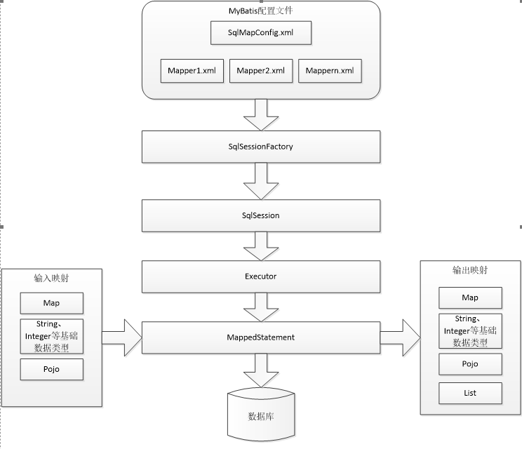
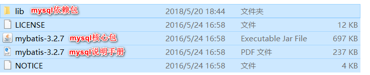
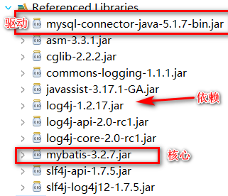
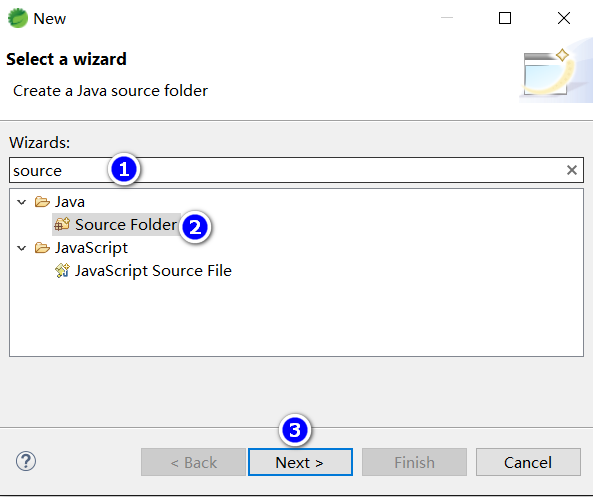
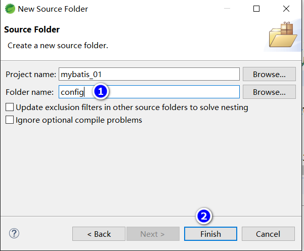

# Mybatis

## 学习计划

* day_01
  * mybatis的介绍
  * mybatis的入门
    * 使用jdbc操作数据库存在的问题
    * mybatis的架构
    * mybatis的入门程序
  * dao的开发方法
    * 原始dao的开发方法
    * 接口的动态代理方式
  * sqlMapConfig.xml文件说明
* day_02
  * 输入映射和输出映射
    * 输入参数映射
    * 返回值映射
  * 动态sql
  * 关联查询
    * 一对一关联
    * 一对多关联
  * mybatis整合spring

## Mybatis介绍

> Mybatis是一个优秀的持久层框架，它对jdbc的操作数据库的过程进行封装，使开发者只需要关注sql本身，而不需要花费精力去处理例如注册驱动、创建connection、创建statement、手动设置参数、结果集检索等jdbc繁杂的过程代码。  
> mybatis通过xml或注解的方式将各种statement（statement、prepareStatement、CallableStatement）配置起来，并通过java对象和statement中的sql进行映射生成最终执行的sql语句，最后由mybatis框架执行sql并将结果映射成java对象并返回。

## 使用jdbc编程问题总结

### 创建mysql数据库

* 创建数据库

    ```sql
    /*
    Navicat MySQL Data Transfer

    Source Server         : localhost_3306
    Source Server Version : 50521
    Source Host           : localhost:3306
    Source Database       : mybatis

    Target Server Type    : MYSQL
    Target Server Version : 50521
    File Encoding         : 65001

    Date: 2015-04-09 16:03:53
    */

    USE mybatis;

    SET FOREIGN_KEY_CHECKS=0;

    -- ----------------------------
    -- Table structure for `orders`
    -- ----------------------------
    DROP TABLE IF EXISTS `orders`;
    CREATE TABLE `orders` (
    `id` INT(11) NOT NULL AUTO_INCREMENT,
    `user_id` INT(11) NOT NULL COMMENT '下单用户id',
    `number` VARCHAR(32) NOT NULL COMMENT '订单号',
    `createtime` DATETIME NOT NULL COMMENT '创建订单时间',
    `note` VARCHAR(100) DEFAULT NULL COMMENT '备注',
    PRIMARY KEY (`id`),
    KEY `FK_orders_1` (`user_id`),
    CONSTRAINT `FK_orders_id` FOREIGN KEY (`user_id`) REFERENCES `user` (`id`) ON DELETE NO ACTION ON UPDATE NO ACTION
    ) ENGINE=INNODB AUTO_INCREMENT=6 DEFAULT CHARSET=utf8;

    -- ----------------------------
    -- Records of orders
    -- ----------------------------
    INSERT INTO `orders` VALUES ('3', '1', '1000010', '2015-02-04 13:22:35', NULL);
    INSERT INTO `orders` VALUES ('4', '1', '1000011', '2015-02-03 13:22:41', NULL);
    INSERT INTO `orders` VALUES ('5', '10', '1000012', '2015-02-12 16:13:23', NULL);

    -- ----------------------------
    -- Table structure for `user`
    -- ----------------------------
    DROP TABLE IF EXISTS `user`;
    CREATE TABLE `user` (
    `id` INT(11) NOT NULL AUTO_INCREMENT,
    `username` VARCHAR(32) NOT NULL COMMENT '用户名称',
    `birthday` DATE DEFAULT NULL COMMENT '生日',
    `sex` CHAR(1) DEFAULT NULL COMMENT '性别',
    `address` VARCHAR(256) DEFAULT NULL COMMENT '地址',
    PRIMARY KEY (`id`)
    ) ENGINE=INNODB AUTO_INCREMENT=27 DEFAULT CHARSET=utf8;

    -- ----------------------------
    -- Records of user
    -- ----------------------------
    INSERT INTO `user` VALUES ('1', '王五', NULL, '2', NULL);
    INSERT INTO `user` VALUES ('10', '张三', '2014-07-10', '1', '北京市');
    INSERT INTO `user` VALUES ('16', '张小明', NULL, '1', '河南郑州');
    INSERT INTO `user` VALUES ('22', '陈小明', NULL, '1', '河南郑州');
    INSERT INTO `user` VALUES ('24', '张三丰', NULL, '1', '河南郑州');
    INSERT INTO `user` VALUES ('25', '陈小明', NULL, '1', '河南郑州');
    INSERT INTO `user` VALUES ('26', '王五', NULL, NULL, NULL);
    ```

导入后会创建`order`和`user`两个表

### 创建工程

* 创建工程
* 需要mysql的数据库驱动，如下图位置的jar包

### jdbc编程步骤

1. 加载数据库驱动
2. 创建并获取数据库链接
3. 创建jdbc statement对象
4. 设置sql语句
5. 设置sql语句中的参数（使用preparedStatement）
6. 通过statement执行sql并获取结果
7. 对sql执行结果进行解析处理
8. 释放资源（resultSet、preparedstatement、connection）

### jdbc程序

```java
public static void main(String[] args) {
    Connection connection = null;
    PreparedStatement preparedStatement = null;
    ResultSet resultSet = null;

    try {
        // 加载数据库驱动
        Class.forName("com.mysql.jdbc.Driver");

        // 通过驱动管理类获取数据库链接
        connection = DriverManager.getConnection("jdbc:mysql://localhost:3306/mybatis?characterEncoding=utf-8", "root", "root");
        // 定义sql语句 ?表示占位符
        String sql = "select * from user where username = ?";
        // 获取预处理statement
        preparedStatement = connection.prepareStatement(sql);
        // 设置参数，第一个参数为sql语句中参数的序号（从1开始），第二个参数为设置的参数值
        preparedStatement.setString(1, "王五");
        // 向数据库发出sql执行查询，查询出结果集
        resultSet = preparedStatement.executeQuery();
        // 遍历查询结果集
        while (resultSet.next()) {
            System.out.println(resultSet.getString("id") + "  " + resultSet.getString("username"));
        }
    } catch (Exception e) {
        e.printStackTrace();
    } finally {
        // 释放资源
        if (resultSet != null) {
            try {
                resultSet.close();
            } catch (SQLException e) {
                // TODO Auto-generated catch block
                e.printStackTrace();
            }
        }
        if (preparedStatement != null) {
            try {
                preparedStatement.close();
            } catch (SQLException e) {
                // TODO Auto-generated catch block
                e.printStackTrace();
            }
        }
        if (connection != null) {
            try {
                connection.close();
            } catch (SQLException e) {
                // TODO Auto-generated catch block
                e.printStackTrace();
            }
        }
    }
}
```

### jdbc问题总结如下

1. 数据库连接创建、释放频繁造成系统资源浪费，从而影响性能。如果使用数据库连接池可解决此问题。
2. sql语句在代码中硬编码，造成代码不易维护，实际应用中sql变化的可能较大，sql变动需要改变java代码。
3. 使用preparedStatement向占位符传参数存在硬编码，因为sql语句的where条件不一定，可能多可能少，修改sql还要修改代码，系统不易维护。
4. 对结果集解析存在硬编码（查询列名），sql变化导致解析代码变化，系统不易维护，如果能将数据库记录封装成pojo对象解析比较方便。

## Mybatis架构



## Mybatis入门程序

### mybatis下载

mybatis的代码由github.com管理
下载地址：[github.com/mybatis/mybatis-3/releases](https://github.com/mybatis/mybatis-3/releases)



### 业务需求

使用mybatis实现以下功能
根据用户id查询一个用户
根据用户名称模糊查询用户列表
添加用户
更新用户
删除用户

### 第一步：环境搭建

#### 创建java工程

#### 加入jar包

* mybatis核心包
* mybatis依赖包
* mysql数据驱动包



#### 加入配置文件




加入

* log4j.properties

    ```txt
    # Global logging configuration
    log4j.rootLogger=DEBUG, stdout
    # Console output...
    log4j.appender.stdout=org.apache.log4j.ConsoleAppender
    log4j.appender.stdout.layout=org.apache.log4j.PatternLayout
    log4j.appender.stdout.layout.ConversionPattern=%5p [%t] - %m%n
    ```

* sqlMapConfig.xml

    ```xml
    <?xml version="1.0" encoding="UTF-8" ?>
    <!DOCTYPE configuration
    PUBLIC "-//mybatis.org//DTD Config 3.0//EN"
    "http://mybatis.org/dtd/mybatis-3-config.dtd">
    <configuration>
        <!-- 和spring整合后 environments配置将废除 -->
        <environments default="development">
            <environment id="development">
                <!-- 使用jdbc事务管理 -->
                <transactionManager type="JDBC" />
                <!-- 数据库连接池 -->
                <dataSource type="POOLED">
                    <property name="driver" value="com.mysql.jdbc.Driver" />
                    <property name="url"
                        value="jdbc:mysql://localhost:3306/mybatis?characterEncoding=utf-8" />
                    <property name="username" value="root" />
                    <property name="password" value="root" />
                </dataSource>
            </environment>
        </environments>
    </configuration>
    ```

sqlMapConfig.xml是mybatis核心配置文件，配置文件内容为数据源、事务管理

#### 创建pojo

pojo类作为mybatis进行sql映射使用，po类通常与数据库表对应

* 数据库user表如下：

    ```sql
    CREATE TABLE `user` (
    `id` INT(11) NOT NULL AUTO_INCREMENT,
    `username` VARCHAR(32) NOT NULL COMMENT '用户名称',
    `birthday` DATE DEFAULT NULL COMMENT '生日',
    `sex` CHAR(1) DEFAULT NULL COMMENT '性别',
    `address` VARCHAR(256) DEFAULT NULL COMMENT '地址',
    PRIMARY KEY (`id`)
    ) ENGINE=INNODB AUTO_INCREMENT=27 DEFAULT CHARSET=utf8;
    ```

* User.java如下

    ```java
    public class User {
        private int id;
        private String username;// 用户姓名
        private String sex;// 性别
        private Date birthday;// 生日
        private String address;// 地址

        // get&set
    }
    ```

#### sql映射文件

```xml
<?xml version="1.0" encoding="UTF-8" ?>
<!DOCTYPE mapper
PUBLIC "-//mybatis.org//DTD Mapper 3.0//EN"
"http://mybatis.org/dtd/mybatis-3-mapper.dtd">
<!-- namespace：命名空间，用于隔离sql，还有一个很重要的作用，后面会讲 -->
<mapper namespace="test">
</mapper>
```

#### 加載映射文件

```xml
<mappers>
    <mapper resource="sqlmap/User.xml" />
</mappers>
```

* 注意，要配置一下dtd的catalog

### 第二步：实现根据id查询用户

使用的sql
select * from user where id=1

#### 映射文件

* 映射文件，在user.xml中添加select标签，编写SQL

    ```xml
    <?xml version="1.0" encoding="UTF-8" ?>
    <!DOCTYPE mapper
    PUBLIC "-//mybatis.org//DTD Mapper 3.0//EN"
    "http://mybatis.org/dtd/mybatis-3-mapper.dtd">
    <!-- namespace：命名空间，用于隔离sql，还有一个很重要的作用，后面会讲 -->
    <mapper namespace="test">

        <!-- id：statement的id或者叫做sql的id -->
        <!-- parameterType：声明输入参数的类型 -->
        <!-- resultType：声明输出参数的类型，应该填写pojo的全路径 -->
        <!-- #{}:输入参数的占位符，相当于jdbc的 -->

        <select id="queryUserByid" parameterType="int"
            resultType="com.mybatis.pojo.User">
            select * from user where id=#{id}
        </select>
    </mapper>
    ```

#### 测试程序

测试程序步骤

1. 创建SqlSessionFactoryBuilder对象
2. 加载SqlMapConfig.xml配置文件
3. 创建SqlSessionFactory对象
4. 创建SqlSession对象
5. 执行SqlSession对象执行查询，获取结果User
6. 打印结果
7. 释放资源

* MybatisTest.java

    ```java
    public class MybatisTest {

        private SqlSessionFactory sqlSessionFactory = null;

        @Before
        public void init() throws IOException {
            // 1.创建流
            InputStream inputStream=Resources.getResourceAsStream("sqlMapConfig.xml");

            // 2.sqlSessionBuilder对象通过流建立sqlSessionFactory
            sqlSessionFactory =new SqlSessionFactoryBuilder().build(inputStream);
        }
        /**
        * mybatis通过一个id查询一个用户
        */
        @Test
        public void test() {
            // 3.创建sqlSession对象
            SqlSession sqlSession = sqlSessionFactory.openSession();

            // 4.执行sqlSession对象执行查询，获取结果User
            // 第一个参数是User.xml的statement的id，第二个参数是执行sql所需要的参数

            User user= sqlSession.selectOne("queryUserByid", 1);
            // 5.打印结果
            System.out.println(user);

            // 6.释放资源
            sqlSession.close();
        }
    }
    ```

#### 执行结果

```txt
DEBUG [main] - Opening JDBC Connection
DEBUG [main] - Created connection 1987083830.
DEBUG [main] - Setting autocommit to false on JDBC Connection [com.mysql.jdbc.JDBC4Connection@76707e36]
DEBUG [main] - ==>  Preparing: select * from user where id=?
DEBUG [main] - ==> Parameters: 1(Integer)
DEBUG [main] - <==      Total: 1
User [id=1, username=王五, sex=2, birthday=null, address=null]
DEBUG [main] - Resetting autocommit to true on JDBC Connection [com.mysql.jdbc.JDBC4Connection@76707e36]
DEBUG [main] - Closing JDBC Connection [com.mysql.jdbc.JDBC4Connection@76707e36]
DEBUG [main] - Returned connection 1987083830 to pool.
```

### 第三步：实现根据用户名模糊查询用户

查询sql：

```sql
select * from 'user' where username like '%王%'
```

#### 方法一

* 映射文件

    ```xml
    <select id="queryUserByUsername1" parameterType="string" resultType="com.mybatis.pojo.User">SELECT * FROM `user` WHERE username LIKE #{username}</select>
    ```

* 测试程序

    ```java
    /**
      * mybatis实现用户名模糊查询
      */
    @Test
    public void test0() {
        SqlSession sqlSession = sqlSessionFactory.openSession();
        List<User> users= sqlSession.selectList("queryUserByUsername1", "%王%");
        for (User u : users) {
            System.out.println(u);
        }
        sqlSession.close();
    }
    ```

#### 方法二

* 映射文件

    ```xml
    <select id="queryUserByUsername2" parameterType="string"
        resultType="com.mybatis.pojo.User">SELECT * FROM `user` WHERE username LIKE '%${value}%'
    </select>
    <!-- 这个位置'%${value}%'中{}里必须是写value -->
    ```

* 测试程序

```java
/**
    * mybatis实现用户名模糊查询2
    */
@Test
public void test1() {
    SqlSession sqlSession = sqlSessionFactory.openSession();
    List<User> users= sqlSession.selectList("queryUserByUsername2", "王");
    for (User u : users) {
        System.out.println(u);
    }
    sqlSession.close();
}
```

### 小结

#### #{}和${}

* #{}表示一个占位符，
* 通过#{}可以实现prepareStatement向占位符中设置值，自动进行java类型和jdbc类型转换。
* #{}可以有效防止sql注入。
* #{}可以接收简单类型或pojo属性值。
* 如果parameterType传输简单类型值，#{}括号中可以是value或其他名称。

* ${}表示拼接sql串
* 通过${}可以将parameterType传入的内容拼接在sql不进行jdbc类型的转换
* ${}可以接收简单类型值或pojo属性值，如果parameterType传输单个简单类型值，${}括号中只能是value。

#### parameterType和resultType

* parameterType：指定输入参数类型，mybatis通过ognl从输入对象中获取参数值拼接到sql中。
* resultType：指定输出结果类型，mybatis将sql查询结果的一行记录数据映射为resultType指定类型的对象。如果有多条数据，则分别进行映射，并把对象放到容器List中。

#### selectOne和selectList

* selectOne查询一条记录，如果使用selectOne查询多条记录抛出异常

```txt
org.apache.ibatis.exceptions.TooManyResultsException: Expected one result (or null) to be returned by selectOne(), but found: 3 at org.apache.ibatis.session.defaults.DefaultSqlSession.selectOne(DefaultSqlSession.java:70)
```

* selectList可以查询一条或多条记录

### 第四步：实现添加用户

使用的sql

`INSERT INTO user (username,birthday,sex,address) VALUES ('黄忠','2020-1-1','1','中国')`

* 映射文件

    ```xml
    <!-- 保存用户 -->
    <insert id="saveUser" parameterType="com.mybatis.pojo.User">
        INSERT INTO user
        (username,birthday,sex,address) VALUES
        (#{username},#{birthday},#{sex},#{address})
    </insert>
    ```

* 测试程序

    ```java
    /**
    * mybatis实现添加用户
    */
    @Test
    public void test2() {
        SqlSession sqlSession = sqlSessionFactory.openSession();
        int i = sqlSession.insert("test.saveUser", new User("黄忠", "1", new Date(System.currentTimeMillis()), "中国"));
        sqlSession.commit();
        System.out.println("有" + i + "行被影响了");
        sqlSession.close();
    }
    ```

#### mysql自增主键返回

查询id的sql

`SELECT LAST_INSERT_ID();`

通过修改User.xml映射文件，可以将mysql自增主键返回

如下添加selectKey标签

```xml
<!-- 保存用户 -->
<insert id="saveUser" parameterType="com.mybatis.pojo.User">
    <!-- selectKey 标签实现主键返回 -->
    <!-- keyColumn 主键对应的表中的那一列 -->
    <!-- keyProperty 主键对应的pojo中的哪一个属性 -->
    <!-- order 设置在执行insert语句前执行查询id的sql，还是在执行insert语句之后执行查询id的sql -->
    <!-- resultType：设置返回的id的类型 -->

    <selectKey keyColumn="id" keyProperty="id" order="AFTER"
        resultType="int">
        SELECT LAST_INSERT_ID()
    </selectKey>
    INSERT INTO user
    (username,birthday,sex,address) VALUES
    (#{username},#{birthday},#{sex},#{address})
</insert>
```

`LAST_INSERT_ID()`是mysql的函数，返回auto_increment自增列新记录id值

#### mysql使用uuid实现主键

```xml
<insert id="saveUser" parameterType="com.mybatis.pojo.User">
    <!-- selectKey 标签实现主键返回 -->
    <!-- keyColumn 主键对应的表中的那一列 -->
    <!-- keyProperty 主键对应的pojo中的哪一个属性 -->
    <!-- order 设置在执行insert语句前执行查询id的sql，还是在执行insert语句之后执行查询id的sql -->
    <!-- resultType：设置返回的id的类型 -->

    <selectKey keyColumn="id" keyProperty="id" order="BEFORE"
        resultType="string">
        SELECT LAST_INSERT_ID()
    </selectKey>
    INSERT INTO user
    (username,birthday,sex,address) VALUES
    (#{username},#{birthday},#{sex},#{address})
</insert>
```

注意，这里使用的order是"BEFORE"

### 修改用户

根据用户id修改用户名

使用的sql

`UPDATE user SET username='赵云' WHERE id=26`

* 映射文件

```xml
<update id="updateUserById"
    parameterType="com.mybatis.pojo.User">
    UPDATE user SET username=#{username} WHERE id=#{id}
</update>
```

* 测试程序

```java
/**
    * mybatis更新用户
    */
@Test
public void test3() {
    SqlSession sqlSession = sqlSessionFactory.openSession();
    User u = new User();
    u.setId(26);
    u.setUsername("赵云");

    int i = sqlSession.update("test.updateUserById", u);
    sqlSession.commit();
    System.out.println("有" + i + "行被影响了");
    sqlSession.close();
}
```

### 删除用户

根据用户id删除用户

使用sql

`DELETE FROM user WHERE id=10`

* 映射文件

    ```xml
    <!-- 删除用户 -->
    <delete id="deleteUserByid" parameterType="int">
        DELETE FROM user WHERE id=#{id}
    </delete>
    ```

* 测试程序

    ```java
    /**
        * mybatis删除用户
        */
    @Test
    public void test4() {
        SqlSession sqlSession = sqlSessionFactory.openSession();

        int i = sqlSession.delete("deleteUserByid", 28);

        sqlSession.commit();
        System.out.println("有" + i + "行被影响了");
        sqlSession.close();
    }
    ```

### Mybatis解决jdbc编程的问题

1. 数据库连接创建、释放频繁造成系统资源浪费从而影响系统性能，如果使用数据库连接池可解决此问题。

    >解决：在sqlMapConfig.xml中配置数据连接池，使用连接池管理数据库连接。  

2. sql语句写在代码中造成代码不易维护，实际应用sql变化的可能较大，sql变动需要改变Java代码。  

    >解决：将sql语句配置在XXXmapper.xml文件中与java代码分离。  

3. 向sql语句传参数麻烦，因为sql语句的where条件不一定，也可能多也可能少，占位符需要和参数一一对应。  

    >解决：mybatis自动将java对象映射至sql语句，通过statement中的parameterType定义参数的类型  

4. 对结果解析麻烦，sql变化导致解析代码变化，且解析前需要遍历，如果能将数据库记录封装成pojo对象解析比较方便。  

    >解决：mybatis自动将sql执行结果映射至java对象，通过statement中的resultType定义输出结果  

### mybatis与hibernate不同

mybatis和hibernate不同

* 它不完全是一个ORM框架，因为mybatis需要程序员自己编写sql。
* mybatis可以通过XML或注解方式灵活配置要运行的sql语句，并将java对象和sql语句映射生成最终执行的sql，最后将sql执行的结果再映射生成java对象

* mybatis学习门槛低，简单易学，程序员直接编写原生态sql，可严格控制sql执行性能，灵活度高
* 非常适合对关系数据库要求不高的软件开发
* 适合需求经常变化的软件
* 灵活的前提是mybatis无法做到数据库无关性，如果需要实现支持多种数据库的软件则需要自定义多套sql映射文件，工作量大。

* hibernate 对象/关系映射能力强，数据性无关性好，对于关系模型很高的软件（例如需求固定的定制化软件）如果用hibernate开发可以节省很多代码
* hibernate 的学习门槛高，要精通门槛更高，而且怎么设计O/R映射，在性能和对象模型之间如何权衡，以及怎样用好hibernate需要很强的经验和能力

总之，按照用户的需求在有限的资源环境只要做出维护性好，扩展性良好的软件框架都是好架构，所以架构只有适合才是最重要的

## Dao开发

使用mybatis开发Dao，通常有两个方法，即原始Dao开发方法和Mapper动态代理开发方法。

### Dao开发需求

使用mybatis开发Dao实现以下的功能

* 根据用户id查询一个用户信息
* 根据用户名称模糊查询用户信息列表
* 添加用户信息

### sqlSession的使用范围

SqlSession中封装了对数据库的操作，如：查询、插入、更新、删除等。
SqlSession通过SqlSessionFactory创建。
SqlSessionFactory是通过SqlSessionFactoryBuilder进行创建

#### sqlSessionFactoryBuilder

> SqlSessionFactoryBuilder用于创建SqlSessionFacoty，SqlSessionFacoty一旦创建完成就不需要SqlSessionFactoryBuilder了，因为SqlSession是通过SqlSessionFactory创建的。所以可以将SqlSessionFactoryBuilder当成一个工具类使用，最佳使用范围是方法范围即方法体内局部变量。

#### SqlSessionFactory

> SqlSessionFactory是一个接口，接口中定义了openSession的不同重载方法，SqlSessionFactory的最佳使用范围是整个应用运行期间，一旦创建后可以重复使用，通常以单例模式管理SqlSessionFactory。

#### SqlSession

> SqlSession是一个面向用户的接口，sqlSession中定义了数据库操作方法。每个线程都应该有它自己的SqlSession实例。SqlSession的实例不能共享使用，它也是线程不安全的。因此最佳的范围是请求或方法范围。绝对不能将SqlSession实例的引用放在一个类的静态字段或实例字段中。

打开一个sqlSession 使用完毕就要关闭它。通常把这个关闭操作放到finally块中以确保每次都能执行关闭，如下

```java
SqlSession session=SqlSessionFactory.openSession();
try{
    // do work
} finally{
    session.close();
}
```

### 原始Dao开发方式

#### 开发dao用的映射文件

```xml
<?xml version="1.0" encoding="UTF-8" ?>
<!DOCTYPE mapper
PUBLIC "-//mybatis.org//DTD Mapper 3.0//EN"
"http://mybatis.org/dtd/mybatis-3-mapper.dtd">
<!-- namespace：命名空间，用于隔离sql，还有一个很重要的作用，后面会讲 -->
<mapper namespace="test">

    <!-- id：statement的id或者叫做sql的id -->
    <!-- parameterType：声明输入参数的类型 -->
    <!-- resultType：声明输出参数的类型，应该填写pojo的全路径 -->
    <!-- #{}:输入参数的占位符，相当于jdbc的 -->

    <select id="queryUserByid" parameterType="int"
        resultType="com.mybatis.pojo.User">
        select * from user where id=#{id}
    </select>

    <select id="queryUserByUsername1" parameterType="string"
        resultType="com.mybatis.pojo.User">SELECT * FROM `user` WHERE username LIKE like #{username}
    </select>

    <select id="queryUserByUsername2" parameterType="string"
        resultType="com.mybatis.pojo.User">SELECT * FROM `user` WHERE username LIKE '%${value}%'
    </select>
    <!-- 这个位置'%${value}%'中{}里必须是写value -->

    <!-- 保存用户 -->
    <insert id="saveUser" parameterType="com.mybatis.pojo.User">
        <!-- selectKey 标签实现主键返回 -->
        <!-- keyColumn 主键对应的表中的那一列 -->
        <!-- keyProperty 主键对应的pojo中的哪一个属性 -->
        <!-- order 设置在执行insert语句前执行查询id的sql，还是在执行insert语句之后执行查询id的sql -->
        <!-- resultType：设置返回的id的类型 -->

        <selectKey keyColumn="id" keyProperty="id" order="AFTER"
            resultType="int">
            SELECT LAST_INSERT_ID()
        </selectKey>
        INSERT INTO user
        (username,birthday,sex,address) VALUES
        (#{username},#{birthday},#{sex},#{address})
    </insert>
    <update id="updateUserById"
        parameterType="com.mybatis.pojo.User">
        UPDATE user SET username=#{username} WHERE id=#{id}
    </update>
    <!-- 删除用户 -->
    <delete id="deleteUserByid" parameterType="int">
        DELETE FROM user WHERE id=#{id}
    </delete>
</mapper>
```

#### Dao接口

```java
public interface UserDao {

    /**
    * 根据id查询用户
    * @param id
    * @return User
    */
    User queryUserById(int id);

    /**
    * 根据用户名模糊查询用户
    * @param username
    * @return
    */
    List<User> queryUserByUserName(String username);

    /**
    * 保存用户
    * @param user
    */
    void saveUser(User user);
}
```

#### Dao实现类

```java
public class UserDaoImpl implements UserDao {

    private SqlSessionFactory sqlSessionFactoy;

    public UserDaoImpl(SqlSessionFactory sqlSessionFactoy) {
        this.sqlSessionFactoy = sqlSessionFactoy;
    }

    @Override
    public User queryUserById(int id) {
        // 创建sqlSession
        SqlSession sqlSession = sqlSessionFactoy.openSession();

        // 执行查询逻辑
        User u = sqlSession.selectOne("test.queryUserByid", id);

        // 释放资源
        sqlSession.close();
        return u;
    }

    @Override
    public List<User> queryUserByUserName(String username) {
        SqlSession sqlSession = sqlSessionFactoy.openSession();
        List<User> list = sqlSession.selectList("test.queryUserByUsername1", username);
        sqlSession.close();
        return list;
    }

    @Override
    public void saveUser(User user) {
        SqlSession sqlSession = sqlSessionFactoy.openSession();
        int i = sqlSession.insert("test.saveUser", user);
        sqlSession.commit();
        sqlSession.close();
    }
}
```

#### Dao测试

```java
public class MybatisTest {

    private SqlSessionFactory sqlSessionFactory = null;

    @Before
    public void init() throws IOException {
        // 1.创建流
        InputStream inputStream = Resources.getResourceAsStream("sqlMapConfig.xml");

        // 2.sqlSessionBuilder对象通过流建立sqlSessionFactory
        sqlSessionFactory = new SqlSessionFactoryBuilder().build(inputStream);
    }

    /**
    * mybatis通过一个id查询一个用户
    */
    @Test
    public void test() {
        // 3.创建sqlSession对象
        SqlSession sqlSession = sqlSessionFactory.openSession();

        // 4.执行sqlSession对象执行查询，获取结果User
        // 第一个参数是User.xml的statement的id，第二个参数是执行sql所需要的参数

        User user = sqlSession.selectOne("test.queryUserByid", 1);
        // 5.打印结果
        System.out.println(user);

        // 6.释放资源
        sqlSession.close();
    }

    /**
    * mybatis实现用户名模糊查询1
    */
    @Test
    public void test0() {
        SqlSession sqlSession = sqlSessionFactory.openSession();
        List<User> users = sqlSession.selectList("test.queryUserByUsername1", "%王%");
        for (User u : users) {
            System.out.println(u);
        }
        sqlSession.close();
    }

    /**
    * mybatis实现用户名模糊查询2
    */
    @Test
    public void test1() {
        SqlSession sqlSession = sqlSessionFactory.openSession();
        List<User> users = sqlSession.selectList("test.queryUserByUsername2", "王");
        for (User u : users) {
            System.out.println(u);
        }
        sqlSession.close();
    }

    /**
    * mybatis实现添加用户
    */
    @Test
    public void test2() {
        SqlSession sqlSession = sqlSessionFactory.openSession();
        User u = new User("黄忠", "1", new Date(System.currentTimeMillis()), "中国");
        int i = sqlSession.insert("test.saveUser", u);
        sqlSession.commit();
        System.out.println("有" + i + "行被影响了");

        System.out.println(u.getId());

        sqlSession.close();
    }
    /**
    * mybatis更新用户
    */
    @Test
    public void test3() {
        SqlSession sqlSession = sqlSessionFactory.openSession();
        User u = new User();
        u.setId(26);
        u.setUsername("赵云");

        int i = sqlSession.update("test.updateUserById", u);
        sqlSession.commit();
        System.out.println("有" + i + "行被影响了");
        sqlSession.close();
    }
    /**
    * mybatis删除用户
    */
    @Test
    public void test4() {
        SqlSession sqlSession = sqlSessionFactory.openSession();

        int i = sqlSession.delete("deleteUserByid", 28);

        sqlSession.commit();
        System.out.println("有" + i + "行被影响了");
        sqlSession.close();
    }
}
```

#### 原始dao开发存在的问题

原始Dao开发中存在以下问题

* Dao方法存在重复代码：通过sqlSessionFactory创建sqlSession，调用sqlSession的数据库操作方法
* 调用SqlSession的数据库操作方法需要指定statement的id，这里存在硬编码，不利于开发维护

### Mapper动态代理方式

#### Mapper开发规范

Mapper接口开发方法需要程序员编写Mapper（相当于Dao）接口，有Mybatis框架根据接口自定义创建接口的动态代理对象，代理对象的方法同上边Dao接口实现类方法。

Mapper接口开发需要遵循以下规范：

1. mapper.xml文件中namespace与mapper接口的类路径相同
2. Mapper接口方法名和mapper.xml中定义的每个statement中的id相同
3. Mapper接口方法的输入参数类型和mapper.xml中定义的每个sql的parameterType的类型相同
4. Mapper接口方法的输出参数类型和mapper.xml中定义的每个sql的resultType的类型相同

#### mapper.xml（映射文件）

定义mapper映射文件UserMapper.xml
将UserMapper.xml放在config下mapper目录下，效果如下：

* UserMapper.xml配置文件内容

    ```xml
    <?xml version="1.0" encoding="UTF-8" ?>
    <!DOCTYPE mapper
    PUBLIC "-//mybatis.org//DTD Mapper 3.0//EN"
    "http://mybatis.org/dtd/mybatis-3-mapper.dtd">
    <!-- namespace：命名空间，用于隔离sql-->
    <!-- 还有一个很重要的作用，使用动态代理开发Dao namespace必须和mapper接口路径一致 -->
    <mapper namespace="com.mybatis.mapper.UserMapper">

        <!-- id：statement的id或者叫做sql的id -->
        <!-- parameterType：声明输入参数的类型 -->
        <!-- resultType：声明输出参数的类型，应该填写pojo的全路径 -->
        <!-- #{}:输入参数的占位符，相当于jdbc的 -->

        <select id="queryUserById" parameterType="int"
            resultType="com.mybatis.pojo.User">
            select * from user where id=#{id}
        </select>

        <select id="queryUserByUsername" parameterType="string"
            resultType="com.mybatis.pojo.User">SELECT * FROM `user` WHERE username LIKE #{username}

        </select>

        <!-- 保存用户 -->
        <insert id="saveUser" parameterType="com.mybatis.pojo.User">
            <!-- selectKey 标签实现主键返回 -->
            <!-- keyColumn 主键对应的表中的那一列 -->
            <!-- keyProperty 主键对应的pojo中的哪一个属性 -->
            <!-- order 设置在执行insert语句前执行查询id的sql，还是在执行insert语句之后执行查询id的sql -->
            <!-- resultType：设置返回的id的类型 -->

            <selectKey keyColumn="id" keyProperty="id" order="AFTER"
                resultType="int">
                SELECT LAST_INSERT_ID()
            </selectKey>
            INSERT INTO user
            (username,birthday,sex,address) VALUES
            (#{username},#{birthday},#{sex},#{address})
        </insert>

        <update id="updateUserById"
            parameterType="com.mybatis.pojo.User">
            UPDATE user SET username=#{username} WHERE id=#{id}
        </update>

        <!-- 删除用户 -->
        <delete id="deleteUserByid" parameterType="int">
            DELETE FROM user WHERE
            id=#{id}
        </delete>
    </mapper>
    ```

* UserMapper.java 接口

    ```java
    public interface UserMapper {
        /**
        * 根据id查询用户
        * @param id
        * @return User
        */
        User queryUserById(int id);

        /**
        * 根据用户名模糊查询用户
        * @param username
        * @return
        */
        List<User> queryUserByUsername(String username);

        /**
        * 保存用户
        * @param user
        */
        void saveUser(User user);
    }
    ```

* 加載UserMapper.xml

    ```xml
    <mappers>
        <mapper resource="sqlmap/User.xml" />
        <mapper resource="mapper/UserMapper.xml"/>
    </mappers>
    ```

* 测试

```java
public class MybatisMapperTest {
    private SqlSessionFactory sqlSessionFactory = null;

    @Before
    public void init() throws IOException {
        // 1.创建流
        InputStream inputStream = Resources.getResourceAsStream("sqlMapConfig.xml");

        // 2.sqlSessionBuilder对象通过流建立sqlSessionFactory
        sqlSessionFactory = new SqlSessionFactoryBuilder().build(inputStream);
    }

    @Test
    /**
    * 通过id查用户
    */
    public void testQueryUserById() {
        // 获取sqlSession，和spring整合由spring管理
        SqlSession sqlSession = this.sqlSessionFactory.openSession();

        // 从sqlSession中获取mapper接口接口的代理对象
        UserMapper mapper = sqlSession.getMapper(UserMapper.class);

        User user = mapper.queryUserById(1);
        System.out.println(user);

        sqlSession.close();
    }

    @Test
    /**
    * 通过模糊查询查用户列表
    */
    public void testQueryUserByUserName() {
        // 获取sqlSession，和spring整合由spring管理
        SqlSession sqlSession = this.sqlSessionFactory.openSession();

        // 从sqlSession中获取mapper接口接口的代理对象
        UserMapper mapper = sqlSession.getMapper(UserMapper.class);

        List<User> users = mapper.queryUserByUsername("%王%");
        for (User u : users) {
            System.out.println(u);
        }

        sqlSession.close();
    }

    @Test
    /**
    * 用户保存
    */
    public void saveUser() {
        // 获取sqlSession，和spring整合由spring管理
        SqlSession sqlSession = this.sqlSessionFactory.openSession();

        // 从sqlSession中获取mapper接口接口的代理对象
        UserMapper mapper = sqlSession.getMapper(UserMapper.class);

        mapper.saveUser(new User("zs", "1", new Date(System.currentTimeMillis()), "bb"));
        sqlSession.commit();
        sqlSession.close();
    }
}
```

### Dao开发小结

* selectOne和selectList
  * 动态代理对象调用sqlSession.selectOne()和sqlSession.selectList()是根据mapper接口方法返回值决定，如果返回list则调用selectList方法，如果返回单个对象则调用selectOne方法
* namespace
  * mybatis官方推荐用mapper代理方法开发mapper接口，程序员不用编写mapper接口实现类，使用mapper代理方法时，输入参数可以使用pojo包装对象或map对象，来保证dao的通用性。

## SqlMapConfig.xml文件

### 配置内容

sqlMapConfig.xml中配置的内容和顺序如下：

* properties（属性)
* settings（全局配置参数）
* typeAliases（类型别名）
* typeHandles（类型处理器）
* objectFactory（对象工厂）
* plugins（插件）
* environments（环境集合属性对象）
  * environment（环境子属性对象）
    * transactionManager（事务管理）
    * dataSource（数据源）
* mapper（映射器)

### properties（属性)

sqlMapConfig.xml可以引用java属性文件中的配置信息如下：

在config下定义db.properties文件

db.properties配置文件内容如下：

```test
jdbc.driver=com.mysql.jdbc.Driver
jdbc.url=jdbc:mysql://localhost:3306/mybatis?characterEncoding=utf-8
jdbc.username=root
jdbc.password=root
```

```xml
<?xml version="1.0" encoding="UTF-8" ?>
<!DOCTYPE configuration
PUBLIC "-//mybatis.org//DTD Config 3.0//EN"
"http://mybatis.org/dtd/mybatis-3-config.dtd">
<configuration>
    <!-- 是用resource属性加载外部配置文件 -->
    <properties resource="db.properties">
        <!-- 在properties内部用property定义属性 -->
        <!-- 如果外部配置文件有该属性，则内部定义属性被外部属性覆盖 -->
        <property name="jdbc.username" value="root123" />
        <property name="jdbc.password" value="root123" />
    </properties>

    <!-- 和spring整合后 environments配置将废除 -->
    <environments default="development">
        <environment id="development">
            <!-- 使用jdbc事务管理 -->
            <transactionManager type="JDBC" />
            <!-- 数据库连接池 -->
            <dataSource type="POOLED">
                <property name="driver" value="${jdbc.driver}" />
                <property name="url" value="${jdbc.url}" />
                <property name="username" value="${jdbc.username}" />
                <property name="password" value="${jdbc.password}" />
            </dataSource>
        </environment>
    </environments>

    <!-- 加载映射文件 -->
    <mappers>
        <mapper resource="sqlmap/User.xml" />
        <mapper resource="mapper/UserMapper.xml" />
    </mappers>
</configuration>
```

注意：Mybatis将按照下面的顺序来加载属性

* 在properties元素体内定义的属性首先被读取。
* 然后会读取properties元素中的resource或url加载的属性，它会覆盖已读取的同名属性

### typeAliases（类型别名)

#### mybatis支持别名

别名 | 映射的类型
------- | -------
_byte | byte
_long | long
_short | short
_int | int
_integer | int
_double | double
_float | float
_boolean | boolean
string | String
byte  | Byte
long  | Long
short  | Short
int  | Integer
integer  | Integer
double  | Double
float  | Float
boolean  | Boolean
date  | Date
decimal  | BigDecimal
bigdecimal  | BigDecimal
map | Map

#### 自定义别名

在SqlMapConfig.xml中配置如下：

```xml
<!-- 设置别名 -->
<typeAliases>
    <package name="com.sm.pojo" />
</typeAliases>
```

### 映射器

Mapper配置的几种方法：

#### `<mapper resource=" " />`

使用相对于类路径的资源（现在的使用方式）
如：`<mapper resource="sqlmap/User.xml" />`

#### `<mapper class=" " />`

使用mapper接口类路径
如：`<mapper class="cn.itcast.mybatis.mapper.UserMapper"/>`

注意：此种方法要求mapper接口名称和mapper映射文件名称相同，且放在同一个目录中。

#### `<package name=""/>`

注册指定包下的所有mapper接口
如：`<package name="cn.itcast.mybatis.mapper"/>`
注意：此种方法要求mapper接口名称和mapper映射文件名称相同，且放在同一个目录中。

## 总结

* mybatis
  * 学习计划
  * mybatis介绍
    * mybatis是一个优秀的持久层框架，对jdbc操作数据库过程进行封装，使开发者关注sql本身
  * 使用jdbc编程的问题总结
    * 创建mysql数据库
    * 创建工程
    * jdbc编程步骤
    * jdbc程序
    * jdbc问题总结如下
      * 创建释放耗资源
      * sql变动需改代码
      * prepareStatement存参数存在硬编码
      * 结果集合解析容易变化，而且麻烦
  * mybatis框架
    * sqlMapConfig.xml+MapperN...xml-->SqlSessionFactory-->SqlSession-->Executor-->MapperStatement-->数据库
  * mybatis入门程序
    * mybatis下载 --->github上
    * 业务需求
      * 插入
      * 删除
      * 修改
      * 查询
    * 搭建环境
      * jar包
        * mybatis核心包
        * mybatis依赖包
        * mysql数据驱动包
      * 核心文件
        * sqlMapConfig.xml
        * log4j.properties
      * sql映射文件 --> xxxMapper.xml
      * 创建pojo
    * 通过id查询用户
      * 创建映射`<select id="" parameterType="" resultType=""></select>`
      * 引入映射到sqlMapConfig.xml
      * 测试程序 SqlSessionFactory通过核心配置文件的流-->创建sqlSessionFactory-->创建sqlSession-->调用selectOne返回结果-->close();
    * 通过用户名模糊查询用户
      * 映射文件
        * SELECT * FROM `user` WHERE username LIKE #{username}
        * SELECT * FROM `user` WHERE username LIKE '%${value}%'
      * 测试程序
        * 使用selectList
    * 小结
      * #{}和${}
        * #{}--->占位符
        * ${}--->拼接sql串
      * parameterType和resultType
        * parameterType --->指定输入参数类型
        * resultType--->指定输出结果类型
      * selectOne和selectList
        * selectOne是一条记录
        * selectList是多条记录
    * 实现添加用户
      * 映射`<insert>`
      * 自增主键返回 `<selectKey keyColumn keyProperty order resultType>`
    * 修改用户
      * 映射`update`
    * 删除用户
      * 映射`delete`
    * mybatis解决jdbc编程的问题
      * 创建释放使用连接池
      * sql配置在XXXmapper.xml文件与java代码分离
      * sql传参将java对象映射至sql语句--->parameterType
      * mybatis自动将sql执行结果映射成pojo/java对象--->resultType
    * mybatis和hibernate的不同
  * dao开发
    * dao需求
      * 增删改查
    * sqlSession的使用范围
      * SqlSessionFactoryBuilder --> 工具类方法局部变量
      * SqlSessionFactory --> 整个应用，一旦创建重复使用
      * SqlSession --> 线程不安全，一个线程一个sqlSession实例，而且用完关闭让连接池回收
    * 原始Dao开发方式
      * 存在问题
        * Dao存在重复代码 sqlSessionFactory创建sqlSession。sqlSession调用数据库操作办法
        * 调用sqlSession的数据库操作办法需要指定statement的id
    * Mapper动态代理方式
      * Mapper开发规范
        * mapper.xml文件中namespace与mapper接口的类路径相同
        * Mapper接口方法名和mapper.xml中定义的每个statement中的sql相同
        * Mapper接口方法的输入参数类型和mapper.xml中定义的每个sql的parameterType的类型相同
        * Mapper接口方法的输出类型参数和mapper.xml中定义的每个sql的resultType的类型相同
      * 创建mapper.xml
      * 创建UserMapper.java接口并在mapper.xml配置namespace
      * 在sqlMapConfig中加载mapper.xml
      * 测试
        * sqlSessionFactory-->创建sqlSession-->通过接口创建userMapper-->执行CRUD-->释放
  * sqlMapConfig.xml文件
    * 配置内容
      * properties
      * settings
      * typeAliases
      * typeHandles
      * objectHandles
      * objectFactory
      * plugins
      * environments
        * environment
          * transactionManager
          * dataSource
      * mapper
    * properties（属性）
    * typeAliases（类型别名)
    * 映射器
      * mapper通过resource导入
      * mapper通过class导入
        * 要求mapper接口和mapper映射文件名称相同，且同一个目录
      * mapper通过package导入
        * 要求mapper接口和mapper映射文件名称相同，且同一个目录
    * 补充：重视xxxMapper.xml中的namespace，namespace要指定和接口路径一样
      * 如果mapper设置的是resource，可以不在一个包
      * 如果mapper设置的是class | package 那么mapper接口和mapper映射要文件名称相同，且同一个目录
  * 总结
