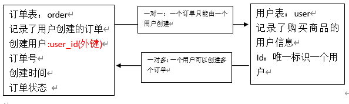
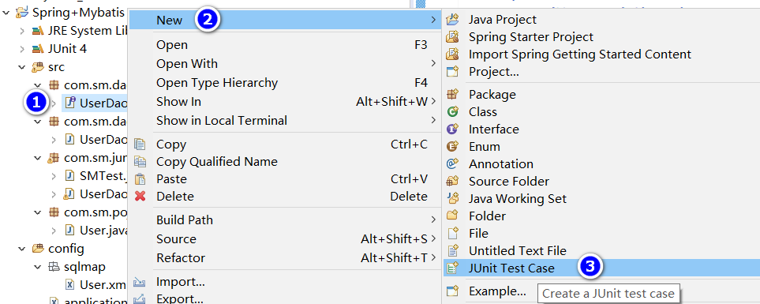
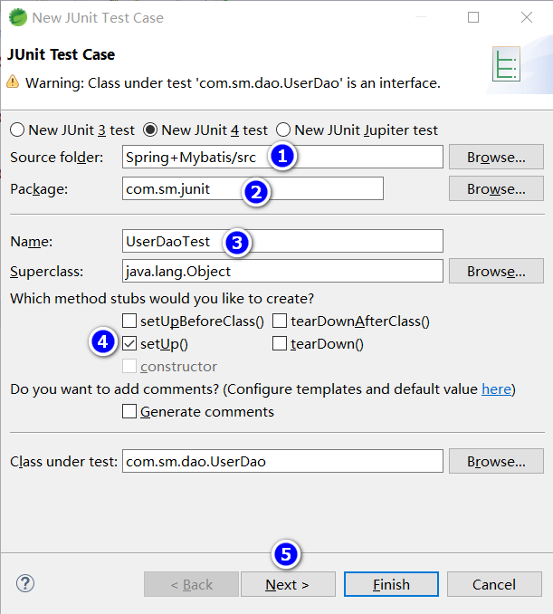
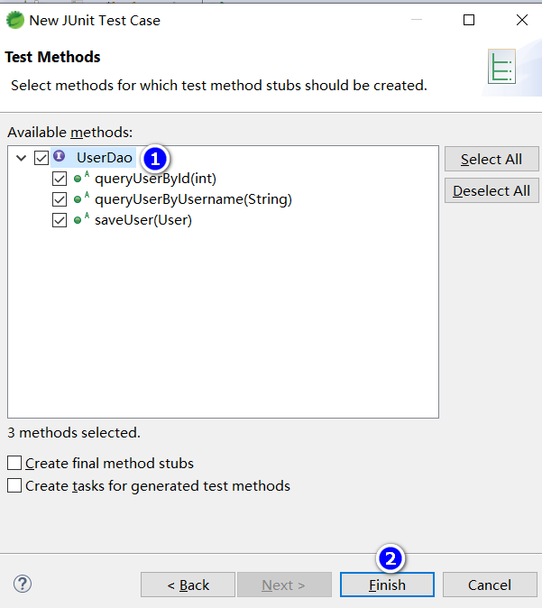
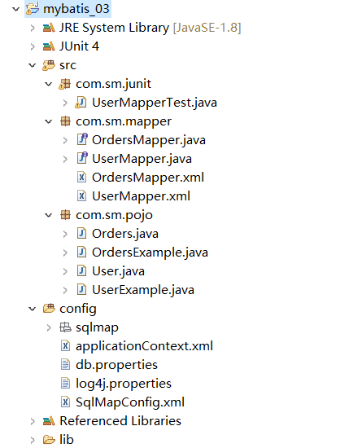

# Mybatis第二天

## 课程计划

1. 输入映射和输出映射
    * 输入参数映射
    * 返回值映射
2. 动态sql
    * if标签
    * Where标签
    * Foreach标签
3. 关联查询
    * 一对一关联
    * 一对多关联
4. Mybatis整合Spring
    * 如何整合Spring
    * 使用原始的方式开发dao
    * 使用Mapper接口动态代理
5. Mybatis逆向工程 - 了解

## 输入映射和输出映射

### 环境准备

* 使用day_01的项目
* 只保留Mapper接口开发相关的文件，其他的删除

### parameterType（输入类型）

#### 传递简单类型

参考第一天
使用 #{}占位符，或者${}进行sql拼接。

#### 传递pojo对象

参考第一天的内容。
Mybatis使用ognl表达式解析对象字段的值，#{}或者${}括号中的值为pojo的属性名称。

#### 传递pojo包装对象

开发中通过可以使用pojo传递查询条件。

查询条件可能是综合的查询条件，不仅包括用户查询条件还包括其他的查询条件

> 比如查询用户信息的时候，将用户购买商品信息也作为查询条件），这时可以使用包装对象传递输入参数

包装对象：pojo类中的一个属性是另一个pojo。

需求：根据用户名模糊查询用户信息，查询条件放到QueryVo的user属性中去。

* sql语句

    ```sql
    SELECT * FROM `user` WHERE username LIKE '%王%'
    ```

* 编写QueryVo

    ```java
    public class QueryVo {
        //包含其他的pojo
        private User user;

        public User getUser() {
            return user;
        }

        public void setUser(User user) {
            this.user = user;
        }
    }
    ```

* 配置UserMapper.xml文件

    ```xml
    <select id="queryUserByQueryVo" parameterType="queryVo" resultType="user">
        SELECT * FROM `user` WHERE username LIKE '%${user.username}%'
    </select>
    ```

* 在UserMapper接口添加方法

    ```java
    /**
        * 根据包装类查询用户
        * @param queryVo
        * @return
        */
    List<User> queryUserByQueryVo(QueryVo queryVo);
    ```

* 测试方法

    ```java
    @Test
    public void test0() throws Exception {
        SqlSession sqlSession = sqlSessionFactory.openSession();
        UserMapper userMapper = sqlSession.getMapper(UserMapper.class);

        QueryVo qv = new QueryVo();
        User user = new User();
        user.setUsername("王");
        qv.setUser(user);

        List<User> users = userMapper.queryUserByQueryVo(qv);
        for (User u : users) {
            System.out.println(u);
        }
    }
    ```

* 总结

  * 编写pojo包装类QueryVo-->Mapper.xml文件加入sql语句-->编写Mapper接口-->测试
  * 猜测流程，sqlSessionFactroy内部是存在mapper.xml的文件，存在和数据库连接的db.properties，当sqlSessionFactroy创建sqlSession相当于从连接池中获取一个连接，而sqlSession在传入接口并获取mapper接口的实现类的时候，去搜索sqlSession所存在的和实现类路径一样的namespace的mapper.xml，然后根据这个xml实现接口，最终返回给实例。

### resultType （输出类型）

#### 输出简单类型

* UserMapper.xml文件

    ```xml
    <!-- SELECT COUNT(*) FROM `user` -->
    <select id="queryUserCount" resultType="int">
        SELECT count(*) FROM `user`
    </select>
    ```

* UserMapper接口

    ```java
    /**
    * 查询用户条数
    * @return
    */
    Integer queryUserCount();
    ```

* 测试方法

    ```java
    @Test
    public void test() throws Exception {
        SqlSession sqlSession = sqlSessionFactory.openSession();
        UserMapper mapper = sqlSession.getMapper(UserMapper.class);
        Integer i = mapper.queryUserCount();
        System.out.println("一共有"+i+"个用户");
        sqlSession.close();
    }
    ```

* 总结

  * 在Mapper.xml写sql-->在Mapper接口中写方法-->测试

#### 输出pojo对象

参考第一天内容

#### 输出pojo列表

参考第一天内容

### resultMap

resultType可以指定将查询结果映射为pojo，但需要pojo属性名和sql查询的列名一致可映射成功

如果sql查询字段名和pojo属性名不一致，可以通过resultMap将字段名和属性名做一个对应关系，resultMap实质上还需要将查询结果映射到pojo对象中。
resultMap可以将查询结果映射为复杂类型的pojo，比如在查询结果映射对象中包括pojo和list实现一对一和一对多查询。

* 需求：查询订单表order的所有数据，以下是sql

    ```sql
    SELECT id,user_id,number,createtime,note FROM `orders`;
    ```

* 数据库如下图

    ```sql
    CREATE TABLE `orders` (
    `id` int(11) NOT NULL AUTO_INCREMENT,
    `user_id` int(11) NOT NULL COMMENT '下单用户id',
    `number` varchar(32) NOT NULL COMMENT '订单号',
    `createtime` datetime NOT NULL COMMENT '创建订单时间',
    `note` varchar(100) DEFAULT NULL COMMENT '备注',
    PRIMARY KEY (`id`),
    KEY `FK_orders_1` (`user_id`),
    CONSTRAINT `FK_orders_id` FOREIGN KEY (`user_id`) REFERENCES `user` (`id`) ON DELETE NO ACTION ON UPDATE NO ACTION
    ) ENGINE=InnoDB AUTO_INCREMENT=6 DEFAULT CHARSET=utf8
    ```

* 声明Order对象 - po对象

    ```java
    public class Orders implements Serializable {

        private static final long serialVersionUID = 1L;

        // 订单ID
        private Integer id;

        // 用户ID
        private Integer userId;

        // 订单号
        private String number;

        // 订单创建时间
        private Date createtime;

        // 备注
        private String note;

        // get&set
    }
    ```

* OrderMapper.xml文件

    ```xml
    <?xml version="1.0" encoding="UTF-8" ?>
    <!DOCTYPE mapper
    PUBLIC "-//mybatis.org//DTD Mapper 3.0//EN"
    "http://mybatis.org/dtd/mybatis-3-mapper.dtd">
    <!-- namespace：命名空间，用于隔离sql -->
    <!-- 还有一个很重要的作用，使用动态代理开发Dao namespace必须和mapper接口路径一致 -->

    <mapper namespace="com.mybatis.mapper.OrderMapper">
        <!-- 查询所有的订单数据 -->

        <select id="queryOrderAll" resultType="orders">
            SELECT id,user_id,number,createtime,note FROM `orders`
        </select>

    </mapper>
    ```

* OrderMapper接口

    ```java
    public interface OrderMapper {

        /**
        * 查询所有订单
        * @return
        */
        List<Orders> queryOrderAll();
    }
    ```

* 测试方法

    ```java
    /**
        * 测试pojo属性和数据库字段不一致时执行方法后的结果
        *
        * @throws Exception
        */
    @Test
    public void test1() throws Exception {
        SqlSession sqlSession = sqlSessionFactory.openSession();
        OrderMapper mapper = sqlSession.getMapper(OrderMapper.class);
        List<Orders> orders = mapper.queryOrderAll();
        for (Orders o : orders) {
            System.out.println(o);
        }
    }
    ```

* 运行结果

    ```txt
    Orders [id=3, userId=null, number=1000010, createtime=Wed Feb 04 13:22:35 CST 2015, note=null]
    Orders [id=4, userId=null, number=1000011, createtime=Tue Feb 03 13:22:41 CST 2015, note=null]
    Orders [id=5, userId=null, number=1000012, createtime=Thu Feb 12 16:13:23 CST 2015, note=null]
    ```

  * 发现userid为null
  * 解决方案：使用resultMap

* 小结
* **声明pojo对象Orders+创建数据库-->编写Mapper.xml文件-->编写Mapper接口-->测试**

#### 使用resultMap

由于上边的mapper.xml中sql查询列和Order属性不一致（user_id和userid），所以查询结果不能映射到pojo中。
需要定义resultMap，把orderResultMap将sql查询列和Order属性（user_id和userid）对应起来。

* 改造OrderMapper.xml

    ```xml
    <?xml version="1.0" encoding="UTF-8" ?>
    <!DOCTYPE mapper
    PUBLIC "-//mybatis.org//DTD Mapper 3.0//EN"
    "http://mybatis.org/dtd/mybatis-3-mapper.dtd">
    <!-- namespace：命名空间，用于隔离sql -->
    <!-- 还有一个很重要的作用，使用动态代理开发Dao namespace必须和mapper接口路径一致 -->

    <mapper namespace="com.mybatis.mapper.OrderMapper">

        <!-- resultMap最终还是要将结果映射到pojo上，type就是指定映射到哪一个pojo -->
        <!-- id:设置ResultMap的id -->
        <resultMap type="orders" id="orderResultMap">

            <!-- 定义主键，非常重要。如果是多个字段，则定义多个id -->
            <!-- property：主键在pojo中的属性名 -->
            <!-- column：主键在数据库中的列名 -->
            <id property="id" column="id" />

            <!-- 定义普通属性 -->
            <result property="userId" column="user_Id" />
            <result property="number" column="number" />
            <result property="createtime" column="createtime" />
            <result property="note" column="note" />

        </resultMap>

        <!-- 查询所有的订单数据 -->
        <select id="queryOrderAll" resultMap="orderResultMap">
            SELECT
            id,user_id,number,createtime,note FROM `orders`
        </select>

    </mapper>
    ```

* 测试结果

    ```txt
    Orders [id=3, userId=1, number=1000010, createtime=Wed Feb 04 13:22:35 CST 2015, note=null]
    Orders [id=4, userId=1, number=1000011, createtime=Tue Feb 03 13:22:41 CST 2015, note=null]
    Orders [id=5, userId=10, number=1000012, createtime=Thu Feb 12 16:13:23 CST 2015, note=null]
    ```

* 总结
  * **加入resultMap标签-->编写resultMap标签的映射（主键+普通属性）-->在select标签设置resultMap-->测试**

## 动态sql

> 通过mybatis提供的各种标签方法实现动态拼接sql

* 需求：根据性别和名字查询用户

查询sql

```sql
SELECT * FROM `user` WHERE sex=1 AND username Like '%张%'
```

### if标签

* Mapper.xml文件

    ```xml
    <!-- 根据条件查询用户 -->
    <select id="queryUserByWhere" parameterType="user"
        resultType="user">
        SELECT * FROM `user` WHERE sex=#{sex} AND username Like
        concat('%',#{username},'%')
    </select>
    ```

* Mapper接口

    ```java
    /**
        * 通过where条件查询用户
        * @param user
        * @return
        */
    List<User> queryUserByWhere(User user);
    ```

* 测试方法

    ```java
    /**
        * 通过where条件查询用户-->动态sql
        *
        * @throws Exception
        */
    @Test
    public void test2() throws Exception {
        SqlSession sqlSession = sqlSessionFactory.openSession();
        OrderMapper mapper = sqlSession.getMapper(OrderMapper.class);
        User user=new User();
        user.setUsername("%陈%");
        user.setSex("1");
        List<User> users = mapper.queryUserByWhere(user);
        for (User u : users) {
            System.out.println(u);
        }
    }
    ```

* 效果

    ```txt
    User [id=22, username=陈小明, sex=1, birthday=null, address=河南郑州]
    User [id=25, username=陈小明, sex=1, birthday=null, address=河南郑州]
    User [id=35, username=陈老师, sex=1, birthday=null, address=河南郑州]
    ```

    如果注释掉`user.setSex("1")`

    ```txt
    DEBUG [main] - ==>  Preparing: SELECT * FROM `user` WHERE sex=? AND username Like concat('%',?,'%')
    DEBUG [main] - ==> Parameters: null, %陈%(String)
    DEBUG [main] - <==      Total: 0
    ```

测试结果二很显然不合理。
按照之前所学的，要解决这个问题，需要编写多个sql，查询条件越多，需要编写的sql就越多了，显然这样是不靠谱的

解决方案：使用动态sql的if标签

#### 使用if标签

```xml
<!-- 根据条件查询用户 -->
<select id="queryUserByWhere" parameterType="user"
    resultType="user">
    SELECT * FROM `user` WHERE 1=1
    <if test="sex!=null and sex != ''">
        AND sex=#{sex}
    </if>
    <if test="username!=null and username!=''">
        AND username LIKE concat('%',#{username},'%')
    </if>
</select>
```

注意字符串类型的数据需要要做不等于空字符串校验

* 结果

```txt
# 注释掉了user.setSex("1");
User [id=22, username=陈小明, sex=1, birthday=null, address=河南郑州]
User [id=25, username=陈小明, sex=1, birthday=null, address=河南郑州]
User [id=35, username=陈老师, sex=1, birthday=null, address=河南郑州]
```

### Where标签

上面的sql还有1=1这样的语句，很麻烦
可以使用where标签进行改造

* 改造UserMapper.xml

    ```xml
    <!-- 根据条件查询用户 -->
    <select id="queryUserByWhere" parameterType="user"
        resultType="user">
        SELECT * FROM `user`
        <!-- Where标签可以自动添加where，同时处理sql语句中第一个sql关键字 -->
        <where>
            <if test="sex!=null and sex != ''">
                AND sex=#{sex}
            </if>
            <if test="username!=null and username!=''">
                AND username LIKE concat('%',#{username},'%')
            </if>
        </where>
    </select>
    ```

* 结果

    ```txt
    User [id=22, username=陈小明, sex=1, birthday=null, address=河南郑州]
    User [id=25, username=陈小明, sex=1, birthday=null, address=河南郑州]
    User [id=35, username=陈老师, sex=1, birthday=null, address=河南郑州]
    ```

### sql片段

* sql中可将重复的sql提取出来，使用时用include引用即可，最终达到重用的目的

    ```xml
    <!-- 查询所有的订单数据 -->
    <select id="queryOrderAll" resultMap="orderResultMap">
        SELECT
        <include refid="userFields"/>
        FROM `orders`
    </select>
    <!-- 声明sql片段 -->
    <sql id="userFields">
        id,user_id,number,createtime,note
    </sql>
    ```

* 如果要使用别的Mapper.xml配置的sql片段，可以在refid前面加上对应的Mapper.xml的namespace

    ```xml
    <!-- 查询所有的订单数据 -->
    <select id="queryOrderAll" resultMap="orderResultMap">
        SELECT
        <include refid="com.mybatis.mapper.OrderMapper.userFields"/>
        FROM `orders`
    </select>
    ```

### foreach标签

向sql传递数组或List，mybatis使用foreach解析，如下

根据多个id查询用户信息

查询sql

```sql
SELECT * FROM user WHERE id IN(1,10,24)
```

* 改造QueryVo

    ```java
    public class QueryVo {
        //包含其他的pojo
        private User user;
        private List<Integer> ids;
        // get&set
    ```

* 在UserMapper添加sql，如下

    ```xml
    <!-- 根据ids查询用户 -->
    <select id="queryUserByIds" parameterType="queryVo"
        resultType="user">
        SELECT * FROM `user`
        <where>
            <!-- foreach标签，进行遍历 -->
            <!-- collection：遍历的集合，这里是QueryVo的ids属性 -->
            <!-- item：遍历的项目，可以随便写，但是和后面的#{}要一致 -->
            <!-- open：在前面添加sql片段 -->
            <!-- close：在结尾处添加的sql片段 -->
            <!-- separator：指定遍历的元素之间使用的分隔符 -->
            <foreach collection="ids" item="item" open="id IN(" close=")"
                separator=",">
                #{item}
            </foreach>
        </where>
    </select>
    ```

* 在接口中添加方法

    ```java
    /**
        * 通过遍历集合查询用户
        * @param qv
        * @return
        */
    List<User> queryUserByIds(QueryVo qv);
    ```

* 测试方法如下图

    ```java
    /**
        * 通过where条件查询用户-->IN+数组
        *
        * @throws Exception
        */
    @Test
    public void test3() throws Exception {
        // mybatis和spring整合，整合之后，交给spring管理
        SqlSession sqlSession = sqlSessionFactory.openSession();

        // 创建Mapper接口的动态代理对象，整合之后，交给Spring管理
        UserMapper mapper = sqlSession.getMapper(UserMapper.class);

        // 使用userMapper执行根据条件查询用户
        QueryVo queryVo=new QueryVo();
        List<Integer> ids=new ArrayList<Integer>();
        ids.add(1);
        ids.add(10);
        ids.add(16);
        queryVo.setIds(ids);

        List<User> users = mapper.queryUserByIds(queryVo);
        for (User user : users) {
            System.out.println(user);
        }

        // mybatis和spring整合，整合之后，交给spring管理
        sqlSession.close();
    }
    ```

* 结果

    ```txt
    User [id=22, username=陈小明, sex=1, birthday=null, address=河南郑州]
    User [id=25, username=陈小明, sex=1, birthday=null, address=河南郑州]
    User [id=35, username=陈老师, sex=1, birthday=null, address=河南郑州]
    ```

### foreach补充

* 改造QueryVo

    ```java
    public class QueryVo {
        //包含其他的pojo
        private User user;
        private List<Integer> ids;
        private Integer[] arrayIds;
        // 给arrayIds和ids也添加上get&set
    ```

* 在UserMapper.java添加方法

    ```java
    //List<User> queryUserByIds(QueryVo qv);
    //List<User> queryUserByIds(Integer[] ids);
    List<User> queryUserByIds(List<Integer> ids);
    ```

* UserMapper.xml

    ```xml
    <!-- 根据ids查询用户 -->
    <select id="queryUserByIds" parameterType="queryVo"
        resultType="user">
        SELECT * FROM `user`
        <where>
            <!-- foreach标签，进行遍历 -->
            <!-- collection：遍历的集合，这里是QueryVo的ids属性 -->
            <!-- item：遍历的项目，可以随便写，但是和后面的#{}要一致 -->
            <!-- open：在前面添加sql片段 -->
            <!-- close：在结尾处添加的sql片段 -->
            <!-- separator：指定遍历的元素之间使用的分隔符 -->
            <foreach collection="list" item="item" open="id IN(" close=")"
                separator=",">
                #{item}
            </foreach>
        </where>
    </select>
    ```

* 测试类

    ```java
    /**
        * 通过where条件查询用户-->IN+数组
        *
        * @throws Exception
        */
    @Test
    public void test3() throws Exception {
        // mybatis和spring整合，整合之后，交给spring管理
        SqlSession sqlSession = sqlSessionFactory.openSession();

        // 创建Mapper接口的动态代理对象，整合之后，交给Spring管理
        UserMapper mapper = sqlSession.getMapper(UserMapper.class);

        // 使用userMapper执行根据条件查询用户
    //  QueryVo queryVo=new QueryVo();
        List<Integer> ids=new ArrayList<Integer>();
        ids.add(1);
        ids.add(10);
        ids.add(16);
    //  queryVo.setIds(ids);

    //  Integer[] ids = new Integer[3];
    //  ids[0] = 1;
    //  ids[1] = 10;
    //  ids[2] = 16;

        List<User> users = mapper.queryUserByIds(ids);
        for (User user : users) {
            System.out.println(user);
        }

        // mybatis和spring整合，整合之后，交给spring管理
        sqlSession.close();
    }
    ```

* 总结
  * 如果调用的是`/List<User> queryUserByIds(Integer[] ids);`方法，需要在UserMapper.xml中修改`collection="array"`
  * 如果调用的是`List<User> queryUserByIds(List<Integer> ids);`方法，需要需要在UserMapper.xml中修改`collection="list"`
  * 原因解释虽然在Mapper.xml中接受的参数是QueryVo，但是传入进去如果是数组或者列表，会自动传入到QueryVo，是数组collection就修改成array，是集合就修改成list

## 关联查询

### 商品订单数据模型



### 一对一查询

需求：查询所有订单信息，关联查询下单用户信息。

注意：因为一个订单信息只会是一个人下的订单，所以从查询订单信息出发关联查询用户信息为一对一查询。如果从用户信息出发查询用户下的

sql语句

```sql
SELECT
    o.id,
    o.user_id userId,
    o.number,
    o.createtime,
    o.note,
    u.username,
    u.address
FROM
    `orders` o
LEFT JOIN `user` u ON o.user_id = u.id
```

#### 方法一：使用resultType

使用resultType，改造顶点pojo类，此pojo类中包括了订单信息和用户信息
这样返回对象的时候，mybatis自动把用户信息也注入进来了

* 改造pojo类

    OrderUser类继承Order类后OrderUser包括了Order类的所有字段，只需要定义用户的信息字段即可，如下

    ```java
    public class OrderUser extends Orders {
        private String username;
        private String address;
        // get&set&tostring
        @Override
        public String toString() {
            return "OrderUser [username=" + username + ", address=" + address + "," + super.toString() + "]";
        }
    }
    ```

* UserMapper.xml

    ```xml
    <!-- 查询订单，同时包含用户数据 -->
    <select id="queryOrderUser" resultType="orderUser">
        SELECT
        o.id,
        o.user_id
        userId,
        o.number,
        o.createtime,
        o.note,
        u.username,
        u.address
        FROM
        `orders` o
        LEFT JOIN `user` u ON o.user_id = u.id
    </select>
    ```

* UserMapper接口

    ```java
    /**
    * 一对一关联，查询订单同时包含用户信息
    *
    * @return
    */
    List<OrderUser> queryOrderUser();
    ```

* 测试方法

    ```java
    @Test
    public void test4() throws Exception {
        // mybatis和spring，整合之后，交给Spring管理
        SqlSession sqlSession = sqlSessionFactory.openSession();

        // 创建Mapper接口的动态代理对象，整合之后，交给spring管理
        UserMapper mapper = sqlSession.getMapper(UserMapper.class);

        // 使用UserMapper执行根据条件查询用户
        List<OrderUser> orderUsers = mapper.queryOrderUser();
        for (OrderUser ou : orderUsers) {
            System.out.println(ou);
        }

        // mabatis和spring 整合，整合之后，交给Spring管理
        sqlSession.close();
    }
    ```

* 结果

    ```txt
    OrderUser [username=王五, address=null,Orders [id=3, userId=1, number=1000010, createtime=Wed Feb 04 13:22:35 CST 2015, note=null]]
    OrderUser [username=王五, address=null,Orders [id=4, userId=1, number=1000011, createtime=Tue Feb 03 13:22:41 CST 2015, note=null]]
    OrderUser [username=张三, address=北京市,Orders [id=5, userId=10, number=1000012, createtime=Thu Feb 12 16:13:23 CST 2015, note=null]]
    ```

* 小结

  定义专门的pojo类作为输出类型，其中定义了sql查询结果集所有的字段。此方法较为简单，企业中使用普遍。
  * 创建OrderUser继承Order并新增俩属性-->UserMapper加sql，注意column和property不同要给sql某column设置和property一样的别名-->UserMapper加接口-->方法测试

#### 方法二：使用resultMap

使用resultMap，定义专门的resultMap用于映射一对一查询结果

* 改造pojo类

    在Order类中加入User属性，user属性中用于存储关联查询的用户信息，因为订单关联查询用户是一对一关系，所以这里使用单个User对象存储关联查询的用户信息。

    ```java
    public class Orders implements Serializable {

        private static final long serialVersionUID = 1L;
        // 订单ID
        private Integer id;
        // 用户ID
        private Integer userId;
        // 订单号
        private String number;
        // 订单创建时间
        private Date createtime;
        // 备注
        private String note;
        // 附加对象 用户对象
        private User user;
    ```

* UserMapper.xml

    ```xml
    <resultMap type="orders" id="orderUserResultMap">
        <id property="id" column="id" />
        <result property="userId" column="user_id" />
        <result property="number" column="number" />
        <result property="createtime" column="createtime" />
        <result property="note" column="note" />
        <!-- 这里result不能省略，省略即没有 -->

        <!-- association：配置一对一属性 -->
        <!-- property：order里面的User属性名 -->
        <!-- javaType：属性类型 -->
        <association property="user" javaType="user">
            <!-- id：声明主键，表示user_id是关联查询对象的唯一标识 -->
            <id property="id" column="user_id" />
            <result property="username" column="username" />
            <result property="address" column="address" />
        </association>
    </resultMap>

    <!-- 查询订单，同时包含用户数据 -->
    <select id="queryOrderUserResultMap"
        resultMap="orderUserResultMap">
        SELECT
        o.id,
        o.user_id,
        o.number,
        o.createtime,
        o.note,
        u.username,
        u.address
        FROM
        `orders` o
        LEFT JOIN `user` u ON o.user_id =
        u.id
    </select>
    ```

* UserMapper接口

    ```java
    /**
    * 一对一关联，查询订单，订单内部包含用户属性
    * @return
    */
    List<Orders> queryOrderUserResultMap();
    ```

* 测试方法

    ```java
    public void test5() throws Exception {
        SqlSession sqlSession = sqlSessionFactory.openSession();
        UserMapper userMapper = sqlSession.getMapper(UserMapper.class);
        List<Orders> ordersWithUserInfo = userMapper.queryOrderUserResultMap();

        for (Orders owu : ordersWithUserInfo) {
            System.out.println(owu);
        }

        sqlSession.close();
    }
    ```

* 测试执行结果

    ```txt
    Orders [id=3, userId=1, number=1000010, createtime=Wed Feb 04 13:22:35 CST 2015, note=null, user=User [id=1, username=王五, sex=null, birthday=null, address=null]]
    Orders [id=4, userId=1, number=1000011, createtime=Tue Feb 03 13:22:41 CST 2015, note=null, user=User [id=1, username=王五, sex=null, birthday=null, address=null]]
    Orders [id=5, userId=10, number=1000012, createtime=Thu Feb 12 16:13:23 CST 2015, note=null, user=User [id=10, username=张三, sex=null, birthday=null, address=北京市]]
    ```

### 一对多查询

案例：查询所有用户信息及关联的订单信息。
用户信息和订单信息为一对多关系

sql语句：

```sql
SELECT
    u.id,
    u.username,
    u.birthday,
    u.sex,
    u.address,
    o.id oid,
    o.number,
    o.createtime,
    o.note
FROM
    `user` u
LEFT JOIN `orders` o ON u.id=o.user_id;
```

* 修改pojo类

    在User类中加入`List<Order> orders属性`

    ```java
    public class User {
        private int id;
        private String username;// 用户姓名
        private String sex;// 性别
        private Date birthday;// 生日
        private String address;// 地址

        private List<Orders> orders;
    ```

* UserMapper.xml

    ```xml
    <resultMap type="user" id="userOrderResultMap">
        <id property="id" column="id" />
        <result property="username" column="username" />
        <result property="birthday" column="birthday" />
        <result property="sex" column="sex" />
        <result property="address" column="address" />

        <!-- 配置一对多的关系 -->
        <collection property="orders" javaType="list"
            ofType="orders">
            <!-- 配置主键 -->
            <id property="id" column="oid" />
            <result property="number" column="number" />
            <result property="createtime" column="createtime" />
            <result property="note" column="note" />
        </collection>
    </resultMap>

    <!-- 一对多关联，查询订单同时查询该用户下的订单 -->
    <select id="queryUserOrder" resultMap="userOrderResultMap">
        SELECT
        u.id,
        u.username,
        u.birthday,
        u.sex,
        u.address,
        o.id oid,
        o.number,
        o.createtime,
        o.note
        FROM
        `user` u
        LEFT JOIN `orders` o
        ON u.id=o.user_id;
    </select>

    ```

  * Mapper接口

  ```java
  /**
      * 一对多关联，查询用户，用户中包含多个订单
      * @return
      */
  List<User> queryUserOrder();
  ```

* 测试方法

    ```java
    @Test
    public void test6() throws Exception {
        SqlSession sqlSession = sqlSessionFactory.openSession();
        UserMapper userMapper = sqlSession.getMapper(UserMapper.class);
        List<User> users = userMapper.queryUserOrder();
        for (User u : users) {
            System.out.println(u);
        }
    }
    ```

* 效果 -- 略

## Mybatis整合Spring

### 整合思路

1. SqlSessionFactory对象应该放到spring容器作为单例存在。
2. 传统dao的开发方式中，应该从spring容器获取到sqlsession对象。
3. Mapper代理形成中，应该从spring容器直接获得mapper的代理对象。
4. 数据库的链接以及连接池事务管理都交给Spring容器来完成

### 整合需要的jar包

1. Spring的jar包
2. Mybatis的jar包
3. Spring+mybatis的整合包
4. Mysql的驱动包
5. 数据库的连接池包

```txt
.
├── aopalliance-1.0.jar
├── asm-3.3.1.jar
├── aspectjweaver-1.6.11.jar
├── cglib-2.2.2.jar
├── commons-dbcp-1.2.2.jar
├── commons-logging-1.1.1.jar
├── commons-pool-1.3.jar
├── javassist-3.17.1-GA.jar
├── jstl-1.2.jar
├── junit-4.9.jar
├── log4j-1.2.17.jar
├── log4j-api-2.0-rc1.jar
├── log4j-core-2.0-rc1.jar
├── mybatis-3.2.7.jar
├── mybatis-spring-1.2.2.jar
├── mysql-connector-java-5.1.7-bin.jar
├── slf4j-api-1.7.5.jar
├── slf4j-log4j12-1.7.5.jar
├── spring-aop-4.1.3.RELEASE.jar
├── spring-aspects-4.1.3.RELEASE.jar
├── spring-beans-4.1.3.RELEASE.jar
├── spring-context-4.1.3.RELEASE.jar
├── spring-context-support-4.1.3.RELEASE.jar
├── spring-core-4.1.3.RELEASE.jar
├── spring-expression-4.1.3.RELEASE.jar
├── spring-jdbc-4.1.3.RELEASE.jar
├── spring-jms-4.1.3.RELEASE.jar
├── spring-messaging-4.1.3.RELEASE.jar
├── spring-tx-4.1.3.RELEASE.jar
├── spring-web-4.1.3.RELEASE.jar
└── spring-webmvc-4.1.3.RELEASE.jar
```

### 加入配置文件

* applicationContext.xml
  * 加载db.properties
  * 配置DataSource连接池
  * 配置sqlSessionFactory、
    * 加载mybatis核心配置文件
    * 加载连接池DataSource
  * 配置dao、service
* db.properties
  * jdbc的driver、url、username、password
* log4j.properties
  * 日志输出
* SqlMapConfig.xml
  * typeAliases标签给pojo类设置别名
  * mappers加载映射配置文件

* 创建资源文件夹config
* SqlMapConfig.xml

    ```xml
    <?xml version="1.0" encoding="UTF-8" ?>
    <!DOCTYPE configuration
    PUBLIC "-//mybatis.org//DTD Config 3.0//EN"
    "http://mybatis.org/dtd/mybatis-3-config.dtd">
    <configuration>
        <!-- 设置别名 -->
        <typeAliases>
            <package name="com.sm.pojo" />
        </typeAliases>
    </configuration>
    ```

* applicationContext.xml

    > SqlSessionFactoryBean属于mybatis-spring这个jar包，对于spring来说，mybatis是另一个架构，需要整合jar包

    ```xml
    <?xml version="1.0" encoding="UTF-8"?>
    <beans xmlns="http://www.springframework.org/schema/beans"
        xmlns:context="http://www.springframework.org/schema/context"
        xmlns:p="http://www.springframework.org/schema/p"
        xmlns:aop="http://www.springframework.org/schema/aop"
        xmlns:tx="http://www.springframework.org/schema/tx"
        xmlns:xsi="http://www.w3.org/2001/XMLSchema-instance"
        xsi:schemaLocation="http://www.springframework.org/schema/beans http://www.springframework.org/schema/beans/spring-beans-4.0.xsd
        http://www.springframework.org/schema/context http://www.springframework.org/schema/context/spring-context-4.0.xsd
        http://www.springframework.org/schema/aop http://www.springframework.org/schema/aop/spring-aop-4.0.xsd http://www.springframework.org/schema/tx http://www.springframework.org/schema/tx/spring-tx-4.0.xsd
        http://www.springframework.org/schema/util http://www.springframework.org/schema/util/spring-util-4.0.xsd">
        <!-- 加载数据库配置文件 -->
        <context:property-placeholder
            location="classpath:db.properties" />
        <!-- 数据库连接池 -->
        <bean id="dataSource"
            class="org.apache.commons.dbcp.BasicDataSource" destroy-method="close">
            <property name="driverClassName" value="${jdbc.driver}" />
            <property name="url" value="${jdbc.url}" />
            <property name="username" value="${jdbc.username}" />
            <property name="password" value="${jdbc.password}" />
            <property name="maxActive" value="10" />
            <property name="maxIdle" value="5" />
        </bean>
        <!-- 配置SqlSessionFactory -->
        <bean id="sqlSessionFactory"
            class="org.mybatis.spring.SqlSessionFactoryBean">
            <!-- 配置mybatis核心配置文件 -->
            <property name="configLocation"
                value="classpath:SqlMapConfig.xml" />
            <!-- 配置数据源 -->
            <property name="dataSource" ref="dataSource"></property>
        </bean>
    </beans>
    ```

* db.properties

    ```properties
    jdbc.driver=com.mysql.jdbc.Driver
    jdbc.url=jdbc:mysql://localhost:3306/mybatis?characterEncoding=utf-8
    jdbc.username=root
    jdbc.password=****
    ```

* log4j.properties

    ```properties
    # Global logging configuration
    log4j.rootLogger=DEBUG, stdout
    # Console output...
    log4j.appender.stdout=org.apache.log4j.ConsoleAppender
    log4j.appender.stdout.layout=org.apache.log4j.PatternLayout
    log4j.appender.stdout.layout.ConversionPattern=%5p [%t] - %m%n
    ```

* 目录结构

    ```txt
    config
    ├── SqlMapConfig.xml
    ├── applicationContext.xml
    ├── db.properties
    └── log4j.properties
    ```

### Dao的开发

* 两种dao的实现方式

  1. 原始dao的开发方式
  2. 使用Mapper代理形式开发方式
     1. 直接配置Mapper代理
     2. 使用扫描包配置Mapper代理

* 需求
  * 实现根据用户id查询
  * 实现根据用户模糊查询
  * 添加用户

* 创建pojo

    ```java
    public class User {
        private int id;
        private String username;// 用户姓名
        private String sex;// 性别
        private Date birthday;// 生日
        private String address;// 地址
    // get&set
    ```

#### 传统dao的开发方式

原始的Dao接口和实现类来完成，需要dao实现类需要继承**SqlSessionDaoSupport**类

* 实现Mapper.xml

    创建config/sqlmap/user.xml并编辑User.xml配置文件

    ```xml
    <?xml version="1.0" encoding="UTF-8" ?>
    <!DOCTYPE mapper
    PUBLIC "-//mybatis.org//DTD Mapper 3.0//EN"
    "http://mybatis.org/dtd/mybatis-3-mapper.dtd">
    <!-- namespace：命名空间，用于隔离sql，还有一个很重要的作用，后面会讲 -->
    <mapper namespace="test">

        <!-- id：statement的id或者叫做sql的id -->
        <!-- parameterType：声明输入参数的类型 -->
        <!-- resultType：声明输出参数的类型，应该填写pojo的全路径 -->
        <!-- #{}:输入参数的占位符，相当于jdbc的 -->

        <select id="queryUserByid" parameterType="int"
            resultType="com.sm.pojo.User">
            select * from user where id=#{id}
        </select>

        <select id="queryUserByUsername1" parameterType="string"
            resultType="com.sm.pojo.User">SELECT * FROM `user` WHERE username LIKE #{username}
        </select>

        <select id="queryUserByUsername2" parameterType="string"
            resultType="com.sm.pojo.User">SELECT * FROM `user` WHERE username LIKE '%${value}%'
        </select>
        <!-- 这个位置'%${value}%'中{}里必须是写value -->

        <!-- 保存用户 -->
        <insert id="saveUser" parameterType="com.sm.pojo.User">
            <!-- selectKey 标签实现主键返回 -->
            <!-- keyColumn 主键对应的表中的那一列 -->
            <!-- keyProperty 主键对应的pojo中的哪一个属性 -->
            <!-- order 设置在执行insert语句前执行查询id的sql，还是在执行insert语句之后执行查询id的sql -->
            <!-- resultType：设置返回的id的类型 -->

            <selectKey keyColumn="id" keyProperty="id" order="AFTER"
                resultType="int">
                SELECT LAST_INSERT_ID()
            </selectKey>
            INSERT INTO user
            (username,birthday,sex,address) VALUES
            (#{username},#{birthday},#{sex},#{address})
        </insert>

        <update id="updateUserById" parameterType="com.sm.pojo.User">
            UPDATE user SET
            username=#{username} WHERE id=#{id}
        </update>

        <!-- 删除用户 -->
        <delete id="deleteUserByid" parameterType="int">
            DELETE FROM user WHERE
            id=#{id}
        </delete>
    </mapper>
    ```

* 加载Mapper.xml

    在config/sqlMapConfig.xml中加载User.xml

    ```xml
    <?xml version="1.0" encoding="UTF-8" ?>
    <!DOCTYPE configuration
    PUBLIC "-//mybatis.org//DTD Config 3.0//EN"
    "http://mybatis.org/dtd/mybatis-3-config.dtd">
    <configuration>
        <!-- 设置别名 -->
        <typeAliases>
            <package name="com.sm.pojo" />
        </typeAliases>

        <!-- 设置mappers映射 -->
        <mappers>
            <mapper resource="sqlmap/User.xml" />
        </mappers>
    </configuration>
    ```

* 实现UserDao接口

    创建com.sm.dao包，并创建UserDao接口实现和User.xml对应的方法

    ```java
    public interface UserDao {
        /**
        * 根据id查询用户
        *
        * @param id
        * @return
        */
        User queryUserById(int id);

        /**
        * 根据用户名模糊查询用户列表
        *
        * @param username
        * @return
        */
        List<User> queryUserByUsername(String username);

        /**
        * 保存
        *
        * @param user
        */
        void saveUser(User user);
    }
    ```

* 实现UserDaoImpl实现类

    编写Dao实现类，实现类必须继承SqlSessionDaoSupport
    SqlSessionDaoSupport提供了getSqlSession()方法来获取SqlSession

    ```java
    public class UserDaoImpl extends SqlSessionDaoSupport implements UserDao {

        @Override
        public User queryUserById(int id) {
            // 获取sqlSession
            SqlSession sqlSession = super.getSqlSession();

            // 使用SqlSession执行操作
            User user = sqlSession.selectOne("queryUserByid", id);

            // 不要关闭SqlSession
            return user;
        }

        @Override
        public List<User> queryUserByUsername(String username) {
            // 获取sqlSession
            return super.getSqlSession().selectList("queryUserByUsername1", username);
        }

        @Override
        public void saveUser(User user) {
            super.getSqlSession().insert("saveUser", user);
            // 不用提交，事务由Spring管理
            // 不要关闭SqlSession
        }
    }
    ```

* 配置dao

    把dao实现类配置到Spring容器中。

    ```xml
    <!-- 原始方式开发dao，配置dao到Spring中 -->
    <bean id="userDao" class="com.sm.dao.impl.UserDaoImpl">
        <property name="sqlSessionFactory" ref="sqlSessionFactory"></property>
    </bean>
    ```

* 如何测试方法 - **NewInfo**
  * 创建测试用例  
  
  * 设置位置和setUp  
  
  * 设置要测试的接口方法  
  

* 编写测试如下:

    ```java
    @RunWith(SpringJUnit4ClassRunner.class)
    @ContextConfiguration("classpath:applicationContext.xml")
    public class UserDaoTest {

        @Resource(name = "userDao")
        private UserDaoImpl userDaoImpl;

        @Before
        public void setUp() throws Exception {
        }

        @Test
        public void testQueryUserById() {
            System.out.println(userDaoImpl.queryUserById(1));
        }

        @Test
        public void testQueryUserByUsername() {
            List<User> users = userDaoImpl.queryUserByUsername("%陈%");
            for (User user : users) {
                System.out.println(user);
            }
        }

        @Test
        public void testSaveUser() {
            userDaoImpl.saveUser(new User("jdklsaj", "1", new Date(System.currentTimeMillis()), "DFSAF"));
        }
    }
    ```

* 注意：要整合单元测试的时候，需要spring-test的版本和其他spring的版本一致，否则单元测试会报错

* 总结传统Dao的开发
  * 首先先整合
  * -->创建pojo
  * -->引入整合的jar
  * -->引入配置文件
    * -->加入配置文件db.properties
    * -->加入配置文件mybatis的sqlMapConfig.xml核心配置
    * -->加入spring的核心配置文件applicaitonContext.xml
      * spring配置中要包含这几样
        * 加载db.properties配置
        * 数据库连接池
        * 配置SqlSessionFactory
          * 其中配置sqlsessionfactory就是要加载核心配置和配置数据源
  * -->实现映射文件User.xml
  * -->在核心配置sqlMapConfig.xml中加载User.xml
  * -->实现UserDao接口和UserDaoImpl实现类
    * 注意，UserDaoImpl实现类要继承SqlSessionDaoSupport
  * -->将Dao配置到Spring容器
    * 把之前配置好的sqlSessionFactroy注入到dao中去
  * -->进行测试
    * 使用eclipse对接口自动配置单元测试

#### Mapper代理形式开发Dao

* 实现UserMapper.xml

    ```xml
    <?xml version="1.0" encoding="UTF-8" ?>
    <!DOCTYPE mapper
    PUBLIC "-//mybatis.org//DTD Mapper 3.0//EN"
    "http://mybatis.org/dtd/mybatis-3-mapper.dtd">
    <mapper namespace="com.sm.mapper">
        <!-- 根据用户id查询 -->
        <select id="queryUserById" parameterType="int" resultType="user">
            select * from user where id = #{id}
        </select>

        <!-- 根据用户名模糊查询用户 -->
        <select id="queryUserByUsername" parameterType="string"
            resultType="user">
            select * from user where username like '%${value}%'
        </select>

        <!-- 添加用户 -->
        <insert id="saveUser" parameterType="user">
            <selectKey keyProperty="id" keyColumn="id" order="AFTER"
                resultType="int">
                select last_insert_id()
            </selectKey>
            insert into user
            (username,birthday,sex,address) values
            (#{username},#{birthday},#{sex},#{address})
        </insert>
    </mapper>
    ```

* 实现UserMapper接口

    ```java
    public interface UserMapper {
        /**
        * 根据用户id查询
        *
        * @param id
        * @return
        */
        User queryUserById(int id);

        /**
        * 根据用户名模糊查询用户
        *
        * @param username
        * @return
        */
        List<User> queryUserByUsername(String username);

        /**
        * 添加用户
        *
        * @param user
        */
        void saveUser(User user);
    }
    ```

* 方式一：配置mapper代理

    ```xml
    <!-- Mapper代理的方式开发方式一，配置Mapper代理对象 -->
    <bean id="userMapper"
        class="org.mybatis.spring.mapper.MapperFactoryBean">
        <!-- 配置Mapper接口 -->
        <property name="mapperInterface"
            value="com.sm.mapper.UserMapper"></property>
        <!-- 配置sqlSessionFactroy -->
        <property name="sqlSessionFactory" ref="sqlSessionFactory" />
    </bean>
    ```

* 测试方法

    ```java
    @RunWith(SpringJUnit4ClassRunner.class)
    @ContextConfiguration("classpath:applicationContext.xml")
    public class UserMapperTest {

        @Resource(name = "userMapper")
        private UserMapper userMapper;

        @Before
        public void setUp() throws Exception {
        }

        @Test
        public void testQueryUserById() {
            System.out.println(userMapper.queryUserById(1));
        }

        @Test
        public void testQueryUserByUsername() {
            List<User> users = userMapper.queryUserByUsername("%陈%");
            for (User user : users) {
                System.out.println(user);
            }
        }

        @Test
        public void testSaveUser() {
            userMapper.saveUser(new User("aaax", "2", new Date(System.currentTimeMillis()), "fdsafdas"));
        }

    }
    ```

* 方式二：扫描包形式配置mapper

    ```xml
    <!-- mapper代理的方式开发方式二，扫描包方式配置代理 -->
    <bean class="org.mybatis.spring.mapper.MapperScannerConfigurer">
        <!-- 配置Mapper接口 -->
        <property name="basePackage" value="com.sm.mapper"></property>
    </bean>
    ```

    每个Mapper代理对象的id就是类名，首字母小写

* 总结
  * --->实现UserMapper.xml
  * --->实现UserMapper接口
  * ---> Spring配置Mapper
    * 方式一：配置mapper代理，使用MapperFactoryBean
      * 注入工厂sqlSessionFactory
      * 注入接口mapperInterface
    * 方式二：扫描包形式配置mapper
      * 注入MapperScannerConfigurer中的basePackage属性，每个mapper的id就是类名，首字母小写。

## Mybatis逆向工程

使用官方网站的Mapper自动生成工具mybatis-generator-core-1.3.2来生成po类和Mapper映射文件

* 导入逆向工程generatorSqlmapCustomer到eclipse工作空间

* 修改配置文件
  * 修改数据库账号
  * 修改要生成的数据库表
  * pojo所在包路径
  * mapper所在包路径

    ```xml
    <?xml version="1.0" encoding="UTF-8"?>
    <!DOCTYPE generatorConfiguration
    PUBLIC "-//mybatis.org//DTD MyBatis Generator Configuration 1.0//EN"
    "http://mybatis.org/dtd/mybatis-generator-config_1_0.dtd">

    <generatorConfiguration>
        <context id="testTables" targetRuntime="MyBatis3">
            <commentGenerator>
                <!-- 是否去除自动生成的注释 true：是 ： false:否 -->
                <property name="suppressAllComments" value="false" />
            </commentGenerator>
            <!--数据库连接的信息：驱动类、连接地址、用户名、密码 -->
            <jdbcConnection driverClass="com.mysql.jdbc.Driver"
                connectionURL="jdbc:mysql://localhost:3306/mybatis" userId="root"
                password="199746wo">
            </jdbcConnection>
            <!-- <jdbcConnection driverClass="oracle.jdbc.OracleDriver"
                connectionURL="jdbc:oracle:thin:@127.0.0.1:1521:yycg" 
                userId="yycg"
                password="yycg">
            </jdbcConnection> -->

            <!-- 默认false，把JDBC DECIMAL 和 NUMERIC 类型解析为 Integer，为 true时把JDBC DECIMAL 和 
                NUMERIC 类型解析为java.math.BigDecimal -->
            <javaTypeResolver>
                <property name="forceBigDecimals" value="false" />
            </javaTypeResolver>

            <!-- targetProject:生成PO类的位置 -->
            <javaModelGenerator targetPackage="com.sm.pojo"
                targetProject=".\src">
                <!-- enableSubPackages:是否让schema作为包的后缀 -->
                <property name="enableSubPackages" value="false" />
                <!-- 从数据库返回的值被清理前后的空格 -->
                <property name="trimStrings" value="true" />
            </javaModelGenerator>
            <!-- targetProject:mapper映射文件生成的位置 -->
            <sqlMapGenerator targetPackage="com.sm.mapper"
                targetProject=".\src">
                <!-- enableSubPackages:是否让schema作为包的后缀 -->
                <property name="enableSubPackages" value="false" />
            </sqlMapGenerator>
            <!-- targetPackage：mapper接口生成的位置 -->
            <javaClientGenerator type="XMLMAPPER"
                targetPackage="com.sm.mapper"
                targetProject=".\src">
                <!-- enableSubPackages:是否让schema作为包的后缀 -->
                <property name="enableSubPackages" value="false" />
            </javaClientGenerator>
            <!-- 指定数据库表 -->
            <table schema="" tableName="user"></table>
            <table schema="" tableName="orders"></table>

            <!-- 有些表的字段需要指定java类型
            <table schema="" tableName="">
                <columnOverride column="" javaType="" />
            </table> -->
        </context>
    </generatorConfiguration>
    ```

### 生成逆向工程代码

在逆向工程中默认包里有一个GeneratorSqlmap.java的类，执行main函数，然后刷新工程会得到两个包

```txt
.
├── GeneratorSqlmap.java
├── com
│   └── ssm
│       ├── mapper
│       │   ├── OrdersMapper.java
│       │   ├── OrdersMapper.xml
│       │   ├── UserMapper.java
│       │   └── UserMapper.xml
│       └── pojo
│           ├── Orders.java
│           ├── OrdersExample.java
│           ├── User.java
│           └── UserExample.java
└── log4j.properties
```

### 测试逆向工程代码

把这两个包放到Spring和mybatis整合项目中，



* 修改Spring配置文件

    ```xml
    <!-- mapper代理的方式开发方式二，扫描包方式配置代理 -->
    <bean class="org.mybatis.spring.mapper.MapperScannerConfigurer">
        <!-- 配置Mapper接口 -->
        <property name="basePackage" value="com.sm.mapper"></property>
    </bean>
    ```

* 编写测试用例

    ```java
    @RunWith(SpringJUnit4ClassRunner.class)
    @ContextConfiguration("classpath:applicationContext.xml")
    public class UserMapperTest {

        @Resource(name = "userMapper")
        private UserMapper userMapper;
        @Before
        public void setUp() throws Exception {
        }

        @Test
        public void testInsert() {
            userMapper.insert(new User("zzsd", new Date(System.currentTimeMillis()), "1", "fdasfdsa"));
        }

        @Test
        public void testSelectByExample() {
            // 创建user对象扩展类，用户设置查询条件
            UserExample uExample=new UserExample();
            uExample.createCriteria().andUsernameLike("%陈%");
            // 查询数据
            List<User> users = userMapper.selectByExample(uExample);
            for (User u : users) {
                System.out.println(u);
            }
        }
        @Test
        public void testSelectByPrimaryKey() {
            System.out.println(userMapper.selectByPrimaryKey(1));
        }
    }
    ```

## 总结

* 在整合之前的环境准备
  * 配置文件
    * 可复制配置文件
      * db.properties
      * log4j.properties
    * 需要配置
      * SqlMapConfig.xml
        * 引入db.properties
        * 通过typeAliases配置别名
        * 配置连接池
        * 配置mapper.xml路径

* 输入映射和输出映射
  * 输入映射 parameterType
    * 传递简单类型
    * 传递pojo对象
    * 传递pojo包装对象
      * 编写QueryVo-->UserMapper.xml配置sql语句-->UserMapper添加方法-->测试
  * 输出简单类型
    * UserMapper配置sql语句-->UserMapper添加方法-->测试
  * 输出pojo对象
  * 输出pojo列表
  * 输出sql字段名和pojo属性不一致 - resultMap（手动映射） | reusultType（自动映射）
    * 声明pojo类Order-->创建OrderMapper.xml文件并配置-->创建OrderMapper接口并配置-->测试（字段和pojo属性不一致的没办法查出）
    * 使用resultMap-->改造OrderMapper.xml（对不一致的属性进行映射，或者对全体属性进行映射`都一样`）-->给sql标签从resultType改成resultMap-->测试可以查出
* 动态sql
  * if标签
  * where标签 - 自动添加where，同时处理sql第一个关键字and
  * foreach标签
    * 参数是QueryVo，那么collection是QueryVo的集合 | 数组 的名字
    * 参数是数组，那么collection是array
    * 参数是集合，那么collection是list
* 关联查询
  * User和Orders是一对多的关系，反过来是一对一
  * 一对一查询
    * 使用resultType
      * 用OrderUser extends Orders，然后自定义信息字段-->配置UserMapper.xml-->配置UserMapper接口-->测试
        * 这种要注意，如果字段有不一致的情况，请在sql语句中设置别名让其一致
    * 使用resultMap
      * 在Orders加入对象user-->配置UserMapper.xml并设置resultMap中的`<association>`-->测试
        * 这种要注意，映射最好一个也不要省略
  * 一对多查询
    * 修改pojo类User类加入orders-->UserMapper中加入`<ollection>`标签-->测试

* Mybatis整合Spring
  * 整合思路
    * SqlSessionFactory对象应该放到Spring容器作为单例存在。
    * 传统dao的开发方式，应该从Spring容器中获取SqlSession对象。
    * Mapeper代理形成中，应该从Spring容器直接获得mapper的代理对象
    * 数据库的链接以及连接池事务管理都交给Spring容器来完成
  * 整合需要的jar
    * Spring的jar包
    * Mybatis的jar包
    * Spring+Mybatis的整合包
    * Mysql的驱动包
    * 数据库的连接池包
  * 加入配置文件
    * 创建资源文件夹config
    * 可复制配置文件
      * db.properties
      * log4j.properties
    * 需要配置文件
      * SqlMapConfig.xml
      * applicationContext.xml
        * 用`context:property-placeholder`加载db.properties
        * 根据db.properties中的属性配置DataSource连接池
        * 配置sqlSessionFactroy - 类其实是`org.mybatis.spring.SqlSessionFactoryBean`
          * 注入configLocation - 其实就是注入SqlMapConfig.xml文件
          * 注入dataSource - 加载连接池
  * Dao开发
    * 原始dao开发
      * 实现User.xml并编辑-->核心文件sqlMapConfig加载User.xml文件-->实现dao接口和实现类-->实现类继承SqlSessionDaoSupport-->实现类交给Spring并注入sqlSessionFactory-->Spring整合单元测试
    * Mapper代理形式开发
      * 实现UserMapper.xml-->实现UserMapper接口
        * 方式一：配置mapper代理，在MapperFactroy中注入mapperInterface和sqlSessionfactory
        * 方式二：扫描包形式配置mapper 用的是mapperScannerConfigure中的basePackage属性
    * mybatis逆向工程
      * 导入逆向工程generatorSqlmapCustomer
      * 修改配置文件
        * 修改数据库账号
        * 修改要生成的数据库表
        * pojo所在宝路径
        * mapper所在包路径
      * 生成逆向工程代码 -->执行main方法
      * 测试
