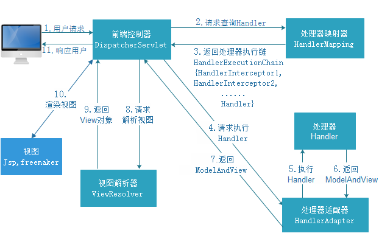

# SpringMVC

<!--markdownlint-disable MD007 -->
<!--markdownlint-disable MD004 -->
<!-- markdownlint-disable MD033 -->

## 课程计划

第一天

1. SpringMVC介绍
2. 入门程序
3. SpringMVC架构讲解
   1. 框架结构
   2. 组件说明
4. SpringMVC整合Mybatis
5. 参数绑定
   1. SpringMVC默认支持的类型
   2. 简单数据类型
   3. pojo类型
   4. pojo包装类型
   5. 自定义参数绑定
6. SpringMVC和Struts2的区别

第二天

1. 高级参数绑定
   1. 数组类型的参数绑定
   2. List类型的绑定
2. @RequestMapping注解的使用
3. @Controller方法返回值
4. SpringMVC中异常处理
5. 图片上传处理
6. Json数据交互
7. SpringMVC实现RESTful
8. 拦截器

## SpringMVC入门

### SpringMVC是什么

SpringWeb MVC和struts2都属于Web层框架，它是Spring框架的一部分


### SpringMVC处理流程


### 入门程序

* 创建web工程
* 导入jar包

    ```txt
    .
    ├── commons-logging-1.1.1.jar
    ├── jstl-1.2.jar
    ├── spring-aop-4.1.3.RELEASE.jar
    ├── spring-aspects-4.1.3.RELEASE.jar
    ├── spring-beans-4.1.3.RELEASE.jar
    ├── spring-context-4.1.3.RELEASE.jar
    ├── spring-context-support-4.1.3.RELEASE.jar
    ├── spring-core-4.1.3.RELEASE.jar
    ├── spring-expression-4.1.3.RELEASE.jar
    ├── spring-jdbc-4.1.3.RELEASE.jar
    ├── spring-jms-4.1.3.RELEASE.jar
    ├── spring-messaging-4.1.3.RELEASE.jar
    ├── spring-tx-4.1.3.RELEASE.jar
    ├── spring-web-4.1.3.RELEASE.jar
    └── spring-webmvc-4.1.3.RELEASE.jar
    ```

* 创建config资源文件夹，创建springmvc.xml

    创建springmvc的核心配置文件  
    springmvc本身就是spring的子项目，对spring兼容性很好，不需要做很多配置。  
    这里只配置一个Controller扫描就可以了，让Spring对页面控制层Controller进行管理

    ```xml
    <?xml version="1.0" encoding="UTF-8"?>
    <beans xmlns="http://www.springframework.org/schema/beans"
        xmlns:xsi="http://www.w3.org/2001/XMLSchema-instance"
        xmlns:p="http://www.springframework.org/schema/p"
        xmlns:context="http://www.springframework.org/schema/context"
        xmlns:mvc="http://www.springframework.org/schema/mvc"
        xsi:schemaLocation="http://www.springframework.org/schema/beans http://www.springframework.org/schema/beans/spring-beans-4.0.xsd
            http://www.springframework.org/schema/mvc http://www.springframework.org/schema/mvc/spring-mvc-4.0.xsd
            http://www.springframework.org/schema/context http://www.springframework.org/schema/context/spring-context-4.0.xsd">

        <!-- 配置controller扫描包 -->
        <context:component-scan
            base-package="com.springmvc.controller" />

    </beans>
    ```

* 创建包`cn.itcast.springmvc.controller`
* 配置前端过滤器

    ```xml
    <!-- 配置SpringMVC前端控制器 -->
    <servlet>
        <servlet-name>SpringMVC_01</servlet-name>
        <servlet-class>org.springframework.web.servlet.DispatcherServlet</servlet-class>
        <!-- 指定SpringMVC配置文件 -->
        <!-- SpringMVC的配置文件的默认路径是/WEB-INF/${servlet-name}-servlet.xml -->
        <init-param>
            <param-name>contextConfigLocation</param-name>
            <param-value>classpath:springmvc.xml</param-value>
        </init-param>
    </servlet>


    <!-- 1./* 拦截所有，包括jsp 2./ 除了jsp，拦截所有 3. *.action *.do -->
    <servlet-mapping>
        <servlet-name>SpringMVC_01</servlet-name>
        <!-- 设置所有以action结尾的请求进入SpringMVC -->
        <url-pattern>*.action</url-pattern>
    </servlet-mapping>
    ```

* 加入jsp页面itemList.jsp

    ```jsp
    <%@ page language="java" contentType="text/html; charset=UTF-8"
        pageEncoding="UTF-8"%>
    <%@ taglib uri="http://java.sun.com/jsp/jstl/core" prefix="c"%>
    <%@ taglib uri="http://java.sun.com/jsp/jstl/fmt" prefix="fmt"%>
    <!DOCTYPE html PUBLIC "-//W3C//DTD HTML 4.01 Transitional//EN" "http://www.w3.org/TR/html4/loose.dtd">
    <html>
    <head>
    <meta http-equiv="Content-Type" content="text/html; charset=UTF-8">
    <title>查询商品列表</title>
    </head>
    <body>
        <form
            action="${pageContext.request.contextPath }/item/queryitem.action"
            method="post">
            查询条件：
            <table width="100%" border=1>
                <tr>
                    <td><input type="submit" value="查询" /></td>
                </tr>
            </table>
            商品列表：
            <table width="100%" border=1>
                <tr>
                    <td>商品名称</td>
                    <td>商品价格</td>
                    <td>生产日期</td>
                    <td>商品描述</td>
                    <td>操作</td>
                </tr>
                <c:forEach items="${itemList }" var="item">
                    <tr>
                        <td>${item.name }</td>
                        <td>${item.price }</td>
                        <td><fmt:formatDate value="${item.createtime}"
                                pattern="yyyy-MM-dd HH:mm:ss" /></td>
                        <td>${item.detail }</td>

                        <td><a
                            href="${pageContext.request.contextPath }/itemEdit.action?id=${item.id}">修改</a></td>
                    </tr>
                </c:forEach>
            </table>
        </form>
    </body>
    </html>
    ```

* 创建pojo items - 我使用mybatis逆向工程自动生成数据库对应的pojo
* 创建ItemController类

    ItemController是一个普通的java类，不需要实现任何借口。
    需要在类上添加@Controller注解，把Controller交由Spring管理
    在方法上面添加@RequestMapping注解，里面指定请求的url。其中`action`可以加也可以不加

    ```java
    @Controller
    public class ItemController {

        // @RequestMapping：里面放的是请求的url，和用户请求的url进行匹配
        // action可以写可以不写
        @RequestMapping("/itemList.action")
        public ModelAndView queryItemList() {

            // 创建页面需要显示的商品数据
            List<Items> list = new ArrayList<Items>();
            list.add(new Items(1, "1华为 荣耀8", 2399f, new Date(), "质量好！1"));
            list.add(new Items(2, "2华为 荣耀8", 2399f, new Date(), "质量好！2"));
            list.add(new Items(3, "3华为 荣耀8", 2399f, new Date(), "质量好！3"));
            list.add(new Items(4, "4华为 荣耀8", 2399f, new Date(), "质量好！4"));
            list.add(new Items(5, "5华为 荣耀8", 2399f, new Date(), "质量好！5"));
            list.add(new Items(6, "6华为 荣耀8", 2399f, new Date(), "质量好！6"));

            // 创建ModelAndView 用来存放数据和视图
            ModelAndView modelAndView = new ModelAndView();

            // 设置数据到模型中
            modelAndView.addObject("itemList", list);

            // 设置视图jsp，需要设置视图的物理地址
            modelAndView.setViewName("/WEB-INF/jsp/itemList.jsp");

            return modelAndView;
        }
    }
    ```

* 启动项目测试
* 总结
  * -->创建动态网络工程2.5
  * -->导入jar包
  * -->创建config并且加入springmvc.xml文件，springmvc.xml配置扫描controller包
  * -->配置前端控制器
  * -->创建controller包
  * -->创建pojo
  * -->创建ItemController
    * 类上要打@Controller的注解
    * 方法上要写 @RequestMapping("/itemList.action")的注解
  * -->加入jsp页面
  * -->启动项目测试

* 注意，如果遇到项目部署完成后，但是包里没有编译好的字节码文件，可能是eclipse中的project-->build automatically没有勾选

## Springmvc架构

### 框架架构



### 框架流程

1. 用户发送请求至前端控制器DispatcherServlet
2. DispatcherServlet收到请求后调用HandlerMapping处理器映射器。
3. 处理器映射器根据请求的url找到具体的处理器，生成处理器对象及处理器拦截器（如果有则生成），一并返回给DispatcherServlet
4. DispatherServlet通过HandlerAdapter处理器适配器调用处理器
5. 执行处理器（Controller，也叫后端控制器）
6. Controller执行完成返回ModelAndView
7. HandlerAdapter将controller执行结果ModelAndView返回给DispatcherServlet
8. DispatcherServlet将ModelAndView传给ViewReslover视图解析器
9. ViewReslover解析后返回具体View
10. DispatcherServlet对View进行渲染视图（即将模型数据填充至视图中）。
11. DispatcherServlet响应用户

### 组件说明

以下组件通常使用框架提供实现

* DispatcherServlet：前端控制器
    > 用户请求到达前端控制器，它就相当于与mvc模式中的c，DispatcherServlet是整个流程控制的中心，由它调用其他组件处理用户的请求，DispatcherServlet的存在降低了组件之间的耦合性
* HandlerMapping：处理器映射器
    > HandlerMapping负责根据用户请求url找到Handler即处理器，springmvc提供了不同的映射器实现不同的映射方式，例如：配置文件方式，实现接口方式，注解方式等。
* Handler：处理器
    > Handler是继DispatcherServlet前端控制器的后端控制器，在DispatcherServlet的控制下Handler对具体的用户请求进行处理。  
    > <font color='red'>由于Handler涉及到具体的用户业务，所以一般情况下需要程序员根据业务需求进行开发Handler。</font>
* HandlerAdapter：处理器适配器
    > 通过HandlerAdapter对处理器进行执行，这是适配器模式，通过扩展适配器可以对更多类型的处理器进行执行  
    > 下图是许多不同的适配器，最终都可以usb接口连接  
    
* ViewResolver：视图解析器
    > ViewResolver负责将处理结果生成View视图，ViewResolver首先根据逻辑视图名解析成物理视图名即具体的页面地址，再生成View视图对象，最后对View进行渲染将处理结果通过页面展示给用户。
* View：视图
    > springmvc框架提供了很多View视图类型的支持，包括，jstlView、freemarkerView、pdfView等，我们最常用的就是jsp  
    > <font color='red'>一般情况下需要通过页面标签或页面模板技术将模型数据通过页面展示给用户，需要由程序员根据业务需求开发具体的页面</font>

> 说明：在springmvc各大组件中，处理器映射器，处理器适配器，视图解析器成为springmvc的三大组件，需要用户开发的组件有handler、view

### 默认加载的组件

我们没有做任何配置，就可以使用这些组件  
因为这些框架已经默认加载了这些组件了，配置文件位置在`/org/springframework/web/servlet/DispatcherServlet.properties`

```txt
# Default implementation classes for DispatcherServlet's strategy interfaces.
# Used as fallback when no matching beans are found in the DispatcherServlet context.
# Not meant to be customized by application developers.

org.springframework.web.servlet.LocaleResolver=org.springframework.web.servlet.i18n.AcceptHeaderLocaleResolver

org.springframework.web.servlet.ThemeResolver=org.springframework.web.servlet.theme.FixedThemeResolver

org.springframework.web.servlet.HandlerMapping=org.springframework.web.servlet.handler.BeanNameUrlHandlerMapping,\
    org.springframework.web.servlet.mvc.annotation.DefaultAnnotationHandlerMapping

org.springframework.web.servlet.HandlerAdapter=org.springframework.web.servlet.mvc.HttpRequestHandlerAdapter,\
    org.springframework.web.servlet.mvc.SimpleControllerHandlerAdapter,\
    org.springframework.web.servlet.mvc.annotation.AnnotationMethodHandlerAdapter

org.springframework.web.servlet.HandlerExceptionResolver=org.springframework.web.servlet.mvc.annotation.AnnotationMethodHandlerExceptionResolver,\
    org.springframework.web.servlet.mvc.annotation.ResponseStatusExceptionResolver,\
    org.springframework.web.servlet.mvc.support.DefaultHandlerExceptionResolver

org.springframework.web.servlet.RequestToViewNameTranslator=org.springframework.web.servlet.view.DefaultRequestToViewNameTranslator

org.springframework.web.servlet.ViewResolver=org.springframework.web.servlet.view.InternalResourceViewResolver

org.springframework.web.servlet.FlashMapManager=org.springframework.web.servlet.support.SessionFlashMapManager
```

### 组件扫描器

使用组件扫描器省去了在Spring容器配置每个Controller类的繁琐。
使用`<context:component-sacn>`自动扫描标记@Controller的控制器类，

* 在springmvc配置文件中配置如下：

    ```xml
    <!-- 配置controller扫描包，多个包之间用,分隔 -->
    <context:component-scan
        base-package="com.springmvc.controller" />
    ```

### 注解映射器和适配器

#### 配置处理器映射器

注解式处理器映射器，对类中标记了@RequestMapping的方法进行映射。根据@RequestMapping定义的url匹配@RequestMapping标记的方法，匹配成功返回HandlerMethod对象给前端控制器。
HandlerMethod对象中封装url对应的方法Method。

从Spring3.1版本开始，废除了DefaultAnnotationHandlerMapping的使用，推荐使用RequestMappingHandlerMapping完成注解式处理器映射。

* 在springmvc.xml配置文件中配置如下

    ```xml
    <bean
        class="org.springframework.web.servlet.mvc.method.annotation.RequestMappingHandlerMapping" />
    ```

注解描述：

@RequestMapping：定义到请求url到处理器功能方法的映射

#### 配置处理器适配器

注解式适配器，对标记@RequestMapping的方法进行适配。

从spring3.1版本开始，废除了AnnotationMethodHandlerAdapter的使用，推荐使用RequestMappingHandlerAdapter完成注解处理器适配

* 在springmvc.xml配置文件中配置如下

    ```xml
    <bean class="org.springframework.web.servlet.mvc.method.annotation.RequestMappingHandlerAdapter" />
    ```

#### 注解驱动

直接配置处理器映射器和处理器适配器比较麻烦，可以使用注解驱动来加载。
SpringMVC使用`<mvc:annotation-driven>`自动加载RequestMappingHandlerMapping和RequestMappingHandlerAdapter

* 可以在springmvc.xml配置文件中使用`<mvc:annotation-driven>`替代注解处理器和适配器的配置

    ```xml
    <!-- 注解驱动 -->
    <mvc:annotation-driven/>
    ```

### 视图解析器

视图解析器使用SpringMVC框架默认的InternalResourceViewResolver，这个视图解析器支持jsp视图解析。

* 在springmvc.xml配置文件中配置如下：

    ```xml
    <bean
        class="org.springframework.web.servlet.view.InternalResourceViewResolver">

        <!-- 配置逻辑视图的前缀 -->
        <property name="prefix" value="/WEB-INF/jsp/"></property>
        <!-- 配置逻辑视图的后缀 -->
        <property name="suffix" value=".jsp"></property>
    </bean>
    ```

最终jsp物理地址，前缀+逻辑视图名+后缀

#### 修改ItemController

* ItemController

    ```java
    @Controller
    public class ItemController {

        // @RequestMapping：里面放的是请求的url，和用户请求的url进行匹配
        // action可以写可以不写
        @RequestMapping("/itemList.action")
        public ModelAndView queryItemList() {

            // 创建页面需要显示的商品数据
            List<Items> list = new ArrayList<Items>();
            list.add(new Items(1, "1华为 荣耀8", 2399f, new Date(), "质量好！1"));
            list.add(new Items(2, "2华为 荣耀8", 2399f, new Date(), "质量好！2"));
            list.add(new Items(3, "3华为 荣耀8", 2399f, new Date(), "质量好！3"));
            list.add(new Items(4, "4华为 荣耀8", 2399f, new Date(), "质量好！4"));
            list.add(new Items(5, "5华为 荣耀8", 2399f, new Date(), "质量好！5"));
            list.add(new Items(6, "6华为 荣耀8", 2399f, new Date(), "质量好！6"));

            // 创建ModelAndView 用来存放数据和视图
            ModelAndView modelAndView = new ModelAndView();

            // 设置数据到模型中
            modelAndView.addObject("itemList", list);

            // 设置视图jsp，需要设置视图的物理地址
            modelAndView.setViewName("itemList");

            return modelAndView;
        }
    }
    ```

* 运行效果一样

## 整合Mybatis

为了更好的学习springmvc和mybaits开发的方法，需要将springmvc和mybatis进行整合。

整合目标，控制层使用springmvc，持久成使用mybatis实现

### 创建数据库表

* sql

    ```sql
    SET FOREIGN_KEY_CHECKS=0;

    -- ----------------------------
    -- Table structure for items
    -- ----------------------------
    DROP TABLE IF EXISTS `items`;
    CREATE TABLE `items` (
    `id` int(11) NOT NULL AUTO_INCREMENT,
    `name` varchar(32) NOT NULL COMMENT '商品名称',
    `price` float(10,1) NOT NULL COMMENT '商品定价',
    `detail` text COMMENT '商品描述',
    `pic` varchar(64) DEFAULT NULL COMMENT '商品图片',
    `createtime` datetime NOT NULL COMMENT '生产日期',
    PRIMARY KEY (`id`)
    ) ENGINE=InnoDB AUTO_INCREMENT=4 DEFAULT CHARSET=utf8;

    -- ----------------------------
    -- Records of items
    -- ----------------------------
    INSERT INTO `items` VALUES ('1', '台式机', '3000.0', '该电脑质量非常好！！！！', null, '2016-02-03 13:22:53');
    INSERT INTO `items` VALUES ('2', '笔记本', '6000.0', '笔记本性能好，质量好！！！！！', null, '2015-02-09 13:22:57');
    INSERT INTO `items` VALUES ('3', '背包', '200.0', '名牌背包，容量大质量好！！！！', null, '2015-02-06 13:23:02');

    -- ----------------------------
    -- Table structure for user
    -- ----------------------------
    DROP TABLE IF EXISTS `user`;
    CREATE TABLE `user` (
    `id` int(11) NOT NULL AUTO_INCREMENT,
    `username` varchar(32) NOT NULL COMMENT '用户名称',
    `birthday` date DEFAULT NULL COMMENT '生日',
    `sex` char(1) DEFAULT NULL COMMENT '性别',
    `address` varchar(256) DEFAULT NULL COMMENT '地址',
    PRIMARY KEY (`id`)
    ) ENGINE=InnoDB AUTO_INCREMENT=27 DEFAULT CHARSET=utf8;

    -- ----------------------------
    -- Records of user
    -- ----------------------------
    INSERT INTO `user` VALUES ('1', '王五', null, '2', null);
    INSERT INTO `user` VALUES ('10', '张三', '2014-07-10', '1', '北京市');
    INSERT INTO `user` VALUES ('16', '张小明', null, '1', '河南郑州');
    INSERT INTO `user` VALUES ('22', '陈小明', null, '1', '河南郑州');
    INSERT INTO `user` VALUES ('24', '张三丰', null, '1', '河南郑州');
    INSERT INTO `user` VALUES ('25', '陈小明', null, '1', '河南郑州');
    INSERT INTO `user` VALUES ('26', '王五', null, null, null);
    ```

### 需要的jar包

1. spring（包括springmvc）
2. mybatis
3. mybatis-spring整合包
4. 数据库连接池
5. 第三方驱动包

### 整合思路

* Dao层：
  * SqlMapConfig.xml 空文件即可，但是需要文件头
  * applicationContext-dao.xml
    * 数据库连接池
    * SqlSessionFactory对象，需要spring和mybatis整合包下的
    * 配置mapper文件扫描器。
* Service层
  * applicationContext-service.xml包扫描器，扫描@service注解的类。
  * applicationContext-trans.xml配置事务。
* Controller层
  * Springmvc.xml
    * 包扫描器，扫描@Controller注解的类。
    * 配置注解驱动
    * 配置视图解析器
* Web.xml文件
  * 配置spring
  * 配置前端控制器

## 实现商品列表显示

### 需求

实现商品查询列表，从mysql数据库查询商品信息

* Mapper/Dao开发 & pojo类创建

    使用逆向工程，生成代码

    注意修改逆向工程的配置文件，参考之前Mybatis_day02

    

* 创建ItemService接口和ItemServiceImpl实现类

    ```java
    public interface ItemService {
        /**
        * 查询商品列表
        * @return
        */
        List<Items> queryItemList();
    }
    ```

    ```java
    // @Service相当于在applicationContext注册bean标签
    @Service("itemService")
    public class ItemServiceImpl implements ItemService {

        // @Resource实际上就是在这个类的bean标签中注入id为itemsMapper的属性
        @Resource(name = "itemsMapper")
        private ItemsMapper itemsMapper;

        @Override
        public List<Items> queryItemList() {
            List<Items> list = itemsMapper.selectByExampleWithBLOBs(null);
            return list;
        }
    }
    ```

* ItemController - web层

    ```java
    @Controller
    public class ItemController {

        @Resource(name = "itemService")
        private ItemService itemService;

        /**
        * 显示商品列表
        * 
        * @return
        */
        @RequestMapping("/itemList")
        public ModelAndView queryItemList() {
            List<Items> items = this.itemService.queryItemList();

            for (Items i : items) {
                System.out.println(i);
            }

            ModelAndView modelAndView = new ModelAndView();
            // 把商品数据放到模型中
            modelAndView.addObject("itemList", items);
            // 设置逻辑视图
            modelAndView.setViewName("itemList");
            return modelAndView;
        }
    }
    ```

* 测试
* 注意出的几个bug
  * 数据库连接的时候引发时区问题
  * service调用的方法是`selectByExampleWithBLOBs`，否则无法显示detail属性，具体可以去找UserMappe.xml看过程
* 总结
  * -->使用Mybatis逆向工程开发出Dao/Mapper+pojo/bean类
  * -->开发service接口和service实现类
  * -->开发Controller让用户访问连接的时候能找当相应的handler
  * -->测试

## 参数绑定

### 默认支持的参数类型

#### 需求分析

* 编辑商品信息,首先要显示商品详情  
* 需要根据商品id查询商品信息,然后展示到页面  
* 请求url：/itemEdit.action  
* 参数：id（商品id）  
* 响应结果：商品编辑页面，展示商品详细信息  

* ItemService接口和其实现

    ```java
    /**
        * 通过id查商品
        * @param id
        * @return
        */
    Items queryItemById(int id);
    ```

    ```java
    @Override
    public Items queryItemById(int id) {
        Items item = itemsMapper.selectByPrimaryKey(id);
        return item;
    }
    ```

* ItemController

    ```java
    @RequestMapping("/itemEdit")
    public ModelAndView queryItemById(HttpServletRequest request) {
        // 从request中获得请求参数
        String strId = request.getParameter("id");
        Integer id = Integer.valueOf(strId);

        // 根据id查询商品数据
        Items item = this.itemService.queryItemById(id);

        // 把结果传递给页面
        ModelAndView modelAndView = new ModelAndView();

        // 把商品数据放在模型中
        modelAndView.addObject("item", item);

        // 设置逻辑视图
        modelAndView.setViewName("editItem");
        return modelAndView;
    }
    ```

* 默认支持的参数类型

    处理器形参中添加如下类型的参数处理适配器会默认识别并进行赋值。

    * HTTPServletRequest  - 通过request对象获取请求信息
    * HttpServletResponse - 通过Response处理响应信息
    * HttpSession         - 通过Session对象得到Session中存放的对象

#### Model/ModelMap

##### Model

除了ModelAndView以外，还可以使用Model来向页面传递数据，Model是一个接口，在参数里直接声明model即可

如果使用Model则不可以使用ModelAndView对象，Model对象可以向页面传递数据，View对象则可以使用String返回值替代。

不管是Model还是ModelAndView，其本质都是使用Request对象像Jsp传递数据。

* Controller

    ```java
    @RequestMapping("/itemEdit")
        public String queryItemById(HttpServletRequest request,Model model) {
            // 从request中获得请求参数
            String strId = request.getParameter("id");
            Integer id = Integer.valueOf(strId);

    //      // 根据id查询商品数据
            Items item = this.itemService.queryItemById(id);
    //
    //      // 把结果传递给页面
    //      ModelAndView modelAndView = new ModelAndView();
    //
    //      // 把商品数据放在模型中
    //      modelAndView.addObject("item", item);
    //
    //      // 设置逻辑视图
    //      modelAndView.setViewName("editItem");

            // 把商品数据放在模型中
            model.addAttribute("item", item);

            return "editItem";
        }
    ```

##### ModelMap

ModelMap是Model接口的实现类，也可以通过ModelMap向页面传递数据

使用Model和ModelMap的效果一样，如果直接使用Model，springmvc会实例化ModelMap

* Controller

    ```java
    @RequestMapping("/itemEdit")
        public String queryItemById(HttpServletRequest request,ModelMap model) {
            // 从request中获得请求参数
            String strId = request.getParameter("id");
            Integer id = Integer.valueOf(strId);

    //      // 根据id查询商品数据
            Items item = this.itemService.queryItemById(id);
    //
    //      // 把结果传递给页面
    //      ModelAndView modelAndView = new ModelAndView();
    //
    //      // 把商品数据放在模型中
    //      modelAndView.addObject("item", item);
    //
    //      // 设置逻辑视图
    //      modelAndView.setViewName("editItem");

            // 把商品数据放在模型中
            model.addAttribute("item", item);

            return "editItem";
        }
    ```

### 绑定简单类型

当请求的参数名称和处理器形参<font color='red'>名称一致</font>时会将请求参数与形参进行绑定。

这样，从Request取参数的方法就可以进一步的简化。

* Controller

    ```java
    @RequestMapping("/itemEdit")
    public String queryItemById(int id,ModelMap model) {
        Items item = this.itemService.queryItemById(id);
        model.addAttribute("item", item);
        return "editItem";
    }
    ```

#### 支持的数据类型

参数类型<font color='red'>推荐使用包装数据类型</font>，因为基础数据类型不可以为null

* 整形：Integer、int
* 字符串：String
* 单精度：Float、float
* 双精度：Double、double
* 布尔型：Boolean、boolean
  * 说明：对于布尔类型的参数，请求的参数值为true或false。或者0或者1
  * 请求url `http://localhost:8080/xxx.action?id=1&status=false`
  * 处理器方法 `public String editItem(Model model,Integer id,Boolean status)`

#### @RequestParam

使用@RequestParam常用于处理简单类型的绑定

* value         ：参数名字，即入参的请求参数名字，如`value="itemId"` 表示请求的参数区的名字为itemId的参数的值传入
* required      ：是否必须，默认是true，表示请求中一定要有相应的参数，否则将报错
* defaultValue  ：默认值，表示如果请求中没有同名参数时的默认值

    ```java
    @RequestMapping("/itemEdit")
    public String queryItemById(@RequestParam(value = "itemId", required = true, defaultValue = "1") Integer id,
            ModelMap model) {

        Items item = this.itemService.queryItemById(id);
        model.addAttribute("item", item);
        return "editItem";
    }
    ```

* Request报的错 TTP Status 400 - Required Integer parameter 'XXXX' is not present

### 绑定pojo类型

* 需求 - 将页面修改后的商品信息保存到数据库中。

* 需求分析
  * 请求的url：/updateItem.action
  * 参数：表单中的数据
  * 响应内容：更新成功的页面

* 使用pojo接收表单数据 - Items类pojo逆向工程生成
* ItemService接口及其实现类

    ```java
    /**
        * 通过id更新商品
        * @param items
        */
    void updateItemById(Items items);
    ```

    ```java
    @Override
    public void updateItemById(Items items) {
        itemsMapper.updateByPrimaryKey(items);
    }
    ```

* Controller

    ```java
    @RequestMapping("/updateitem")
    public String updateItemById(Items items) {
        items.setCreatetime(new Date());
        itemService.updateItemById(items);
        return "success";
    }
    ```

* 编写success页面

#### 解决post乱码问题

提交发现，保存成功，但是保存的是乱码

* 在web.xml中加入

    ```xml
    <!-- 解决post乱码问题 -->
    <filter>
        <filter-name>encoding</filter-name>
        <filter-class>org.springframework.web.filter.CharacterEncodingFilter</filter-class>
        <!-- 设置编码参是UTF8 -->
        <init-param>
            <param-name>encoding</param-name>
            <param-value>UTF-8</param-value>
        </init-param>
    </filter>
    <filter-mapping>
        <filter-name>encoding</filter-name>
        <url-pattern>/*</url-pattern>
    </filter-mapping>
    ```

以上可以解决post请求乱码问题。

对于get请求中文参数出现乱码解决方法有两个：

* 修改tomcat配置文件添加编码与工程编码一致，如下

    ```xml
    <Connector URIEncoding="utf-8" connectionTimeout="20000" port="8080" protocol="HTTP/1.1" redirectPort="8443"/>
    ```

* 另一种方法对参数进行重新编码

    ```java
    String userName new String(request.getParamter("userName").getBytes("ISO8859-1"),"utf-8")
    ```

    ISO-8859-1是tomcat默认编码，需要将tomcat编码后的内容解成字节，然后按utf-8编码

### 绑定包装pojo

* 需求 - 使用包装的pojo接收商品信息的查询条件

* pojo对象定义如下

    ```java
    public class QueryVo {
        private Items items;

        public Items getItems() {
            return items;
        }

        public void setItems(Items items) {
            this.items = items;
        }
    }
    ```

* 页面定义如下图

    ```html
    <table width="100%" border=1>
        <tr>
            <td>商品ID<input type="text" name="items.id"></td>
            <td>商品名称<input type="text" name="items.name"></td>
            <td><input type="submit" value="查询" /></td>
        </tr>
    </table>
    ```

* 接收查询条件

    ```java
    // 绑定包装数据类型
    @RequestMapping("/queryItem")
    public String queryItem(QueryVo queryVo) {
        System.out.println(queryVo.getItem().getId());
        System.out.println(queryVo.getItem().getName());

        return "success";
    }
    ```

### 自定义参数绑定

* 需求

    > 在商品修改页面可以修改商品的生产日期，并且根据业务需求自定义日期格式。

* 需求分析

    由于日期数据有很多格式，springmvc没办法把字符串转换成日期类型。所以需要自定义参数

* 修改jsp页面

    ```html
    <tr>
        <td>商品生产日期</td>
        <td><input type="text" name="createtime"
            value="<fmt:formatDate value="${item.createtime}" pattern="yyyy-MM-dd HH:mm:ss"/>" /></td>
    </tr>
    ```

* 自定义Converter

    ```java
    //Converter<S, T>
    //S:source,需要转换的源的类型
    //T:target,需要转换的目标类型
    public class DateConverter implements Converter<String, Date> {

        @Override
        public Date convert(String source) {
            try {
                // 把字符串转换为日期类型
                SimpleDateFormat simpleDateFormat = new SimpleDateFormat("yyy-MM-dd HH:mm:ss");
                Date date = simpleDateFormat.parse(source);

                return date;
            } catch (ParseException e) {
                // TODO Auto-generated catch block
                e.printStackTrace();
            }
            // 如果转换异常则返回空
            return null;
        }
    }
    ```

* 配置Converter
  * 我们可以配置多个转换器

    ```xml
    <!-- 配置注解驱动 -->
    <!-- 如果配置此标签,可以不用配置... -->
    <mvc:annotation-driven conversion-service="conversionService" />

    <!-- 转换器配置 -->
    <bean id="conversionService" class="org.springframework.format.support.FormattingConversionServiceFactoryBean">
        <property name="converters">
            <set>
                <bean class="cn.itcast.springmvc.converter.DateConverter" />
            </set>
        </property>
    </bean>
    ```

    ```xml
    <!--注解适配器 -->
    <bean class="org.springframework.web.servlet.mvc.method.annotation.RequestMappingHandlerAdapter">
    <property name="webBindingInitializer" ref="customBinder"></property>
    </bean>

    <!-- 自定义webBinder -->
    <bean id="customBinder" class="org.springframework.web.bind.support.ConfigurableWebBindingInitializer">
    <property name="conversionService" ref="conversionService" />
    </bean>

    <!-- 转换器配置 -->
    <bean id="conversionService" class="org.springframework.format.support.FormattingConversionServiceFactoryBean">
    <property name="converters">
        <set>
            <bean class="cn.itcast.springmvc.convert.DateConverter" />
        </set>
    </prope

    ```

## springmvc和struts2不同

1. springmvc的入口是一个servlet即前端控制器，而struts2入口是一个filter过滤器。
2. springmvc是基于方法开发（一个url对应一个方法），请求参数传递到方法的形参，可以设计为单利或多例模式（建议单例），struts2是基于类开发，传递参数是通过类的属性，只能设计为多例。
3. Struts采用值栈存储请求和响应数据，通过OGNL存取数据，springmvc通过参数解析器是将request请求内容解析，并给方法形参赋值，将数据封装成ModelAndView对象，最后又将ModelAndView中的模型数据通过request域传输到页面上，jsp视图解析器默认使用jstl。

## springmvc线程安全问题

```txt
　　对于使用过SpringMVC和Struts2的人来说，大家都知道SpringMVC是基于方法的拦截，而Struts2是基于类的拦截。struct2为每一个请求都实例化一个action所以不存在线程安全问题，springmvc默认单例请求使用一个Controller，假如这个Controller中定义了静态变量，就会被多个线程共享。所以springmvc的controller不要定义静态变量。如果要使用可以用ThreadLocal或者@Scope("prototype")开启不以单例的模式运行但是以这种方式运行就不是单例了会有额外的开销。那么有人就会问了，spring管理的bean默认也是单例的，是不是说除了controller，我后面的service和dao是也要注意线程安全问题？这个问题就要具体问题具体回答了，这里对线程安全问题的产生做个简单的介绍也许你就会懂了。
　　我们都知道线程安全问题其实就是数据共享问题。如果多个线程之间共享了同一份数据就存在同时操作这个数据的可能。这个时候就会出现
和预期的偏差，这就是线程安全问题。
在谈这个问题之前我们需要知道java内存哪些是多线程共享的，那些是线程独有的。
Java平台中的内存包括以下几种：Stack空间、Heap空间和Non-Heap空间,stack是线程独享的，heap和non-heap是线程间共享的。
stack：栈，每个线程都有自己的栈，他主要用来存放局部变量的值即对象的引用。
heap：堆，所有的对象都是放到堆里面的，实例变量的值是存储在Heap空间的。实例变量是可以被多线程共享的。
non-heap:静态变量的值是存储在Non-Heap空间中的，也是线程间共享的。
有如下的类：
class A{
 private int a=0;
 private static int b=1;
 public void method(){
  int c=0;
  boolean flag = true;
  List<String> list=new LinkedList<String>();
 }}
}
其中a是实例变量会被多个线程共享（A类如果是singleton的话）
b是静态变量（类变量）会被多个线程共享
c是局部变量用线程独享的stack存放
list存放指向堆上的对象的引用也是线程独享的
这里还实例化了一个LinkedList对象是放在heap上的这个是可以共享的，但是对例子上的这个对象来讲
method每次被调用都会生成一个LinkedList实例，因此list变量所引用的对象实际上只有一个线程可以访问。

到这里大家应该对使用单例还是多例有个明确的认识了吧。笼统的讲当模式是单例的时候，而类里面有静态变量和实例变量的时候要考虑线程安全问题了，这个时候的一些集合操作最好使用并发包java.util.concurrent里面的额相关集合类
```

## 总结

* springmvc入门
  * springmvc是什么 - web层框架
  * springmvc的处理流程
  * 入门程序
    * 创建web动态工程
    * 导入springmvc的jar包
    * 加入配置文件
      * springmvc.xml
      * 配置前端控制器
    * 加入jsp页面
    * 实现显示商品列表页
      * 创建pojo
      * 创建ItemController
        * @RequestMapping("")
    * 测试
* springmvc架构
  * 框架结构
  * 架构流程
  * 组件说明
    * DispatcherServlet：前端控制器
    * HandlerMapping：处理器映射器
    * Handler：处理器
    * HandlerAdapter：处理器适配器
    * ViewResolver：视图解析器
    * View：视图
    * 三大组件 HandlerMapping HandlerAdapter ViewReslover
  * 默认加载的组件
  * 组件扫描器 - 省去spring容器配置每个controller类的繁琐`<context:component-sacn>`、
  * 注解映射器和适配器 - 老版本无效问题
    * 配置处理映射器
    * 配置处理器适配器
    * 注册驱动
  * 视图解析器
    * 修改ItemController的前后缀
* 整合mybatis
  * 创建数据库表
  * 加入需要的jar包
  * 整合思路
    * Dao层
      * sqlMapConfig.xml空文件即可，但是需要文件头（别名在逆向工程已经生成）
      * applicationContext-dao.xml
        * 数据库连接池
        * sqlSessionFactory对象，需要spring和mybatis整合包下的sqlSessionFactorybean实现
        * 配置mapper文件扫描
    * Service层
      * applicationContext-service.xml包扫描器，扫描@Service类
      * application-trans.xml配置事务
    * Controller层
      * Springmvc.xml
        * 包扫描器，扫描@Controller注释的类
        * 配置注解驱动
        * 配置视图解析器
    * Web.xml文件
      * 配置spring监听器
      * 配置前端控制器
  * 创建工程
  * 整合jar包
  * 加入配置文件
    * sqlMapConfig.xml
    * db.properties
    * application-dao.xml
    * application-Context-service.xml
    * applicationContext-trans.xml
    * spring-mvc.xml
    * web.xml
      * 把spring中的application*.xml配置到spring工厂
      * 中心控制器
  * 加入jsp页面 -->整合完毕。
* 实现商品列表显示
  * Mapper&pojo mybatis逆向工程
  * 创建ItemService接口&ItemServiceImpl实现类
  * 创建ItemController - web层
  * 测试
  * 注意几个小bug
    * 数据库时区问题
    * service调用的方法是selectByExampleWithBLOBs，详情可以看ItemMapper.xml
* 参数绑定
  * 默认支持参数类型
    * HttpServletRequest
    * HttpServletResponse
    * HttpSession
    * Model/ModelMap
  * 绑定简单类型
    * 当请求参数名称与处理器形参名称一致时会将请求参数与形参绑定
    * 支持的数据类型
      * Integer int
      * String
      * Float float
      * Double double
      * Boolean boolean
        * 参数值可10，可true false
    * @Requestparam常用于处理简单类型绑定
      * value 参数名
      * required 是否必须
      * defaultValue默认值
    * 绑定pojo类型
      * 需求 - 将页面修改后的商品信息保存到数据库中。
      * 使用pojo接收表单数据
        * 要求：pojo对象中的属性名和表单input的name属性要一致
      * ItemService接口和实现类
      * Controller
      * 跳转到success页面
      * 解决post乱码问题
        * 加入过滤器
    * 绑定包装pojo
      * 表单中name改为item.id和item.name
      * 在Controller加入对应处理器
    * 自定义参数绑定
      * 编写DataConverter实现Converter
      * springmvc.xml配置FormattingConversionServiceFactoryBean，把转换器放进去。
* springmvc并发讨论
