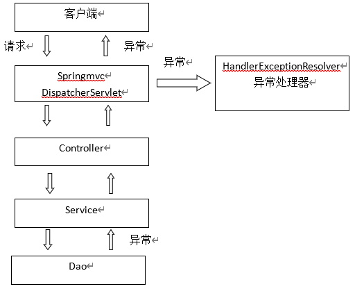
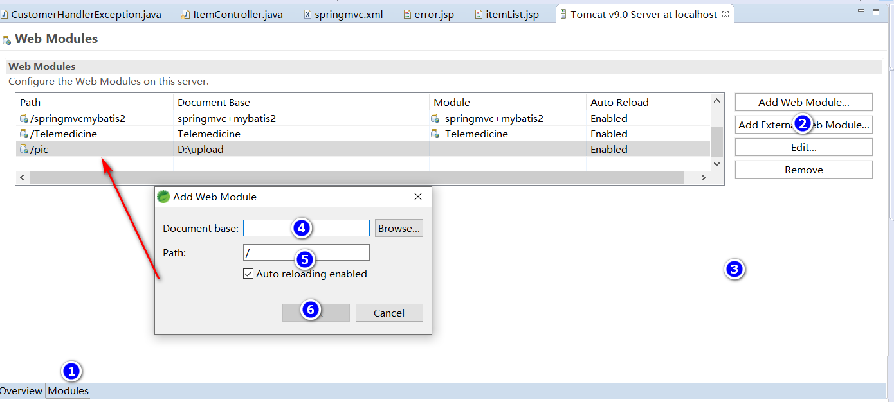
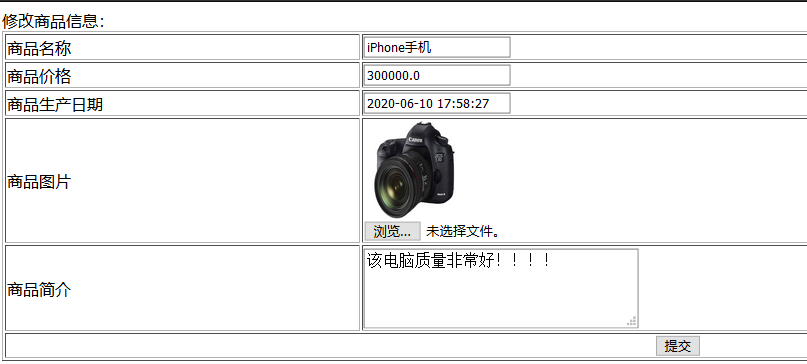
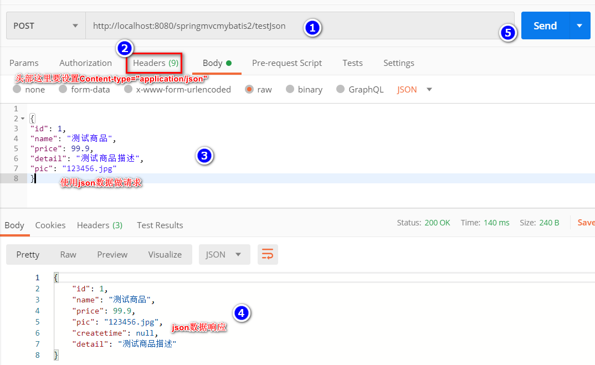

# SpringMVC_02

## 课程计划

* 高级参数绑定
  * 数组类型的参数绑定
  * List类型的绑定
* @RequestMapping注释的使用
* Controller方法返回值
* Springmvc中异常处理
* 图片上传处理
* Json数据交互
* Springmvc实现RESTful
* 拦截器

## 高级参数绑定

### 绑定数组

* 需求 - 在商品列表页面中选中多个商品，然后删除。
* 需求分析
    > 功能要求商品页面中的每个商品前有一个checkbox，选中多个商品然后点击删除按钮把商品id传递给Controller，根据商品id删除商品信息。

* jsp修改

    ```html
    <form
        action="${pageContext.request.contextPath }/deleteBatchItem.action">
        商品列表：
        <table width="100%" border=1>
            <tr>
                <td>选择</td>
                <td>商品名称</td>
                <td>商品价格</td>
                <td>生产日期</td>
                <td>商品描述</td>
                <td>操作</td>
            </tr>
            <c:forEach items="${itemList }" var="item">
                <tr>
                    <td><input type="checkbox" name="ids" value="${ item.id }" /></td>
                    <td>${item.name }</td>
                    <td>${item.price }</td>
                    <td><fmt:formatDate value="${item.createtime}"
                            pattern="yyyy-MM-dd HH:mm:ss" /></td>
                    <td>${item.detail }</td>

                    <td><a
                        href="${pageContext.request.contextPath }/itemEdit.action?id=${item.id}">修改</a></td>
                </tr>
            </c:forEach>
        </table>
        <input type="submit" value="批量删除">
    </form>
    ```

    页面选中多个checkbox向Controller方法传递  
    form表单提交的url是deleteBatchItem.action

* Controller

  * 方式一

    ```java
    @RequestMapping("/deleteBatchItem")
    public String deleteBatchItem(Integer[] ids) {
        for (Integer integer : ids) {
            System.out.println(integer);
        }
        return "success";
    }
    ```

  * 方式二

    ```java
    @RequestMapping("/deleteBatchItem")
    public String deleteBatchItem(QueryVo vo) {
        for (Integer integer : vo.getIds()) {
            System.out.println(integer);
        }
        return "success";
    }
    ```

### 将表单的数据绑定到list

* 需求 - 实现商品数据的批量修改。
* 开发分析

  * 在商品列表页面中可以对商品信息进行修改。
  * 可以批量提交修改后的商品数据

* 定义pojo
  * List中存放对象，并将定义的List放在包装类QueryVo中

    ```java
    public class QueryVo {
        private Items items;

        // 用对象的属性接收数组，属性名要同网页的name相同
        private Integer[] ids;

        // 用对象的属性接收List集合
        private List<Items> itemList;
        // 记得要添加get&set方法
    }
    ```

* jsp改造

    ```html
    <head>
    <meta http-equiv="Content-Type" content="text/html; charset=UTF-8">
    <title>查询商品列表</title>
    <script src="http://apps.bdimg.com/libs/jquery/2.1.4/jquery.min.js"></script>
    <script type="text/javascript">
        function batchUpdate() {
            $.ajax({
                //几个参数需要注意一下
                type : "POST",//方法类型
                dataType : "html",//预期服务器返回的数据类型
                url : "deleteBatchItem.action",//url
                data : $('#form1').serialize(),
                success : function(result,state,a) {
                    console.log(result);//打印服务端返回的数据(调试用)
                    if (a.status == 200) {
                        alert("SUCCESS");
                    };
                },
                error : function() {
                    alert("异常！");
                }
            });
        }
    </script>
    </head>
    <body>
        <form id="form1"
            action="${pageContext.request.contextPath }/deleteBatchItem.action">
            商品列表：
            <table width="100%" border=1>
                <c:forEach items="${itemList }" var="item" varStatus="s">
                    <tr>
                        <input type="hidden" name="itemList[${s.index}].id"
                            value="${item.id }">
                        <td><input type="checkbox" name="ids" value="${ item.id }" /></td>
                        <td><input type="text" name="itemList[${s.index}].name"
                            value="${item.name }" /></td>
                        <td><input type="text" name="itemList[${s.index}].price"
                            value="${item.price }" /></td>
                        <td><input type="text" name="itemList[${s.index}].createtime"
                            value="<fmt:formatDate value="${item.createtime}"
                                pattern="yyyy-MM-dd HH:mm:ss" />" /></td>
                        <td><input type="text" name="itemList[${s.index}].detail"
                            value="${item.detail }" /></td>

                        <td><a
                            href="${pageContext.request.contextPath }/itemEdit.action?id=${item.id}">修改</a></td>
                    </tr>
                </c:forEach>
            </table>
            <input type="submit" value="批量删除"> <input type="button"
                onclick="batchUpdate()" value="批量更新" />
        </form>
    </body>
    </html>
    ```

* Controller

    ```java
    @RequestMapping("/deleteBatchItem")
    public String deleteBatchItem(QueryVo vo) {
        for (Items i : vo.getItemList()) {
            System.out.println(i);
        }
        return "success";
    }
    ```

* 注意

  * ${current}    当前这次迭代的（集合中的）项
  * ${status.first}   判断当前项是否为集合中的第一项，返回值为true或false
  * ${status.last}    判断当前项是否为集合中的最
  * varStatus属性常用参数总结下：
  * ${status.index}   输出行号，从0开始。
  * ${status.count}   输出行号，从1开始。
  * ${status.后一项，返回值为true或false
  * begin、end、step分别表示：起始序号，结束序号，跳跃步伐。

## RequestMapping

### URL路径映射

@RequestMapping(value="item") 或 RequestMapping("/item"）

* value是数组，可以是多个

    ```java
    /**
        * 显示商品列表
        *
        * @return
        */
    @RequestMapping(value = { "itemList", "itemListAll" })
    public ModelAndView queryItemList() {
        List<Items> items = this.itemService.queryItemList();

        for (Items i : items) {
            System.out.println(i);
        }

        ModelAndView modelAndView = new ModelAndView();
        // 把商品数据放到模型中
        modelAndView.addObject("itemList", items);
        // 设置逻辑视图
        modelAndView.setViewName("itemList");
        return modelAndView;
    }
    ```

* 添加到类上面

    ```java
    @Controller
    @RequestMapping("item")
    public class ItemController {

        @Resource(name = "itemService")
        private ItemService itemService;

        /**
        * 显示商品列表
        *
        * @return
        */
        @RequestMapping(value = { "itemList", "itemListAll" })
        public ModelAndView queryItemList() {
            List<Items> items = this.itemService.queryItemList();

            for (Items i : items) {
                System.out.println(i);
            }

            ModelAndView modelAndView = new ModelAndView();
            // 把商品数据放到模型中
            modelAndView.addObject("itemList", items);
            // 设置逻辑视图
            modelAndView.setViewName("itemList");
            return modelAndView;
        }
    ```

    此时需要进入queryItemList方法的请求url为：  
    `http://127.0.0.1:8080/springmvcmybatis2/item/itemListAll.action`  
    或者  
    `http://127.0.0.1:8080/springmvcmybatis2/item/itemList.action`

### 请求方法限定

除了可以对URl进行设置，还可以限定请求进来的方法

* 限定get方法

    `@RequestMapping(value = { "itemList", "itemListAll" },method = RequestMethod.GET)`

* 限定post方法

    `@RequestMapping(value = { "itemList", "itemListAll" },method = RequestMethod.POST)`

* get和post方法都可以

    `@RequestMapping(value = { "itemList", "itemListAll" },method = RequestMethod.GET)`

* 注意当限制成get方法，则只能以get方式方式访问url，post，那只能以post方式，也可以限定多个。
* 如果限定post，用get访问结果为

    ```txt
    HTTP Status 405 – Method Not Allowed

    Type Status Report

    消息 Request method 'GET' not supported

    描述 请求行中接收的方法由源服务器知道，但目标资源不支持
    ```

## Controller方法返回值

### 返回ModelAndView

Controller方法中定义ModelAndView对象并返回，对象中可添加model数据、指定view，参考第一天内容。

### 返回void

在Controller方法形参上定义request和response，使用request或response指定响应结果；

1. 使用request转发页面，如下：

    ```java
    request.getRequestDispatcher("/WEB-INF/jsp/success.jsp").forward(request, response);
    ```

2. 可以通过response页面重定向

    ```java
    response.sendRedirect("url")
    response.sendRedirect("/springmvc-web2/itemEdit.action");
    ```

3. 可以通过response指定响应结果，例如响应json数据如下：

    ```java
    response.getWriter().print("{\"abc\":123}");
    ```

* 代码演示

    ```java
    @RequestMapping("queryItema")
    public void queryItem(HttpServletRequest request, HttpServletResponse response)
            throws ServletException, IOException {
        // 1. 使用request进行转发
        // request.getRequestDispatcher("/WEB-INF/jsp/success.jsp").forward(request,
        // response);

        // 2. 使用response进行重定向到编辑页面
        // response.sendRedirect("itemEdit.action");

        // 3.使用response直接显示
        response.getWriter().print("{\"abc\":123}");
    }
    ```

### 返回字符串

Controller方法返回字符串可以指定逻辑视图名，通过视图解析器解析为物理视图地址

#### 逻辑视图名

* Controller方法返回字符串可以指定逻辑视图名，通过视图解析器解析为物理视图地址。

    ```java
    // 指定逻辑视图名
    return "itemList";
    ```

#### Redirect重定向

* Controller方法返回字符串可以重定向一个url地址
* 如下商品修改提交后重定向到商品编辑页面

    ```java
    @RequestMapping("updateitem")
    public String updateItemById(Items items) {
        System.out.println(items.getCreatetime().toString());
        itemService.updateItemById(items);
        return "redirect:/itemEdit.action?itemId=" + items.getId();
    }
    ```

#### forward转发

* Controller方法执行后继续执行另一个Controller方法
* 如下商品修改提交后转向商品修改页面，修改商品的id参数可以带到商品修改方法中。

    ```java
    @RequestMapping("updateitem")
    public String updateItemById(Items items) {
        // 更新商品
        System.out.println(items.getCreatetime().toString());
        this.itemService.updateItemById(items);


        // 修改商品成功后，重定向商品编辑页面
        // 重定向后浏览器地址变更为重定向地址
        // 重定向相当于执行了新的request和response，所以之前的请求参数都会丢失
        // 如果要指定请求参数，需要重定向的url后面添加?itemId=1这样的请求参数
        // return "redirect:/itemEdit.action?itemId=" + items.getId();

        // 修改商品成功后，继续执行另一个方法
        // 使用转发的方式实现，转发后浏览器地址栏还是原来的请求地址
        // 转发并没有执行新的request和response，所以之前的请求参数都存在
        return "forward:/itemEdit.action";
    }
    ```

* 因为请求修改商品的时候，请求参数里面只有id属性，没有itemid属性
* 所以要修改，如下

    ```java
    @RequestMapping("itemEdit")
    public String queryItemById(@RequestParam(value = "id", required = true, defaultValue = "1") Integer id,
            ModelMap model) {

        Items item = this.itemService.queryItemById(id);
        model.addAttribute("item", item);
        return "editItem";
    }
    ```

## 异常处理器

> springmvc在处理请求过程中出现异常信息交由异常处理器进行处理，自定义异常处理器可以实现一个系统的异常处理逻辑。

### 异常处理思路

* 系统中异常包括两类
  * 预期异常
    * 预期异常通过捕获从而获取异常信息
  * 运行时异常RuntimeException
    * 运行异常主要通过规范代码开发、测试通过手段减少运行时异常的发生

系统的dao、service、controller出现都通过throws Exception向上抛出，最后由springmvc前端控制器交由异常处理器进行异常处理，如下图



### 自定义异常类

为了区分不同的异常，通常根据异常类型进行区分，这里我们创建一个自定义系统异常。

如果Controller、Service、dao抛出此类异常说明是系统预期处理的异常信息。

```java
public class MyException extends Exception {
    // 异常信息
    private String message;

    public MyException() {
        super();
    }

    public MyException(String message) {
        super();
        this.message = message;
    }

    public String getMessage() {
        return message;
    }

    public void setMessage(String message) {
        this.message = message;
    }
}
```

### 自定义异常处理器

```java
public class CustomerHandlerException implements HandlerExceptionResolver {

    @Override
    public ModelAndView resolveException(HttpServletRequest request, HttpServletResponse response, Object handler,
            Exception exception) {
        // 定义异常信息
        String msg;

        // 判断异常类型
        if (exception instanceof MyException) {
            // 如果是自定义异常，读取异常信息
            msg = exception.getMessage();
        } else {
            // 如果是运行时异常，则取错误堆栈，从堆栈中获取异常信息
            Writer out = new StringWriter();
            PrintWriter s = new PrintWriter(out);
            exception.printStackTrace(s);
            msg = out.toString();
        }

        // 把错误信息发送给相关人员，邮件，短信等方式
        // TODO

        // 返回错误页面，给用户友好页面显示错误信息
        ModelAndView modelAndView = new ModelAndView();
        modelAndView.addObject("msg", msg);
        modelAndView.setViewName("error");
        return modelAndView;
    }
}
```

### 异常处理器配置

在Springmvc.xml中配置。

```xml
<!-- 配置全局异常处理器 -->
<bean id="customerHandlerException" class="com.springmvc.exception.handler.CustomerHandlerException"/>
```

### 错误页面

```html
<%@ page language="java" contentType="text/html; charset=UTF-8"
    pageEncoding="UTF-8"%>
<!DOCTYPE html>
<html>
<head>
<meta charset="UTF-8">
<title>Insert title here</title>
</head>
<body>
    <h1>访问的页面，出错了...</h1>
    <hr>
    <h1>异常信息</h1>
    <hr>
    <h2>${ msg }</h2>
</body>
</html>
```

### 异常测试

```java
/**
    * 抛出异常测试
    */
@RequestMapping("throwExeption")
public ModelAndView throwExeption() throws Exception {
    // 自定义异常
    if (true) {
        throw new MyException("自定义异常出现了~");
    }

    // 运行时异常
    int a = 1 / 0;

    // 查询商品数据
    List<Items> list = this.itemService.queryItemList();
    // 创建ModelAndView,设置逻辑视图名
    ModelAndView mv = new ModelAndView("itemList");
    // 把商品数据放到模型中
    mv.addObject("itemList", list);

    return mv;
}
```

## 上传图片

### 配置虚拟目录

在Tomcat上配置虚拟目录，有两种方法

* 在tomcat下conf/server.xml中添加：

    ```xml
    <Context docBase="D:\develop\upload\temp" path="/pic" reloadable="false"/>
    ```

* 通过eclipse配置，如下图

    

最后访问`http://localhost:8080/pic/xxx.png`

### 配置上传解析器

在springmvc.xml中配置文件上传解析器

```xml
<!-- 文件上传，id必须为multipartResolver -->
<bean id="multipartResolver" class="org.springframework.web.multipart.commons.CommonsMultipartResolver">
    <!-- 设置文件上传大小 -->
    <property name="maxUploadSize" value="5000000" />
</bean>
```

### 图片上传

* 导入jar包

    commons-fileupload-1.2.2.jar  
    common-io-2.4.jar

* 修改jsp

    ```html
    <form id="itemForm"
    action="${pageContext.request.contextPath }/updateItem"
    method="post" enctype="multipart/form-data">

    <!-- form要指定enctype="multipart/form-data" -->
    <!-- 当我们上传的含有非文本内容,即含有文件(txt、MP3、img)等，需要设置这个属性 -->
    <!-- 将表单中的数据变成二进制进行上传，所以这时候如果用request是无法直接获取到相应表单的值的 -->


    <tr>
        <td>商品图片</td>
        <td>
            <c:if test="${item.pic !=null}">
                
                <br/>
            </c:if>
            <input type="file"  name="pictureFile"/>
        </td>
    </tr>
    ```

* 编写Controller

    ```java
    /**
    * 上传图片
    * @param items
    * @param pictureFile
    * @return
    * @throws IllegalStateException
    * @throws IOException
    */
    @RequestMapping("updateItem")
    public String updateItemById(Items items, MultipartFile pictureFile) throws IllegalStateException, IOException {
        // 图片上传
        // 设置图片名称不能重复，可以使用uuid
        String picName = UUID.randomUUID().toString();

        // 获取文件名
        String oriName = pictureFile.getOriginalFilename();

        // 获取图片后缀
        String extName = oriName.substring(oriName.lastIndexOf("."));

        logger.debug("oriName:" + oriName + " extName：" + extName);

        // 开始上传
        pictureFile.transferTo(new File("D:\\upload\\" + picName + extName));

        // 设置图片名到商品中
        items.setPic(picName+extName);

        // 更新商品
        this.itemService.updateItemById(items);

        return "forward:/itemEdit.action";
    }
    ```

* 执行效果

    

## JSON数据交互

### @RequestBody

作用：

@RequestBody注解用于读取http请求的内容（字符串），通过springmvc提供的HttpMessageConverter接口将读到的内容（json数据）转换为java对象并绑定到Controller方法的参数上。

* 传统的请求参数：

    `itemEdit?id=1&name=zhangsan&age=12`

* 现在的请求参数

    使用POST请求，在请求体里面加入json数据

    ```json
    {
    "id": 1,
    "name": "测试商品",
    "price": 99.9,
    "detail": "测试商品描述",
    "pic": "123456.jpg"
    }
    ```

### @ResponseBody

作用：

@ResponseBody注解用于将Controller的方法返回的对象，通过Springmvc提供的HttpMessageConverter接口转换为指定格式的数据，如json、xml等，通过response响应给客户端

### 请求json，响应json实现

* 加入jar

    如果需要springMVC支持json，必须加入json处理的jar  
    所以使用jackson这个jar

    ```txt
    .
    ├── jackson-annotations-2.4.0.jar
    ├── jackson-core-2.4.2.jar
    └── jackson-databind-2.4.2.jar
    ```

* ItemController编写

    ```java
    /**
    * 测试JSON的交互
    * @param items
    * @return
    */
    @RequestMapping("testJson")
    @ResponseBody
    public Items testJson(@RequestBody Items items) {
        return items;
    }
    ```

* 使用PostMan进行Post请求

    

### 配置JSON转换器

如果不适用注解驱动`<mvc:annotation-driven />`，就需要给处理器适配器配置json转换器，参考之前学习的自定义参数绑定。

在springmvc.xml配置文件中，给处理器适配器加入json转换器：

```xml
<!--处理器适配器 -->
<bean class="org.springframework.web.servlet.mvc.method.annotation.RequestMappingHandlerAdapter">
    <property name="messageConverters">
    <list>
    <bean class="org.springframework.http.converter.json.MappingJacksonHttpMessageConverter"></bean>
    </list>
    </property>
</bean>
```

## RESTful支持

Restful就是一个资源定位及资源操作的风格，不是标准也不是协议，只是一种风格。基于这个风格设计的软件可以更简洁，更有层次，更易于实现缓存等机制。

资源，互联网所有的事务都可以被抽象成资源  
资源操作：使用POST、DELETE、PUT、GET，使用不同方法对资源进行操作，分别对应添加、删除、修改、查询。

* 传统方式操作资源

    ```txt
    http://127.0.0.1/item/queryItem.action?id=1     查询,GET
    http://127.0.0.1/item/saveItem.action           新增,POST
    http://127.0.0.1/item/updateItem.action         更新,POST
    http://127.0.0.1/item/deleteItem.action?id=1    删除,GET或POST
    ```

* 使用RESTful操作资源

    ```txt
    http://127.0.0.1/item/1     查询,GET
    http://127.0.0.1/item       新增,POST
    http://127.0.0.1/item       更新,PUT
    http://127.0.0.1/item/1     删除,DELETE
    ```

### 用Restful方式实现商品查询

从URL上获取参数

使用RESTful风格开发的借口，根据id查询商品，接口地址是：

`http://127.0.0.1/item/1`

我们需要从url上获取商品id，步骤如下

  1. 使用@RequestMapping("item/{id}") 声明请求的url - {xxx}叫做占位符，请求的URL可以是 "item/1"或"item/2"
  2. 使用(@PathVariable() Integer id) 获取url上的数据

        ```java
        /**
            * 使用RESful风格开发接口，实现根据id查询商品
            * @param id
            * @return Items
            */
        @RequestMapping("item/{id}")
        @ResponseBody
        public Items queryItemsByid(@PathVariable() Integer id) {
            Items items=this.itemService.queryItemById(id);
            return items;
        }
        ```

如果@RequestMapping中表示为 "item/{id}"，id和形参名一致，@PathVariable不用指定名称，如果不一致，例如"item/{ItemId}"则需要指定名称一致，@PathVariable不用指定名称，如果不一致，例如`"item/{itemId}`则需要指定名称 `@PathVariable("itemId")`

`http://127.0.0.1/item/123?id=1`

注意俩区别

1. `@PathVariable`是获取url上数据的。`@RequestParam`获取请求参数的（包括post表单提交）
2. 如果加上`@RespoonseBody`注解，就不会走视图解析器，不会返回页面，目前返回的json数据。
    * 如果不加，就走视图解析器，返回页面

## 拦截器

### 定义

Spring Web MVC的处理器拦截器类似Servlet开发中的过滤器Filter，用于对处理器进行预处理和后处理

### 拦截器定义

实现HandlerInterceptor接口，如下：

```java
public class HandlerInterceptor1 implements HandlerInterceptor {

    private Logger logger = Logger.getLogger(HandlerInterceptor1.class);

    // Controller执行后且视图返回后调用此方法
    // 这里可的到执行Controller时的异常信息
    // 这里可记录操作日志
    @Override
    public void afterCompletion(HttpServletRequest arg0, HttpServletResponse arg1, Object arg2, Exception arg3)
            throws Exception {
        System.out.println(this.getClass().getName()+"...afterCompletion");
    }

    // Controller执行后但未返回视图前调用此方法
    // 这里可在返回用户前对模型数据进行加工处理，比如这里加入公用信息以便页面显示
    @Override
    public void postHandle(HttpServletRequest arg0, HttpServletResponse arg1, Object arg2, ModelAndView arg3)
            throws Exception {
        System.out.println(this.getClass().getName()+"...postHandle");
    }

    // Controller执行前调用此方法
    // 返回true表示继续执行，返回false终止执行
    // 这里可以加入登录校验、权限拦截等
    @Override
    public boolean preHandle(HttpServletRequest arg0, HttpServletResponse arg1, Object arg2) throws Exception {
        logger.debug(this.getClass().getName()+"...preHandler");
        // 设置为true测试使用
        return true;
    }
}
```

### 拦截器配置

上面定义的拦截器再复制一份HandlerIntercept2

在Springmvc.xml中配置拦截器

```xml
<!-- 配置拦截器 -->
<mvc:interceptors>
    <mvc:interceptor>
        <!-- 所有的请求都进入拦截器 -->
        <mvc:mapping path="/**"/>
        <!-- 配置具体的拦截器 -->
        <bean class="com.springmvc.intrerceptor.HandlerInterceptor1"/>
    </mvc:interceptor>
    <mvc:interceptor>
        <!-- 所有的请求都进入拦截器 -->
        <mvc:mapping path="/**"/>
        <!-- 配置具体的拦截器 -->
        <bean class="com.springmvc.intrerceptor.HandlerInterceptor2"/>
    </mvc:interceptor>
</mvc:interceptors>
```

### 通过测试

浏览器访问地址`http://127.0.0.1:8080/springmvc-web2/itemList.action`

运行结果

```txt
DEBUG [http-nio-8080-exec-11] - com.springmvc.intrerceptor.HandlerInterceptor1...preHandler
DEBUG [http-nio-8080-exec-11] - com.springmvc.intrerceptor.HandlerInterceptor2...preHandler

com.springmvc.intrerceptor.HandlerInterceptor2...postHandle
com.springmvc.intrerceptor.HandlerInterceptor1...postHandle

com.springmvc.intrerceptor.HandlerInterceptor2...afterCompletion
com.springmvc.intrerceptor.HandlerInterceptor1...afterCompletion
```

### 中断流程测试

HandlerInterceptor1的preHandler方法返回false，HandlerInterceptor2返回true

运行流程如下：

HandlerInterceptor1..preHandler..

从日志看出第一个拦截器的preHandler方法返回false后，第一个拦截器执行了preHandler方法，其他两个方法没有执行，第二个拦截器的所有方法不执行了，且Controller也不执行了。

HandlerInterceptor1的preHandler方法返回true，HandlerInterceptor2返回false，运行流程如下

```txt
HandlerInterceptor1..preHandle..
HandlerInterceptor2..preHandle..
HandlerInterceptor1..afterCompletion..
```

从日志看出第二个拦截器的preHandler方法返回false后第一个拦截器的postHandler没有执行，第二个拦截器的postHandler和afterCompletion没有执行，且Controller也不执行了。

### 拦截器总结

* preHandler      按拦截器定义顺序调用
* postHandler     按拦截器定义逆序调用
* afterCompletion 只有preHandler返回true才调用

* postHandler在拦截器链内所有拦截器返回成功调用
* afterCompletion只有preHandler返回true才调用

### 拦截器应用

#### 处理流程

1. 有一个登录页面，需要写一个Controller访问登录页面
2. 登录页面有提交表单的动作，需要在Controller处理
   1. 判断用户名密码是否正确（写入用户名username）
   2. 跳转到商品列表
3. 拦截器
   1. 拦截用户请求，判断用户是否登录（登录请求不能拦截）
   2. 如果用户已经登录，放行
   3. 如果用户未登录，跳转到登录页面。

#### 编写jsp

```html
<%@ page language="java" contentType="text/html; charset=UTF-8"
    pageEncoding="UTF-8"%>
<!DOCTYPE html PUBLIC "-//W3C//DTD HTML 4.01 Transitional//EN" "http://www.w3.org/TR/html4/loose.dtd">
<html>
<head>
<meta http-equiv="Content-Type" content="text/html; charset=UTF-8">
<title>Insert title here</title>
</head>
<body>
    <form action="${pageContext.request.contextPath }/user/login">
        <label>用户名：</label> <br> <input type="text" name="username">
        <br> <label>密码：</label> <br> <input type="password"
            name="password"> <br> <input type="submit">
    </form>
</body>
</html>
```

#### 用户登录Controller

```java
@Controller
@RequestMapping("user")
public class UserController {

    private Logger logger = Logger.getLogger(UserController.class);

    /**
    * 跳转到登录页面
    *
    * @return String
    */
    @RequestMapping("toLogin")
    public String toLogin() {
        return "login";
    }

    /**
    * 用户登录
    *
    * @param username
    * @param password
    * @param session
    * @return String
    */
    @RequestMapping("login")
    public String login(String username, String password, HttpSession session) {

        // 校验用户登录
        logger.debug("用户名" + username + "_密码" + password);

        // 把用户名放在session中
        session.setAttribute("username", username);
        return "redirect:/item/itemList";
    }
}
```

#### 编写拦截器

```java
public class LoginInterceptor implements HandlerInterceptor{

    @Override
    public void afterCompletion(HttpServletRequest arg0, HttpServletResponse arg1, Object arg2, Exception arg3)
            throws Exception {
    }

    @Override
    public void postHandle(HttpServletRequest arg0, HttpServletResponse arg1, Object arg2, ModelAndView arg3)
            throws Exception {
    }

    @Override
    public boolean preHandle(HttpServletRequest request, HttpServletResponse response, Object arg2) throws Exception {
        HttpSession session = request.getSession();
        Object username = session.getAttribute("username");

        if (username!=null) {
            return true;
        }else {
            response.sendRedirect(request.getContextPath()+"/user/toLogin");
        }
        return false;
    }
}
```

#### 配置拦截器

```xml
<!-- 配置拦截器 -->
<mvc:interceptors>
    <mvc:interceptor>
        <mvc:mapping path="/item/**"/>
        <bean class="com.springmvc.intrerceptor.LoginInterceptor"/>
    </mvc:interceptor>

    <mvc:interceptor>
        <mvc:mapping path="/user/**"/>
        <bean class="com.springmvc.intrerceptor.UserInterceptor"/>
    </mvc:interceptor>
</mvc:interceptors>
```

## 总结

* 高级参数绑定
  * 数组绑定
    * 方式一，用与name系统名称的形参接受上传的参数
    * 方式二，用包装类
  * 表单数据绑定到list
    * 定义pojo，将list放入
* @RequestMapping
  * value可以是多个 - `@RequestMapping(value={"itemList","itemListAll"})`
  * 添加到类上面
  * 请求方法限定 - `@RequestMapping(value={"itemList","itemListAll"},method=Request.GET)`
* Controller返回值
  * void + 形参上定义request或response指定响应结果
  * 返回字符串指定逻辑视图
    * "redirect:/"
    * "forward:/"
* 异常处理器
  * 异常处理思路
    * 包括两类
      * 预期异常
      * 运行时异常
  * 自定义异常
  * 自定义异常处理器
* 上传图片
  * 配置虚拟路径
  * 配置上传解析器
  * 修改jsp中的enctype="multipart/form-data"
  * 在Controller中加入MultipartFile的实例
* JSON数据交互
  * @RequestBody
    * @RequestBody注解用于读取http请求的内容（字符串），完了通过springmvc提供的HTTPMessageConverter接口转换成java对象，并绑定到Controller参数上
  * @ResponseBody
    * @ResponseBody将Controller用于返回的对象，通过springmvc提供的HTTPMessageConverter接口转换成指定格式的数据，如json、xml，响应给客户端。
  * 请求json，响应json实现
* RESTful支持
  * RESTful就是一个资源定位及资源操作的风格，不是标注也不是协议，只是风格
* 拦截器
  * 拦截器定义，实现HandlerInterceptor接口
  * 拦截器在Springmvc.xml中配置
  * 两种测试 - 通过测试 中断流程测试
  * 拦截器总结
  * 拦截器应用 - 登录账号
