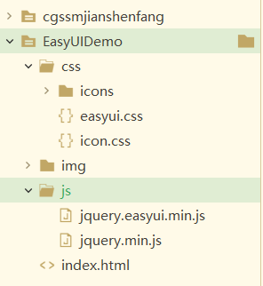

# EasyUI

## EasyUI概述

### 什么是EasyUI

> jQuery EasyUI是一组基于jQuery的UI插件集合体，而jQuery EasyUI的目标就是帮助web开发者更轻松的打造出功能丰富并且美观的UI界面。开发者不需要编写复杂的javascript，也不需要对css样式有深入的了解，开发者需要了解的只有一些简单的html标签。

### 常见的版本

EasyUI1.4 或 1.5

### 下载EasyUI

`http://www.jeasyui.net/download/`

## EasyUI入门

* 引用EasyUI开发的js和css

    

* EasyUI的使用方式有两种

  * css方式

        ```html
        <!-- EasyUI的入门 方式一：css的方式 -->
        <a href="#" class="easyui-linkbutton" data-options="iconCls:'icon-help'">超链接</a>
        ```

  * js编写方式

        ```html
        <script type="text/javascript">
            $(function() {
                $("#btn").linkbutton({
                    "iconCls": "icon-search"
                })
            })
        </script>

        <!-- EasyUI的入门：方式二：js的方式 -->
        <a href="#" id="btn">超链接</a>
        ```

## EasyUI布局

> 通过 $.fn.layout.defaults 重写默认的 defaults。  
> 布局（layout）是有五个区域（北区 north、南区 south、东区 east、西区 west 和中区 center）的容器。中间的区域面板是必需的，边缘区域面板是可选的。每个边缘区域面板可通过拖拽边框调整尺寸，也可以通过点击折叠触发器来折叠面板。布局（layout）可以嵌套，因此用户可建立复杂的布局。

### EasyUI布局的使用

    ```html
    <!DOCTYPE html>
    <html>
        <head>
            <meta charset="utf-8">
            <title></title>
            <link rel="stylesheet" type="text/css" href="./css/easyui.css">
            <link rel="stylesheet" type="text/css" href="./css/icon.css">
            <script type="text/javascript" src="./js/jquery.min.js"></script>
            <script type="text/javascript" src="./js/jquery.easyui.min.js"></script>
        </head>
        <body>
        <div id="cc" class="easyui-layout" data-options="fit:true">
            <div data-options="region:'north',title:'North Title',split:true" style="height:100px;"></div>
            <div data-options="region:'south',title:'South Title',split:true" style="height:100px;"></div>
            <div data-options="region:'east',title:'East',split:true" style="width:100px;"></div>
            <div data-options="region:'west',title:'West',split:true" style="width:100px;"></div>
        </div>
        </body>
    </html>
    ```

## EasyUI的分类

### EasyUI的分类的介绍

> 通过 $.fn.accordion.defaults 重写默认的 defaults。  
> 折叠面板（accordion）允许您提供多个面板（panel），同时显示一个或多个面板（panel）。每个面板（panel）都有展开和折叠的内建支持。点击面板（panel）头部可展开或折叠面板（panel）主体。面板（panel）内容可通过 ajax 指定 'href' 属性来加载。用户可定义被选中的面板（panel）。如果为指定，则默认选中第一个面板（panel）。

### EasyUI的分类的使用

    ```html
    <!DOCTYPE html>
    <html>
        <head>
            <meta charset="utf-8">
            <title></title>
            <link rel="stylesheet" type="text/css" href="./css/easyui.css">
            <link rel="stylesheet" type="text/css" href="./css/icon.css">
            <script type="text/javascript" src="./js/jquery.min.js"></script>
            <script type="text/javascript" src="./js/jquery.easyui.min.js"></script>
        </head>
        <body>
            <div id="aa" class="easyui-accordion" style="width:300px;height:200px;">
                <div title="Title1" data-options="iconCls:'icon-save'" style="overflow:auto;padding:10px;">
                </div>
                <div title="Title2" data-options="iconCls:'icon-reload',selected:true" style="padding:10px;">
                </div>
                <div title="Title3">
                </div>
            </div>
        </body>
    </html>
    ```

## EasyUI选项卡

### EasyUI的选项卡的介绍

> 通过 $.fn.tabs.defaults 重写默认的 defaults。  
> The tabs display a collection of panel. It shows only one tab panel at a time. Each tab panel has the header title and some mini button tools, including close button and other customized buttons.

### EasyUI的选项卡的使用

    ```html
    <!DOCTYPE html>
    <html>
        <head>
            <meta charset="utf-8">
            <title></title>
            <link rel="stylesheet" type="text/css" href="./css/easyui.css">
            <link rel="stylesheet" type="text/css" href="./css/icon.css">
            <script type="text/javascript" src="./js/jquery.min.js"></script>
            <script type="text/javascript" src="./js/jquery.easyui.min.js"></script>
        </head>
        <body>
            <a href="#" id="btn" class="easyui-linkbutton">按钮</a>
            <div id="tt" class="easyui-tabs" style="width:500px;height:250px;">
                <div title="Tab1" style="padding:20px;display:none;">
                    数据区域
                </div>
            </div>
            <script type="text/javascript">
                $(function(){
                    $("#btn").click(function(){
                        // 判断选项卡是否存在：
                        var flag=$("#tt").tabs("exists","客户管理");
                        if(flag){
                            // 已经存在选项卡
                            $("#tt").tabs("select","客户管理");
                        }else{
                            $("#tt").tabs('add',{
                                title:'客户管理',
                                content:'客户管理数据',
                                closable:true
                            });
                        }
                    })
                })
            </script>
        </body>
    </html>
    ```

## EasyUI数据表格

## EasyUI的窗口

    ```html
    <!DOCTYPE html>
    <html>
        <head>
            <meta charset="utf-8">
            <title></title>
            <link rel="stylesheet" type="text/css" href="./css/easyui.css">
            <link rel="stylesheet" type="text/css" href="./css/icon.css">
            <script type="text/javascript" src="./js/jquery.min.js"></script>
            <script type="text/javascript" src="./js/jquery.easyui.min.js"></script>

            <script type="text/javascript">
                $(function() {
                    $('#win').window({
                        width: 600,
                        height: 400,
                        modal: true,
                        closed: false
                    })
                })
            </script>

        </head>
        <body>
            <div id="win"></div>
        </body>
    </html>
    ```
