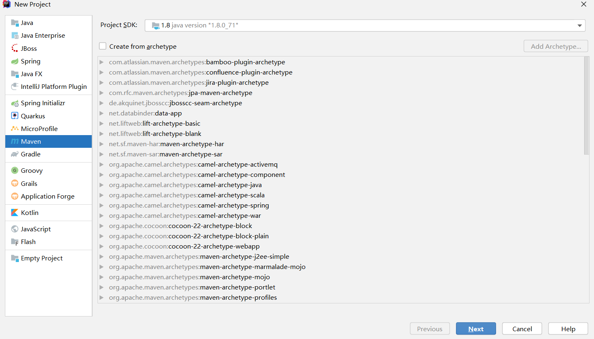
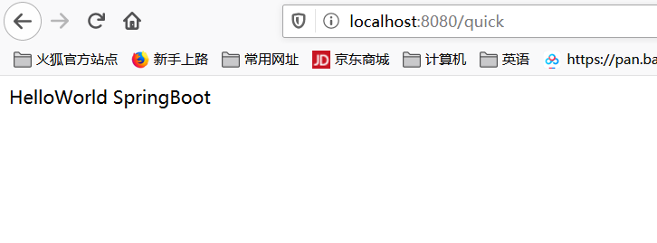
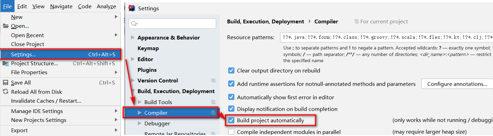
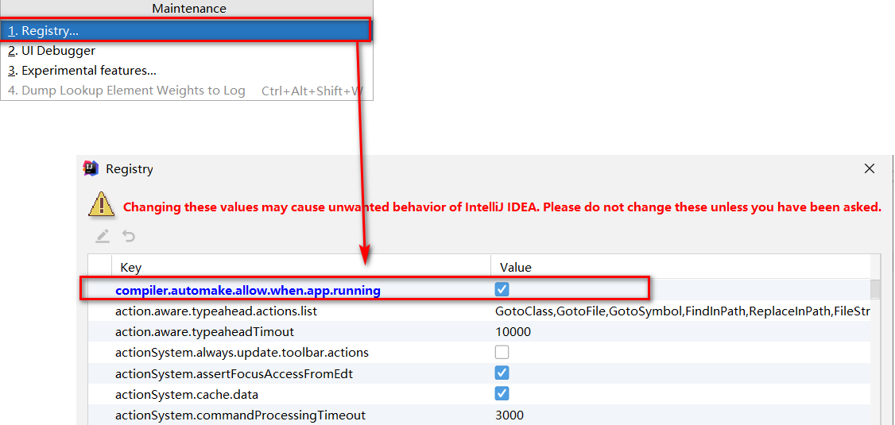
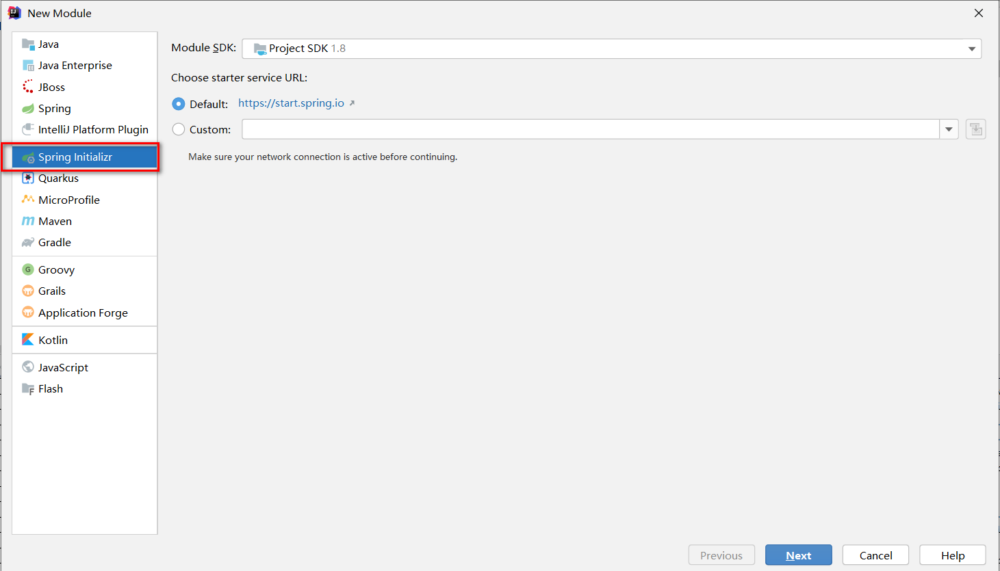
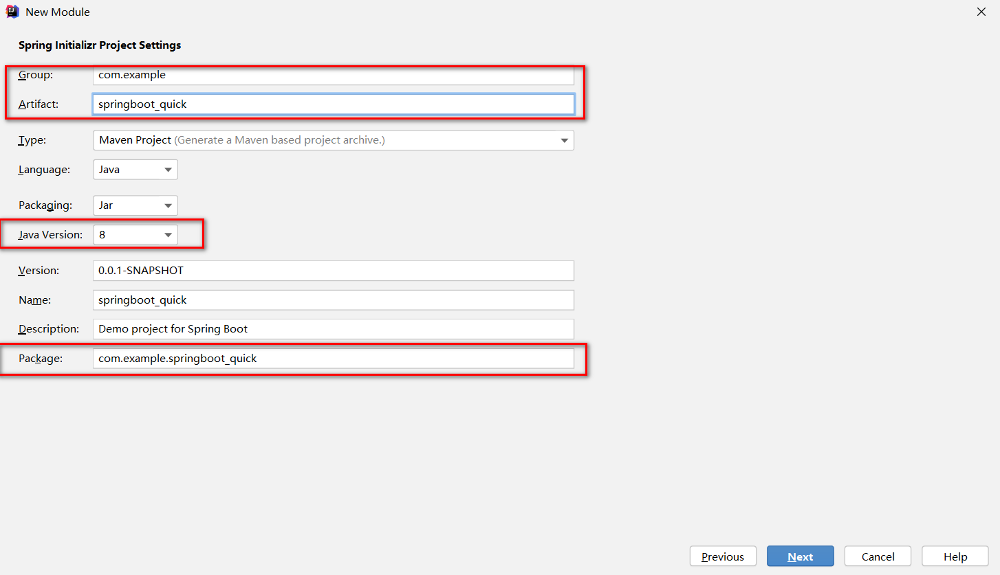
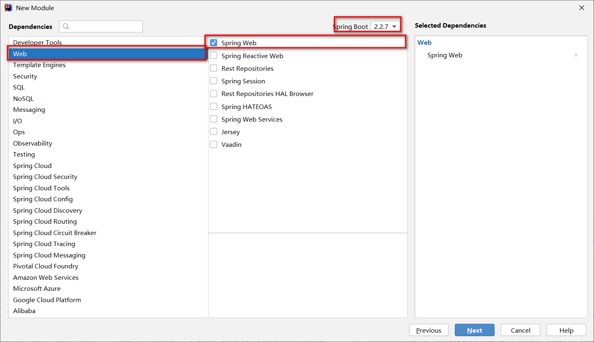
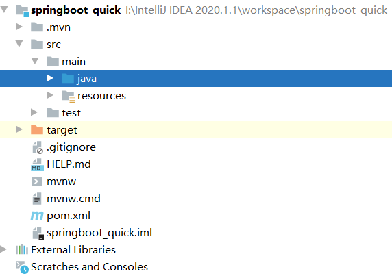
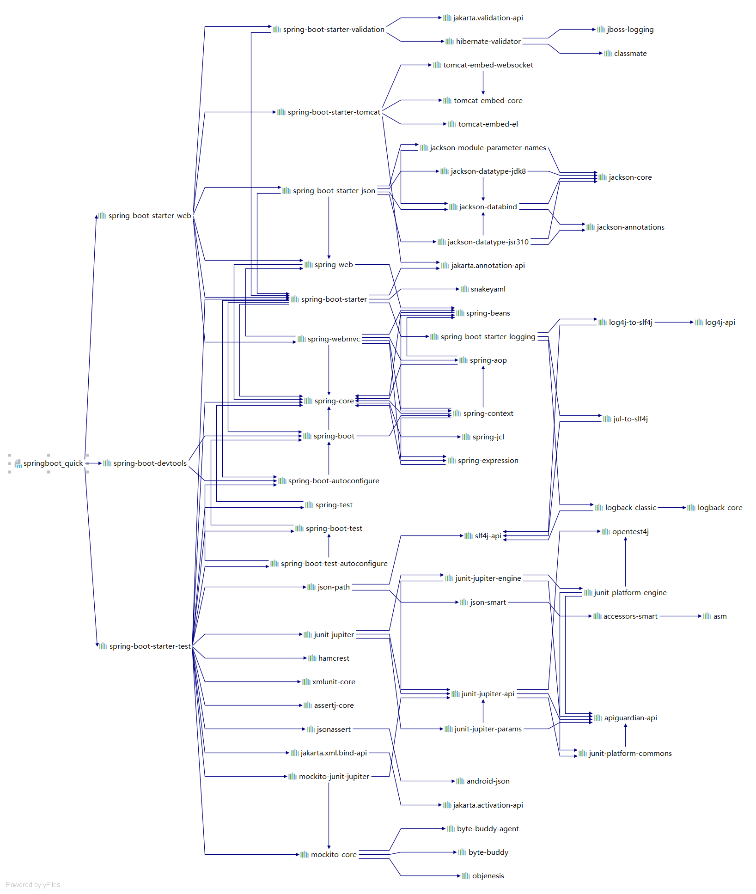

# Springboot基础

## 学习目标

1. 能够理解Spring的优缺点
2. 能够理解SpringBoot的特点
3. 能够理解SpringBoot的核心功能
4. 能够理解SpringBoot的环境
5. 能够完成application.properties配置文件的配置
6. 能够使用SpringBoot集成Mybatis
7. 能够使用SpringBoot集成JUnit
8. 能够使用SpringBOot集成SpringData JPA

## 一、SpringBoot简介

### 1.1 原有Spring的优缺点分析

#### Spring的优点分析

Spring是java企业版（java Enterprise Edition JEE）的轻量级替代品。无需开发重量级的Enterprise JavaBean（EJB），Spring为企业级Java开发提供了一种相对简单的方法，通过依赖注入和面向切面编程，用简单的java对象（Plain Old java Object）实现了EJB的功能。

#### Spring的缺点分析

虽然Spring的组件是轻量级的，但它的配置是重量级的。

所有这些配置都代表了开发时的损耗。因为在考虑Spring特性配置和解决业务问题直接需要进行思维切换，所以在编写配置占了配置编写应用程序逻辑的时间。和所有框架一样，Spring实用，但与此同时它要求的回报也不少。

除此之外，项目的依赖管理也是一件耗时耗力的事情，在环境搭建时，需要分析要导入那些库的坐标，而且还需要分析导入与之有关依赖关系的其他库的坐标，一旦选错了依赖的版本，随之而来的不兼容问题就会严重阻碍项目的开发进度。

### 1.2 SpringBoot的概述

#### SpringBoot解决上述Spring的缺点

Springboot对上述Spring的缺点进行优化和改善，基于约定优于配置的思想，可以让开发人员不必在配置与逻辑业务进行思维的切换，全身心的投入到逻辑业务的diamagnetic编写中，从而大大提高了开发的效率，一定程度上缩短了项目周期。

#### SpringBoot的特点

* 为基于Spring的开发提供更快的入门体验。
* 开箱即用，没有代码生成，也无需XML配置，同时也可以修改默认值来满足特定的需求。
* 提供了一些大型项目中常见的非功能特性，如嵌入式服务器、安全、指标、健康检查、外部配置等。
* SpringBoot不是对Spring功能上的管理，而是提供了一种快速使用Spring的方式。

#### SpringBoot的核心功能

* 起步依赖

    起步依赖本质是一个Maven项目对象模型（Project Object Model POM），定义了对其他库的传递依赖，这些东西加在一起即支持某项功能。

    简单的说，起步依赖就是将具备某种功能的坐标打包到一起，并提供了一些默认的功能。

* 自动配置

    SpringBoot的自动配置是一个运行时（更准确地说，是应用程序启动时）的过程，考虑了众多因素，才决定Spring配置应该用那个，不该用那个，该过程是Spring自动完成的。

## 二、SpringBoot快速入门

### 2.1 代码实现

#### 创建无骨架的Maven工程



#### 添加SpringBoot的起步依赖

SpringBoot要求，项目要集成SpringBoot的起步依赖Spring-boot-starter-parent

```xml
<parent>
    <groupId>org.springframework.boot</groupId>
    <artifactId>spring-boot-starter-parent</artifactId>
    <version>2.0.1.RELEASE</version>
</parent>
```

SpringBoot要集成SpringMVC进行Controller开发，所以项目要导入web的启动依赖

```xml
<dependencies>
    <dependency>
        <groupId>org.springframework.boot</groupId>
        <artifactId>spring-boot-starter-web</artifactId>
    </dependency>
</dependencies>
```

#### 编写SpringBoot引导类

需要通过SpringBoot提供的引导类起步SpringBoot才可以访问

```java
package com.springboot;

import org.springframework.boot.SpringApplication;
import org.springframework.boot.autoconfigure.SpringBootApplication;

@SpringBootApplication
public class HiSpringBoot {

    public static void main(String[] args) {
        SpringApplication.run(HiSpringBoot.class);
    }
}
```

#### 编写Controller

在引导类HiSpringBoot同包或子级包中创建HelloController

```java
package com.springboot.controller;

import org.springframework.web.bind.annotation.RequestMapping;
import org.springframework.web.bind.annotation.RestController;

@RestController
public class HelloController {

    @RequestMapping("/quick")
    public String quick() {
        return "HelloWorld SpringBoot";
    }
}
```

#### 测试

执行SpringBoot起步类的main方法，控制台打印日志如下：

```txt
  .   ____          _            __ _ _
 /\\ / ___'_ __ _ _(_)_ __  __ _ \ \ \ \
( ( )\___ | '_ | '_| | '_ \/ _` | \ \ \ \
 \\/  ___)| |_)| | | | | || (_| |  ) ) ) )
  '  |____| .__|_| |_|_| |_\__, | / / / /
 =========|_|==============|___/=/_/_/_/
 :: Spring Boot ::        (v2.0.1.RELEASE)

2020-05-12 11:11:49.464  INFO 39420 --- [           main] com.springboot.HiSpringBoot              : Starting HiSpringBoot on DESKTOP-0SPTMGB with PID 39420 (started by 84035 in I:\IntelliJ IDEA 2020.1.1\workspace\project1)
2020-05-12 11:11:49.466  INFO 39420 --- [           main] com.springboot.HiSpringBoot              : No active profile set, falling back to default profiles: default
2020-05-12 11:11:49.509  INFO 39420 --- [           main] ConfigServletWebServerApplicationContext : Refreshing org.springframework.boot.web.servlet.context.AnnotationConfigServletWebServerApplicationContext@23282c25: startup date [Tue May 12 11:11:49 CST 2020]; root of context hierarchy
2020-05-12 11:11:50.324  INFO 39420 --- [           main] o.s.b.w.embedded.tomcat.TomcatWebServer  : Tomcat initialized with port(s): 8080 (http)
2020-05-12 11:11:51.026  INFO 39420 --- [           main] o.s.b.w.embedded.tomcat.TomcatWebServer  : Tomcat started on port(s): 8080 (http) with context path ''
```

通过日志发现，`Tomcat initialized with port(s): 8080 (http)`

Tomcat已经起步，端口监听为8080，web应用的虚拟工程名称为空

打开浏览器访问url地址为`http://localhost:8080/quick`



### 2.2 快速入门解析

#### SpringBoot代码解析

* `@SpringBootApplication`：标注SpringBoot的启动类，该注解具备多种功能（后面详细剖析）
* `SpringApplication.run(MySpringBootApplication.class)` 代表运行SpringBoot的启动类，参数是SpringBoot启动类的字节码对象

#### SpringBoot工程热部署

我们在开发中反复修改类，页面等资源，每次修改后都是需要重新启动才生效，这样每次启动都很麻烦，浪费了大量时间，我们可以在修改代码后不重启就能生效，在pom.xml中添加如下配置就可以实现这样的功能，我们称之为热部署。

```xml
<!--热部署配置-->
<dependency>
    <groupId>org.springframework.boot</groupId>
    <artifactId>spring-boot-devtools</artifactId>
</dependency>
```

注意：IDEA进行SpringBoot热部署失败的原因

出现这种情况，并不是热部署配置问题，其根本原因是因为Intellij IDEA默认情况下不会自动编译，需要对IDEA进行配置，如下



然后`Shift+Ctrl+Alt+/`，选择Registry



#### 使用idea快速创建SpringBoot项目









通过idea快速创建的SpringBoot项目的pom.xml中已经导入了我们选择的web的起步依赖的坐标

```xml
<?xml version="1.0" encoding="UTF-8"?>
<project xmlns="http://maven.apache.org/POM/4.0.0" xmlns:xsi="http://www.w3.org/2001/XMLSchema-instance"
         xsi:schemaLocation="http://maven.apache.org/POM/4.0.0 https://maven.apache.org/xsd/maven-4.0.0.xsd">
    <modelVersion>4.0.0</modelVersion>
    <parent>
        <groupId>org.springframework.boot</groupId>
        <artifactId>spring-boot-starter-parent</artifactId>
        <version>2.2.7.RELEASE</version>
        <relativePath/> <!-- lookup parent from repository -->
    </parent>
    <groupId>com.example</groupId>
    <artifactId>springboot_quick</artifactId>
    <version>0.0.1-SNAPSHOT</version>
    <name>springboot_quick</name>
    <description>Demo project for Spring Boot</description>

    <properties>
        <java.version>1.8</java.version>
    </properties>

    <dependencies>
        <dependency>
            <groupId>org.springframework.boot</groupId>
            <artifactId>spring-boot-starter-web</artifactId>
        </dependency>

        <dependency>
            <groupId>org.springframework.boot</groupId>
            <artifactId>spring-boot-starter-test</artifactId>
            <scope>test</scope>
            <exclusions>
                <exclusion>
                    <groupId>org.junit.vintage</groupId>
                    <artifactId>junit-vintage-engine</artifactId>
                </exclusion>
            </exclusions>
        </dependency>

        <!--热部署配置-->
        <dependency>
            <groupId>org.springframework.boot</groupId>
            <artifactId>spring-boot-devtools</artifactId>
        </dependency>
    </dependencies>

    <build>
        <plugins>
            <plugin>
                <groupId>org.springframework.boot</groupId>
                <artifactId>spring-boot-maven-plugin</artifactId>
            </plugin>
        </plugins>
    </build>
</project>
```

可以使用快速入门的方式创建Controller进行访问，此处不再赘述。

### 三、SpringBoot原理分析

#### 起步依赖原理分析

##### 分析spring-boot-starter-parent

按住Ctrl点击pom.xml中的spring-boot-starter-parent，跳转到spring-boot-starter-parent的pom.xml，xml配置中含有如下。

```xml
<parent>
    <groupId>org.springframework.boot</groupId>
    <artifactId>spring-boot-dependencies</artifactId>
    <version>2.0.1.RELEASE</version>
    <relativePath>../../spring-boot-dependencies</relativePath>
</parent>
```

按住Ctrl点击pom.xml中的spring-boot-starter-dependencies，跳转到了spring-boot-starter-dependencies的pom.xml，xml配置如下，只摘取部分

```xml
<properties>
    <activemq.version>5.15.3</activemq.version>
    <antlr2.version>2.7.7</antlr2.version>
    <appengine-sdk.version>1.9.63</appengine-sdk.version>
    <artemis.version>2.4.0</artemis.version>
    <aspectj.version>1.8.13</aspectj.version>
    <assertj.version>3.9.1</assertj.version>
    <atomikos.version>4.0.6</atomikos.version>
    <bitronix.version>2.1.4</bitronix.version>
... ... ...
</properties>
<dependencyManagement>
    <dependencies>
        <dependency>
            <groupId>org.springframework.boot</groupId>
            <artifactId>spring-boot</artifactId>
            <version>2.0.1.RELEASE</version>
        </dependency>
        <dependency>
            <groupId>org.springframework.boot</groupId>
            <artifactId>spring-boot-test</artifactId>
            <version>2.0.1.RELEASE</version>
        </dependency>
        ... ... .. 
</dependencyManagement>
<build>
    <pluginManagement>
        <plugins>
            <plugin>
                <groupId>org.jetbrains.kotlin</groupId>
                <artifactId>kotlin-maven-plugin</artifactId>
                <version>${kotlin.version}</version>
            </plugin>
            <plugin>
                <groupId>org.jooq</groupId>
                <artifactId>jooq-codegen-maven</artifactId>
                <version>${jooq.version}</version>
            </plugin>
            <plugin>
                <groupId>org.springframework.boot</groupId>
                <artifactId>spring-boot-maven-plugin</artifactId>
                <version>2.0.1.RELEASE</version>
            </plugin>
            <plugin>
                <artifactId>maven-antrun-plugin</artifactId>
                <version>${maven-antrun-plugin.version}</version>
            </plugin>
            ... ... ...
    </pluginManagement>
</build>
```

从上面的spring-boot-starter-dependencies的pom.xml中我们可以发现，一部分坐标的版本、依赖管理、插件管理已经定义好，所以我们的SpringBoot工程继承spring-boot-starter-parent后已经具备版本锁定等配置了，所以起步依赖的作用就是进行依赖的传递。

##### 分析spring-boot-starter-web

按住Ctrl点击pom.xml中的spring-boot-starter-web，跳转到spring-boot-starter-web的pom.xml，xml配置如下

```xml
<?xml version="1.0" encoding="UTF-8"?>
<project xsi:schemaLocation="http://maven.apache.org/POM/4.0.0 http://maven.apache.org/xsd/maven-4.0.0.xsd" xmlns="http://maven.apache.org/POM/4.0.0"
    xmlns:xsi="http://www.w3.org/2001/XMLSchema-instance">
  <modelVersion>4.0.0</modelVersion>
  <parent>
    <groupId>org.springframework.boot</groupId>
    <artifactId>spring-boot-starters</artifactId>
    <version>2.0.1.RELEASE</version>
  </parent>
  <groupId>org.springframework.boot</groupId>
  <artifactId>spring-boot-starter-web</artifactId>
  <version>2.0.1.RELEASE</version>
  <name>Spring Boot Web Starter</name>
  <dependencies>
    <dependency>
      <groupId>org.springframework.boot</groupId>
      <artifactId>spring-boot-starter</artifactId>
      <version>2.0.1.RELEASE</version>
      <scope>compile</scope>
    </dependency>
    <dependency>
      <groupId>org.springframework.boot</groupId>
      <artifactId>spring-boot-starter-json</artifactId>
      <version>2.0.1.RELEASE</version>
      <scope>compile</scope>
    </dependency>
    <dependency>
      <groupId>org.springframework.boot</groupId>
      <artifactId>spring-boot-starter-tomcat</artifactId>
      <version>2.0.1.RELEASE</version>
      <scope>compile</scope>
    </dependency>
    <dependency>
      <groupId>org.hibernate.validator</groupId>
      <artifactId>hibernate-validator</artifactId>
      <version>6.0.9.Final</version>
      <scope>compile</scope>
    </dependency>
    <dependency>
      <groupId>org.springframework</groupId>
      <artifactId>spring-web</artifactId>
      <version>5.0.5.RELEASE</version>
      <scope>compile</scope>
    </dependency>
    <dependency>
      <groupId>org.springframework</groupId>
      <artifactId>spring-webmvc</artifactId>
      <version>5.0.5.RELEASE</version>
      <scope>compile</scope>
    </dependency>
  </dependencies>
</project>
```

从上面的spring-boot-starter-web的pom.xml我们可以发现，spring-boot-starter-web就是将web开发要使用的spring-web、spring-webmvc等坐标进行了“打包”，这样我们工程只要引入spring-boot-starter-web起步依赖的坐标就可以进行web开发了，同样体系了传递依赖的作用。


