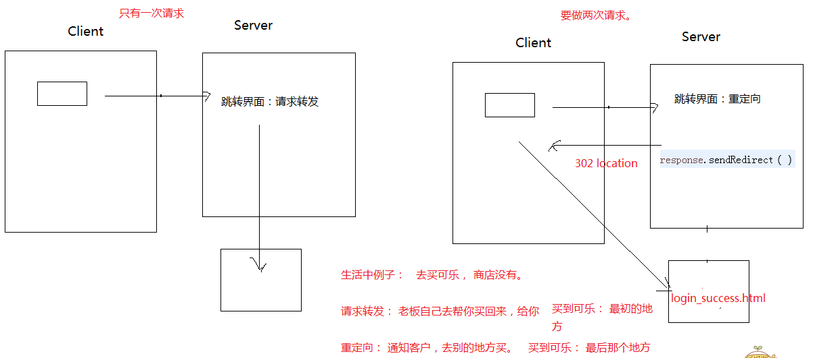

# HttpServletRequest&HttpServletResponse&ServletContext

## 一步到位的Servlet - tomcat 4.0

在eclipse中不需要web.xml配置servlet，而是通过注解的方式找寻servlet

```java
@WebServlet("/HelloServlet") // 在这里
public class HelloServlet extends HttpServlet {
    private static final long serialVersionUID = 1L;

    protected void doGet(HttpServletRequest request, HttpServletResponse response) throws ServletException, IOException {
        response.getWriter().append("Served at: ").append(request.getContextPath());
    }

    protected void doPost(HttpServletRequest request, HttpServletResponse response) throws ServletException, IOException {
        doGet(request, response);
    }
}
```

> 在 servlet2.5里面，只要新建servlet就自动生成web.xml里的参数标签

## 在servlet部署的时候tomcat出现的问题 - dwm version4.0 | 2.5

上一次的项目修改之后继续部署下一次，结果tomcat部署的还是上一次项目的文件，原因是java项目没有build。

> 解决办法：将Project选项下Build Automatically选中即可  
> 而且在这次解决问题的时候新的发现，当java文件修改的时候控制台会打印出以下log

```html
一月 10, 2020 11:30:18 下午 org.apache.catalina.core.StandardContext reload
信息: Reloading Context with name [/RequestAndResponse] is completed
```

> 这代表Servlet源码更新后，存在web.xml文件中的servlet资源自动部署到项目里边了，但是如果更新web.xml就需要重新启动服务器

## Servlet匹配方式

### 1.全路径匹配

> 以`/`开始`/a`或者`/aa/bb`  
> localhost:8080/项目名称/aa/bb

### 2.路径匹配，前半段匹配

> 以`/`开始，但是以`*`结束 `/a/*`或者`/*`  
> `*` 其实是一个通配符，匹配任意文字  
> localhost:8080/项目名称/aa/bb

### 3.以扩展名匹配

> 写法：没有`/`以`*`开始，扩展名`*.aa`,`*.bb`

## ServletContext

> Servlet上下文
>  
> 每个web工程只有一个ServletContext对象。说白了也就是不管在那个servlet里面，获取到的这个类都是同一个。

### 如何获得ServletContext对象

```java
// 1.获取对象
ServletContext context = getServletContext();
```

### ServletContext有什么作用

1. 获取全局配置参数
2. 获取web工程中的资源
3. 存取数据，servlet之间共享数据 域对象

#### 可以获取全局配置参数

```xml
<!-- 1.配置参数 -->
<context-param>
    <param-name>address</param-name>
    <param-value>China</param-value>
</context-param>
```

```java
// 2. 获取参数
ServletContext context = getServletContext();
String value = context.getInitParameter("address");
System.out.println("address=" + value);
```

#### 可以获取Web应用的资源

首先需要理解一下相对路径和绝对路径

* 绝对路径：绝对路径就是你的主页上的文件或目录在硬盘上真正的路径，

```html
例如 I:/apache-tomcat-9.0.21/wtpwebapps/RequestAndResponse/WEB-INF/classes/a/config.properties
```

* 相对路径：相对与某个基准目录的路径。（存在参照物）

```html
例如，当前在 I:/apache-tomcat-9.0.21/wtpwebapps/RequestAndResponse/WEB-INF/classes 目录下
相对于当前目录 a/config.properties是相对路径
```

---

1.通过`classloader`去获取web工程下的资源

获得地址流的方法有两种

* 通过`getResource`获取path地址，在放入流

```java
String path = this.getClass().getClassLoader().getResource("a/config.properties").getPath();
// getResource参数为空字符串获得的path是 I:/apache-tomcat-9.0.21/wtpwebapps/RequestAndResponse/WEB-INF/classes/
```

* 通过`getResourceAsStream`方法

```java
InputStream is = this.getClass().getResourceAsStream("/a/config.properties");
```

* 实例 - 通过当前类加载器获得Resources文件夹下a/config.properties

```java
Properties properties = new Properties();

// 1.  通过当前类加载器获得Resources文件夹下a/config.properties的路径
String path = this.getClass().getClassLoader().getResource("a/config.properties").getPath();

// 2. 传递路径给流
InputStream is = new FileInputStream(path);

// 3. 加载到properties
properties.load(is);
String name = properties.getProperty("name");
System.out.println("name=" + name);
```

2.可以获取Web应用中的资源

获取地址流的方法有两种

* 通过`context.getRealPath("")`方法获取根目录，`""`填入相对路径，在放入流

```java
// 这里获得的是在tomcat项目的根目录
ServletContext context = getServletContext();
System.out.println(context.getRealPath(""));
// I:\apache-tomcat-9.0.21\wtpwebapps\RequestAndResponse\
```

* 通过`context.getResourceAsStream(path)`方法直接获取流

```java
InputStream is = context.getResourceAsStream("file/config.properties");
```

* 实例 - 通过Web资源获取项目中 /RequestAndResponse/WebContent/file/config.properties

```java
// 1.获取当前项目的context对象，以及获取properties对象存储值
ServletContext context = getServletContext();
Properties properties = new Properties();


System.out.println(context.getRealPath(""));
// I:\apache-tomcat-9.0.21\wtpwebapps\RequestAndResponse\

// 2.获取文件流
InputStream is = context.getResourceAsStream("file/config.properties");

// 3. 加载到properties
properties.load(is);
String name = properties.getProperty("name");
System.out.println("name=" + name);
```

#### 使用ServletContext存储数据

1.定义一个html页面，制作一个form表单

```html
<body>
    <h2>请输入以下内容，完成登陆</h2>
    <form action="LoginServlet" method="get">
        账号:<input type="text" name="username"><br />
        密码:<input type="password" name="pwd"><br />
        <input type="button" value="登陆">
    </form>
</body>
```

2.定义一个Servlet，名为LoginServlet


* 针对密码是否正确用`PrintWriter`对象输到页面success/failed

```java
protected void doGet(HttpServletRequest request, HttpServletResponse response)
        throws ServletException, IOException {
    // 1. 获取数据
    String username = request.getParameter("username");
    String pwd = request.getParameter("pwd");

    // 2.校验数据
    System.out.println("username=" + username + "  pwd=" + pwd);
    PrintWriter pw = response.getWriter();
    if (username.equals("admin") && pwd.equals("123")) {
        pw.write("success...");
    } else {
        pw.write("failed...");
    }
}
```

* （改进版1）针对成功或者失败，进行判断，然后跳转到不一样的页面

```java
if (username.equals("admin") && pwd.equals("123")) {
    // pw.write("success...");
    // 设置状态码？重新定位状态码
    response.setStatus(302);
    // 定位跳转的位置是哪一个页面
    response.setHeader("Location", "login_success.html");
} else {
    pw.write("failed...");
}
```

* (改进版2) 增加使用ServletContext来存取数据 - 用户登陆的次数

```java
if (username.equals("admin") && pwd.equals("123")) {
    // pw.write("success...");
    // 设置状态码？重新定位状态码

    Object obj = getServletContext().getAttribute("count");

    int total = 0;
    if (obj != null) {
        total = (int) obj;
    }

    getServletContext().setAttribute("count", ++total);

    System.out.println("成功登陆的次数为" + total);

    response.setStatus(302);
    // 定位跳转的位置是哪一个页面
    response.setHeader("Location", "login_success.html");
} else {
    pw.write("failed...");
}
```

login_success.html 来接收登陆

```html
<body>
    <h2>登陆成功了</h2>
    <a href="CountServlet">获取网站登陆成功总数</a>
</body>
```

`CountServlet` 来取数据，并把数据显示到页面上

```java
protected void doGet(HttpServletRequest request, HttpServletResponse response)
        throws ServletException, IOException {
    Object obj = getServletContext().getAttribute("count");
    response.getWriter().write("登陆成功的次数:" + (int) obj);
}
```

细节：`action`后边跟的`LoginServlet`，最后去找的是`url-pattern`

* 注意，为什么谷歌火狐在第一次登陆的时候，会增加访问次数，而第二次登陆的时候没有增加，因为谷歌火狐在第一次登陆的时候会留下浏览缓存，点击登陆就先找缓存中的这个网站，而IE并不是，每登陆一次就增加一次

小技巧


### ServletContext 何时创建，何时销毁

何时创建：服务器启动的时候，会为托管的每一个web应用程序，创建一个`ServletContext`对象

何时销毁：从服务器移除托管，或者是关闭服务器。

* ServletContext的作用范围

> 只要在同一个项目里面，都可以取。  
> 不同项目 A项目存，B项目取，是取不到的，`ServletContext`对象不同

## HttpServletRequest

> 这个对象封装了客户端提交过来的一切数据

### 可以获取客户端请求头信息

```java
Enumeration<String> headerNames = request.getHeaderNames();
while (headerNames.hasMoreElements()) {
    String name = (String) headerNames.nextElement();
    String value = request.getHeader(name);
    System.out.println(name + "=" + value);
}
```

### 获取客户端提交过来的数据

```java
String name = request.getParameter("name");
String address = request.getParameter("address");
System.out.println("name = " + name);
System.out.println("address = " + address);
System.out.println("----------------------------------------------------------");

Map<String, String[]> parameterMap = request.getParameterMap();
Set<String> keySet = parameterMap.keySet();
Iterator<String> iterator = keySet.iterator();
while (iterator.hasNext()) {
    String key = (String) iterator.next();
    System.out.println("key=" + key + "--值总数有：" + parameterMap.get(key).length);
    String value = parameterMap.get(key)[0];
    String value1 = parameterMap.get(key)[1];
    String value2 = parameterMap.get(key)[2];
    System.out.println(key + "========" + value + "=" + value1 + "=" + value2);
}
```

#### 获取中文数据

> 客户端提交数据给服务器端，如果数据中带有中文的话，有可能会出现乱码情况，那么可以参照以下方式解决。

* 如果是`Get`方式

  * 第一种

    ```java
        String username = request.getParameter("username");
        String pwd = request.getParameter("pwd");
        System.out.println(username + " " + pwd);
        // get请求过来的数据，在url地址栏就经过编码了，所以我们取到的就是乱码
        // tomcat收到了这批数据，getParameter 默认使用了ISO-8859-1去解码

        // 解决办法是：先让文字回到ISO-8859-1对应的字节数组，然后按utf-8组拼字符串
        System.out.println(new String(username.getBytes("ISO-8859-1"), "UTF-8") + "--" + pwd);
    ```

  * 第二种

    ```xml
        <!-- 可以在tomcat里面做设置处理conf/server.xml加上URLEncoding="utf-8" 不推荐 -->
        <Connector connectionTimeout="20000" port="8080" protocol="HTTP/1.1" redirectPort="8443" URLEncoding="UTF-8" />
    ```

* 如果是`POST`方式

```java
// 这个是设置请求体里面的文字编码，对get方式传数据没用
request.setCharacterEncoding("utf-8");
// 这行设置一定要写在getParameter之前
```

### 请求转发

```java
request.getRequestDispatcher("login_success.html").forward(request, response);
```

1. 地址上显示的是请求servlet的地址。返回200 OK
2. 请求次数只有一次，因为是服务器内部帮客户端执行了后续的工作。
3. 只能跳转自己项目的资源路径。
4. 效率上稍微高一点，因为只执行一次请求。
5. 可以使用上一次的request对象。

* 抓包图


**注意！**

* 在跳转的时候，如果代码中含有`PrintWriter pw = response.getWriter();` 那么`response`头部的`Content-Type`的值就会被设置成`text/html;charset=ISO-8859-1`，为了防止这种情况，`Content-Type`的值要设置为`text/html;charset=UTF-8`


```java
response.setContentType("text/html;charset=UTF-8");
```

## HttpServletResponse

> 负责返回数据给客户端

```java
// 以字符流的方式写数据
response.getWriter().write("<h1>Hello Response use Writer</h1>");

// 以字节流的方式写数据
response.getOutputStream().write("<h2>Hello Response user Steam</h2>".getBytes());
```

### 响应的数据中有中文，那么有可能出现中文乱码

* 以字符流输出

> response.getWriter();

```java
// 1. 指定输出客户端内容的时候，这些文字使用utf-8编码
response.setCharacterEncoding("utf-8");

// 2.再次规定浏览器看这份数据的时候，使用什么编码 -  这里要与输出编码要一致
response.setHeader("Content-Type", "text/html; charset=utf-8");

// 以字符流的方式写数据
response.getWriter().write("<h1>你好世界</h1>");
```

* 以字节流输出

> response.getOutputSteam()

```java
// 1. 指定浏览器看这份数据使用的码表
response.setHeader("Content-Type", "text/html; charset=utf-8");

// 2.指定输出中文使用的码表
response.getOutputStream().write("你好世界".getBytes("utf-8"));
```

无论是字节流还是字符流输出，使用这一行代码就可以了

```java
response.setContentType("text/html;charset=UTF-8");
// 然后在写数据即可
```

### 重定向

```java
/**
* 之前的写法
*/
response.setStatus(302);
response.setHeader("Location", "login_success.html");

// 重定向的写法
response.sendRedirect("login_success.html");
```

1. 地址上显示的是最后一个路径
2. 请求次数最少有两次，服务器在第一次请求后，会返回302以及一个地址，浏览器在根据这个地址，执行第二次访问。
3. 可以跳转到任意路径，不是自己工程也可以跳
4. 效率稍微低一点，执行两次请求。
5. 后续的请求，没法使用上一次的request请求的数据，或者，没法使用上一次的request对象，因为是两次不同的请求。

* 抓包图


## 图解重定向和请求转发



## 演练下载资源

1.直接以超链接的方式下载，不写任何代码，也能够下载东西下来。

   让tomcat的默认servlet去下载：

```html
<h1>下载</h1>
<a href="file/黑马.png">黑马.png</a><br />
<a href="file/aa.jpg">aa.jpg</a><br />
<a href="file/bb.txt">bb.txt</a><br />
<a href="file/cc.rar">cc.rar</a><br />
```

> 原因是tomcat里面有一个默认的servlet - DefalutServlet。这个DefaultServlet专门用于处理放在tomcat服务器上的静态资源

2.通过servlet自定义下载

通过get访问，提交文件参数给servlet

```html
<a href="DownloadServlet?fname=heima.png">黑马.png</a>
<a href="DownloadServlet?fname=aa.jpg">aa.jpg</a>
<a href="DownloadServlet?fname=bb.txt">bb.txt</a>
<a href="DownloadServlet?fname=cc.rar">cc.rar</a>
```

servlet接到参数之后，获得文件路径，通过IO流把文件从服务器输出出去给客户端

```java
String file = request.getParameter("fname");
String path = getServletContext().getRealPath("file/" + file);
System.out.println(path);

// 设置响应头
response.setHeader("Content-Disposition", "attachment; filename=" + file);

// 输出流输出文件
InputStream is = new FileInputStream(new File(path));
ServletOutputStream outputStream = response.getOutputStream();

int len;
byte b[] = new byte[1024];
while ((len = is.read(b)) != -1) {
    outputStream.write(b, 0, len);
}
```

注意：

* 浏览器请求参数存在中文乱码时候，需要改变后台接收的编码
* 浏览器下载的文件名称出问题，说明浏览器需要进行对URL的中文进行解码，而中文本身不需要解码，所以要提前把URL中的中文进行编码


解决方案是通过请求头的`user-agent`来对不同的浏览器的URL进行编码

```java
if (request.getHeader("User-Agent").contains("Firefox")) {
    file = BaseUtils.base64EncodeFileName(file);
} else {
    file = URLEncoder.encode(file, "utf-8");
}
```

> Content-Disposition 是参考的RFC 2616  
> RFC搜索页面：[RFC Search](https://www.rfc-editor.org/search/rfc_search.php)

## 总结

* 一步到位servlet
  * dwm - 2.5版本可以自动配置web.xml文件
  * 已经配置到web.xml文件的servlet可以和服务器热部署
* servlet匹配方式 - url-patten
  * 全路径
  * 半路径
  * 以扩展名匹配
* ServletContext对象
  * 如何获得？
  * 作用？
    * 获取全局参数
    * 获取web应用的文件资源
    * 存取数据
  * 何时创建，何时销毁？ 开始 - 结束
* HttpRequest
  * 请求头信息
  * 传递参数（中文乱码）
  * 请求转发 - 注意乱码问题
* HttpResponse
  * 响应信息乱码
    * getWriter()
    * getOutputStream()
  * 重定向 - 注意与请求转发的区别
* 综合demo - 下载 - 注意file文字编码问题
