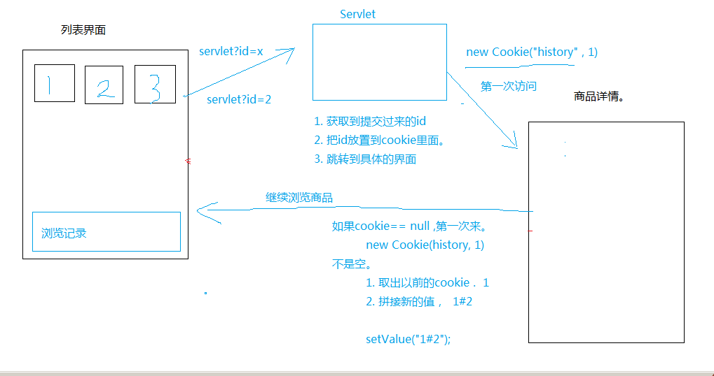

# Cookie & Session

## Cookie

> 饼干，其实就是一份小数据，是服务器给客户端，并且存储在客户端上的一份小数据。

### 应用场景

> 自动登陆、浏览记录、购物车。

### 简单使用

#### 1.添加Cookie到客户端

在响应的时候添加cookie

```java
/* 创造对象的方式
 * 1.直接new
 *
 * 2.单例模式|提供静态方法
 *
 * 3.工厂模式stu
 *
 * StuFactory StuBuilder
 */
Cookie cookie = new Cookie("aa", "bb");
response.addCookie(cookie);
// 可以加多个cookie
```


#### 2.获取客户端带来的cookie

```java
Cookie[] cookies = request.getCookies();
if (cookies!=null) {
    for (Cookie cookie : cookies) {
        System.out.println(cookie.getName() + "=" + cookie.getValue());
    }
}
```

#### 常用方法

* 设置cookie的有效期

```java
cookie.setMaxAge(60 * 60 * 24 * 7);
```

* 赋新的值

```java
cookie.setValue(newValue);
```

* 用于指定只有请求了指定的域名，才会带上该cookie

```java
cookie.setDomain(".helloworld.com");
```

* 只有访问该域名下的cookieDemo的这个路径地址才会带cookie

```java
cookie.setPath("/CookieDemo");
```

### 例子一：显示最近的访问时间

1. 判断账号是否正确
2. 如果正确，但是得到的cookie是一个数组，我们要从数组里面找到想要的对象
3. 如果找到的对象为空，表明是第一次登陆，那么要添加cookie
4. 如果找到的对象不为空，表明不是第一次登陆

```java
response.setContentType("text/html;charset=UTF-8");
// text/html;charset=UTF-8

String username = request.getParameter("username");
String password = request.getParameter("password");

// 1. 判断账号密码是否正确
if ("admin".equals(username) && "123".equals(password)) {

    // 2. 如果正确则获取cookie，但是得到的是一个数组，我们要从数组里找到我们想要的对象
    Cookie cookie = CookieUtils.findCookie(request, "lastTime");

    // 3. 如果找到的对象为空，表明是第一次登陆，那么就要添加cookie
    if (cookie == null) {
        // 第一次访问
        cookie = new Cookie("lastTime", System.currentTimeMillis() + "");
        cookie.setMaxAge(60 * 60);
        response.addCookie(cookie);
        response.getWriter().write("欢迎您" + username);
    } else {
        // 4. 如果找到的对象不为空说明白不是第一次访问

        response.getWriter()
                .write("欢迎您" + username + "，您上次访问的时间是" + new Date(Long.parseLong(cookie.getValue())));

        cookie.setValue(System.currentTimeMillis() + "");
        response.addCookie(cookie);
    }
} else {
    response.getWriter().write("访问失败");
}
```

### 例子二：显示商品浏览记录

#### 准备工作

1. 拷贝基础课第一天的 html原型文件，到工程的WebContent里面。
2. 在WebContent目录下新建一个jsp文件， product_list.jsp, 然后拷贝原来product_list.html的内容到jsp里面。 建好之后，jsp里面的所有ISO-8859-1 改成 UTF-8
3. 修改product_info.htm里面的手机数码超链接地址和修改首页(index.html)顶部的手机数码跳转的位置为 product_list.jsp

```java
<li class="active"><a href="product_list.jsp">手机数码<span class="sr-only">(current)</span></a></li>
```

#### 例子二分析



#### ProductServlet编写

```java
String id = request.getParameter("id");

Cookie[] cookies = request.getCookies();
Cookie cookie = CookieUtils.findCookie(cookies, "history");

if (cookie == null) {
    // 第一次访问
    cookie = new Cookie("history", id);
} else {
    // 不是第一次访问
    id += "#" + cookie.getValue();
    cookie.setValue(id);
}
System.out.println(id);
cookie.setMaxAge(60 * 60 * 24 * 7);
cookie.setPath("/CookDemo2");
response.addCookie(cookie);
response.sendRedirect("product_info.htm");
```

#### Jsp简单使用

在上一步基础上要改变jsp中的a标签的`href`的属性，例如`info?id=1`

* jsp

> Java Server Pager 最终会翻译成一个类， 就是一个Servlet

* 定义全局变量

```jsp
<%! int a = 99; %>
```

* 定义局部变量

```jsp
<% int b = 999; %>
```

* 在jsp页面上，显示 a 和 b的值，

```jsp
<%=a %>
<%=b %>
```

#### 设置product_list.jsp

```jsp
<%
    Cookie cookie = CookieUtils.findCookie(request.getCookies(), "history");
    if (cookie == null) {
%>
        <p>您还没访问过产品</p>
<%
    } else {
        String ids[] = cookie.getValue().split("#");
        for (String id : ids) {
%>

    <li
    style="width: 150px; height: 216; float: left; margin: 0 8px 0 0; padding: 0 18px 15px; text-align: center;">
        .jpg" width="130px" height="130px" />
    </li>
<%
        }
    }
%>
```

#### 清除浏览记录

```java
Cookie cookie = new Cookie("history", "");
cookie.setMaxAge(0);
// 这个位置设置为0，意味着用新的替换旧的，而0则表示立即删除

cookie.setPath("/CookDemo02");
// 注意这个位置必须要求正确

response.addCookie(cookie);
```

### Cookie总结

1. 服务器给客户端发来一份小数据，并且存放在客户端中。
2. 获取cookie，添加cookie

    ```java
    request.getCookie();
    ```

3. Cookie分类
   * 会话Cookie
     * 默认情况下，关闭了浏览器，那么Cookie就会消失
   * 持久Cookie
     * 在一定时间内，都有效，并且保存在客户端上

         ```java
            cookie.setMaxAge(0) ; // 设置立即删除
            cookie.setMaxAge(100); //100 秒
          ```

4. Cookie的安全问题

> 由于Cookie会保存在客户端上，所以有安全隐患问题 - 跨站脚本攻击XSS。  还有一个问题， Cookie的大小与个数有限制。 为了解决这个问题  Session

## Session

> 会话，Session是基于Cookie的一种会话机制。Cookie是服务器返回一小份数据给客户端，并且存放在客户端。Session是，数据存储在服务端。

### 常用API

```java
//得到会话ID
String id = session.getId();

//存值
session.setAttribute(name, value);

//取值
session.getAttribute(name);

//移除值
session.removeAttribute(name);
```

### Session何时创建、何时销毁

* 创建

> Session在用户第一次访问服务器的时候创建  
> 如果有在servlet里面调用了 request.getSession()

* 销毁

> * 关闭服务器
> * 服务器会把长时间没有活动的Session从服务器内存中清除，此时Session便失效。- session可以持久化 redis
> * 但是即使关闭浏览器，session也不会关闭


### 例子三：简单购物车

#### 例子三分析


#### CartServlet代码

```java
response.setContentType("text/html;charset=UTF-8");

Cookie[] cookies = request.getCookies();
Cookie sessionCookie = null;
for (Cookie cookie : cookies) {
    if (cookie.getName().equals("JSESSIONID")) {
        sessionCookie = cookie;
    }
}

sessionCookie.setMaxAge(60 * 60 * 24 * 7);
sessionCookie.setPath("/CartDemo");

// 获取前端产品的ID
String id = request.getParameter("id");
String phones[] = { "iPhone X", "小米9", "oppo reno ace", "三星C7", "iPhone 11", "一加7pro", };

// 通过ID解析出产品名字
String name = phones[Integer.parseInt(id)];

// 获取session对象
HttpSession session = request.getSession();

// 获取map
Map<String, Integer> map = (Map<String, Integer>) session.getAttribute("cart");

if (map == null) {
    map = new LinkedHashMap<>();
    // map集合存储 手机名称 - 数量
    map.put(name, 1);
} else {
    if (map.containsKey(name)) {
        map.put(name, map.get(name) + 1);
    } else {
        map.put(name, 1);
    }
}
// 重新设置对象
session.setAttribute("cart", map);

response.addCookie(sessionCookie);

// 输出html跳转页面
response.getWriter().write("<a href='index.html'>继续购物</a><br/>");
response.getWriter().write("<a href='cart.jsp'>查看购物车</a><br/>");

```

注意：为什么要设置cookie

* 首先Session是基于Cookie的
* 当浏览器访问项目的时候，服务器会自动添加一个Cookie给客户端，名字为JSESSIONID，
* 但是期限是会话，当关掉浏览器，相当于销毁Cookie，没有Cookie来证明Session，客户端再也不会和服务器建立相同的Session，而Session对象会留在服务器中一段时间消失，只有设置JSESSIONID的Cookie的期限，才能保留服务器设置的默认时间会话

#### Jsp代码

```jsp
<h2>购物车清单</h2>
<%
    Map<String, Integer> map = (Map<String, Integer>) session.getAttribute("cart");

    if (map != null) {
        for (String key : map.keySet()) {
%>
<p><%=key%>:<%=map.get(key)%></p>

<%
        }
    } else {
%>
<h3>您还没添加任何物品</h3>
<%
    }
%>

<a href="ClearServlet">清空购物车</a>
<a href="index.html">返回商城</a>
```

## 总结

* Cookie
  * 服务器给客户端发送的一份小数据，并且存放在客户端上
  * 基本用法
    * 添加 | 删除Cookie
    * 获取Cookie
  * 什么时候有cookie
    * 建立会话的时候就会设置一个cookie
    * `response.addCookie(new Cookie())`
  * cookie分类
    * 会话cookie
      * 关闭浏览器就失效
    * 持久cookie
      * 存放在客户端上，有一定期限
      * 设置期限 `setMaxAge();`
  * 演练例子
    * 1.获取上一次访问的时间
    * 2.获取商品记录
* Session
  * session是基于cookie的一种会话技术，数据存放在服务端上
  * 会在客户端里添加一个字段为JSESSIONID的cookie，是tomcat服务器生成
  * 操作API
    * `setAttribute` 存数据
    * `getAttribute` 取数据
    * `removeAttribute`  移除数据
    * `getSessionId()`  获取会话id
    * `invalidate()` 强制让会话失效。
  * 创建和销毁
    * 调用`request.getSesion`创建
    * 服务器关闭 | 会话超时（服务器默认时间） - 销毁

注意`setAttribute`存放的值，在浏览器关闭之后，还是存在的。
