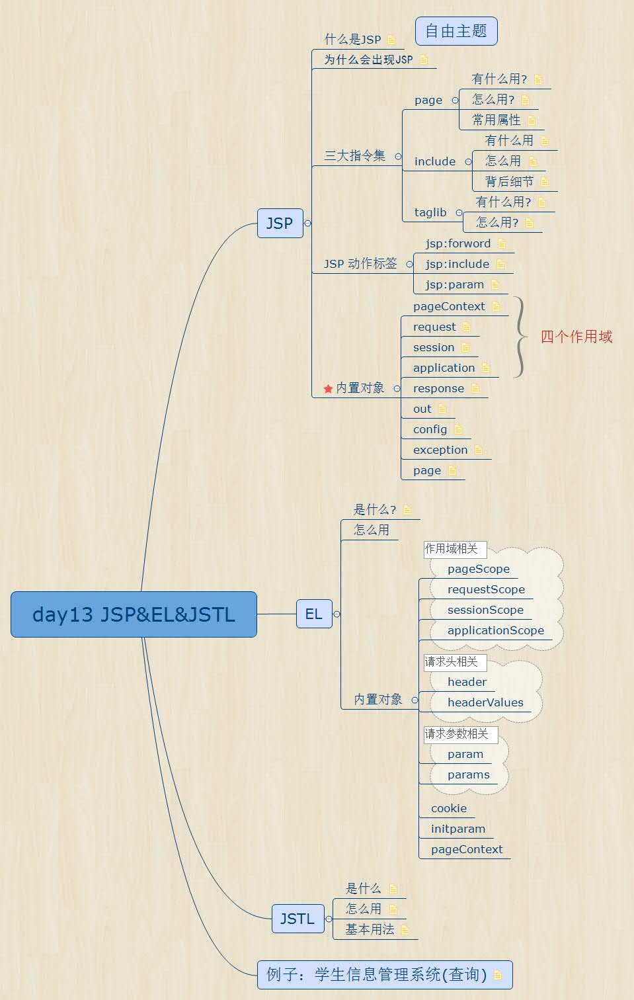
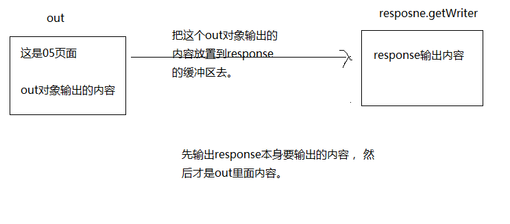
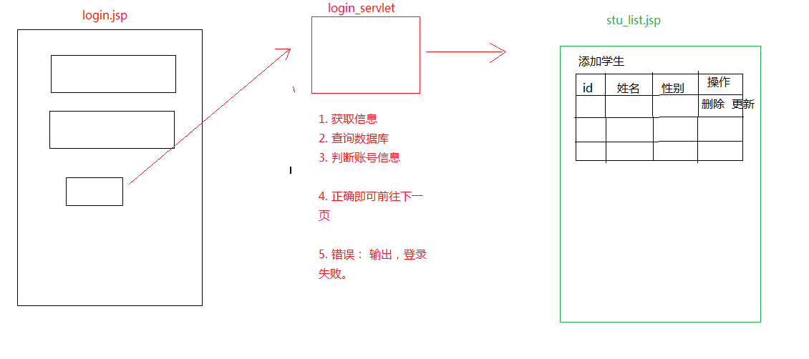

# JSP&EL&JSTL

## JSP



### JSP简介

* 什么是jsp - Java Server Pages

> 是由`Sun Microsystems`公司主导创建的一种动态网页技术标准。JSP部署于网络服务器上，可以响应客户端发送的请求，并根据请求内容动态地生成HTML、XML或其他格式文档的Web网页，然后返回给请求者。JSP技术以Java语言作为脚本语言，为用户的HTTP请求提供服务，并能与服务器上的其它Java程序共同处理复杂的业务需求。

* 工作原理

> * JSP将Java代码和特定变动内容嵌入到静态的页面中，实现以静态页面为模板，动态生成其中的部分内容。
> * JSP文件在运行时会被其编译器转换成更原始的Servlet代码。JSP编译器可以把JSP文件编译成用Java代码写的Servlet，然后再由Java编译器来编译成能快速执行的二进制机器码，也可以直接编译成二进制码。

* 为什么会有jsp

> 能以模板化的方式简单、高效地添加动态网页内容。

### JSP在eclipse自动部署问题

在JSP修改之后，从浏览器直接访问此jsp文件之后是可以自动部署到服务器上的

> 注意：包括服务器新建一个jsp，浏览器访问之后，服务器会自动将jsp资源自动生成成`.java`文件，接着自动编译成`.class`文件

### 指令写法

#### page指令

* language

> 表明jsp页面中可以写java代码

* contentType

> 其实即使说这个jsp翻译的html文件是什么类型，告诉浏览器我是什么内容类型，以及使用什么编码

```jsp
contentType="text/html; charset=UTF-8"
text/html  MIMEType 这是一个文本，html网页
```

* pageEncoding

> jsp内容编码

* extends

> 用于指定jsp翻译成java文件后，继承的父类是谁，一般不用改。

* session

> * 值可选的有true or false.  
> * 用于控制在这个jsp页面里面，能够直接使用session对象  
> * 具体的区别是，请看翻译后的文件，如果该值是true，那么代码中含有getSession（）的调用，如果是false :  那么就不会有该方法调用，也就是没有session对象了。在页面上自然也就不能使用session了。

* errorPage

> 指的是错误的页面， 值需要给错误的页面路径

* isErrorPage

> 上面的errorPage 用于指定错误的时候跑到哪一个页面去。 那么这个isErroPage , 就是声明某一个页面到底是不是错误的页面。

#### include指令 - 静态包含

> 包含另外一个jsp的内容进来。

```JSP
<%@include file="other.jsp"%>
```

* 背后细节

> 被包含的文件被原封不动的插入到包含页面中使用该指令的位置，然后JSP编译器再对这个合成的文件进行编译，最终编译后的文件只有一个。是在翻译阶段执行

#### taglib指令

```jsp
<%@ taglib prefix=""  uri=""%>

<!-- url:标签库路径 -->
<!-- prefix:标签库的别名 -->
```

### JSP动作标签

```jsp
<jsp:include page=""></jsp:include>
<jsp:param value="" name=""/>
<jsp:forward page=""></jsp:forward>
```

* jsp:include - 动态包含

> 包含文件时，当该动作标识执行后，JSP程序会将请求转发到（注意不是重定向）被包含页面，并将执行结果输出到浏览器中，然后返回页面继续执行后面的代码，以为web容器执行的两个文件，所以JSP编译器会分别对两个文件进行编译。在请求处理阶段执行

* jsp:forward - 请求转发

> 前往那一个页面

```jsp
<jsp:forward page=""></jsp:forward>

request.getRequestDispatcher("other02.jsp").forward(request, response);
```

* jsp:param - 加入参数

> 意思是：在包含某个页面的时候，或者在跳转某个页面的时候，加入这个参数。

```jsp
<jsp:forward page="other.jsp">
    <jsp:param value="beijing" name="address"/>
</jsp:forward>
```

收到的参数是

```jsp
<%= request.getParameter("address")%>
```

### JSP内置对象

> 所谓内置对象，就是我们可以直接在jsp页面中使用这些对象，不用创建

#### 作用域对象

* pageContext
* request
* session
* application

以上4个是作用域对象

> 表示这些对象可以存值，他们的取值范围有限定。 `setAttribute`和 `getAttribute`

存取代码例子

```jsp
<h1>使用作用域用来存数据</h1>
<%
    pageContext.setAttribute("name", "page");
    request.setAttribute("name", "request");
    session.setAttribute("name", "session");
    application.setAttribute("name", "application");
%>

<%=pageContext.getAttribute("name")%>
<%=request.getAttribute("name")%>
<%=session.getAttribute("name")%>
<%=application.getAttribute("name")%>
```

作用域范围大小：
pageContext - request - session - application

#### 四个作用域的区别

* pageContext 【PageContext】

> 作用域仅限于当前的页面。  
> 还可以获取到其他八个内置对象。

* request【HttpServletRequest】

> 作用域仅限一次请求。只要服务器对该请求做出了响应。这个域中存的值就没有了

* session【HttpSession】

> 作用域限于一次会话（多次请求与响应）当中。

* application 【ServletContext】

> 整个工程都可以访问。服务器关闭后就不能访问了。

#### 其他对象

* out 【JspWriter】
* respoonse 【HttpServletResponse】



* exception 【Throwable】
* page      【Object】 - 这个就是jsp翻译成java类的实例对象
* config    【ServletConfig】

## EL表达式

### EL简介 - Expression Language

> 是为了简化咱们的jsp代码，具体一点就是为了简化在jsp里面写的哪些java代码。

* 写法格式

```EL
${}
```

> 如果从作用域中取值，会从小的作用域开始取，如果没有就往下一个作用域取。一直把四个作用域取完都没有，就没有显示。

### 如何使用

#### 1. 取出4个作用域中存放的值

```jsp
<%
    pageContext.setAttribute("name", "page");
    request.setAttribute("name", "request");
    session.setAttribute("name", "session");
    application.setAttribute("name", "application");
%>

按普通手段取值<br>

<%= pageContext.getAttribute("name")%>
<%= request.getAttribute("name")%>
<%= session.getAttribute("name")%>
<%= application.getAttribute("name")%>

<br>使用EL表达式取出作用域中的值<br>

${ pageScope.name }
${ requestScope.name }
${ sessionScope.name }
${ applicationScope.name }
```

#### 2. 如果域中所存的是数组

```jsp
<%
    String[] a = { "aa", "bb", "cc", "dd" };
    pageContext.setAttribute("array", a);
%>

使用EL表达式取出作用域中的数组的值
<br> ${array[0]},${array[1]},${array[2]},${array[3]}
```

#### 3.如果域中所存的是ArrayList集合

使用EL表达式取出作用域中集合的值

```jsp
<%
    List<String> list = new ArrayList<String>();
    list.add("aa");
    list.add("bb");
    list.add("cc");
    list.add("dd");
    pageContext.setAttribute("li", list);
%>

${ li[0] }, ${ li[1] }, ${ li[2] }, ${ li[3] },
```

#### 4.取出Map集合的值

```jsp
<%
    Map<String, String> map = new HashMap<String, String>();
    map.put("name", "zhangsan");
    map.put("age", "18");
    map.put("address", "北京..");
    map.put("address.aa", "深圳..");

    pageContext.setAttribute("map", map);
%>

<br>取出map的值
<br> ${ map.name }, ${ map.age }, ${ map.address }, ${ map["address.aa"] },
```

### 取值细节

1. 从域中取值，得先存值。

    ```jsp
    pageContext.setAttribute("name", "page");
    request.setAttribute("name", "request");
    session.setAttribute("name", "session");
    application.setAttribute("name", "application");
    ```

    * 直接指定，到这个作用域里面去找这个name
      * `${pageScope.name}`
    * 先去page里边找，没有去request里面找，去session，去application
      * `${name}`
    * 指定去session中取值
      * `${sessionScope.name}`

2. 取值方式
   * 如果这份值是有下标的，那么直接使用[]

    ```jsp
    <%
        String[] a = { "aa", "bb", "cc", "dd" };
        pageContext.setAttribute("array", a);
    %>

    使用EL表达式取出作用域中的数组的值
    <br> ${array[0]},${array[1]},${array[2]},${array[3]}
    <!-- 这里说的array指的是attribute得name -->
    ```

    * 如果没有下标，直接使用`.`的方式去取

    ```jsp
    <%
        User user = new User("张三", "18");
        session.setAttribute("user", user);
    %>
    ${ user.name }, ${ user.age },
    ```

> 一般使用EL表达式，用的比较多的，都是从一个对象中取出它的属性，比如取出某一个学生的姓名。

### EL表达式的11个内置对象

${ 对象名.成员 }

* pageContext

作用域相关对象

* pageScope
* requestScope
* sessionScope
* sessionScope
* applicationScope

头信息相关对象

* header
* headerValues

参数信息相关对象

* param
* paramValues

* cookie
* initParam - 全局初始化参数

## JSTL

### JSTL简介

> 全称：Java server pages standarded tag library jsp标准标签库

> 简化jsp的代码编写。替换`<%%>`，一般与EL表达式配合

### 怎么使用

1. 导入jar文件到工程的WebContent/Web-Inf/lib
    * `jstl.jar standard.jar`
2. 在jsp页面上，使用`taglib`指令，来引入标签库
3. 注意：如果想支持EL表达式，那么引入的标签库必须选择1.1版本，1.0版本不支持EL表达式。

```jsp
<%@ taglib prefix="c" uri="http://java.sun.com/jsp/jstl/core" %>
```

### 常用标签

```JSP
<c:set></c:set>
<c:if test=""></c:if>
<c:forEach></c:forEach>
```

#### 1.c:Set

```jsp
<!-- 声明了一个对象name，对象的值zhangsan，存储到了page（默认），指定是session -->
<c:set var="name" value="zhangsan" scope="session"></c:set>

${ sessionScope.name }
```

#### 2.c:if

> 判断test里面的表达式是否满足，如果满足，就执行c:if标签中的输出，c:if是没有else的

```jsp
<c:set var="age" value="18"></c:set>
<c:if test="${ age>26 }">
    年龄大于26岁了...
</c:if>

<c:if test="${ age<=26 }">
    年龄小于了26岁...
</c:if>

<br>-------------------------------
<br> 定义一个变量名flag，取接收前面表达式的值，然后存在session的域中
<c:if test="${ age>26 }" var="flag" scope="session">
    年龄大于了26岁..
</c:if>
${ sessionScope.flag }
```

#### 3.c:forEach

```jsp
<p>从1开始遍历到10，得到的结果，赋值给i，并且会存储到page域中，step，增幅为2</p>
<c:forEach begin="1" end="10" var="i" step="2">
    ${ i }
</c:forEach>

<p>items: 表示遍历哪一个对象，注意，这里必须写EL表达式。</p>
<p>var: 遍历出来的每一个元素用user去接收</p>

<%
    List<User> list = new ArrayList<User>();
    list.add(new User("zhangsan", "12"));
    list.add(new User("lisi", "22"));
    list.add(new User("wangwu", "32"));
    list.add(new User("zhaoliu", "42"));
    list.add(new User("ff", "52"));
    session.setAttribute("list", list);
%>

<c:forEach var="user" items="${ list }">
    ${ user.name } --- ${ user.age }<br>
</c:forEach>
<!-- 首先items是从域里取出来，然后保存在user这个变量里，user默认再保存再域里，完了EL在从里边取值 -->
```

## 学生信息管理系统

* 需求分析



1. 先写`login.jsp`，用来显示登陆的用户界面，接着写`LoginServlet`用来处理`login.jsp`发来的请求
2. 创建用户表，字段是 `id`，`username`，`password`
3. 创建UserDao，定义登陆的方法
  
   ```java
    /**
    * 该dao定义了对用户表的访问规则
    * @author Administrator
    *
    */
   public interface UserDao {
        /**
        * 登陆
        * @param userName
        * @param password
        */
        public boolean login(String userName, String password);
    }
    ```

4. 创建`UserDaoImpl`的类，实现刚才定义的登陆方法。

    ```java
    public class UserDaoImpl implements UserDao {
        @Override
        public boolean login(String userName, String password) {
            Connection conn = null;
            PreparedStatement ps = null;
            ResultSet rs = null;
            try {
                // 1.得到连接对象
                conn = JDBCUtils.getConn();

                // 创建ps对象
                ps = conn.prepareStatement("select * from t_user where user=? and pwd=?");
                ps.setString(1, userName);
                ps.setString(2, password);

                // 3.开始执行
                rs = ps.executeQuery();

                // 如果能够成功移到下一条记录，那么表明有这个用户
                return rs.next();
            } catch (SQLException e) {
                e.printStackTrace();
            } finally {
                JDBCUtils.release(conn, ps, rs);
            }
            return false;
        }
    }
    ```

5. 在`LoginServlet`里面访问`UserDao`，判断登陆结果，以区分对待
6. 创建`stu_list.jsp`，让登陆成功的时候跳转过去。
7. 创建学生表，里面字段随意。
8. 定义学生的Dao，`StudentDao`

    ```java
    /**
    * 该dao用来操作学生数据库的数据
    * @author Administrator
    *
    */
    public interface StudentDao {
        /**
        * 查找所有学生的数据
        * @return
        */
        public List<Student> findAllStu();

    }
    ```

9. 对上面定义的`StudentDao`做出实现`StudentDaoImpl`

    ```java
    public class StudentDaoImpl implements StudentDao {

        @Override
        public List<Student> findAllStu() {

            Connection conn = null;
            PreparedStatement ps = null;
            ResultSet rs = null;
            List<Student> list = null;
            try {
                list = new ArrayList<Student>();

                conn = JDBCUtils.getConn();
                ps = conn.prepareStatement("select * from t_student");
                rs = ps.executeQuery();

                while (rs.next()) {
                    list.add(new Student(rs.getInt("id"), rs.getString("name"), rs.getInt("age"), rs.getString("address"),
                            rs.getString("telephone")));
                }
                return list;
            } catch (SQLException e) {
                // TODO Auto-generated catch block
                e.printStackTrace();
            } finally {
                JDBCUtils.release(conn, ps, rs);
            }
            return null;
        }
    }
    ```

10. 在登陆成功的时候，完成三件事情。  

      1. 查询所有学生
      2. 把这个所有的学生集合存储到作用域中
      3. 跳转到stu_list.jsp

    ```java
    protected void doGet(HttpServletRequest request, HttpServletResponse response)
            throws ServletException, IOException {
        // 设置请求体编码 - 只对post有效
        request.setCharacterEncoding("utf-8");
        response.setContentType("text/html;charset=utf-8");
        // 获取账号和密码
        String username = request.getParameter("username");
        String pwd = request.getParameter("pwd");

        System.out.println(username + " " + pwd);

        // 判断
        if (new UserDaoImpl().login(username, pwd)) {
            HttpSession session = request.getSession();
            session.setAttribute("stuList", new StudentDaoImpl().findAllStu());
            request.getRequestDispatcher("stu_list.jsp").forward(request, response);
        } else {
            response.getWriter().write("登陆失败<a href='login.jsp'>返回登陆界面</a>");
        }
    }
    ```

11. 在`stu_list.jsp`中，取出域中的集合，然后使用c标签去遍历集合

    ```html
    <table border="1" style="text-align: center">
            <tr>
                <td>id</td>
                <td>姓名</td>
                <td>年龄</td>
                <td>住址</td>
                <td>电话</td>
                <td>操作</td>
            <tr>
                <c:forEach items="${ stuList }" var="stu">
                    <tr>
                        <td>${ stu.id }</td>
                        <td>${ stu.name }</td>
                        <td>${ stu.age }</td>
                        <td>${ stu.address }</td>
                        <td>${ stu.telephone }</td>
                        <td><a href="#">更新</a> <a href="#">删除</a>
                    </tr>
                    <tr>
                </c:forEach>
        </table>
    ```

## 总结

* jsp
  * 三大指令
    * page
    * include
    * tablib
  * 三个动作标签
    * `<jsp:include>`
    * `<jsp:forward>`
    * `<jsp:param>`
  * 九个内置对象
    * 四个作用域
      * pageContext
      * request
      * session
      * application
    * 其他
      * out
      * exception
      * response
      * page
      * config
* EL
  * ${ 表达式 }
  * 取4个作用域中的值  
     `${name}`
  * 有11个内置对象。
    * pageContext
    * pageScope
    * sessionScope
    * applicationScope
    * ---
    * header
    * headerValues
    * ---
    * param
    * paramValues
    * ---
    * cookie
    * initParam
* JSTL
  * 使用1.1版本，支持EL表达式，1.0不支持EL表达式
  * 拷贝jar包，通过taglib，去引入标签库
    * `<c:set>`
    * `<c:if>`
    * `<c:forEach>`
  