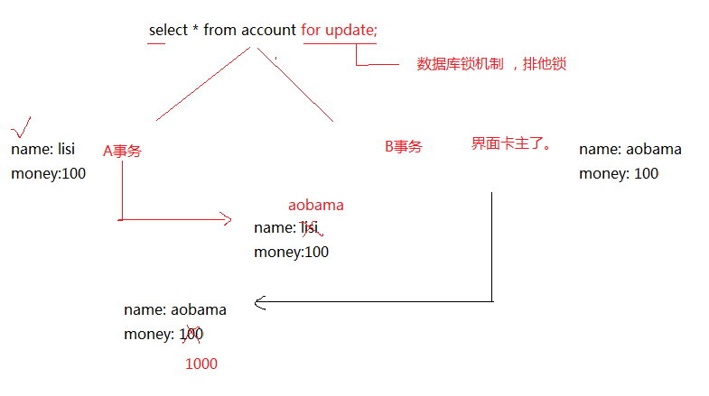
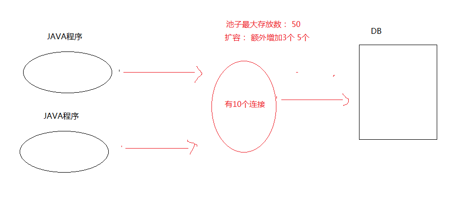

# 事物&数据库连接池&DBUtils

## 事务

> Transaction 其实指的一组操作，里面包含许多个单一的逻辑。只要一个逻辑没有执行成功，那么都算失败，所有的数据都回归到最初的状态（回滚）

* 为什么要有事务？

> 为了确保逻辑的成功，例子：银行的转账。

### 使用命令行方式演示事务

预备知识  
如何 开启 | 提交 | 回滚事务

* 开启事务
  * start transaction
* 提交 | 回滚事务
  * commit; 提交事务，数据将会写到磁盘上的数据库
  * rollback; 数据回滚，回到最初的状态。

---

操作过程

1. 关闭自动提交功能

    ```sql
    show variables like '%commit%'; // 查询自动提交状态
    set autocommit =off;            // 关闭自动提交功能
    ```

    
2. 演示事务

    ```sql
    start transaction; // 开启事务
    update t_student set age = age-1 where id=1; // 更新
    select * from t_student; // 查询
    rollback; // 回滚 此处也可以是commit
    ```

    

### 使用代码方式演示事务

> 不管是数据库还是java web的项目，都是是针对连接来的。

预备知识

1. 通过`conn.setAutoCommit(false)`来关闭自动提交的设置
2. 提交事务`conn.commit();`
3. 回滚事务`conn.rollback();`

---

```java
public static void main(String[] args) {
        Connection conn = null;
        PreparedStatement ps = null;
        ResultSet rs = null;
        try {
            conn = JDBCUtils.getConn();

            // 连接，事务默认就是自动提交的，关闭自动提交
            conn.setAutoCommit(false);

            // 扣钱，扣ID为1的100块钱
            ps = conn.prepareStatement("update account set money = money - ? where id =?");
            ps.setInt(1, 100);
            ps.setInt(2, 1);
            ps.executeUpdate();

            int a = 10 / 0; // 产生问题

            // 加钱，给ID为2 加100块钱
            ps.setInt(1, -100);
            ps.setInt(2, 2);
            ps.executeUpdate();

            // 成功：提交事务。
            conn.commit();
        } catch (Exception e) {
            try {
                // 失败，回滚事务
                conn.rollback();
            } catch (SQLException e1) {
                // TODO Auto-generated catch block
                e1.printStackTrace();
            }
            e.printStackTrace();
        } finally {
            JDBCUtils.release(conn, ps, rs);
        }
    }
```

一定要**注意，在使用事务的过程中，要更换支持事务的引擎**

MySQL默认的数据库引擎是MyIsam是不支持事务的，InnoDB支持

* MyISAM：这个是默认类型，它是基于传统的ISAM类型，ISAM是Indexed Sequential Access Method (有索引的 顺序访问方法) 的缩写，它是存储记录和文件的标准方法。与其他存储引擎比较，MyISAM具有检查和修复表格的大多数工具。 MyISAM表格可以被压缩，而且它们支持全文搜索。它们不是事务安全的，而且也不支持外键。如果事物回滚将造成不完全回滚，不具有原子性。**如果执行大量 的SELECT，MyISAM是更好的选择。**
* InnoDB：这种类型是事务安全的。它与BDB类型具有相同的特性，它们还支持外键。InnoDB表格速度很快，具有比BDB还丰富的特性，因此如果需要一个事务安全的存储引擎，建议使用它。**如果你的数据执行大量的INSERT或UPDATE**，出于性能方面的考虑，应该使用InnoDB表。

解决引擎不支持事务的办法

* 如何查看数据库表中的引擎
  * 查看数据库下所有表`show table status from db_smsystem;`
  * 查看单个表`SHOW TABLE STATUS LIKE 't_user';`
* 如何修改数据库表中的引擎
  * `ALTER TABLE t_user ENGINE=INNODB;`


### 事务的特性

ACID

* 原子性 - Atomicity

> 指的是，事务中包含的逻辑，不可分割

* 一致性 - Consistency

> 事务的执行使得数据库从一种正确的状态

* 隔离性 - Isolation

> 事务在执行期间不应该受到其他事务的影响

* 持久性 - Durability

> 指的是，事务执行成功，那么数据应该持久保存在磁盘上

### 事务的三大并发问题以及四种隔离

> 不考虑隔离级别设置，那么会出现以下问题。

并发三大问题 脏数据、不可重复读、幻读

* 脏数据（dirty data）

    > 一个事务读到另一个事务还未提交的数据  

   也就是说，一个事务正在对一条记录做修改，在这个事务未提交之前，这条数据是处于待定状态的（可能提交也可能回滚），这时，第二个事务来读取这条没有提交的数据，并根据此做进一步的处理。就会产生未提交数据以来关系，这种现象叫脏读。

* 不可重读度（No-Repeatable Reads）

    > 一个事务先后读取同一条数据，而事务在两次读取之间被其他事务所修改，则两次读取的数据不同，称之为不可重复读

* 幻读（Phantom Reads）

    > 是A事务不管B事务怎样，A事务的数据是一样的，B事务就算把数据提交了，A事务也看不到，所以造成了A事务幻觉

知识储备

* 查看隔离级别
  * `select @@tx_isolation;`
* 设置隔离级别
  * `set session transaction isolation level ...`

四种隔离级别

* Read Uncommitted
* Read Committed
* Repeatable Read
* Serializable

以下是演示

mysql -uroot -p *****

#### 读未提交

1. 设置A窗口的隔离级别为读未提交 Read Uncommitted

    ```sql
    set session transaction isolation level Read Uncommitted
    ```

    

2. A B 两个窗口都开启事务，在B窗口执行更新操作

    

    在实际有个例子，例如老板给张三发工资，事务开始，老板修改了张三的工资为5000，正好张三正在查询（读未提交），查到了老板修改后的5000的工资，心中很开心，但是老板突然发现5000工资是发给李四的，不用给张三发工资，老板就rollback了，而张三实际上一分钱也没得到。- 正确的是张三应该读到原来的数据。

#### 读已提交

1. 设置A窗口的隔离级别为 读已提交

    ```sql
      set session transaction isolation level Read Committed
    ```

    

2. A，B两窗口都开启事务，B窗口执行更新操作

    

3. 在A窗口执行的查询结果不一致。一次是在B窗口提交事务之前，一次在B窗口提交事务之后。

    

> 这个隔离级别能够屏蔽脏读的现象，但是引发了另一个问题，不可重复读。  
> 也就是说A窗口查B窗口提交前后数据不一样的时候，A窗口在操作的时候会因为B窗口提交的时机所受影响。

#### 可重复读

1. A窗口默认可重复读 - mysql默认隔离方式
   
2. A、B开启事务，B插入数据，A更新，B提交，A更新
   

个人理解

.docx 18:27:49
不可重复读（读已提交隔离级别）是因为 A事务因为B事务在commit前后读出的数据不一致，造成A事务在处理的时候，也会得到逻辑上错误的结果，幻读（可重复读隔离级别）是A事务不管B事务怎样，A事务的数据是一样的，B事务就算把数据提交了，A事务也看不到，所以造成了A事务幻觉

.docx 18:28:42
可重复隔离级别感觉也不算完全解决了前后读出的数据不一致问题，而是读的数据压根就是假的

#### 可串行化

> 如果有一个连接的隔离级别设置为了串行化 ，那么谁先打开了事务， 谁就有了先执行的权利， 谁后打开事务，谁就只能得着，等前面的那个事务，提交或者回滚后，才能执行。  但是这种隔离级别一般比较少用。 容易造成性能上的问题。 效率比较低。

  ```sql
    set session transaction isolation level Read Serializable
  ```

  

#### 事务的安全隐患总结

* 安全问题
  * 脏读
  * 不可重复读
  * 幻读
* 隔离级别
  * 读未提交
  * 读已提交
  * 可重复读
  * 可串行化

|                  | 脏读 | 不可重复读 | 幻读 |
|------------------|------|------------|------|
| Read uncommitted | √    | √          | √    |
| Read committed   | ×    | √          | √    |
| Repeatable read  | ×    | ×          | √    |
| Serializable     | ×    | ×          | ×    |

不可重复读的和幻读很容易混淆，不可重复读侧重于修改，幻读侧重于新增或删除。解决不可重复读的问题只需锁住满足条件的行，解决幻读需要锁表。

* 需要掌握的

  1. 在代码里使用事务，记得选择支持事务的引擎
  2. 事务只是针对连接对象，如果再开一个连接对象，那么是默认的提交。 - 即默认的自动提交

* 需要了解的
  1. 读
      * 脏读
        * 一个事务读取到另一个事务未提交的数据
      * 不可重复读
        * 一个事务读到了另一个事务已提交的数据，造成前后两次查询结果不一致
      * 幻读 - 根据隔离级别来定
        * 一个事务读到了另一个数据insert的数据，造成查询结果不一致。
  2. 写
     * 丢失更新

mysql默认隔离级别是可重复读  
oracle默认隔离级别是读已提交

### 丢失更新以及四种锁

#### 四种锁

* 共享锁（S锁，读锁）

  共享锁锁定的资源可以被其他用户读取，但是不能修改它。在SELECT命令执行时，SQL Server通常会对对象进行共享锁锁定。通常加共享锁的数据页被读取完毕后，共享锁就会立即释放。
* 排他锁 | 独占锁 | X锁 、写锁  

  独占锁锁定的资源只允许进行锁定操作的程序使用，其他任何对它操作均不会被接受。执行数据更新命令，即INSERT、UPDATE或DELETE命令时，SQL Server会自动使用独占锁。但当对象上有其他锁存在的时候无法对其独占锁。独占锁一直到事务结束才能释放。

* 乐观锁

  总是认为不会产生并发问题，每次去取数据的时候总认为不会有其他线程对数据进行修改，因此不会上锁，但是在更新的时候会判断其他线程在这之前有没有对数据进行修改，一般会使用版本号机制或CAS操作实现。
  
  version方式：一般在数据表中加上一个数据版本号version字段，表示数据被修改的时候，当数据被修改，version值会加1。当线程A要更新数据值时，在读取数据的同时也会读取version值，在提交更新时，若刚才读取到的version值为当前数据库中的version值相等时才更新，否则重试更新操作，直到更新成功。

* 悲观锁

  总是假设最坏的情况，每次取数据时都认为其他线程会修改，所以都会加锁（读锁、写锁、行锁等），当其他线程想要访问数据时，都需要堵塞挂起。可以依靠数据库实现，如行锁、读锁、写锁等，都是在操作之前加锁，在java中，synchronized的思想也是悲观锁。

根据范围，锁还可以划分成行级锁和表锁

#### 丢失更新


事务之间不受影响的，A事务拿到的数据改为obama，但是B事务拿到的数据还是lisi，在A事务提交过后，B事务提交更改money为800，因为B事务还是名字还是旧数据lisi，就把A事务给覆盖掉了。

#### 解决丢失更新

* 悲观锁

  > 可以在查询的时候，加入for update

  

* 乐观锁

> 要求程序员自己控制

  

## 数据库连接池

1. 数据库的连接对象创建工作，比较消耗性能。
2. 所以一开始在内存中开辟一块空间（集合），一开始先往池子里面放置多个连接对象，后面需要连接的话，直接从池子里面取，不需要自己创建连接了，使用完毕要记得归还，确保连接对象能循环利用



### 自定义数据库连接池

* 代码实现
  
  ```java
  /**
  * 这是一个数据库连接池 一开始先往池子里面放10个连接
  *
  * 1. 开始创建10个连接。
  *
  * 2. 来的程序通过getConnection获取连接
  *
  * 3. 用完之后，使用addBack归还连接。
  *
  * 4. 扩容
  *
  * 问题： sun公司针对连接池定义一套规范。
  *
  * 1. 需要额外记住addBack方法
  *
  * 2. 需要单例，如果一下子new好多mydatasouce呢？
  *
  * 3. 无法面向接口编程
  *
  * UserDao dao=new UserDaoImpl(); dao.insert();
  *
  * DataSource dataSoucrce = new MyDataSource(); 因为接口里面没有定义addBack方法
  *
  * 4.怎么解决
  *
  * @author Administrator
  *
  */
  public class MyDataSouce implements DataSource {

    List<Connection> list = new ArrayList<Connection>();

    public MyDataSouce() {
      for (int i = 0; i < 10; i++) {
        Connection conn = JDBCUtils.getConn();
        list.add(conn);
      }
    }

    // 该连接池对外公布的获取连接办法
    @Override
    public Connection getConnection() throws SQLException {
      // 来拿连接的时候，先看看，池子里面还有没有
      if (list.size() == 0) {
        for (int i = 0; i < 5; i++) {
          Connection conn = JDBCUtils.getConn();
          list.add(conn);
        }
      }

      // remove(0) ---> 移除第一个。移除的是集合中的第一个 移除的是开始的那个元素
      Connection conn = list.remove(0);
      return conn;
    }

    /**
    * 用完之后，记得归还
    *
    * @param conn
    */
    public void addBack(Connection conn) {
      list.add(conn);
    }

    @Override
    public PrintWriter getLogWriter() throws SQLException {
      // TODO Auto-generated method stub
      return null;
    }

    @Override
    public void setLogWriter(PrintWriter out) throws SQLException {
      // TODO Auto-generated method stub

    }

    @Override
    public void setLoginTimeout(int seconds) throws SQLException {
      // TODO Auto-generated method stub

    }

    @Override
    public int getLoginTimeout() throws SQLException {
      // TODO Auto-generated method stub
      return 0;
    }

    @Override
    public Logger getParentLogger() throws SQLFeatureNotSupportedException {
      // TODO Auto-generated method stub
      return null;
    }

    @Override
    public <T> T unwrap(Class<T> iface) throws SQLException {
      // TODO Auto-generated method stub
      return null;
    }

    @Override
    public boolean isWrapperFor(Class<?> iface) throws SQLException {
      // TODO Auto-generated method stub
      return false;
    }

    @Override
    public Connection getConnection(String username, String password) throws SQLException {
      // TODO Auto-generated method stub
      return null;
    }
  }
  ```

* 出现的问题
  1. 需要额外记住 addBack方法
  2. 需要使用单例模式
  3. 无法面向接口编程 - 以为接口没定义addBack方法
  4. 怎么解决，以addBack方法为切入点。

### 解决自定义数据库连接池出现的问题

> 由于多了一个addBack 方法，所以使用这个连接池的地方，需要额外记住这个方法，并且还不能面向接口编程。  
> 我们打算修改接口中的那个close方法。  原来的Connection对象的close方法，是真的关闭连接。  
> 打算修改这个close方法，以后在调用close， 并不是真的关闭，而是归还连接对象。

#### 如何扩展某一个方法

> 原有的方法逻辑，不是我们想要的，想修改自己的逻辑

1. 直接改源码，无法实现
2. 继承，必须得知道这个接口的具体实现是谁。
3. 使用装饰者模式。


* 代码实现 - ConnectionWrapper

  ```java
  public class ConnectionWrapper implements Connection {

    Connection conn = null;
    List<Connection> list = null;

    public ConnectionWrapper(Connection conn, List<Connection> list) {
      this.conn = conn;
      this.list = list;
    }

    @Override
    public PreparedStatement prepareStatement(String sql) throws SQLException {
      // TODO Auto-generated method stub
      return conn.prepareStatement(sql);
    }

    @Override
    public void close() throws SQLException {
      // TODO Auto-generated method stub
      list.add(conn);
    }

  // ...后续方法没实现直接省略

  }
  ```

* 代码实现 - MyDataSouce

  ```java
    public class MyDataSouce implements DataSource {

      List<Connection> list = new ArrayList<Connection>();

      public MyDataSouce() {
        for (int i = 0; i < 10; i++) {
          Connection conn = JDBCUtils.getConn();
          list.add(conn);
        }
      }

      // 该连接池对外公布的获取连接办法
      @Override
      public Connection getConnection() throws SQLException {
        // 来拿连接的时候，先看看，池子里面还有没有
        if (list.size() == 0) {
          for (int i = 0; i < 5; i++) {
            Connection conn = JDBCUtils.getConn();
            list.add(conn);
          }
        }

        // remove(0) ---> 移除第一个。移除的是集合中的第一个 移除的是开始的那个元素
        Connection conn = list.remove(0);

        // 在把这个对象抛出去的时候，对这个对象进行包装
        Connection connection = new ConnectionWrapper(conn, list);

        return connection;
      }

      // .. 后续方法未实现省略
    }
  ```

* 代码实现 - TestPool

  ```java
    public class TestPool {

      public static void main(String[] args) {
        Connection conn = null;
        PreparedStatement ps = null;
        MyDataSouce dataSouce = new MyDataSouce();

        try {
          conn = dataSouce.getConnection();
          ps = conn.prepareStatement("insert into account values(null,'wangwu',1000)");
          ps.executeUpdate();
        } catch (SQLException e) {
          e.printStackTrace();
        } finally {
          try {
            ps.close();
          } catch (SQLException e) {
            // TODO Auto-generated catch block
            e.printStackTrace();
          }
          JDBCUtils.release(conn, ps, null);
        }
      }
    }
  ```

总结一下就是，说白了Connection对象在TestPool类经过getConnection()获取之后，其实是经过了ConnectionWrapper类进行了包装，最终得到的是ConnectionWrapper类的对象，调用的方法也是ConnectionWrapper类的方法，而ConnectionWrapper的close方法是重写了的，所以间接的就扩展了原有的Connection的方法。**本质是用对象组合之后，扩展对象的close方法了**。

补充：开闭原则(OCP)是面向对象设计中“可复用设计”的基石,是面向对象设计中最重要的原则之一,其它很多的设计原则都是实现开闭原则的一种手段。
开闭原则中“开”,是指对于组件功能的扩展是开放的,是允许对其进行功能扩展的;开闭原则中“闭”,是指对于原有代码的修改是封闭的,即不应该修改原有的代码。 - **装饰者模式符合开闭原则**

题外话 面向接口的好处


### 开源连接池

#### DBCP

1. 导入jar文件 `commons-pool-1.5.6、commons-dpcp-1.4`
2. 不适用配置文件

   ```java
    public class TestDBCP {
      public static void main(String[] args) {
        Connection conn = null;
        PreparedStatement ps = null;
        try {
          // 1. 构建数据源对象
          BasicDataSource dataSource = new BasicDataSource();

          // 2.设置数据库
          dataSource.setDriverClassName("com.mysql.cj.jdbc.Driver");
          dataSource.setUrl("jdbc:mysql://localhost/bank?serverTimezone=UTC");
          dataSource.setUsername("root");
          dataSource.setPassword("******");


          // 获取连接对象
          conn = dataSource.getConnection();

          ps = conn.prepareStatement("insert into account values(null,?,?)");
          ps.setString(1, "hua2");
          ps.setInt(2, 3000);

          ps.executeUpdate();

        } catch (SQLException e) {
          // TODO Auto-generated catch block
          e.printStackTrace();
        } finally {
          JDBCUtils.release(conn, ps, null);
        }
      }
    }

   ```

3. 使用配置方式

    ```java
    public class TestDBCP02 {

      public static void main(String[] args) {
        Connection conn = null;
        PreparedStatement ps = null;
        try {
          BasicDataSourceFactory factory = new BasicDataSourceFactory();
          Properties properties = new Properties();
          InputStream is = new FileInputStream("src\\dbcpconfig.properties");
          properties.load(is);

          DataSource dataSource = (DataSource) BasicDataSourceFactory.createDataSource(properties);

          conn = dataSource.getConnection();

          ps = conn.prepareStatement("insert into account values(null,?,?)");
          ps.setString(1, "aa");
          ps.setInt(2, 4000);

          ps.executeUpdate();

        } catch (SQLException e) {
          // TODO Auto-generated catch block
          e.printStackTrace();
        } catch (FileNotFoundException e) {
          // TODO Auto-generated catch block
          e.printStackTrace();
        } catch (IOException e) {
          // TODO Auto-generated catch block
          e.printStackTrace();
        } catch (Exception e) {
          // TODO Auto-generated catch block
          e.printStackTrace();
        } finally {
          JDBCUtils.release(conn, ps, null);
        }
      }
    }
    ```

    注意`dbcpconfig.properties`要按照以下这些名称设计

    ```txt
    driverClassName=com.mysql.cj.jdbc.Driver
    url=jdbc:mysql://localhost/bank?serverTimezone=UTC
    username=root
    password=******
    ```

    名称来源

    ```java
    dataSource.setDriverClassName("com.mysql.cj.jdbc.Driver");
    dataSource.setUrl("jdbc:mysql://localhost/bank?serverTimezone=UTC");
    dataSource.setUsername("root");
    dataSource.setPassword("******");
    ```

#### C3P0

1. 拷贝jar文件到lib目录 `c3p0-0.9.5.5.jar` 和`mchange-commons-java-0.2.19.jar`
2. 不适用配置文件方式

    ```java
    public class C3P0Test {

      public static void main(String[] args) {
        Connection conn = null;
        PreparedStatement ps = null;

        ComboPooledDataSource dataSource = new ComboPooledDataSource();

        try {
          // 1.创建database
          dataSource.setDriverClass("com.mysql.cj.jdbc.Driver");
          // 2.设置连接信息
          dataSource.setJdbcUrl("jdbc:mysql://localhost/bank?serverTimezone=UTC");

          dataSource.setUser("root");
          dataSource.setPassword("******");

          conn = dataSource.getConnection();
          ps = conn.prepareStatement("insert into account values ( null,?,?)");
          ps.setString(1, "liming");
          ps.setInt(2, 500);

          ps.executeUpdate();
        } catch (PropertyVetoException | SQLException e) {
          // TODO Auto-generated catch block
          e.printStackTrace();
        }finally {
          JDBCUtils.release(conn, ps, null);
        }
      }
    }
    ```

3. 使用配置文件方式

    ```java
    public class C3P0Test {

      public static void main(String[] args) {
        Connection conn = null;
        PreparedStatement ps = null;

        ComboPooledDataSource dataSource = new ComboPooledDataSource();
        try {
          conn = dataSource.getConnection();
          ps = conn.prepareStatement("insert into account values ( null,?,?)");
          ps.setString(1, "lssimiang");
          ps.setInt(2, 5010);
          ps.executeUpdate();
        } catch (SQLException e) {
          // TODO Auto-generated catch block
          e.printStackTrace();
        } finally {
          JDBCUtils.release(conn, ps, null);
        }
      }
    }
    ```

    配置文件

    ```xml
    <?xml version="1.0" encoding="UTF-8"?>
    <c3p0-config>
      <!-- default-config 默认的配置， -->
      <default-config>
        <property name="driverClass">com.mysql.cj.jdbc.Driver</property>
        <property name="jdbcUrl">jdbc:mysql://localhost/bank?serverTimezone=UTC</property>
        <property name="user">root</property>
        <property name="password">********</property>
        <property name="initialPoolSize">10</property>
        <property name="maxIdleTime">30</property>
        <property name="maxPoolSize">100</property>
        <property name="minPoolSize">10</property>
        <property name="maxStatements">200</property>
      </default-config>
    </c3p0-config>
    ```

* 注意
  * 导入正确的jar包
  * 因为`new BeanListHandler<T>(T.class)`传入的是字节码实例化的，所以需要`T`这个类类中有一个空构造函数

## DBUtils

最初提醒：设计的**数据库字段要与bean对象的私有属性字段要一致**，否则无法查出数据。

### 增删改

```java
QueryRunner queryRunner = new QueryRunner(new ComboPooledDataSource());
// 记得填写c3p0-config文件
try {

  // 增加
    queryRunner.update("insert into account values(null,?,?)", "bb", 2000);

  // 删除
    queryRunner.update("delete from account where id=?", 1);

  // 更新
  queryRunner.update("update account set money=? where id=?",99999,2);
} catch (SQLException e) {
  // TODO Auto-generated catch block
  e.printStackTrace();
}
```

### 查询

1. 直接new接口的匿名实现类

    ```java
      public class DBUtilsTest02 {
        public static void main(String[] args) {
          // dbutils只是帮我们简化了CRUD的代码，但是连接的创建以及获取工作，不在他的考虑范围
          QueryRunner queryRunner = new QueryRunner(new ComboPooledDataSource());
          try {
            List<Account> list = queryRunner.query("select * from account", new ResultSetHandler<List<Account>>() {
              @Override
              public List<Account> handle(ResultSet arg0) throws SQLException {
                List<Account> list = new ArrayList<Account>();
                while (arg0.next()) {
                  list.add(new Account(arg0.getInt("id"), arg0.getString("username"), arg0.getInt("money")));
                }
                return list;
              }
            });
            for (Account account : list) {
              System.out.println(account.toString());
            }
          } catch (SQLException e) {
            // TODO Auto-generated catch block
            e.printStackTrace();
          }
        }
      }
    ```

2. 直接使用框架已经写好的实现类

    ```java
    public class DBUtilsTest02 {

      public static void main(String[] args) throws InstantiationException, IllegalAccessException {
        // dbutils只是帮我们简化了CRUD的代码，但是连接的创建以及获取工作，不在他的考虑范围

        // Account newInstance = Account.class.newInstance();
        // 传入字节码文件能够统一的获得字节码的实例

        QueryRunner queryRunner = new QueryRunner(new ComboPooledDataSource());
        try {
          // 一种可能：这个bean类缺少空构造器
          // 查询单个对象
          Account acc = queryRunner.query("select * from account where id= ? ", new BeanHandler<Account>(Account.class), 2);
          System.out.println(acc);

          System.out.println("-------------------------");

          // 查询多个对象
          List<Account> query = queryRunner.query("select * from account", new BeanListHandler<Account>(Account.class));
          for (Account account : query) {
            System.out.println(account);
          }

        } catch (SQLException e) {
          // TODO Auto-generated catch block
          e.printStackTrace();
        }
      }
    }
    ```

注意：
Class.newInstance()；只能反射无参的构造器，需要构造器可见；
Constructor.newInstance()；可以反射任何构造器，可以反射私有构造器

### ResultSetHandler 常用的实现类

以下两个是使用频率最高的

BeanHandler，查询到的单一数据封装成一个对象  
BeanListHandler 查询到的多个数据封装成一个List<对象>

---

ArrayHandler 查询到的单个数据封装成一个数组  
ArrayListHandler 查询到的多个数据封装成一个集合，集合里面的元素是数组

MapHander 查询到的单个数据封装成一个map  
MapListHandler 查询到的多个数据封装成一个集合，集合里面的元素是map。

ColumnListHander - 某一个列  
KeyedHandler 某一个值  
ScalarHandler 查select count..总数之类

### 自己设计通用的CRUD

知识储备

元数据 Meata data

> 描述数据的数据 String sql，描述这份sql字符串的数据叫做元数据

数据库元数据 `DatabaseMetaData`  
参数元数据 `ParameterMetaData`  
结果集元数据 `ResultSetMetaData`

#### 通用的增删改 - Update

```java
/**
* 以参数个数为准
*
* @param sql    需要操作的sql语句
* @param params 可变参数，有几个占位符，就写几个参数进来
*/
public static void updateVer1(String sql, Object... params) {
  Connection conn = null;
  PreparedStatement ps = null;
  try {
    conn = JDBCUtils.getConn();
    ps = conn.prepareStatement(sql);

    for (int i = 0; i < params.length; i++) {
      // 不知道什么类型所以就用setObject()方法
      ps.setObject(i + 1, params[i]);
    }
    ps.executeUpdate();
  } catch (SQLException e) {
    // TODO Auto-generated catch block
    e.printStackTrace();
  } finally {
    JDBCUtils.release(conn, ps, null);
  }
}

/**
* 打算以问号个数为准
*
* @param sql    需要操作的sql语句
* @param params 可变参数，有几个占位符，就写几个参数进来
*/
public static void updateVer2(String sql, Object... params) {
  Connection conn = null;
  PreparedStatement ps = null;
  try {
    // 获取连接并放入sql语句在PreparedStatement对象中
    conn = JDBCUtils.getConn();
    ps = conn.prepareStatement(sql);

    // 因为参数个数未知
    // 这个地方获取sql语句中需要填充的参数有几个
    ParameterMetaData pm = ps.getParameterMetaData();
    int paramCount = pm.getParameterCount();
    // PreparedStatement对象中可以获得ParameterMetaData对象
    // ParameterMetaData对象中含有getParameterCount()方法
    // 来获取参数的个数

    for (int i = 0; i < paramCount; i++) {
      // 因为不知道是什么类型的数据，所以都使用setObject来对待
      ps.setObject(i + 1, params[i]);
    }
    // for循环设置参数
    ps.executeUpdate();
  } catch (SQLException e) {
    // TODO Auto-generated catch block
    e.printStackTrace();
  } finally {
    JDBCUtils.release(conn, ps, null);
  }
}
```

* 注意
  * 1.参数个数未知，所以用`Object... params`来传递数据
  * 2.sql里需要填入的参数个数位置
    * 要么使用`params.length`来识别个数 - 数组个数
    * 要么使用`getParameterCount();`来识别个数 - ?号个数
  * 3.设置参数类型未知 用`ps.setObject(i + 1, params[i]);`循环即可

#### 通用的查询 - Query

* 查询方法主体、接口、main方法

    ```java
    public List<T> query(String sql, ResultHandler<T> resultHandler, Object... params) {
        Connection conn = null;
        PreparedStatement ps = null;
        ResultSet rs = null;
        try {
          // 获取连接
          conn = JDBCUtils.getConn();
          ps = conn.prepareStatement(sql);

          // 获取到几个问号，占位符
          ParameterMetaData pm = ps.getParameterMetaData();

          for (int i = 0; i < pm.getParameterCount(); i++) {
            // 因为不知道是什么类型的数据，所以都使用setObject来对持
            ps.setObject(i + 1, params[i]);
          }

          // 执行查询工作，得到结果集
          rs = ps.executeQuery();

          //List<T> list = resultHandler.handle(rs);
          //return list;

          // 把结果集丢给调用者，让它封装数据，返回封装数据
          return resultHandler.handle(rs);

        } catch (SQLException e) {
          // TODO Auto-generated catch block
          e.printStackTrace();
        } finally {
          JDBCUtils.release(conn, ps, rs);
        }
        return null;
    }
    ```

    ```java
    public interface ResultHandler<T> {
      List<T> handle(ResultSet rs);
    }

    ```

    ```java
      public static void main(String[] args) {
      List<Account> query = new CommonDBUtils<Account>().query("select * from account where money=?",
          new ResultHandler<Account>() {
            @Override
            public List<Account> handle(ResultSet rs) {
              List<Account> list = new ArrayList<Account>();
              try {
                while (rs.next()) {
                  list.add(new Account(rs.getString("username"), rs.getInt("money")));
                }
              } catch (SQLException e) {
                // TODO Auto-generated catch block
                e.printStackTrace();
              }
              return list;
            }
          }, 1000);

      for (Account account : query) {
        System.out.println(account.toString());
      }
    }
    ```

* 注意
  * 查询的参数个数未知 - 使用`Object... params`
  * 查询需要填充数据个数未知 - 参考增删改
  * 查询不知道如何返回数据
    * 通过设置接口，在参数位置放入`ResultHandler<T> resultHandler`让调用的人实现，返回的数据再通过`query`方法返回。

## 总结

* 事务
  * 命令行事务
  * 代码事务
  * 事务的特性 - ACID
  * 事务的三大并发问题和四种隔离
    * 三大并发问题
      * 脏读、不可重复度、幻读
    * 四种隔离
      * 读未提交
      * 读已提交
      * 可重复读
      * 串行化
  * 丢失更新和四种锁
    * 四种锁
      * 排他锁 | X锁 | 写锁
      * 读锁 | S锁
      * 乐观锁 - version控制版本
      * 悲观锁 - java的锁机制
    * 丢失更新以及解决办法
* 数据库连接池
  * 自定义连接池
    * 装饰者模式
  * 开源连接池
    * C3P0 - 重要
    * BDCP
* DBUtils
  * 增删改 - update
  * 查询
    * ResultSetHandler常用类
      * BeanHandler
      * BeanListHandler
  * 自己设计的通用CRUD
    * 增删改
      * 元数据
        * 数据库元数据 - DatabaseMetaData
        * 参数元数据 - ParameterMetaData *
        * 结果元数据 - ResultSetMetaData
    * 查询
