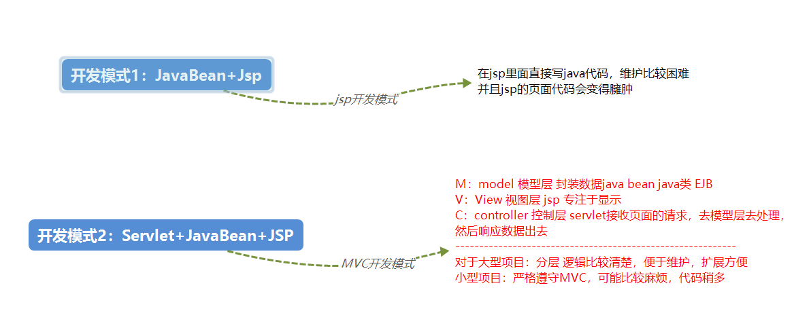
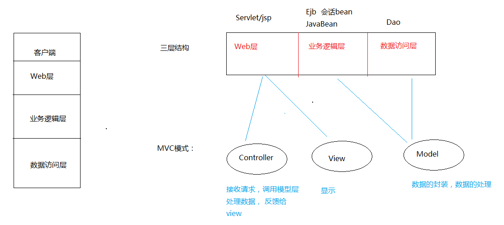

# MVC设计模式&学管实例

## JSP开发模式&MVC开发模式

### 两大开发模式



### 三层架构和MVC模式



## 三层架构&学管实例

### 学管实例

目录

```text
.  
├── c3p0-config.xml  
└── cc  
    └── sms  
        ├── bean  
        │   └── Student.java  
        ├── dao  
        │   ├── Impl  
        │   │   └── StudentDaoImpl.java  
        │   ├── Page.java  
        │   └── StudentDao.java  
        ├── params  
        │   └── Params.java  
        ├── service  
        │   ├── impl  
        │   │   └── StudentServiceImpl.java  
        │   └── StudentService.java  
        ├── servlet  
        │   ├── AddStuServlet.java  
        │   ├── ChangePageSizeServlet.java  
        │   ├── DeleteStuServlet.java  
        │   ├── DisplayAllListServlet.java  
        │   ├── DisplayCurrentPageServlet.java  
        │   ├── DisplayFuzzyQueryServlet.java  
        │   ├── DisplayOneStuServlet.java  
        │   └── UpdateStuServlet.java  
        ├── test  
        │   └── JunitTest.java  
        └── utils  
            └── JDBCUtils.java  
```

#### 数据库、jar包、设置文件的准备

* 建立的表

    ```sql
    CREATE DATABASE db_stus;
    USE db_stus;
    CREATE TABLE t_student(
        sid INT PRIMARY KEY AUTO_INCREMENT,
        sname VARCHAR(20),
        gender VARCHAR(5),
        phone VARCHAR(20),
        birthday DATE,
        hobby VARCHAR(50),
        info VARCHAR(200)
    );
    ```

* 此项目需要导入的jar包

  * c3p0
    * `c3p0-0.9.5.5.jar`
    * `mchange-commons-java-0.2.19.jar`
  * mysql
    * `mysql-connector-java-8.0.18.jar`
  * jstl
    * `standard.jar`
    * `jstl.jar`
  * DBUtils
    * `commons-dbutils-1.7.jar`

* 加入的配置文件是`c3p0-config.xml`

    ```xml
    <?xml version="1.0" encoding="UTF-8"?>
    <c3p0-config>

        <!-- default-config 默认的配置， -->
        <default-config>
            <property name="driverClass">com.mysql.cj.jdbc.Driver</property>
            <property name="jdbcUrl">jdbc:mysql://localhost/db_stus?serverTimezone=Asia/Shanghai</property>
            <property name="user">root</property>
            <property name="password">******</property>


            <property name="initialPoolSize">10</property>
            <property name="maxIdleTime">30</property>
            <property name="maxPoolSize">100</property>
            <property name="minPoolSize">10</property>
            <property name="maxStatements">200</property>
        </default-config>
    </c3p0-config>
    ```

---

#### 查询

思路是，在主页里面点击显示所有学生列表，去访问一个servlet，servlet通过调用service里面的业务方法，查询到了一个学生列表集合，最终将学生列表集合，通过jstl + el显示到jsp页面

1. 设计`index.html`主页

    ```html
    <a href="DisplayAllListServlet">显示所有学生列表</a>
    <a href="#">分页显示学生列表</a>
    ```

2. 设计`Student`实体类

    ```java
    public class Student {
        private int sid;
        private String sname;
        private String gender;
        private String phone;
        private Date birthday;
        private String hobby;
        private String info;

        // ...省略get/set/构造/tostring
    }
    ```

3. 设计`StudentDao`接口用来提出单一数据访问功能设计的规范

    ```java
    /**
    * 查询所有学生的数据
    *
    * @return List<Student> 返回学生的List数据集合
    * @throws SQLException
    */
    List<Student> findAllStu() throws SQLException;
    ```

4. 设计`StudentDaoImpl`来实现`StudentDao`接口

    ```java

    /**
    * 这里千万不要用动态的连接池，因为动态的连接池，每new一个新的实例就会
    */
    static QueryRunner runner = new QueryRunner(JDBCUtils.getDataSource());

    @Override
    public List<Student> findAllStu() throws SQLException {
        return runner.query("select * from t_student", new BeanListHandler<Student>(Student.class));
    }
    ```

5. 设计`StudentService`接口用来提出业务多语句功能接口的规范

    ```java
    /**
    * 查询所有学生的数据
    *
    * @return List<Student> 返回学生的List数据集合
    * @throws SQLException
    */
    List<Student> findAllStu() throws SQLException;
    ```

6. 设计`StudentServiceImpl`来实现`StudentService`接口

    ```java
    StudentDao dao = StudentDaoImpl.getStudentDaoImpl();

    @Override
    public List<Student> findAllStu() throws SQLException {
        return dao.findAllStu();
    }
    ```

7. 设计`DisplayAllListServlet`用来将业务查到的所有数据显示到jsp上

    ```java
    protected void doGet(HttpServletRequest request, HttpServletResponse response)
            throws ServletException, IOException {
        StudentService service = new StudentServiceImpl();
        try {
            List<Student> list = service.findAllStu();
            request.setAttribute("list", list);
            request.getRequestDispatcher("list_all.jsp").forward(request, response);
        } catch (SQLException e) {
            // TODO Auto-generated catch block
            e.printStackTrace();
        }
    }
    ```

8. 设计`list_all.jsp`

    ```html
    <table border="1">
        <tr>
            <td>姓名</td>
            <td>性别</td>
            <td>电话</td>
            <td>生日</td>
            <td>爱好</td>
            <td>简介</td>
            <td>操作</td>
        </tr>
        <c:forEach items="${ list }" var="stu">
            <tr>
                <td>${stu.sname }</td>
                <td>${stu.gender }</td>
                <td>${stu.phone }</td>
                <td>${stu.birthday }</td>
                <td>${stu.hobby }</td>
                <td>${stu.info }</td>
                <td><a href="#">操作</a> <a
                    href="DisplayOneStuServlet?sid= ${stu.sid}">更新</a></td>
            </tr>
        </c:forEach>
    </table>
    ```

* 注意
  * 善于用`alt`+`shift`+`S`快捷生成get/set
  * `shitf`+`end`选中一行
  * 多使用面向接口编程

#### 增加


思路是，从list_all.jsp列表页面，跳入到add.jsp页面，在填写数据结束后，点击submit，然后一个servlet来处理，将数据封装成bean，调用业务方法，增加成功。

1. 在`list_all.jsp`中添加到`add.jsp`的连接

    ```html
    <tr>
        <td colspan="7"><a href="add.jsp">增加</a></td>
    </tr>
    ```

2. 设计`add.jsp`的表单

    ```html
    <form action="AddStuServlet" method="post">
        <table border="1">
            <tr>
                <td>姓名</td>
                <td><input type="text" name="sname"></td>
            </tr>
            <tr>
                <td>性别</td>
                <td><input type="radio" value="男" name="gender" />男 <input
                    type="radio" value="女" name="gender" />女</td>
            </tr>
            <tr>
                <td>电话</td>
                <td><input type="text" name="phone"></td>
            </tr>
            <tr>
                <td>生日</td>
                <td><input type="date" name="birthday" /></td>
            </tr>
            <tr>
                <td>爱好</td>
                <td><input type="checkbox" name="hobby" id="" value="篮球" />篮球
                    <input type="checkbox" name="hobby" id="" value="计算机" />计算机 <input
                    type="checkbox" name="hobby" id="" value="唱歌" />唱歌</td>
            </tr>
            <tr>
                <td>简介</td>
                <td><textarea rows="5" name="info" cols="20"></textarea></td>
            </tr>
            <tr>
                <td colspan="2"><input type="submit" value="更新" /></td>
            </tr>
        </table>
    </form>
    ```

3. 设计`AddStuServlet`

    ```java
    protected void doGet(HttpServletRequest request, HttpServletResponse response)
            throws ServletException, IOException {
        request.setCharacterEncoding("utf-8");

        String hobbyList = Arrays.toString(request.getParameterValues("hobby"));
        try {
            Student stu = new Student(request.getParameter("sname"), request.getParameter("gender"),
                    request.getParameter("phone"),
                    new SimpleDateFormat("yyyy-MM-dd").parse(request.getParameter("birthday")),
                    hobbyList.substring(1, hobbyList.length() - 1), request.getParameter("info"));

           // 这里做插入操作，需要设计
        } catch (ParseException | SQLException e) {
            // TODO Auto-generated catch block
            e.printStackTrace();
        }
    }
    ```

4. 在`StudentDao`接口中添加规范 - 单一逻辑

    ```java
    /**
        * 插入学生数据
        *
        * @param stu
        * @return boolean
        * @throws SQLException
        */
    boolean insertStu(Student stu) throws SQLException;
    ```

5. `StudentDaoImpl`类实现`StudentDao`接口新方法

    ```java
    @Override
    public boolean insertStu(Student stu) throws SQLException {
        return runner.update("insert into t_student values(null,?,?,?,?,?,?)", stu.getSname(), stu.getGender(),
                stu.getPhone(), stu.getBirthday(), stu.getHobby(), stu.getInfo()) == 1 ? true : false;
    }
    ```

6. `StudentService`建立同样规范方法 - 多逻辑

    ```java
    /**
        * 插入学生数据
        *
        * @param stu
        * @return boolean
        * @throws SQLException
        */
    boolean insertStu(Student stu) throws SQLException;
    ```

7. `StudentServiceImpl`类来实现接口方法

    ```java
    @Override
    public boolean insertStu(Student stu) throws SQLException {
        return dao.insertStu(stu);
    }
    ```

8. `AddStuServlet`添加这两句

    ```java
    request.setAttribute("status", new StudentServiceImpl().insertStu(stu));
    request.getRequestDispatcher("DisplayAllListServlet").forward(request, response);
    ```

9. 记得在`Student`的bean对象中添加无sid的构造函数

* 注意
  * 首先，增加的文本是要通过post提交到服务器所以，要统一字符集编码`request.setCharacterEncoding("utf-8");`
  * 在获取日期String -> Date的时候需要用的API是

     ```java
     new SimpleDateFormat("yyyy-MM-dd").parse(request.getParameter("birthday"))
     ```

  * 获取的日期在存入数据库总会少一天，这里需要更改jdbcurl的serverTimezone

    ```xml
    jdbc:mysql://localhost/db_stus?serverTimezone=Asia/Shanghai
    ```

  * 在获取多选框数据的时候  

    ```java
    // 多选框拿到的是多个值，所以是数组
    // 1. 首先将拿到的数组对象toString，用Arrays这个类
    hobbyList = Arrays.toString(request.getParameterValues("hobby"));
    // 2.最终得到的结果[XXX,XXX,XXX]，需要切割放入数据库
    hobbyList = hobbyList.substring(1, hobbyList.length() - 1);
    ```

  * 善于利用三元表达式
  
    ```java
    return runner.update("insert into t_student values(null,?,?,?,?,?,?)", stu.getSname(), stu.getGender(),
            stu.getPhone(), stu.getBirthday(), stu.getHobby(), stu.getInfo()) == 1 ? true : false;
    ```

#### 更新


这里是在list_all这个页面跳转到的更新页面

思想是首先list_all在跳转更新的时候，传入sid给DisplayOneStuServlet，然后DisplayOneStuServlet拿着sid去查询这个学生的所有数据，然后，存入域中，在update.jsp中显示出来，在update.jsp修改的所有数据上传到updateServlet进行更新数据.

1. 在`list_all`页面给`DisplayOneStuServlet`传入uid，让这个servlet拿着uid去查询这个学生所有数据，然后再显示到页面上

    ```html
    <td><a href="#">操作</a> <a
    href="DisplayOneStuServlet?sid=${stu.sid}">更新</a></td>
    ```

2. `StudentDao`和`StudentService`接口要写一个标准,完了`StudentServiceImpl`和`StudentDaoImpl`去实现

    ```java
    // `StudentDao`和`StudentService`的标准
    /**
    * 通过id查找某个学生数据
    *
    * @param sid 学生的sid
    * @return Student
    * @throws SQLException
    */
    Student findStuByID(String sid) throws SQLException;
    ```

    ```java
    // StudentDaoImpl实现
    @Override
    public Student findStuByID(String sid) throws SQLException {
        return runner.query("select * from t_student where sid=?", new BeanHandler<Student>(Student.class), sid);
    }
    ```

    ```java
    // StudentServiceImpl实现
    @Override
    public Student findStuByID(String sid) throws SQLException {
        return dao.findStuByID(sid);
    }
    ```

3. 设计`DisplayOneStuServlet`这个Servlet

    ```java
    protected void doGet(HttpServletRequest request, HttpServletResponse response)
            throws ServletException, IOException {
        String sid = request.getParameter("sid");
        StudentService service = new StudentServiceImpl();
        try {
            // 这个地方使用刚刚设计好的业务代码
            request.setAttribute("stu", service.findStuByID(sid));
            request.getRequestDispatcher("update.jsp").forward(request, response);
        } catch (SQLException e) {
            // TODO Auto-generated catch block
            e.printStackTrace();
        }
    }
    ```

4. 设计`update.jsp`表单,显示域中刚刚存需要更新学生的数据

    ```html
    <form action="UpdateStuServlet" method="post">
        <table border="1">
            <tr>
                <td>姓名</td>
                <td><input type="text" name="sname" value="${ stu.sname }"></td>
            </tr>
            <tr>
                <td>性别</td>
                <td><input type="radio" value="男" name="gender"
                    <c:if test="${ stu.gender=='男' }">checked='true'</c:if> />男 <input
                    type="radio" value="女" name="gender"
                    <c:if test="${ stu.gender=='女' }">checked='true'</c:if> />女</td>
            </tr>
            <tr>
                <td>电话</td>
                <td><input type="text" name="phone" value="${ stu.phone }"></td>
            </tr>
            <tr>
                <td>生日</td>
                <td><input type="date" name="birthday"
                    value="${ stu.birthday }" /></td>
            </tr>
            <tr>
                <td>爱好</td>
                <td><input type="checkbox" name="hobby" id="" value="篮球"
                    <c:if test="${fn:contains(stu.hobby,'篮球')}">checked='true'</c:if> />篮球
                    <input type="checkbox" name="hobby" id="" value="计算机"
                    <c:if test="${fn:contains(stu.hobby,'计算机')}">checked='true'</c:if> />计算机
                    <input type="checkbox" name="hobby" id="" value="唱歌"
                    <c:if test="${fn:contains(stu.hobby,'唱歌')}">checked='true'</c:if> />唱歌</td>
            </tr>
            <tr>
                <td>简介</td>
                <td><textarea rows="5" name="info" cols="20">${ stu.info }</textarea></td>
            </tr>
            <tr>
                <input type="text" name="sid" value="${stu.sid}" hidden="true">
                <td colspan="2"><input type="submit" value="更新" /></td>
            </tr>
        </table>
    </form>
    ```

5. 设计`UpdateStuServlet`这个类

    ```java
    protected void doGet(HttpServletRequest request, HttpServletResponse response)
            throws ServletException, IOException {
        request.setCharacterEncoding("utf-8");
        String hobbyList = Arrays.toString(request.getParameterValues("hobby"));

        Student stu=null;
        try {
            stu=new Student(
                    Integer.parseInt(request.getParameter("sid")),
                    request.getParameter("sname"),
                    request.getParameter("gender"),
                    request.getParameter("phone"),
                    new SimpleDateFormat("yyyy-MM-dd").parse(request.getParameter("birthday")),
                    hobbyList.substring(1, hobbyList.length() - 1),
                    request.getParameter("info"));
            System.out.println(stu.toString());


            // 接着是根据sid更新
            //request.setAttribute("status", new StudentServiceImpl().updateStuByID(stu));
            //request.getRequestDispatcher("DisplayAllListServlet").forward(request, response);
        } catch (Exception e) {
            // TODO Auto-generated catch block
            e.printStackTrace();
        }
    }
    ```

6. 在`StudentDao`和`StudentService`添加方法, `StudentDaoImpl`和`StudentServiceImpl`实现接口

    ```java
    /**
    * 通过id来更新某个学生数据
    *
    * @param sid
    * @return boolean
    * @throws SQLException
    */
    boolean updateStuByID(Student stu) throws SQLException;
    ```

    ```java
    // StudentDaoImpl实现接口
    @Override
    public boolean updateStuByID(Student stu) throws SQLException {
        return runner.update("update t_student set sname=?,gender=?,phone=?,birthday=?,hobby=?,info=? where sid=?",
                stu.getSname(), stu.getGender(), stu.getPhone(), stu.getBirthday(), stu.getHobby(), stu.getInfo(),
                stu.getSid()) == 1 ? true : false;
    }
    ```

    ```java
    // StudentServiceImpl实现接口
    @Override
    public boolean updateStuByID(Student stu) throws SQLException {
        return dao.updateStuByID(stu);
    }
    ```

7. 在`UpdateStuServlet`类中将注释打开

    ```java
    // 接着是根据sid更新
    request.setAttribute("status", new StudentServiceImpl().updateStuByID(stu));
    request.getRequestDispatcher("DisplayAllListServlet").forward(request, response);
    ```

* 注意
  * 在`list_all`页面给`DisplayOneStuServlet`传入uid传入sid这么写

    ```html
    href="DisplayOneStuServlet?sid=${stu.sid}
    ```

  * 这里注意,如果想让radiobutton选中需要用到`<c:if`

    ```html
    <!-- 在test方法中"${}" 两个上引号与EL表达式之间不能有空格 -->
    <c:if test="${ stu.gender=='男' }">checked='true'</c:if> />男
    ```

  * `<c:if test="${fn:contains(stu.hobby,'篮球')}">checked='true'</c:if>`如果checxbox想要选中,需要

    ```html
    <!-- 需要导入函数的标签库 -->
    <%@ taglib prefix="fn" uri="http://java.sun.com/jsp/jstl/functions"%>
    <!-- 如何知道某字符串包含了什么? -->
    `<c:if test="${fn:contains(stu.hobby,'篮球')}">checked='true'</c:if>`
    ```

  * 日期不准确|String->data,和爱好的参数同增加一样

    ```java
    new SimpleDateFormat("yyyy-MM-dd").parse(request.getParameter("birthday"));
    // String->Date

    // 时间不准确切换url jdbc:mysql://localhost/db_stus?serverTimezone=Asia/Shanghai

    String hobbyList = Arrays.toString(request.getParameterValues("hobby"));
    // 爱好参数拿下来是 [xxx,xxx,xxx]存到数据库之前需要切割
    hobbyList = hobbyList.substring(1, hobbyList.length() - 1);
    ```

#### 删除


删除比较简单，直接点击删除按键，访问一个servlet，接着做执行操作，结束之后返回列表页面

1. 首先设计列表的删除按钮

    ```html
        <td><a href="DisplayOneStuServlet?sid= ${stu.sid}">更新</a> <a href="#"
                    onclick="onDelete(${stu.sid})">删除</a></td>

        <script type="text/javascript">
            function onDelete(sid) {
                var result = confirm("你是否要删除这一条数据");
                if (result) {
                    window.location.href = 'DeleteStuServlet?sid='+sid;
                }
            }
        </script>
    ```

2. 设计dao、service双接口，impl两类实现

    ```java
    // StudentDao、StudentService双接口代码一样
    /**
    * 通过sid来删除某个学生数据
    *
    * @param sid
    * @return boolean
    * @throws SQLException
    */
    boolean deleteStuByID(int sid) throws SQLException;
    ```

    ```java
    // StudentDaoImpl实现
    @Override
    public boolean deleteStuByID(int sid) throws SQLException {
        return runner.update("delete from t_student where sid=?", sid) == 1 ? true : false;
    }
    ```

    ```java
    // StudentServiceImpl实现
    @Override
    public boolean deleteStuByID(int sid) throws SQLException {
        return dao.deleteStuByID(sid);
    }
    ```

3. 实现删除的servlet

    ```java
    protected void doGet(HttpServletRequest request, HttpServletResponse response)
            throws ServletException, IOException {
        String sid = request.getParameter("sid");
        try {
            request.setAttribute("status", new StudentServiceImpl().deleteStuByID(Integer.parseInt(sid)));
            request.getRequestDispatcher("DisplayAllListServlet").forward(request, response);
        } catch (SQLException e) {
            e.printStackTrace();
        }
    }
    ```

注意，主要是传递数据的时候，sid是通过js传递的

```html  
<script type="text/javascript">
    function onDelete(sid) {
        var result = confirm("你是否要删除这一条数据");
        if (result) {
            window.location.href = 'DeleteStuServlet?sid='+sid;
        }
    }
</script>
<a href="#" onclick="onDelete(${stu.sid})">删除</a>

<!-- a标签需要href保留样式，js中的sid通过在表格中自动生成的sid传递，表格中的sid是经过循环查询得到的，这里的EL表达式不能放在脚本里，需要通过变量传递进去 -->
```

#### 模糊查询


思路是，点击查询之后，将姓名和性别传入servlet，servlet查询之后将数据在返回到页面里面

1. 在`list_all.jsp`中设计

    ```html
    <form action="DisplayFuzzyQueryServlet" method="post"
        style="margin-bottom: 0px;">
        姓名:<input type="text" name="sname" /> &nbsp;&nbsp; 性别:<select
            name="gender">
            <option value="男">男</option>
            <option value="女">女</option>
            <option value=""></option>
        </select> <input type="submit" value="模糊查询" />&nbsp;&nbsp;&nbsp;<a
            href="add.jsp">增加</a>
    </form>
    ```

2. 设计`DisplayFuzzyQueryServlet`

    ```java
    protected void doGet(HttpServletRequest request, HttpServletResponse response)
            throws ServletException, IOException {

        try {
            request.setCharacterEncoding("utf-8");
            request.setAttribute("list", new StudentServiceImpl().findPartStuByFuzzy(request.getParameter("sname"),
                    request.getParameter("gender")));
            request.getRequestDispatcher("list_all.jsp").forward(request, response);
        } catch (SQLException e) {
            // TODO Auto-generated catch block
            e.printStackTrace();
        }
    }
    ```

3. 在DAO和Service接口中规范`findPartStuByFuzzy()`方法

    ```java
    /**
        * 模糊查找学生的数据
        *
        * @return
        * @throws SQLException
        */
    List<Student> findPartStuByFuzzy(String sname,String gender) throws SQLException;
    ```

4. 在`StudentDaoImpl`类和`StudentServiceImpl`类实现

    ```java
    // StudentDaoImpl类
    @Override
    public List<Student> findPartStuByFuzzy(String sname, String gender) throws SQLException {
        String sql = "select * from t_student where 1=1";
        List<String> list = new ArrayList<String>();

        System.out.println(sname + "---" + gender);

        // 如果sname不空，那么加sql语句，加参数
        if (!sname.equals("") && sname != null) {
            sql = sql + " and sname like ?";
            list.add("%" + sname + "%");
        }

        // 如果性别不空，加sql语句，加参数
        if (gender != null && !gender.equals("")) {
            sql = sql + " and gender = ?";
            list.add(gender);
        }
        return runner.query(sql, new BeanListHandler<Student>(Student.class), list.toArray());
    }
    ```

    ```java
    // StudentServiceImpl类
    @Override
    public List<Student> findPartStuByFuzzy(String sname, String gender) throws SQLException {
        return dao.findPartStuByFuzzy(sname, gender);
    }
    ```

5. servlet中得到数据返回到`list_all.jsp`

    ```java
    request.setCharacterEncoding("utf-8");
    request.setAttribute("list", new StudentServiceImpl().findPartStuByFuzzy(request.getParameter("sname"),
            request.getParameter("gender")));
    request.getRequestDispatcher("list_all.jsp").forward(request, response);
    ```

---

注意！

* 下拉列表要用

    ```html
    <select
        name="gender">
        <option value="男">男</option>
        <option value="女">女</option>
        <option value=""></option>
    </select>
    ```

* `request`要存name为`list`的数据，因为`list_all.jsp`是从name为list的集合数据取的

    ```java
    request.setAttribute("list", new StudentServiceImpl().findPartStuByFuzzy(request.getParameter("sname"),
                    request.getParameter("gender")));
    ```

* 如何设置sql语句 *难点

    ```java
    List<String> list = new ArrayList<String>();

    if (!sname.equals("") && sname != null) {
        sql = sql + " and sname like ?";
        list.add("%" + sname + "%");
    }
    if (gender != null && !gender.equals("")) {
        sql = sql + " and gender = ?";
        list.add(gender);
    }

    // 这里的runner可以执行加入数组的方法，所以使用添加数组的办法
    return runner.query(sql, new BeanListHandler<Student>(Student.class), list.toArray());
    ```

* 如何写模糊查找的sql

    ```sql
    select * from t_student where sname like '%李%' and gender='男';
    ```

#### 分页查询

思想是，当点击分页浏览页面的时候，有一个servlet去找到，要查的页面，将这个页面做成一个实体类`Page.java`，里边包含了该页的学生数据，学生数据多少条，当前总共多少页，每页显示几条数据，当前页是第几页，然后将这样一个Page对象放在域中，通过jsp jstl + EL表达式表示出来。


1. 在`index.html`添加servlet

    ```html
    <body>
        <a href="DisplayAllListServlet">显示所有学生列表</a>
        <a href="DisplayCurrentPageServlet?currentPage=1">分页显示学生列表</a>
    </body>
    ```

2. 接着考虑设计servlet，但是在设计servlet之前，要考虑如何将分页显示到前端页面上，首先考虑如何查询语句，还要考虑设计dao和service方法

    ```sql
    "select * from t_student limit ? offset ?"
    -- limit 是限制一次查几条，offset是限制偏移多少条
    ```

3. `StudentDao`设计的接口以及，`StudentDaoImpl`的实现

    ```java
    /**
    * 每页显示pageSize条，当前是currentPage页
    *
    * @param currentPage
    * @param pageSize
    * @return List<Student>
    * @throws SQLException
    */
    List<Student> findStuByCurrentPage(int currentPage,int pageSize) throws SQLException;
    ```

    ```java
    // 这里是重点，pageSize和(currentPage - 1) * pageSize)解释
    // pageSize是传入每一页要设置的大小
    // (currentPage - 1) * pageSize) 是当前页查找的位置，偏移量是去掉当前页，前那么多页currentPage - 1*pageSize的偏移量
    @Override
    public List<Student> findStuByCurrentPage(int currentPage, int pageSize) throws SQLException {
        return runner.query("select * from t_student limit ? offset ?", new BeanListHandler<Student>(Student.class),
                pageSize, (currentPage - 1) * pageSize);
    }
    ```

4. 然后，设计`Page`类和全局参数类`Params`

    ```java
    public class Page {

        // 当前页学生数据集合
        private List<Student> stuDataList;

        // 一共学生多少条记录
        private int stuCount;

        // 总过多少页
        private int totalPage;
        // 每页有几条
        private int pageSize;
        // 当前第几页
        private int currentPage;


        // 省略get/set/tostring/构造
    }
    ```

    ```java
    public class Params {
        // 这个类专门设计每页多少条用的
        public static int pageSize = 5;
    }
    ```

5. 设计`StudentService`和`StudentServiceImpl`

    ```java
    // StudentService
    /**
    * 每页pageSize条，当前currentPage页
    *
    * @param currentPage
    * @param pageSize
    * @return
    * @throws SQLException
    */
    Page findStuByCurrentPage(int currentPage) throws SQLException;
    ```

    ```java
    // StudentServiceImpl
    @Override
    public Page findStuByCurrentPage(int currentPage) throws SQLException {

        // 所有学生数目
        int stuCount = dao.findStuCount();

        int pageSize = Params.pageSize;

        // 总共页数
        int totalPage = stuCount % pageSize == 0 ? stuCount / pageSize : stuCount / pageSize + 1;

        // 当前页数的学生数据
        List<Student> stuDataList = dao.findStuByCurrentPage(currentPage, pageSize);

        return new Page(stuCount, currentPage, totalPage, stuDataList, pageSize);
    }
    ```

    * 注意，这里多了一个方法`findStuCount();`
    * 需要在dao和daoimpl中实现，这里只给出实现
  
    ```java
    public int findStuCount() throws SQLException {
        // Long与Integer转换一定要通过方法
        // new ScalarHandler<Long>() 这里的泛型一定要指定Long 类型，因为指定了Integer和Long是无法转换的
        return runner.query("select count(sid) from t_student ;", new ScalarHandler<Long>()).intValue();
    }
    ```

6. 最终由`DisplayCurrentPageServlet`来实现这个功能

    ```JAVA
        protected void doGet(HttpServletRequest request, HttpServletResponse response)
                throws ServletException, IOException {
            try {
                int currentPage = Integer.parseInt(request.getParameter("currentPage"));
                Page page = new StudentServiceImpl().findStuByCurrentPage(currentPage);

                request.setAttribute("page", page);
                request.getRequestDispatcher("dividePageSearch.jsp").forward(request, response);

            } catch (SQLException e) {
                // TODO Auto-generated catch block
                e.printStackTrace();
            }

        }
    ```

7. `dividePageSearch.jsp`中的表格加两行功能

    ```html
    <tr>
        <td colspan="7">
        第 ${ page.currentPage } / ${ page.totalPage }&nbsp;&nbsp;&nbsp; 每页显示 ${ page.pageSize } 条 &nbsp;&nbsp;&nbsp;总记录数
            ${ page.stuCount } &nbsp;&nbsp;

            <!-- 首页和上一页显示不显示，就看是不是第一页，不是就显示 -->
            <c:if test="${ page.currentPage!=1 }">
                <a href="DisplayCurrentPageServlet?currentPage=1">首页</a>|
                <a href="DisplayCurrentPageServlet?currentPage=${ page.currentPage-1 }">上一页</a>
            </c:if>

            <!-- 中间这里把所有的页数遍历出来 -->
            <c:forEach begin="1" end="${ page.totalPage }" var="i">
                <!-- 这里做一下判断，如果i和currentPage一样，那么就不写超链接，不一样，则写超链接 -->
                <c:if test="${ page.currentPage==i }">
                    ${ i } <!-- 这里只会调用一次 -->
                </c:if>
                <c:if test="${ page.currentPage!=i }">
                    <a href="DisplayCurrentPageServlet?currentPage=${i}">${i}</a>
                </c:if>

            <!-- 尾页和下一页显示不显示，就看是不是最后一页，不是就显示 -->
            </c:forEach> <c:if test="${ page.currentPage!=page.totalPage }">
                <a
                    href="DisplayCurrentPageServlet?currentPage=${ page.currentPage+1 }">下一页</a>
                <a href="DisplayCurrentPageServlet?currentPage=${page.totalPage}">尾页</a>
            </c:if>
        </td>
    </tr>
    <tr>
        <td colspan="7">
            <!-- 这里加个功能，改变pageSize -->
            <form action="ChangePageSizeServlet" method="post">
                设置每页显示大小： <input type="text" name="pageSize"
                    onkeyup="this.value=this.value.replace(/[^0-9]+/,'')" ; /> <input
                    type="submit" value="提交">
            </form>
        </td>
    </tr>
    ```

8. 改变`pageSize`需要配合改变`Params`的参数，所以在提交`pageSize`就通过另一个`ChangePageSizeServlet`来进行操作

    ```java
    protected void doGet(HttpServletRequest request, HttpServletResponse response)
            throws ServletException, IOException {
        String pageSizeString = request.getParameter("pageSize");

        // pageSizeString写了的话，就改变pagesize
        if (!pageSizeString.equals("")) {
            int pageSize = Integer.parseInt(pageSizeString);
            Params.pageSize = pageSize;
        }

        // 没写就按照默认的重新访问一下DisplayCurrentPageServlet，记得要带参数
        request.getRequestDispatcher("DisplayCurrentPageServlet?currentPage=1").forward(request, response);;
    }
    ```

---

注意!

* 要理解好sql语句放入的参数和值
  
  ```java
  return runner.query("select * from t_student limit ? offset ?", new BeanListHandler<Student>(Student.class),
            pageSize, (currentPage - 1) * pageSize); // 这里的函数一定不要弄错了
  ```

* EL中的判断

    ```jsp
    ${ page.currentPage==i }
    <!-- 这里的i值，是从var定义出来的，其实默认保存到pageContext域里了，所以直接比较就可以 -->
    ```

* 每个servlet最好担任的工作是单一的，一个servlet最好不要担任多个工作。比如
  * ChangePageSizeServlet
  * DisplayCurrentPageServlet

* 注意Long与Integer是无法强转的，long和int可以

    ```java
    @Override
    public int findStuCount() throws SQLException {
        // Long与Integer转换一定要通过方法
        // new ScalarHandler<Long>() 这里的泛型一定要指定Long 类型，因为指定了Integer和Long是无法转换的
        return runner.query("select count(sid) from t_student ;", new ScalarHandler<Long>()).intValue();
    }
    ```

### 总结

* MVC + 学管实例
  * JSP开发模式
  * MVC开发模式
  * 学习管理系统
    * 数据库，jar包，设置文件
    * 查询
    * 增加
    * 更新
    * 删除
    * 模糊查询 - 难点 关键在于sql语句的理解，和dbutils的使用
    * 分页查询 - 难点 关键在于sql语句的理解，和Page类的使用
