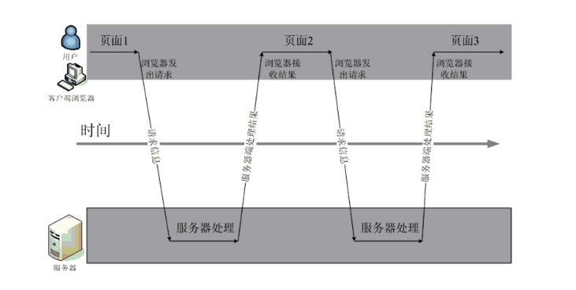
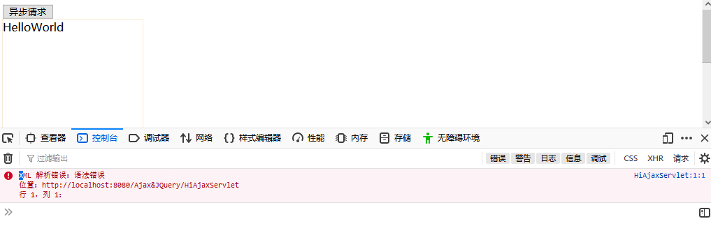
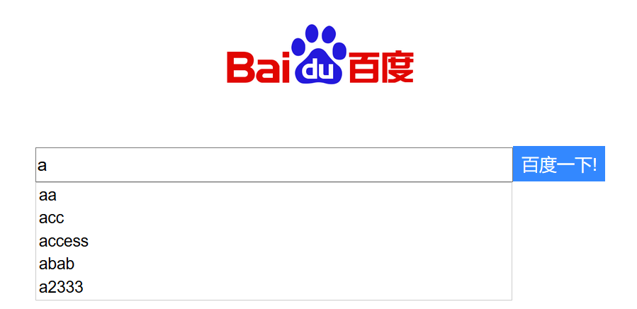
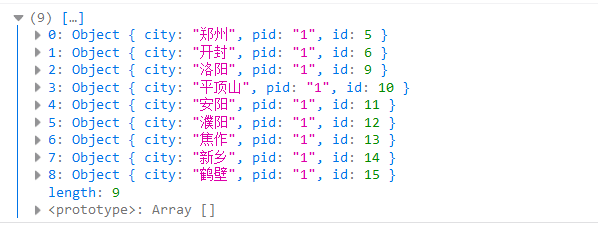
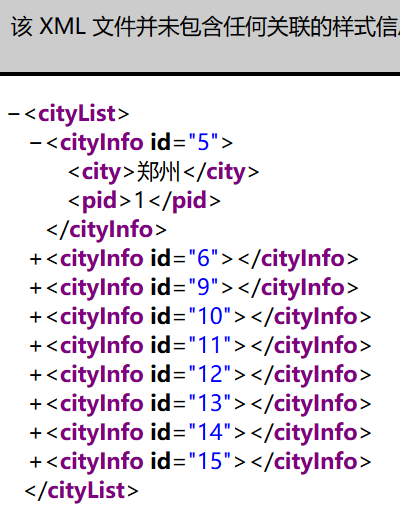

# Ajax & JQuery

## Ajax

* 是什么？

> “Asynchronous Javascript And XML”（异步JavaScript和XML）  
> 并不是新的技术，只是把原有的技术，整合到一起而已。

```text
1.使用CSS和XHTML来表示。
2.使用DOM模型来交互和动态显示。
3.使用XMLHttpRequest来和服务器进行异步通信。
4.使用javascript来绑定和调用。
```

* 有什么用？

> 咱们的网页如果想要刷新局部内容，那么需要重新载入整个网页，然后用户体验不是很好。 ajax就是为了解决局部刷新的问题，保持其他部分不动，只刷新某些地方。

### 什么是同步异步

* 同步

    

* 异步

    

看了上面的讲解，你可能会说这不就是阻塞机制吗？不不不，同步异步不能和阻塞非阻塞混为一谈。

阻塞和非阻塞 强调的是程序在等待调用结果（消息，返回值）时的状态.  阻塞调用是指调用结果返回之前，当前线程会被挂起。调用线程只有在得到结果之后才会返回。非阻塞调用指在不能立刻得到结果之前，该调用不会阻塞当前线程。 对于同步调用来说，很多时候当前线程还是激活的状态，只是从逻辑上当前函数没有返回而已，即同步等待时什么都不干，白白占用着资源。

同步和异步强调的是消息通信机制 (synchronous communication/ asynchronous communication)。所谓同步，就是在发出一个"调用"时，在没有得到结果之前，该“调用”就不返回。但是一旦调用返回，就得到返回值了。换句话说，就是由“调用者”主动等待这个“调用”的结果。而异步则是相反，"调用"在发出之后，这个调用就直接返回了，所以没有返回结果。换句话说，当一个异步过程调用发出后，调用者不会立刻得到结果。而是在"调用"发出后，"被调用者"通过状态、通知来通知调用者，或通过回调函数处理这个调用

### Ajax原生用法

前期准备 导入`xstream-1.4.4.jar`&`xpp3_min-1.1.4c.jar`

#### 数据请求 - Get

* html和js请求文件

    ```html
    <body>
        <input type="button" name="" id="" value="异步请求" onclick="aysnRequest()" />
        <div id="flashBox" style="width: 200px; height: 300px; border:1px solid antiquewhite;">
        </div>
    </body>
    ```

    ```javascript
    function aysnRequest() {
        var xHttp = new XMLHttpRequest();
        xHttp.onreadystatechange = function() {
            // 0: 请求未初始化
            // 1: 服务器连接已建立
            // 2: 请求已接收
            // 3: 正在处理请求
            // 4: 请求已完成且响应已就绪

            // onreadystatechange 被触发五次（0-4），每次 readyState 都发生变化。
            if (this.readyState == 4 && this.status == 200){
                // alert(this.responseText);
                document.getElementById("flashBox").innerHTML=this.responseText;
            }
        }
        xHttp.open("GET","HiAjaxServlet?name=aa&age=18",true)
        xHttp.send();
    }
    ```

* servlet响应

    ```java
    protected void doGet(HttpServletRequest request, HttpServletResponse response)
            throws ServletException, IOException {

        List<String> list = new ArrayList<String>();
        list.add("Hello Ajax");
        list.add(request.getParameter("name"));
        list.add(request.getParameter("age"));

        XStream xstream = new XStream(new StaxDriver());

        response.setContentType("text/xml;charset=utf-8");
        response.getWriter().write(xstream.toXML(list));
    }
    ```

* 注意，servlet响应写出去的可以是字符串或者是xml，浏览器反应也正常，但是控制台却爆出了错误，原因是毕竟是XMLHttpRequest对象，返回的数据最好是XML文件

* 如果写出的是字符串



* 返回XML的时候需要解析，用的是XStream类对象，导入`xstream-1.4.4.jar`&`xpp3_min-1.1.4c.jar`

#### 数据请求 - Post

* html和js文件

```html
<body>
    <input type="button" name="" id="" value="异步请求" onclick="aysnPostRequest()" />
    <div id="flashBox" style="width: 200px; height: 300px; border:1px solid antiquewhite;">
    </div>
</body>
```

```javascript
function aysnPostRequest() {
    var xHttp = new XMLHttpRequest();
    xHttp.onreadystatechange = function() {
        if (this.readyState == 4 && this.status == 200){
            alert(this.responseText);
            document.getElementById("flashBox").innerHTML=this.responseText;
        }
    }
    xHttp.open("POST","HiAjaxServlet",true);

    // post提交参数和get是不一样的
    xHttp.setRequestHeader("Content-type", "application/x-www-form-urlencoded");
    xHttp.send("name=aa&age=18");
}
```

* servlet回应

    ```java
    protected void doPost(HttpServletRequest request, HttpServletResponse response)
            throws ServletException, IOException {
        request.setCharacterEncoding("utf-8");

        System.out.println("Hi AjaxPostRequest");
        List<String> list = new ArrayList<String>();
        list.add("Hello Ajax");
        list.add(request.getParameter("name"));
        list.add(request.getParameter("age"));

        XStream xstream = new XStream(new StaxDriver());

        response.setContentType("text/xml;charset=utf-8");
        response.getWriter().write(xstream.toXML(list));
    }
    ```

#### 检验用户名案例[原生]

[检验用户名案例 - JQuery](#检验用户名案例[JQuery])

* html代码和js代码

    ```html
    <form action="" method="post">
                <table border="" cellspacing="" cellpadding="">
                    <tr>
                        <td>用户名：</td>
                        <td><input type="text" name="username" id="username" value="" onkeyup="checkUserName()" />
                        <!-- 这里要用onkeyup，要在键盘弹起之后读取值，否则读到的值最开始的值 -->

                        <span id="result">
                        </span></td>
                    </tr>
                    <tr>
                        <td>密码</td>
                        <td><input type="password" name="" id="" value="" /></td>
                    </tr>
                    <tr>
                        <td>邮箱</td>
                        <td><input type="" name="" id="" value="" /></td>
                    </tr>
                    <tr>
                        <td>简介</td>
                        <td><input type="" name="" id="" value="" /></td>
                    </tr>
                </table>
                <input type="submit" value="提交" />
    </form>
    ```

    ```javascript
    function checkUserName() {
        // alert("Hi,You have pressed the key");
        var xHttp = new XMLHttpRequest();
        var v = document.getElementById('username').value;

        xHttp.onreadystatechange = function() {
            if (this.readyState == 4 && this.status == 200) {
                // alert(this.responseText);

                var isExist = this.responseText;
                // 这里接到响应结果的数据

                var parser = new DOMParser();
                xmlDoc=parser.parseFromString(isExist, "text/xml");
                // 使用xmlDoc解析xml，解析器为DOM解析器

                var result = xmlDoc.getElementsByTagName('isExist')[0].textContent;
                // 这里获得isExist标签第一个内部的文本

                // document.getElementById('result').innerText = result;
                var span=document.getElementById('result');

                console.log(result);

                if(result=="1"){
                    span.innerText="此用户名已注册";
                    span.style.color="red";
                }else{
                    span.innerText="此用户名可以使用";
                    span.style.color="green";
                }
            }
        }
        xHttp.open("POST", "CheckUserNameServlet", true);
        xHttp.setRequestHeader("Content-type", "application/x-www-form-urlencoded");
        xHttp.send("username=" + v);
    }
    ```

* servlet以及dao方法实现

    ```java
    protected void doGet(HttpServletRequest request, HttpServletResponse response)
            throws ServletException, IOException {
        try {
            request.setCharacterEncoding("utf-8");

            AccountDao acc = new AccountDaoImpl();
            XStream xs = new XStream(new StaxDriver());

            xs.alias("isExist", String.class);
            // 这个是设置String tag的名字

            boolean userIsExist = acc.userNameIsExist(request.getParameter("username"));

            List<String> list = new ArrayList<String>();

            if (userIsExist) {
                list.add("1");
            } else {
                list.add("2");
            }
            // System.out.println(xml);
            // 这个地方千万不要写成new ArrayList<String>().add了，因为返回值是bool值

            response.getWriter().write(xs.toXML(list));
        } catch (SQLException e) {
            // TODO Auto-generated catch block
            e.printStackTrace();
        }
    }
    ```

    ```java
    /**
    * 这个连接池一定要是静态的，因为多次实例化新的连接池，会让连接爆满，进而影响性能
    */
    QueryRunner runner = new QueryRunner(JDBCUtils.getDataSource());

    @Override
    public boolean userNameIsExist(String name) throws SQLException {
        return runner.query("select count(*) from account where username=?", new ScalarHandler<Long>(), name).intValue() > 0;
    }
    ```

## JQuery

### 简介

* 是什么？
  
> JavaScript的代码框架

* 有什么用？

> 简化代码，提高效率。

* 核心

> write less do more，写得更少，做的更多。

### 用法

#### load方法

* js+html

    ```js
    $(function(){
        $("#a").click(function(){
            $("#box").load("HiAjaxServlet")
        });
    });
    ```

    ```html
    <input type="button" id="a"  value="加载一下"/>
    <div id="box" style="width:100px;height: 100px;;">
    </div>
    ```

* servlet

    ```java
    protected void doGet(HttpServletRequest request, HttpServletResponse response)
            throws ServletException, IOException {

        List<String> list = new ArrayList<String>();
        list.add("Hello Ajax");

        XStream xstream = new XStream(new StaxDriver());

        response.setContentType("text/xml;charset=utf-8");
        response.getWriter().write(xstream.toXML(list));
    }
    ```

#### get

* js

    ```javascript
    $("#b").click(function() {
            $.get("HiAjaxServlet?name=aa&age=13", function(data) {
                // 这里的data是xmldoc对象，需要先找到string结点，再从结点选择，最终在jq对象包装调用方法
                var a=$(data).find("string");
                for(i=0;i<a.length;i++){
                    $("#box1").append(a[i]);
                }
            });
    });
    ```

* servlet提供的数据

    ```xml
    <list>
        <string>Hello Ajax</string>
        <string>aa</string>
        <string>13</string>
    </list>
    ```

#### post

* js

    ```javascript
    $("#c").click(function() {
        $.post("HiAjaxServlet", {
                name: "aa",
                age: 13
            },
        function(data, status) {
            // alert("数据: \n" + data + "\n状态: " + status);
            var result = $(data).find("string");
            for (i = 0; i < result.length; i++) {
                $("#box2").append(result[i]);
            }
        });
    });
    ```

数据还是上边的

#### 检验用户名案例[JQuery]

```js
$(function() {
    $("#username").keyup(function() {
        var val = $(this).val();
        $.post("CheckUserNameServlet", {username : val}, function(data, status) {
            var a = $(data).find("isExist");
            if($(a).text()=="1"){
                $("#result").text("此用户已注册");
                $("#result").css("color","red");

            }else{
                $("#result").text("此用户可以注册");
                $("#result").css("color","green");
            }
        });
    });
});
```

其他文件见 [案例：校验用户名是否可用 - 原生写法](#检验用户名案例[原生])

## 百度搜索提示



思路是，首先搜索的时候，搜索框中响应了键盘弹起事件，判断一下，空就清空，不空就发个请求带一个key给servlet，然后servlet通过请求的key，通过dao连接数据库，进行模糊查询之后，拿到的集合，放到域中，跳转到jsp，jsp通过域拿着集合，遍历出html页面，最终把数据传送给键盘弹起事件中异步请求中的回调方法，回调方法判断一下影响是否成功，如果成功之后就将数据放入页面里。

### 搭建环境

1. 定义首页

    ```html
    <div id="container">
        <h1>
            
        </h1>

        <div>
            <input type="text" name="searchField" id="searchField" value="" /><input
                type="button" value="百度一下!" id="btn" />
        </div>
        <div id="queryResult"></div>
    </div>
    ```

2. 定义数据库 - 略
3. 写脚本代码请求数据

    ```js
    $(function() {
        $("#searchField").keyup(function() {
            var val = $(this).val();
            console.log(val);
            if (val == "") {
                // 如果搜索框值空
                $("#queryResult").html("");
            } else {
                // 如果搜索框值不空，就请求
                $.post("SearchRList", {
                    key: val
                }, function(data, status) {
                    console.log(status)
                    // 这里要判断请求是否成功
                    if (status == "success") {
                        $("#queryResult").html(data);
                    }
                });
            }
        });
    });
    ```

4. 准备bean对象（略） + 准备dao以及实现方法

    ```java

    /** DAO
        * 通过key查询返回列表集合
        * @param key
        * @return List<SearchItem>
        * @throws SQLException
        */
    List<SearchItem> searchList(String key) throws SQLException;

    // -----
    // DAOImpl
    @Override
    public List<SearchItem> searchList(String key) throws SQLException {
        return runner.query("select relative from t_list where relative like ?",
                new BeanListHandler<SearchItem>(SearchItem.class), key + "%");
    }
    ```

    * 注意，bean对象的私有成员要和数据库的字段名字保持一致

5. 准备servlet+jsp

    ```java
    protected void doGet(HttpServletRequest request, HttpServletResponse response)
                throws ServletException, IOException {
            String key = request.getParameter("key");
            try {
                // 1.查询当前关键字在数据库中的数据
                AccountDao accDao = new AccountDaoImpl();
                List<SearchItem> searchList = accDao.searchList(key);

                // 2.将查询到的bean集合放入到域中
                request.setAttribute("list", searchList);

                // 这里就不用设置response.setContentType("text/html;charset=utf-8");
                // 3. 跳转
                request.getRequestDispatcher("list.jsp").forward(request, response);
            } catch (SQLException e) {
                // TODO Auto-generated catch block
                e.printStackTrace();
            }
        }
    ```

    ```jsp
    <table id="list">
        <c:forEach items="${ list }" var="l">
            <tr>
                <td>${ l.relative }</td>
            </tr>
        </c:forEach>
    </table>
    ```

## 使用JQuery实现省市联动

1. 拿省的数据

   * DAO和Servlet

    ```java
    protected void doGet(HttpServletRequest request, HttpServletResponse response) throws ServletException, IOException {
        try {
            request.setAttribute("pList", new AccountDaoImpl().findProvince());
            request.getRequestDispatcher("ChooseCity.jsp").forward(request, response);
        } catch (SQLException e) {
            // TODO Auto-generated catch block
            e.printStackTrace();
        }
    }
    ```

    ```java
    @Override
    public List<Province> findProvince() throws SQLException {
        return runner.query("select * from t_province", new BeanListHandler<Province>(Province.class));
    }
    ```

2. 拿市的数据

    dao

    ```java
        @Override
    public List<City> findCityByPID(String pid) throws SQLException {
        return runner.query("select * from t_city where pid=?", new BeanListHandler<City>(City.class), pid);
    }
    ```

    服务器返回数据有两种方式
    * 返回xml

    ```java
        protected void doGet(HttpServletRequest request, HttpServletResponse response)
            throws ServletException, IOException {
        try {
            List<City> cityList = new AccountDaoImpl().findCityByPID(request.getParameter("pid"));

            XStream xs = new XStream();

            // 将City的id字段做成属性
            xs.useAttributeFor(City.class, "id");

            // 设置别名
            xs.alias("cityList", List.class);
            xs.alias("cityInfo", City.class);

            // 转换一个对象成xml字符串
            String xml = xs.toXML(cityList);

            System.out.println(xml);

            response.setContentType("text/xml;charset=utf-8");
            response.getWriter().write(xml);
        } catch (SQLException e) {
            // TODO Auto-generated catch block
            e.printStackTrace();
        }
    }
    ```

    * 返回json

    ```java
    protected void doGet(HttpServletRequest request, HttpServletResponse response)
            throws ServletException, IOException {

        try {
            ArrayList<City> cityList = (ArrayList<City>) new AccountDaoImpl().findCityByPID(request.getParameter("pid"));

            JSONArray array = JSONArray.parseArray(JSONObject.toJSONString(cityList));
            // System.out.println(array.toJSONString());
            response.setContentType("text/json;charset=utf-8");
            response.getWriter().write(array.toJSONString());
        } catch (SQLException e) {
            // TODO Auto-generated catch block
            e.printStackTrace();
        }
    }
    ```

3. 前台页面如何解析

* html页面

    ```html
    <body>

        省份:
        <select name="province" id="province">
            <option value="#">- 请选择 -</option>

            <c:forEach items="${pList}" var="p">
                <option value="${p.id}">${p.province}</option>
            </c:forEach>

        </select> 城市:
        <select name="city" id="city">
            <option value="">- 请选择 -</option>
        </select>
    </body>
    ```

* js界面 - json/xml

    json如何解析

    

    ```js
    $(function() {
        $("#province").change(function() {
            var val = $(this).val();
            console.log(val);
            // 看val的值是否有效
            if (val != "#") {
                $.post("GetCityServletByJSON", {
                    pid: val
                }, function(data, status) {
                    if (status == "success") {

                        // 这部分先将原有的清空
                        $("#city").html("<option value='- 请选择 -'>- 请选择 -");

                        // 再添加新的服务器返回的数据
                        for (i = 0; i < data.length; i++) {
                            $("#city").append("<option value='" + data[i].id + "'>" + data[i].city)
                        }
                    }
                })
            }
        })
    })
    ```

    xml如何解析

    

    ```java
    $(function() {
        $("#province").change(function() {
            var val = $(this).val();
            console.log(val);
            if (val != "#") {
                $.post("GetCityServletByXML", {
                    pid: val
                }, function(data, status) {
                    console.log(data);
                    if (status == "success") {
                        $("#city").html("<option value='- 请选择 -'>- 请选择 -");
                        var cityInfo = $(data).find("cityInfo");
                        for (i = 0; i < cityInfo.length; i++) {
                            $("#city").append("<option value='" + $((cityInfo[i]).nodeName).attr("id") + "'>" + $(cityInfo[i]).find(
                                "city").text())
                        }
                    }
                })
            }
        })
    })
    ```

## 总结

* ajax
  * 什么是异步同步 - 要区别阻塞非阻塞
  * ajax的原生用法
    * get
    * post
    * 案例：检验用户名
* jquery
  * 用法
    * load
    * get
    * post
    * 案例：检验用户名
* 百度搜索提示
  * xml解析用了XStream jar包
  * 异步请求jsp加载到页面上
* jquery搭建省市联动
  * json解析
