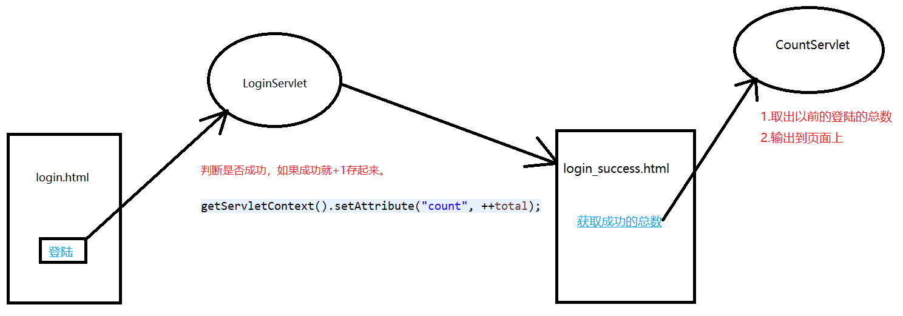

# HttpServletRequest&HttpServletResponse

## 一步到位的Servlet - tomcat 4.0       

在eclipse中不需要web.xml配置servlet，而是通过注解的方式找寻servlet

```java
@WebServlet("/HelloServlet") // 在这里
public class HelloServlet extends HttpServlet {
    private static final long serialVersionUID = 1L;

    protected void doGet(HttpServletRequest request, HttpServletResponse response) throws ServletException, IOException {
        response.getWriter().append("Served at: ").append(request.getContextPath());
    }

    protected void doPost(HttpServletRequest request, HttpServletResponse response) throws ServletException, IOException {
        doGet(request, response);
    }
}
```

## Servlet匹配方式

* 1.全路径匹配

> 以`/`开始`/a`或者`/aa/bb`  
> localhost:8080/项目名称/aa/bb

* 2.路径匹配，前半段匹配

> 以`/`开始，但是以`*`结束 `/a/*`或者`/*`  
> `*` 其实是一个通配符，匹配任意文字  
> localhost:8080/项目名称/aa/bb

* 3.以扩展名匹配

> 写法：没有`/`以`*`开始，扩展名`*.aa`,`*.bb`

## 在servlet部署的时候tomcat出现的问题 - dwm version4.0 | 2.5

上一次的项目修改之后继续部署下一次，结果tomcat部署的还是上一次项目的文件，原因是java项目没有build。

> 解决办法：将Project选项下Build Automatically选中即可  
> 而且在这次解决问题的时候新的发现，当java文件修改的时候控制台会打印出以下log

```html
一月 10, 2020 11:30:18 下午 org.apache.catalina.core.StandardContext reload
信息: Reloading Context with name [/RequestAndResponse] is completed
```

> 这代表Servlet源码更新后，自动部署到项目里边了。

## ServletContext

> Servlet上下文
>  
> 每个web工程只有一个ServletContext对象。说白了也就是不管在那个servlet里面，获取到的这个类都是同一个。

### 如何获得ServletContext对象

```java
// 1.获取对象
ServletContext context = getServletContext();
```

### ServletContext有什么作用

1. 获取全局配置参数
2. 获取web工程中的资源
3. 存取数据，servlet之间共享数据 域对象

#### 可以获取全局配置参数

```xml
<!-- 1.配置参数 -->
<context-param>
    <param-name>address</param-name>
    <param-value>China</param-value>
</context-param>
```

```java
// 2. 获取参数
ServletContext context = getServletContext();
String value = context.getInitParameter("address");
System.out.println("address=" + value);
```

#### 可以获取Web应用的资源

首先需要理解一下相对路径和绝对路径

* 绝对路径：绝对路径就是你的主页上的文件或目录在硬盘上真正的路径，

```html
例如 I:/apache-tomcat-9.0.21/wtpwebapps/RequestAndResponse/WEB-INF/classes/a/config.properties
```

* 相对路径：相对与某个基准目录的路径。（存在参照物） 

```html
例如，当前在 I:/apache-tomcat-9.0.21/wtpwebapps/RequestAndResponse/WEB-INF/classes 目录下
相对于当前目录 a/config.properties是相对路径
```

---

1.通过`classloader`去获取web工程下的资源

获得地址流的方法有两种

* 通过`getResource`获取path地址，在放入流

```java
String path = this.getClass().getClassLoader().getResource("a/config.properties").getPath();
// getResource参数为空字符串获得的path是 I:/apache-tomcat-9.0.21/wtpwebapps/RequestAndResponse/WEB-INF/classes/
```

* 通过`getResourceAsStream`方法

```java
InputStream is = this.getClass().getResourceAsStream("/a/config.properties");
```

* 实例 - 通过当前类加载器获得Resources文件夹下a/config.properties

```java
Properties properties = new Properties();

// 1.  通过当前类加载器获得Resources文件夹下a/config.properties的路径
String path = this.getClass().getClassLoader().getResource("a/config.properties").getPath();

// 2. 传递路径给流
InputStream is = new FileInputStream(path);

// 3. 加载到properties
properties.load(is);
String name = properties.getProperty("name");
System.out.println("name=" + name);
```

2.可以获取Web应用中的资源

获取地址流的方法有两种

* 通过`context.getRealPath("")`方法获取根目录，`""`填入相对路径，在放入流

```java
// 这里获得的是在tomcat项目的根目录
ServletContext context = getServletContext();
System.out.println(context.getRealPath(""));
// I:\apache-tomcat-9.0.21\wtpwebapps\RequestAndResponse\
```

* 通过`context.getResourceAsStream(path)`方法直接获取流

```java
InputStream is = context.getResourceAsStream("file/config.properties");
```

* 实例 - 通过Web资源获取项目中 /RequestAndResponse/WebContent/file/config.properties

```java
// 1.获取当前项目的context对象，以及获取properties对象存储值
ServletContext context = getServletContext();
Properties properties = new Properties();


System.out.println(context.getRealPath(""));
// I:\apache-tomcat-9.0.21\wtpwebapps\RequestAndResponse\

// 2.获取文件流
InputStream is = context.getResourceAsStream("file/config.properties");

// 3. 加载到properties
properties.load(is);
String name = properties.getProperty("name");
System.out.println("name=" + name);
```

#### 使用ServletContext存储数据

1.定义一个html页面，制作一个form表单

```html
<body>
    <h2>请输入以下内容，完成登陆</h2>
    <form action="LoginServlet" method="get">
        账号:<input type="text" name="username"><br />
        密码:<input type="password" name="pwd"><br />
        <input type="button" value="登陆">
    </form>
</body>
```

2.定义一个Servlet，名为LoginServlet



* 针对密码是否正确用`PrintWriter`对象输到页面success/failed

```java
protected void doGet(HttpServletRequest request, HttpServletResponse response)
        throws ServletException, IOException {
    // 1. 获取数据
    String username = request.getParameter("username");
    String pwd = request.getParameter("pwd");

    // 2.校验数据
    System.out.println("username=" + username + "  pwd=" + pwd);
    PrintWriter pw = response.getWriter();
    if (username.equals("admin") && pwd.equals("123")) {
        pw.write("success...");
    } else {
        pw.write("failed...");
    }
}
```

* （改进版1）针对成功或者失败，进行判断，然后跳转到不一样的页面

```java
if (username.equals("admin") && pwd.equals("123")) {
    // pw.write("success...");
    // 设置状态码？重新定位状态码
    response.setStatus(302);
    // 定位跳转的位置是哪一个页面
    response.setHeader("Location", "login_success.html");
} else {
    pw.write("failed...");
}
```

* (改进版2) 增加使用ServletContext来存取数据 - 用户登陆的次数

```java
if (username.equals("admin") && pwd.equals("123")) {
    // pw.write("success...");
    // 设置状态码？重新定位状态码

    Object obj = getServletContext().getAttribute("count");

    int total = 0;
    if (obj != null) {
        total = (int) obj;
    }

    getServletContext().setAttribute("count", ++total);

    System.out.println("成功登陆的次数为" + total);

    response.setStatus(302);
    // 定位跳转的位置是哪一个页面
    response.setHeader("Location", "login_success.html");
} else {
    pw.write("failed...");
}
```

login_success.html 来接收登陆

```html
<body>
    <h2>登陆成功了</h2>
    <a href="CountServlet">获取网站登陆成功总数</a>
</body>
```

`CountServlet` 来取数据，并把数据显示到页面上

```java
protected void doGet(HttpServletRequest request, HttpServletResponse response)
        throws ServletException, IOException {
    Object obj = getServletContext().getAttribute("count");
    response.getWriter().write("登陆成功的次数:" + (int) obj);
}
```

细节：`action`后边跟的`LoginServlet`，最后去找的是`url-pattern`