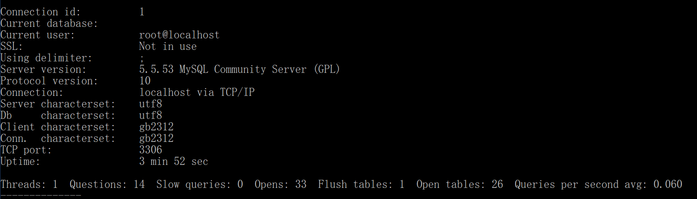
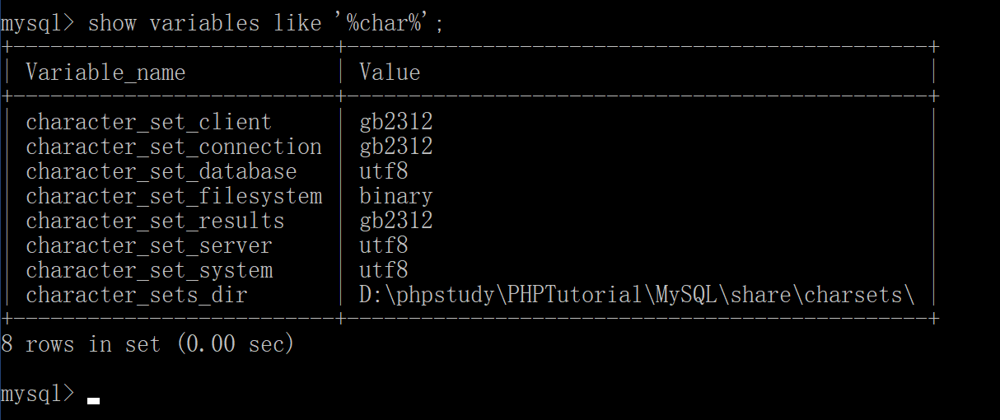
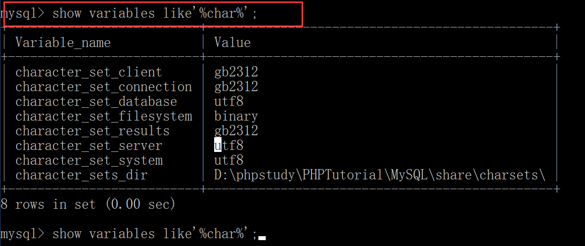

# Mysql在cmd显示乱码问题

## 名词解释

### Mysql和mysqld的区别

mysql

> mysql is a command-line client for executing SQL statements interactively or in batch mode.

mysqld

> mysqld is the MySQL server.

### 系统字符集

| 条目                   | 说明                                                                                           |
| ------------------------ | ------------------------------------------------------------------------------------------------ |
| character_set_client     | 客户端的字符集。客户端默认字符集。当客户端向服务器发送请求时，请求以该字符集进行编码。 |
| character_set_connection | 客户端服务器连接字符集                                                                |
| character_set_database   | 为数据库服务器中某个库使用的字符集设定，如果建库时没有指明，将使用服务器安装时指定的字符集设置。 |
| character_set_results    | 结果字符集。服务器向客户端返回结果或者信息时，结果以该字符集进行编码。 |
| character_set_server     | 为服务器安装时指定的默认字符集设定。                                           |
| character_set_system     | 为数据库系统使用的字符集设定。                                                    |

## 如何通过设置my.ini来设置mysql系统字符集

```xml
# 客户端
[mysql]
default-character-set=gb2312
# 设置character_set_client、character_set_connection、character_set_results的默认字符集

# 服务器
[mysqld]
port=3306
character-set-server=utf8
# 设置character_set_server、character_set_database的默认字符集
```

## 常用查看字符集命令

1.查看数据库支持的所有字符集

```sql
show character set;
```

2.查看当前状态命令

```sql
status(或 /s)
```



3.查看系统字符集设置（包括所有的字符集设置）

```sql
show variables like'%char%';
```



## 乱码问题分析

MySQL会出现中文乱码的原因不外乎下列几点：

1. server本身设定问题，例如还停留在latin1
2. database、table、column的语系设定问题(包含character与collation)
3. 客户端程式(例如php)的连接语系设定问题（character_set_client、character_set_connection、character_set_results）

## 客户端乱码解决方案

### 第一步，修改mysql目录下`my.ini` 让 default-character-set=gb2312

```html
# MySQL client library initialization.
[client]
port=3306
[mysql]
default-character-set=gb2312
```

### 第二步：在mysql数据库cmd中输入

```sql
show variables like'%char%';
```



### 第三步：改变原有数据库的编码方式

```sql
set character_set_database=utf8;
set character_set_server=utf8;
set character_set_client=gb2312;
set character_set_connection=gb2312;
set character_set_results=gb2312;

SET NAMES utf8
```

> SET NAMES gb2312 相当于  
>set character_set_client=gb2312;  
set character_set_connection=gb2312;  
set character_set_results=gb2312;  
> 这三句话

## 服务器乱码解决方案

### 第一步，修改mysql目录下`my.ini` 让 character-set-server=utf8

```xml
[mysqld]
port=3306
character-set-server=utf8
```

### 第二步，重启mysqld服务


## 总结

- 学会一些名词
  - mysql和mysqld的区别
  - 系统字符集
- 会通过修改my.ini来设置默认字符集
- 学会一些命令查看字符集
  - `show character set;` - 查看可用字符集
  - `show variables like'%char%';` - 查看系统字符集
  - `status` - 查看当前状态
- 可以分析出乱码问题出现位置
  - 服务器
  - 客户端
  - 数据库、表、列？
- 客户端字符集乱码解决办法
  - 修改my.ini
  - 看系统字符集看修改了没
  - 修改了需要在修改时用`set names`
- 服务器字符集乱码解决办法
  - 同客户端
