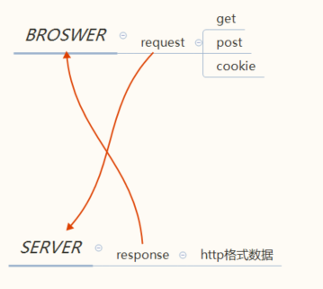
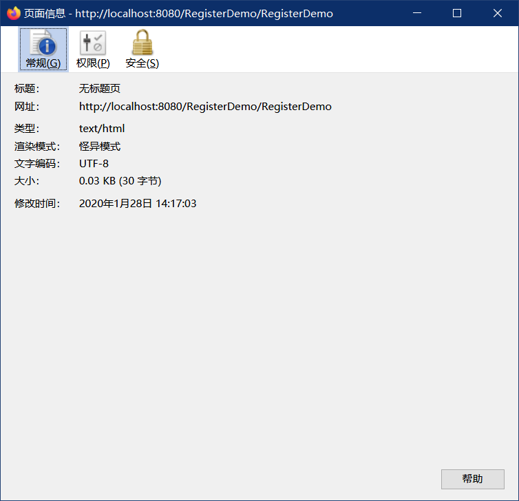

# 客户端与服务器传递中文乱码问题

## 分析传递过程

HTTP服务器可以通常理解成，接收来自浏览器的请求，读取其中的信息，并返回http的信息



其中，浏览器发送的数据主要以三种形式传递，`get`/`post`/`cookies`携带参数传递。

  
而服务器，生成http的返回数据的形式有三种。
> 其中，jsp与servlet的本质没有区别，一般认为，jsp在servlet的基础上，加了html框架，如果把jsp代码中的html去掉，jsp和servlet基本就是一个东西了。

整个流程分四步

* 浏览器发送数据
* 服务器解析浏览器发送的数据
* 服务器返回数据
* 浏览器解析返回的数据

字符集问题出现在信息从一级流通到另一级的过程中，也就是这四个动作中，要规避字符集问题，需要了解四个动作中，分别的，其使用字符集的确认方式。

也就是说，**问题**是

* 浏览器发送数据 - 采用那种字符集？
* 服务器解析浏览器发送的数据 - 采用那种字符集？
* 服务器返回数据 - 采用那种字符集？
* 浏览器解析返回的数据 - 采用那种字符集？

## 浏览器发送数据 - 采用那种字符集

### 浏览器访问方式

浏览器发起一个请求，需要通过URL访问

* 输入URL访问
* 通过连接跳转访问
  * form表单
  * 超链接 - a标签


无论是那种形式最终浏览器都会将其包装成HTTP格式进行访问

```html
POST /MyTestProject6/Test_Servlet_002 HTTP/1.1
Host: localhost
Connection: keep-alive
Content-Length: 39
Cache-Control: max-age=0
Origin: http://localhost
Upgrade-Insecure-Requests: 1
Content-Type: application/x-www-form-urlencoded
User-Agent: Mozilla/5.0 (Windows NT 10.0; Win64; x64) AppleWebKit/537.36 (KHTML, like Gecko) Chrome/68.0.3440.106 Safari/537.36
Accept: text/html,application/xhtml+xml,application/xml;q=0.9,image/webp,image/apng,*/*;q=0.8
Referer: http://localhost/MyTestProject6/Test_003.html
Accept-Encoding: gzip, deflate, br
Accept-Language: zh-CN,zh;q=0.9
Cookie: JSESSIONID=1420F43C4B8259D6FCCD46E87B095DB3; _ga=GA1.1.1822121407.1535547634
```

### 字符集判断

而，request信息中，并不会指定编码集

那参数在传递中，**对中文进行编码的格式如何确定呢？**

首先将浏览器访问服务器的的动作分为两种

1. 在URL栏里直接输入URL访问 - 输入URL
2. 在已经呈现的HTML页面中跳转 - 通过连接跳转访问

第一种直接在URL栏中输入的中文，会以浏览器默认的编码集进行编码。

而其他的的访问，也即是由页面生成的URL，其内容的编码格式取决于该页面在编码时使用的字符集

也就是meta标签

```html
<meta charset="XXX">
```

一定程度上，也就是页面中的标签，该标签标注了该页面的编码格式

### 总结

1. 直接输中文，依浏览器默认字符集（chrome:utf-8,火狐:gbk）
2. 页面采用那种字符集编码，则发送数据时采用何种字符集
3. 页面未指定字符集，chrome和火狐都默认使用GKB进行编码

## 服务器解析浏览器发送的数据 - 采用那种字符集

因为request并不会携带关于request的内容由那种字符集信息

服务器解析数据的时候可能会受用户在URL里写中文影响

但大多数URL都是由服务器本身的页面发出，统一字符集的话，一般不会受到字符集的影响

总结：服务器解析浏览器发送的数据时，使用何种字符集？

1. 首先参照上一节中描述的get数据和post数据在浏览器端编码的规则
2. get数据一般tomcat7以下服务器解析默认iso-8859-1，tomcat7以上get请求默认utf-8，server.xml可以设置默认读取方式，默认GBK但传入UTF-8会很尴尬
3. post数据默认iso-8859-1，通过设置`request.setCharacterEncoding("XXX")`可以修改（在每次请求传入时），也可以将这一步写入filter中。
4. COOKIE数据默认iso-8859-1，按照服务器之前存入COOKIE时的字符集去解码

## 服务器返回数据 - 采用那种字符集

  
不过如果最终返回的是页面，三种方式最终返回的数据，在浏览器看来是没啥区别的。

### servlet

首先测试servlet，仅写入这么一条service的内容，不做其他设置

```java
response.getWriter().append("Served at: ").append(request.getContextPath());
```

结合页面显示效果，不难发现

如果未设置contentType,浏览器会使用默认的gbk进行解析

如果设置了contentType，比如：

```java
response.setContentType("text/html;charset=utf-8");
response.getWriter().append("测试直接传输一个中文");
```



则浏览器会使用对应的字符集进行解析，也就是参照contentType中设置的charset

总结：服务器返回数据时，使用何种字符集？

1. servlet端需要设置contentType，注意与代码的编码文件格式保持一致
2. html文件需要设置`<meta charset>`，注意与html文件的编码格式保持一致，缺省时浏览器使用gbk。
3. jsp文件需要设置contentType或pageEncoding，注意与jsp文件的编码格式保持一致，缺省时浏览器使用gbk，但JSP编译器会通过iso-8859-1去编译。

## 浏览器解析返回的数据 - 采用那种字符集

浏览器在解析时使用的字符集，依照response的head中的contentType中的charset参数。
当该参数缺省时，会去寻找文件中的`<meta charset>`标签。
都缺省时，使用浏览器默认字符集。

## 口述整个过程

首先浏览器通过两种方式请求- request不提供编码

1. 通过直接url中写参数 - 用的是浏览器默认编码方式
2. 通过页面的form表单跳转，或者超链接，用的是`<meta charset>`标签的编码 - 注意html文件保存的编码要和标签统一

服务器接收请求之后，通过tomcat服务器解析参数

1. tomcat 有的会解析成ISO 8859-1，有的会解析成utf-8
2. 但是servlet获取到参数解析后的数据，就算参数乱码，也只是编码方式出了问题，文件保存的格式不变，只需要更改编码方式即可。

服务器处理完参数，开始返回数据

1. 如果返回的是html页面，服务器是不知道字符集的，直接抛出去。（html页面也要注意，保存的格式与设置的字符集应该一致）
2. 如果返回的是servlet中response写出的字符串，如果未设置contentType，输出的字符集应该与servlet文件的编码方式一样，浏览器使用默认字符集

浏览器开始获取数据后解析

1. 先找依照response的head中的contentType中的charset参数
2. 找文件中的`<meta charset>`标签
3. 都缺省时，使用浏览器默认字符集。
