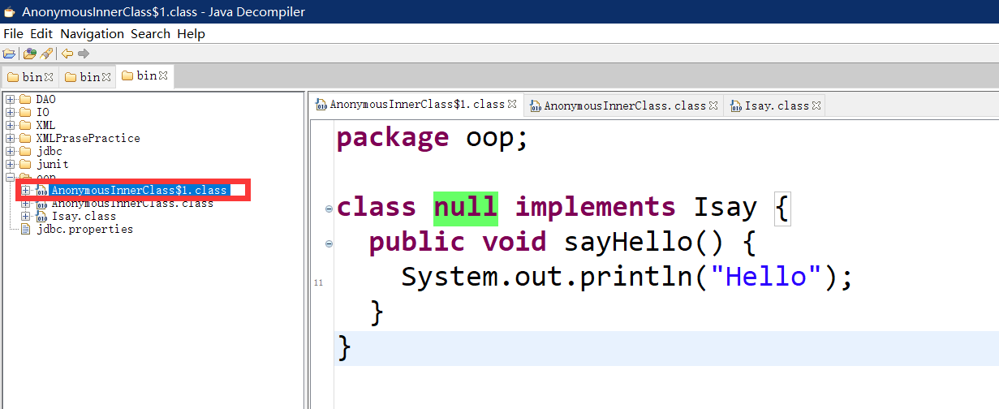

# 使用匿名内部类直接new接口

java中的匿名类有一个倍神奇的用法，见下面代码示例：

```java
public interface Isay {
    void sayHello();
}
```

上面是一个简单的接口，下面是如何使用

```java
public class AnonymousInnerClass {

    public static void main(String[] args) {
        Isay say=new Isay() {
            @Override
            public void sayHello() {
                // TODO Auto-generated method stub
                System.out.println("Hello");
            }
        };
        say.sayHello(); // 执行结果是 Hello
    }
}
```

初看上去，就好象在“不提供接口实现的情况下，直接new了一个接口实例

还好这只是假象，观察bin目录下的class输出，会发现有一个AnonymousInnerClass$1的文件，如果反编译观察下，发现原来是编译器自动生成一个类AnonymousInnerClass$1



如果在有些场合，只需要临时需要创建一个接口的实现类，上面的“技巧”可以用来简化代码

## 总结

```java
Isay say=new Isay() {
            @Override
            public void sayHello() {
                // TODO Auto-generated method stub
                System.out.println("Hello");
            }
        };
```

以上这段代码，不代表实现实例化一个接口，而是建一个匿名内部类，然后将接口给实现了，然后对象`say`调用hello的时候，根据多态，就执行匿名内部类的`sayHello()`方法了。
