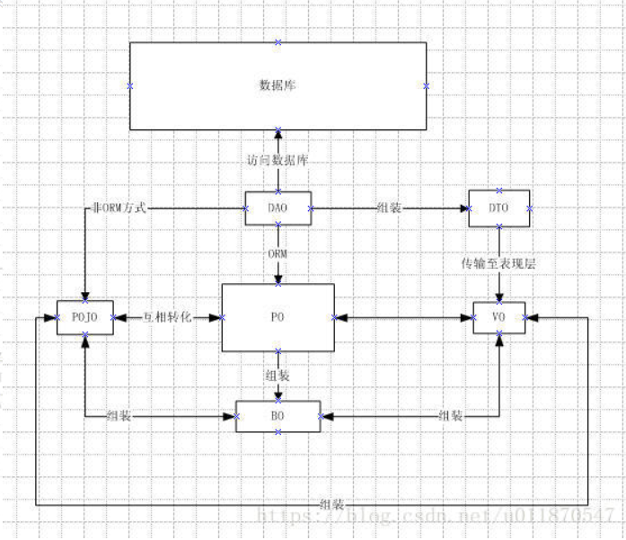

# PO&BO&VO&POJO区别

* PO persistent object - 持久对象

  * 有时候称为Data对象，对应数据库中的entity，可以简单认为PO对应数据库一条记录
  * 在hibernate持久层框架中与insert/delete操作密切相关。
  * PO中不应该包含任何对数据库的操作

---

* POJO plain ordinary java object 无规则简单java对象

    > 一个中间对象，可以转换为PO、DTO、VO

  * POJO持久化之后-->PO（持久化对象）
    * 在运行期间，由hibernate中的cglib动态把POJO转换成PO，PO相对于POJO会增加一些用管理数据库entity状态的属性和方法。PO对于programmer来说完全透明，由于是运行期生成PO，所以可以支持增量编译，增量调试。
  * POJO传输过程中-->DTO（数据传输对象）
  * POJO用于表示层-->VO（值对象/表现层对象）
  * PO和VO其实都是POJO转换而来。

---

* BO - business object 业务对象

    > 业务对象主要作用是把业务逻辑封装为一个对象。这个对象可以包括一个或多个其他的对象。

    比如一个简历，有教育经历、工作经历、社会关系等等，我们可以把教育经历对应一个PO，工作经历对应一个PO，社会关系对应一个PO  
    建立一个对应建立的BO对象处理建立，每个BO包含这些PO  
    这样处理业务逻辑时，我们就可以针对BO去处理。

    封装业务逻辑为一个对象（可以包括多个PO，通常需要将BO转换成PO）才能进行数据的持久化，反之，从DB中得到的PO，需要转换成BO才能在业务层使用

    关于BO主要有三个概念

  * 只包含业务对象的属性
  * 只包含业务方法
  * 两者都包含。

    实际使用中，认为哪一种概念正确并不重要，关键是实际项目中适合自己使用的需要。

---

* VO - value object 值对象/view object 变现层对象

  * 主要对应页面显示（web页面/swt、swing交界面）的数据对象。
  * 可以与表对应，也可以不，这根据业务的需要

---

* DTO（TO） - Data Transfer OBject 数据传输对象

  * 用于需要跨进程或远程传输，它不应该包含业务逻辑
  * 比如一张表有100个字段，那么对应的PO就有100个属性（大多数情况下，DTO内的数据来自多个表）。但view层只显示10个字段，没有必要把整个PO对象传递给client，这时我们就可以用只有这10个属性的DTO来传输数据到client，这样也不会暴露server端表接口，到达客户端后，如果用这个对应界面显示，那这时它的身份就转为VO。

---

* DAO - data access object 数据访问对象

  * 主要用来封装对DB的访问（CRUD操作）
  * 通过接收Business层的数据，把POJO持久为PO

