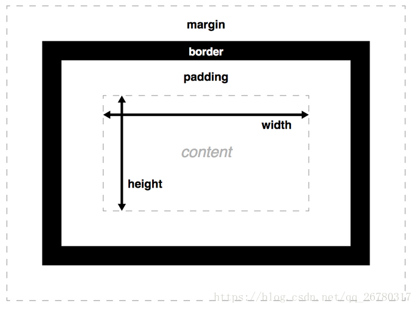
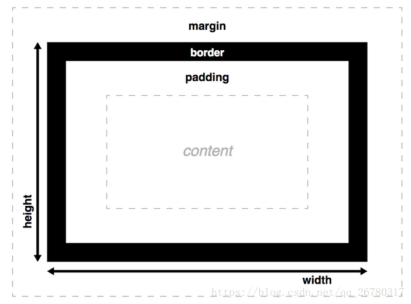

# box-sizing:border-box

> 背景：先声明一下运用的场景，假如项目布局使用的是自适应的布局方式，div给出的宽度是百分比的形式，即框占窗口宽度的50%，但边界和内边距是用像素来表示的怎么办？为了避免这种问题，可以使用属性box-sizing来调整框模型。使用border-box，来将框模型更改成这个新的模型。

box-sizing属性用于更改用于计算元素的宽度和高度默认的CSS盒子模型，可以使用此属性来模拟不正确支持CSS盒子模型规范的浏览器行为。

## 回顾基础

文档的每个元素被构造成文档布局内的一个矩形框，框每层的大小都可以使用一些特定的CSS属性调整。相关属性如下：

### 框属性的基本规范

1. **width**和**height**设置内容框（content box）的**宽度和高度**。内容框是框内容显示的区域，例如一些文本内容，以及表示镶嵌子元素的其他框。
2. padding - 内边距
3. border - 边界
4. margin - 外边距

从这点内容说明了，如果设置width | height为百分比的话，padding、margin、border还为像素表示，造成样式不好修改。

### 运用box-sizing:border-box属性下，框模型的变化

这时候 **width=content(width)+padding+border**
